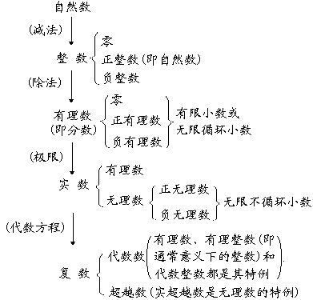

<h1>　 </h1>
<h1 align=center style='text-align:center'>第一章 代数、三角公式与初等函数 </h1>

这里收集和整理了初等代数(代数方程部分见第三章)，平面三角与球面三角的一些常用公式，同时也介绍了一些常见的初等函数(一个实自变量)的简单性质与图形，所以本章基本上包括了中等学校里的代数学和三角学的主要内容.

<h2 align=center style='text-align:center'>§1 代 数 公 式 </h2>
<h3>一、 数的扩张、分类及其基本运算规则</h3>

1. 数的扩张与分类表

<b></b>

