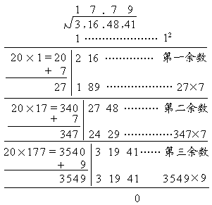

4. 乘方与开方

<table cellpadding=0 cellspacing=0>
 <tr>
  <td width=176 height=80 style='vertical-align:top'>
  <table cellpadding=0 cellspacing=0 width="100%">
   <tr>
    <td>
    

    

    
&nbsp;&nbsp;&nbsp;&nbsp;&nbsp;&nbsp;&nbsp; 个

    
&nbsp;

    
&nbsp;

    

    </td>
   </tr>
  </table>
  &nbsp;</td>
 </tr>
</table>
[乘方]&nbsp; 个数a相乘

&nbsp;

&nbsp;

&nbsp;

&nbsp;&nbsp;&nbsp; 

称为a的次(乘)方，又称为a的次幂.a称为幂底数，称为幂指数.

从乘法的符号规则直接得出乘方的符号规则：正数的任何次方为正数；负数的偶次方为正数；负数的奇次方为负数；零的任何次方为零.

规定不等于零的数的零次方等于1，即a0=1，a&sup1;0.

[开平方]&nbsp; 若a2=b，则a称为b的平方根，记为，求平方根的运算称为开平方.开平方的一般方法用下面例子说明.

例&nbsp; 求316.4841的平方根.

解&nbsp; 第一步,先将被开方的数，从小数点位置向左右每隔两位用逗号“，”分段，如把数316.4841分段成3,16.48,41.第二步，找出第一段数字的初商，使初商的平方不超过第一段数字，而初商加1的平方则大于第一段数字，本例中第一段数字为3，初商为1，因为12=1&lt;3，而(1+1)2=4&gt;3.第三步，用第一段数字减去初商的平方，并移下第二段数字，组成第一余数，在本例中第一余数为216.第四步，找出试商，使(20&acute;初商+试商)&acute;试商不超过第一余数，而[20&acute;初商+(试商+1)]&acute;(试商+1)则大于第一余数.第五步，把第一余数减去(20&acute;初商+试商)&acute;试商，并移下第三段数字，组成第二余数，本例中试商为7，第二余数为2748.依此法继续做下去，直到移完所有的段数，若最后余数为零，则开方运算告结束.若余数永远不为零，则只能取某一精度的近似值.第六步，定小数点位置，平方根小数点位置应与被开方数的小数点位置对齐.本例的算式如下：

[开立方]&nbsp; 若a3=b，则a称为b的立方根，记为，求立方根的运算称为开立方.

一个数的平方根和立方根可从“平方根表”和“立方根表”中查到.

&nbsp;

