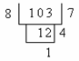
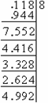

5. 实数进位制

[进位制的基与数字]&nbsp; 任一正数可表为通常意义下的有限小数或无限小数，各数字的值与数字所在的位置有关，任何位置的数字当小数点向右移一位时其值扩大10倍，当小数点向左移一位时其值缩小10倍.例如

一般地，任一正数<i>a</i>可表为

这就是10进数，记作<i>a</i>(10)，数10称为进位制的基，式中<i>ai</i>在{0,1,2,L,9}中取值，称为10进数的数字，显然没有理由说进位制的基不可以取其他的数.现在取<i>q</i>为任意大于1的正整数当作进位制的基，于是就得到<i>q</i>进数表示

&nbsp; (1)

式中数字<i>ai</i>在{0,1,2,L,<i>q</i>-1}中取值，<i>anan</i>-1L<i>a</i>1<i>a</i>0称为<i>q</i>进数<i>a</i>(<i>q</i>)的整数部分，记作[<i>a</i>(<i>q</i>)];

<i>a</i>-1<i>a</i>-2L称为<i>a</i>(<i>q</i>)的分数部分，记作{<i>a</i>(<i>q</i>)}.常用进位制，除10进制外，还有2进制、8进制、16进制等，其数字如下

&nbsp;&nbsp;&nbsp;&nbsp;&nbsp;&nbsp;&nbsp;&nbsp;&nbsp;&nbsp;&nbsp;&nbsp;&nbsp;&nbsp;&nbsp; 2进制&nbsp;&nbsp;&nbsp;&nbsp;  0, 1

&nbsp;&nbsp;&nbsp;&nbsp;&nbsp;&nbsp;&nbsp;&nbsp;&nbsp;&nbsp;&nbsp;&nbsp;&nbsp;&nbsp;&nbsp; 8进制&nbsp;&nbsp;&nbsp;&nbsp;  0, 1, 2, 3, 4, 5, 6, 7

&nbsp;&nbsp;&nbsp;&nbsp;&nbsp;&nbsp;&nbsp;&nbsp;&nbsp;&nbsp;&nbsp;&nbsp;&nbsp;&nbsp; 16进制&nbsp;&nbsp;&nbsp;&nbsp;  0, 1, 2, 3, 4, 5, 6, 7, 8, 9

&nbsp;&nbsp;&nbsp;&nbsp;&nbsp;&nbsp;&nbsp;&nbsp;&nbsp;&nbsp;&nbsp;&nbsp;&nbsp;&nbsp;&nbsp;&nbsp;&nbsp;&nbsp;&nbsp;&nbsp; &nbsp;&nbsp;
&nbsp; &nbsp;

[2，8，16进制的加法与乘法表]

<table class=MsoNormalTable border=1 cellspacing=0 cellpadding=0
 style='border-collapse:collapse;border:none'>
 <tr>
  <td width=243 colspan=3 valign=top style='width:182.55pt;border:none;
  border-bottom:solid windowtext 1.0pt;padding:0mm 5.4pt 0mm 5.4pt'>
  
2进制加法表

  </td>
  <td width=81 valign=top style='width:60.85pt;border:none;padding:0mm 5.4pt 0mm 5.4pt'>
  
&nbsp;

  </td>
  <td width=243 colspan=3 valign=top style='width:182.55pt;border:none;
  border-bottom:solid windowtext 1.0pt;padding:0mm 5.4pt 0mm 5.4pt'>
  
2进制乘法表

  </td>
 </tr>
 <tr>
  <td width=81 valign=top style='width:60.85pt;border:none;border-right:solid windowtext 1.0pt;
  padding:0mm 5.4pt 0mm 5.4pt'>
  
+

  </td>
  <td width=81 valign=top style='width:60.85pt;border:none;border-right:solid windowtext 1.0pt;
  padding:0mm 5.4pt 0mm 5.4pt'>
  
0

  </td>
  <td width=81 valign=top style='width:60.85pt;border:none;padding:0mm 5.4pt 0mm 5.4pt'>
  
1

  </td>
  <td width=81 valign=top style='width:60.85pt;border:none;padding:0mm 5.4pt 0mm 5.4pt'>
  
&nbsp;

  </td>
  <td width=81 valign=top style='width:60.85pt;border:none;border-right:solid windowtext 1.0pt;
  padding:0mm 5.4pt 0mm 5.4pt'>
  

  </td>
  <td width=81 valign=top style='width:60.85pt;border:none;border-top:solid windowtext 1.0pt;
  padding:0mm 5.4pt 0mm 5.4pt'>
  
0

  </td>
  <td width=81 valign=top style='width:60.85pt;border:none;border-top:solid windowtext 1.0pt;
  padding:0mm 5.4pt 0mm 5.4pt'>
  
1

  </td>
 </tr>
 <tr>
  <td width=81 valign=top style='width:60.85pt;border-top:solid windowtext 1.0pt;
  border-left:none;border-bottom:none;border-right:solid windowtext 1.0pt;
  padding:0mm 5.4pt 0mm 5.4pt'>
  
0

  </td>
  <td width=81 valign=top style='width:60.85pt;border-top:solid windowtext 1.0pt;
  border-left:none;border-bottom:none;border-right:solid windowtext 1.0pt;
  padding:0mm 5.4pt 0mm 5.4pt'>
  
0

  </td>
  <td width=81 valign=top style='width:60.85pt;border:none;border-top:solid windowtext 1.0pt;
  padding:0mm 5.4pt 0mm 5.4pt'>
  
1

  </td>
  <td width=81 valign=top style='width:60.85pt;border:none;padding:0mm 5.4pt 0mm 5.4pt'>
  
&nbsp;

  </td>
  <td width=81 valign=top style='width:60.85pt;border-top:solid windowtext 1.0pt;
  border-left:none;border-bottom:none;border-right:solid windowtext 1.0pt;
  padding:0mm 5.4pt 0mm 5.4pt'>
  
0

  </td>
  <td width=81 valign=top style='width:60.85pt;border:none;border-top:solid windowtext 1.0pt;
  padding:0mm 5.4pt 0mm 5.4pt'>
  
0

  </td>
  <td width=81 valign=top style='width:60.85pt;border:none;border-top:solid windowtext 1.0pt;
  padding:0mm 5.4pt 0mm 5.4pt'>
  
0

  </td>
 </tr>
 <tr>
  <td width=81 valign=top style='width:60.85pt;border-top:none;border-left:
  none;border-bottom:solid windowtext 1.0pt;border-right:solid windowtext 1.0pt;
  padding:0mm 5.4pt 0mm 5.4pt'>
  
1

  </td>
  <td width=81 valign=top style='width:60.85pt;border-top:none;border-left:
  none;border-bottom:solid windowtext 1.0pt;border-right:solid windowtext 1.0pt;
  padding:0mm 5.4pt 0mm 5.4pt'>
  
1

  </td>
  <td width=81 valign=top style='width:60.85pt;border:none;border-bottom:solid windowtext 1.0pt;
  padding:0mm 5.4pt 0mm 5.4pt'>
  
10

  </td>
  <td width=81 valign=top style='width:60.85pt;border:none;padding:0mm 5.4pt 0mm 5.4pt'>
  
&nbsp;

  </td>
  <td width=81 valign=top style='width:60.85pt;border-top:none;border-left:
  none;border-bottom:solid windowtext 1.0pt;border-right:solid windowtext 1.0pt;
  padding:0mm 5.4pt 0mm 5.4pt'>
  
1

  </td>
  <td width=81 valign=top style='width:60.85pt;border:none;border-bottom:solid windowtext 1.0pt;
  padding:0mm 5.4pt 0mm 5.4pt'>
  
0

  </td>
  <td width=81 valign=top style='width:60.85pt;border:none;border-bottom:solid windowtext 1.0pt;
  padding:0mm 5.4pt 0mm 5.4pt'>
  
1

  </td>
 </tr>
</table>

8进制加法表

<table class=MsoNormalTable border=1 cellspacing=0 cellpadding=0
 style='margin-left:12.5pt;border-collapse:collapse;border:none'>
 <tr>
  <td width=57 valign=top style='width:42.55pt;border:solid windowtext 1.0pt;
  border-left:none;padding:0mm 5.4pt 0mm 5.4pt'>
  
+

  </td>
  <td width=66 valign=top style='width:49.6pt;border:solid windowtext 1.0pt;
  border-left:none;padding:0mm 5.4pt 0mm 5.4pt'>
  
0

  </td>
  <td width=57 valign=top style='width:42.5pt;border:solid windowtext 1.0pt;
  border-left:none;padding:0mm 5.4pt 0mm 5.4pt'>
  
1

  </td>
  <td width=66 valign=top style='width:49.65pt;border:solid windowtext 1.0pt;
  border-left:none;padding:0mm 5.4pt 0mm 5.4pt'>
  
2

  </td>
  <td width=76 valign=top style='width:20.0mm;border:solid windowtext 1.0pt;
  border-left:none;padding:0mm 5.4pt 0mm 5.4pt'>
  
3

  </td>
  <td width=66 valign=top style='width:49.6pt;border:solid windowtext 1.0pt;
  border-left:none;padding:0mm 5.4pt 0mm 5.4pt'>
  
4

  </td>
  <td width=76 valign=top style='width:20.0mm;border:solid windowtext 1.0pt;
  border-left:none;padding:0mm 5.4pt 0mm 5.4pt'>
  
5

  </td>
  <td width=76 valign=top style='width:20.0mm;border:solid windowtext 1.0pt;
  border-left:none;padding:0mm 5.4pt 0mm 5.4pt'>
  
6

  </td>
  <td width=76 valign=top style='width:20.0mm;border-top:solid windowtext 1.0pt;
  border-left:none;border-bottom:solid windowtext 1.0pt;border-right:none;
  padding:0mm 5.4pt 0mm 5.4pt'>
  
7

  </td>
 </tr>
 <tr>
  <td width=57 valign=top style='width:42.55pt;border:none;border-right:solid windowtext 1.0pt;
  padding:0mm 5.4pt 0mm 5.4pt'>
  
0

  </td>
  <td width=66 valign=top style='width:49.6pt;border:none;border-right:solid windowtext 1.0pt;
  padding:0mm 5.4pt 0mm 5.4pt'>
  
00

  </td>
  <td width=57 valign=top style='width:42.5pt;border:none;border-right:solid windowtext 1.0pt;
  padding:0mm 5.4pt 0mm 5.4pt'>
  
01

  </td>
  <td width=66 valign=top style='width:49.65pt;border:none;border-right:solid windowtext 1.0pt;
  padding:0mm 5.4pt 0mm 5.4pt'>
  
02

  </td>
  <td width=76 valign=top style='width:20.0mm;border:none;border-right:solid windowtext 1.0pt;
  padding:0mm 5.4pt 0mm 5.4pt'>
  
03

  </td>
  <td width=66 valign=top style='width:49.6pt;border:none;border-right:solid windowtext 1.0pt;
  padding:0mm 5.4pt 0mm 5.4pt'>
  
04

  </td>
  <td width=76 valign=top style='width:20.0mm;border:none;border-right:solid windowtext 1.0pt;
  padding:0mm 5.4pt 0mm 5.4pt'>
  
05

  </td>
  <td width=76 valign=top style='width:20.0mm;border:none;border-right:solid windowtext 1.0pt;
  padding:0mm 5.4pt 0mm 5.4pt'>
  
06

  </td>
  <td width=76 valign=top style='width:20.0mm;border:none;padding:0mm 5.4pt 0mm 5.4pt'>
  
07

  </td>
 </tr>
 <tr>
  <td width=57 valign=top style='width:42.55pt;border:none;border-right:solid windowtext 1.0pt;
  padding:0mm 5.4pt 0mm 5.4pt'>
  
1

  </td>
  <td width=66 valign=top style='width:49.6pt;border:none;border-right:solid windowtext 1.0pt;
  padding:0mm 5.4pt 0mm 5.4pt'>
  
01

  </td>
  <td width=57 valign=top style='width:42.5pt;border:none;border-right:solid windowtext 1.0pt;
  padding:0mm 5.4pt 0mm 5.4pt'>
  
02

  </td>
  <td width=66 valign=top style='width:49.65pt;border:none;border-right:solid windowtext 1.0pt;
  padding:0mm 5.4pt 0mm 5.4pt'>
  
03

  </td>
  <td width=76 valign=top style='width:20.0mm;border:none;border-right:solid windowtext 1.0pt;
  padding:0mm 5.4pt 0mm 5.4pt'>
  
04

  </td>
  <td width=66 valign=top style='width:49.6pt;border:none;border-right:solid windowtext 1.0pt;
  padding:0mm 5.4pt 0mm 5.4pt'>
  
05

  </td>
  <td width=76 valign=top style='width:20.0mm;border:none;border-right:solid windowtext 1.0pt;
  padding:0mm 5.4pt 0mm 5.4pt'>
  
06

  </td>
  <td width=76 valign=top style='width:20.0mm;border:none;border-right:solid windowtext 1.0pt;
  padding:0mm 5.4pt 0mm 5.4pt'>
  
07

  </td>
  <td width=76 valign=top style='width:20.0mm;border:none;padding:0mm 5.4pt 0mm 5.4pt'>
  
10

  </td>
 </tr>
 <tr>
  <td width=57 valign=top style='width:42.55pt;border:none;border-right:solid windowtext 1.0pt;
  padding:0mm 5.4pt 0mm 5.4pt'>
  
2

  </td>
  <td width=66 valign=top style='width:49.6pt;border:none;border-right:solid windowtext 1.0pt;
  padding:0mm 5.4pt 0mm 5.4pt'>
  
02

  </td>
  <td width=57 valign=top style='width:42.5pt;border:none;border-right:solid windowtext 1.0pt;
  padding:0mm 5.4pt 0mm 5.4pt'>
  
03

  </td>
  <td width=66 valign=top style='width:49.65pt;border:none;border-right:solid windowtext 1.0pt;
  padding:0mm 5.4pt 0mm 5.4pt'>
  
04

  </td>
  <td width=76 valign=top style='width:20.0mm;border:none;border-right:solid windowtext 1.0pt;
  padding:0mm 5.4pt 0mm 5.4pt'>
  
05

  </td>
  <td width=66 valign=top style='width:49.6pt;border:none;border-right:solid windowtext 1.0pt;
  padding:0mm 5.4pt 0mm 5.4pt'>
  
06

  </td>
  <td width=76 valign=top style='width:20.0mm;border:none;border-right:solid windowtext 1.0pt;
  padding:0mm 5.4pt 0mm 5.4pt'>
  
07

  </td>
  <td width=76 valign=top style='width:20.0mm;border:none;border-right:solid windowtext 1.0pt;
  padding:0mm 5.4pt 0mm 5.4pt'>
  
10

  </td>
  <td width=76 valign=top style='width:20.0mm;border:none;padding:0mm 5.4pt 0mm 5.4pt'>
  
11

  </td>
 </tr>
 <tr>
  <td width=57 valign=top style='width:42.55pt;border:none;border-right:solid windowtext 1.0pt;
  padding:0mm 5.4pt 0mm 5.4pt'>
  
3

  </td>
  <td width=66 valign=top style='width:49.6pt;border:none;border-right:solid windowtext 1.0pt;
  padding:0mm 5.4pt 0mm 5.4pt'>
  
03

  </td>
  <td width=57 valign=top style='width:42.5pt;border:none;border-right:solid windowtext 1.0pt;
  padding:0mm 5.4pt 0mm 5.4pt'>
  
04

  </td>
  <td width=66 valign=top style='width:49.65pt;border:none;border-right:solid windowtext 1.0pt;
  padding:0mm 5.4pt 0mm 5.4pt'>
  
05

  </td>
  <td width=76 valign=top style='width:20.0mm;border:none;border-right:solid windowtext 1.0pt;
  padding:0mm 5.4pt 0mm 5.4pt'>
  
06

  </td>
  <td width=66 valign=top style='width:49.6pt;border:none;border-right:solid windowtext 1.0pt;
  padding:0mm 5.4pt 0mm 5.4pt'>
  
07

  </td>
  <td width=76 valign=top style='width:20.0mm;border:none;border-right:solid windowtext 1.0pt;
  padding:0mm 5.4pt 0mm 5.4pt'>
  
10

  </td>
  <td width=76 valign=top style='width:20.0mm;border:none;border-right:solid windowtext 1.0pt;
  padding:0mm 5.4pt 0mm 5.4pt'>
  
11

  </td>
  <td width=76 valign=top style='width:20.0mm;border:none;padding:0mm 5.4pt 0mm 5.4pt'>
  
12

  </td>
 </tr>
 <tr>
  <td width=57 valign=top style='width:42.55pt;border:none;border-right:solid windowtext 1.0pt;
  padding:0mm 5.4pt 0mm 5.4pt'>
  
4

  </td>
  <td width=66 valign=top style='width:49.6pt;border:none;border-right:solid windowtext 1.0pt;
  padding:0mm 5.4pt 0mm 5.4pt'>
  
04

  </td>
  <td width=57 valign=top style='width:42.5pt;border:none;border-right:solid windowtext 1.0pt;
  padding:0mm 5.4pt 0mm 5.4pt'>
  
05

  </td>
  <td width=66 valign=top style='width:49.65pt;border:none;border-right:solid windowtext 1.0pt;
  padding:0mm 5.4pt 0mm 5.4pt'>
  
06

  </td>
  <td width=76 valign=top style='width:20.0mm;border:none;border-right:solid windowtext 1.0pt;
  padding:0mm 5.4pt 0mm 5.4pt'>
  
07

  </td>
  <td width=66 valign=top style='width:49.6pt;border:none;border-right:solid windowtext 1.0pt;
  padding:0mm 5.4pt 0mm 5.4pt'>
  
10

  </td>
  <td width=76 valign=top style='width:20.0mm;border:none;border-right:solid windowtext 1.0pt;
  padding:0mm 5.4pt 0mm 5.4pt'>
  
11

  </td>
  <td width=76 valign=top style='width:20.0mm;border:none;border-right:solid windowtext 1.0pt;
  padding:0mm 5.4pt 0mm 5.4pt'>
  
12

  </td>
  <td width=76 valign=top style='width:20.0mm;border:none;padding:0mm 5.4pt 0mm 5.4pt'>
  
13

  </td>
 </tr>
 <tr>
  <td width=57 valign=top style='width:42.55pt;border:none;border-right:solid windowtext 1.0pt;
  padding:0mm 5.4pt 0mm 5.4pt'>
  
5

  </td>
  <td width=66 valign=top style='width:49.6pt;border:none;border-right:solid windowtext 1.0pt;
  padding:0mm 5.4pt 0mm 5.4pt'>
  
05

  </td>
  <td width=57 valign=top style='width:42.5pt;border:none;border-right:solid windowtext 1.0pt;
  padding:0mm 5.4pt 0mm 5.4pt'>
  
06

  </td>
  <td width=66 valign=top style='width:49.65pt;border:none;border-right:solid windowtext 1.0pt;
  padding:0mm 5.4pt 0mm 5.4pt'>
  
07

  </td>
  <td width=76 valign=top style='width:20.0mm;border:none;border-right:solid windowtext 1.0pt;
  padding:0mm 5.4pt 0mm 5.4pt'>
  
10

  </td>
  <td width=66 valign=top style='width:49.6pt;border:none;border-right:solid windowtext 1.0pt;
  padding:0mm 5.4pt 0mm 5.4pt'>
  
11

  </td>
  <td width=76 valign=top style='width:20.0mm;border:none;border-right:solid windowtext 1.0pt;
  padding:0mm 5.4pt 0mm 5.4pt'>
  
12

  </td>
  <td width=76 valign=top style='width:20.0mm;border:none;border-right:solid windowtext 1.0pt;
  padding:0mm 5.4pt 0mm 5.4pt'>
  
13

  </td>
  <td width=76 valign=top style='width:20.0mm;border:none;padding:0mm 5.4pt 0mm 5.4pt'>
  
14

  </td>
 </tr>
 <tr>
  <td width=57 valign=top style='width:42.55pt;border:none;border-right:solid windowtext 1.0pt;
  padding:0mm 5.4pt 0mm 5.4pt'>
  
6

  </td>
  <td width=66 valign=top style='width:49.6pt;border:none;border-right:solid windowtext 1.0pt;
  padding:0mm 5.4pt 0mm 5.4pt'>
  
06

  </td>
  <td width=57 valign=top style='width:42.5pt;border:none;border-right:solid windowtext 1.0pt;
  padding:0mm 5.4pt 0mm 5.4pt'>
  
07

  </td>
  <td width=66 valign=top style='width:49.65pt;border:none;border-right:solid windowtext 1.0pt;
  padding:0mm 5.4pt 0mm 5.4pt'>
  
10

  </td>
  <td width=76 valign=top style='width:20.0mm;border:none;border-right:solid windowtext 1.0pt;
  padding:0mm 5.4pt 0mm 5.4pt'>
  
11

  </td>
  <td width=66 valign=top style='width:49.6pt;border:none;border-right:solid windowtext 1.0pt;
  padding:0mm 5.4pt 0mm 5.4pt'>
  
12

  </td>
  <td width=76 valign=top style='width:20.0mm;border:none;border-right:solid windowtext 1.0pt;
  padding:0mm 5.4pt 0mm 5.4pt'>
  
13

  </td>
  <td width=76 valign=top style='width:20.0mm;border:none;border-right:solid windowtext 1.0pt;
  padding:0mm 5.4pt 0mm 5.4pt'>
  
14

  </td>
  <td width=76 valign=top style='width:20.0mm;border:none;padding:0mm 5.4pt 0mm 5.4pt'>
  
15

  </td>
 </tr>
 <tr>
  <td width=57 valign=top style='width:42.55pt;border-top:none;border-left:
  none;border-bottom:solid windowtext 1.0pt;border-right:solid windowtext 1.0pt;
  padding:0mm 5.4pt 0mm 5.4pt'>
  
7

  </td>
  <td width=66 valign=top style='width:49.6pt;border-top:none;border-left:none;
  border-bottom:solid windowtext 1.0pt;border-right:solid windowtext 1.0pt;
  padding:0mm 5.4pt 0mm 5.4pt'>
  
07

  </td>
  <td width=57 valign=top style='width:42.5pt;border-top:none;border-left:none;
  border-bottom:solid windowtext 1.0pt;border-right:solid windowtext 1.0pt;
  padding:0mm 5.4pt 0mm 5.4pt'>
  
10

  </td>
  <td width=66 valign=top style='width:49.65pt;border-top:none;border-left:
  none;border-bottom:solid windowtext 1.0pt;border-right:solid windowtext 1.0pt;
  padding:0mm 5.4pt 0mm 5.4pt'>
  
11

  </td>
  <td width=76 valign=top style='width:20.0mm;border-top:none;border-left:none;
  border-bottom:solid windowtext 1.0pt;border-right:solid windowtext 1.0pt;
  padding:0mm 5.4pt 0mm 5.4pt'>
  
12

  </td>
  <td width=66 valign=top style='width:49.6pt;border-top:none;border-left:none;
  border-bottom:solid windowtext 1.0pt;border-right:solid windowtext 1.0pt;
  padding:0mm 5.4pt 0mm 5.4pt'>
  
13

  </td>
  <td width=76 valign=top style='width:20.0mm;border-top:none;border-left:none;
  border-bottom:solid windowtext 1.0pt;border-right:solid windowtext 1.0pt;
  padding:0mm 5.4pt 0mm 5.4pt'>
  
14

  </td>
  <td width=76 valign=top style='width:20.0mm;border-top:none;border-left:none;
  border-bottom:solid windowtext 1.0pt;border-right:solid windowtext 1.0pt;
  padding:0mm 5.4pt 0mm 5.4pt'>
  
15

  </td>
  <td width=76 valign=top style='width:20.0mm;border:none;border-bottom:solid windowtext 1.0pt;
  padding:0mm 5.4pt 0mm 5.4pt'>
  
16

  </td>
 </tr>
</table>

&nbsp;

8进制乘法表

<table class=MsoNormalTable border=1 cellspacing=0 cellpadding=0
 style='margin-left:12.5pt;border-collapse:collapse;border:none'>
 <tr>
  <td width=57 valign=top style='width:42.55pt;border:solid windowtext 1.0pt;
  border-left:none;padding:0mm 5.4pt 0mm 5.4pt'>
  

  </td>
  <td width=66 valign=top style='width:49.6pt;border:solid windowtext 1.0pt;
  border-left:none;padding:0mm 5.4pt 0mm 5.4pt'>
  
0

  </td>
  <td width=57 valign=top style='width:42.5pt;border:solid windowtext 1.0pt;
  border-left:none;padding:0mm 5.4pt 0mm 5.4pt'>
  
1

  </td>
  <td width=66 valign=top style='width:49.65pt;border:solid windowtext 1.0pt;
  border-left:none;padding:0mm 5.4pt 0mm 5.4pt'>
  
2

  </td>
  <td width=66 valign=top style='width:49.6pt;border:solid windowtext 1.0pt;
  border-left:none;padding:0mm 5.4pt 0mm 5.4pt'>
  
3

  </td>
  <td width=76 valign=top style='width:20.0mm;border:solid windowtext 1.0pt;
  border-left:none;padding:0mm 5.4pt 0mm 5.4pt'>
  
4

  </td>
  <td width=76 valign=top style='width:20.0mm;border:solid windowtext 1.0pt;
  border-left:none;padding:0mm 5.4pt 0mm 5.4pt'>
  
5

  </td>
  <td width=76 valign=top style='width:20.0mm;border:solid windowtext 1.0pt;
  border-left:none;padding:0mm 5.4pt 0mm 5.4pt'>
  
6

  </td>
  <td width=76 valign=top style='width:20.0mm;border-top:solid windowtext 1.0pt;
  border-left:none;border-bottom:solid windowtext 1.0pt;border-right:none;
  padding:0mm 5.4pt 0mm 5.4pt'>
  
7

  </td>
 </tr>
 <tr>
  <td width=57 valign=top style='width:42.55pt;border:none;border-right:solid windowtext 1.0pt;
  padding:0mm 5.4pt 0mm 5.4pt'>
  
0

  </td>
  <td width=66 valign=top style='width:49.6pt;border:none;border-right:solid windowtext 1.0pt;
  padding:0mm 5.4pt 0mm 5.4pt'>
  
00

  </td>
  <td width=57 valign=top style='width:42.5pt;border:none;border-right:solid windowtext 1.0pt;
  padding:0mm 5.4pt 0mm 5.4pt'>
  
00

  </td>
  <td width=66 valign=top style='width:49.65pt;border:none;border-right:solid windowtext 1.0pt;
  padding:0mm 5.4pt 0mm 5.4pt'>
  
00

  </td>
  <td width=66 valign=top style='width:49.6pt;border:none;border-right:solid windowtext 1.0pt;
  padding:0mm 5.4pt 0mm 5.4pt'>
  
00

  </td>
  <td width=76 valign=top style='width:20.0mm;border:none;border-right:solid windowtext 1.0pt;
  padding:0mm 5.4pt 0mm 5.4pt'>
  
00

  </td>
  <td width=76 valign=top style='width:20.0mm;border:none;border-right:solid windowtext 1.0pt;
  padding:0mm 5.4pt 0mm 5.4pt'>
  
00

  </td>
  <td width=76 valign=top style='width:20.0mm;border:none;border-right:solid windowtext 1.0pt;
  padding:0mm 5.4pt 0mm 5.4pt'>
  
00

  </td>
  <td width=76 valign=top style='width:20.0mm;border:none;padding:0mm 5.4pt 0mm 5.4pt'>
  
00

  </td>
 </tr>
 <tr>
  <td width=57 valign=top style='width:42.55pt;border:none;border-right:solid windowtext 1.0pt;
  padding:0mm 5.4pt 0mm 5.4pt'>
  
1

  </td>
  <td width=66 valign=top style='width:49.6pt;border:none;border-right:solid windowtext 1.0pt;
  padding:0mm 5.4pt 0mm 5.4pt'>
  
00

  </td>
  <td width=57 valign=top style='width:42.5pt;border:none;border-right:solid windowtext 1.0pt;
  padding:0mm 5.4pt 0mm 5.4pt'>
  
01

  </td>
  <td width=66 valign=top style='width:49.65pt;border:none;border-right:solid windowtext 1.0pt;
  padding:0mm 5.4pt 0mm 5.4pt'>
  
02

  </td>
  <td width=66 valign=top style='width:49.6pt;border:none;border-right:solid windowtext 1.0pt;
  padding:0mm 5.4pt 0mm 5.4pt'>
  
03

  </td>
  <td width=76 valign=top style='width:20.0mm;border:none;border-right:solid windowtext 1.0pt;
  padding:0mm 5.4pt 0mm 5.4pt'>
  
04

  </td>
  <td width=76 valign=top style='width:20.0mm;border:none;border-right:solid windowtext 1.0pt;
  padding:0mm 5.4pt 0mm 5.4pt'>
  
05

  </td>
  <td width=76 valign=top style='width:20.0mm;border:none;border-right:solid windowtext 1.0pt;
  padding:0mm 5.4pt 0mm 5.4pt'>
  
06

  </td>
  <td width=76 valign=top style='width:20.0mm;border:none;padding:0mm 5.4pt 0mm 5.4pt'>
  
07

  </td>
 </tr>
 <tr>
  <td width=57 valign=top style='width:42.55pt;border:none;border-right:solid windowtext 1.0pt;
  padding:0mm 5.4pt 0mm 5.4pt'>
  
2

  </td>
  <td width=66 valign=top style='width:49.6pt;border:none;border-right:solid windowtext 1.0pt;
  padding:0mm 5.4pt 0mm 5.4pt'>
  
00

  </td>
  <td width=57 valign=top style='width:42.5pt;border:none;border-right:solid windowtext 1.0pt;
  padding:0mm 5.4pt 0mm 5.4pt'>
  
02

  </td>
  <td width=66 valign=top style='width:49.65pt;border:none;border-right:solid windowtext 1.0pt;
  padding:0mm 5.4pt 0mm 5.4pt'>
  
04

  </td>
  <td width=66 valign=top style='width:49.6pt;border:none;border-right:solid windowtext 1.0pt;
  padding:0mm 5.4pt 0mm 5.4pt'>
  
06

  </td>
  <td width=76 valign=top style='width:20.0mm;border:none;border-right:solid windowtext 1.0pt;
  padding:0mm 5.4pt 0mm 5.4pt'>
  
10

  </td>
  <td width=76 valign=top style='width:20.0mm;border:none;border-right:solid windowtext 1.0pt;
  padding:0mm 5.4pt 0mm 5.4pt'>
  
12

  </td>
  <td width=76 valign=top style='width:20.0mm;border:none;border-right:solid windowtext 1.0pt;
  padding:0mm 5.4pt 0mm 5.4pt'>
  
14

  </td>
  <td width=76 valign=top style='width:20.0mm;border:none;padding:0mm 5.4pt 0mm 5.4pt'>
  
16

  </td>
 </tr>
 <tr>
  <td width=57 valign=top style='width:42.55pt;border:none;border-right:solid windowtext 1.0pt;
  padding:0mm 5.4pt 0mm 5.4pt'>
  
3

  </td>
  <td width=66 valign=top style='width:49.6pt;border:none;border-right:solid windowtext 1.0pt;
  padding:0mm 5.4pt 0mm 5.4pt'>
  
00

  </td>
  <td width=57 valign=top style='width:42.5pt;border:none;border-right:solid windowtext 1.0pt;
  padding:0mm 5.4pt 0mm 5.4pt'>
  
03

  </td>
  <td width=66 valign=top style='width:49.65pt;border:none;border-right:solid windowtext 1.0pt;
  padding:0mm 5.4pt 0mm 5.4pt'>
  
06

  </td>
  <td width=66 valign=top style='width:49.6pt;border:none;border-right:solid windowtext 1.0pt;
  padding:0mm 5.4pt 0mm 5.4pt'>
  
11

  </td>
  <td width=76 valign=top style='width:20.0mm;border:none;border-right:solid windowtext 1.0pt;
  padding:0mm 5.4pt 0mm 5.4pt'>
  
14

  </td>
  <td width=76 valign=top style='width:20.0mm;border:none;border-right:solid windowtext 1.0pt;
  padding:0mm 5.4pt 0mm 5.4pt'>
  
17

  </td>
  <td width=76 valign=top style='width:20.0mm;border:none;border-right:solid windowtext 1.0pt;
  padding:0mm 5.4pt 0mm 5.4pt'>
  
22

  </td>
  <td width=76 valign=top style='width:20.0mm;border:none;padding:0mm 5.4pt 0mm 5.4pt'>
  
25

  </td>
 </tr>
 <tr>
  <td width=57 valign=top style='width:42.55pt;border:none;border-right:solid windowtext 1.0pt;
  padding:0mm 5.4pt 0mm 5.4pt'>
  
4

  </td>
  <td width=66 valign=top style='width:49.6pt;border:none;border-right:solid windowtext 1.0pt;
  padding:0mm 5.4pt 0mm 5.4pt'>
  
00

  </td>
  <td width=57 valign=top style='width:42.5pt;border:none;border-right:solid windowtext 1.0pt;
  padding:0mm 5.4pt 0mm 5.4pt'>
  
04

  </td>
  <td width=66 valign=top style='width:49.65pt;border:none;border-right:solid windowtext 1.0pt;
  padding:0mm 5.4pt 0mm 5.4pt'>
  
10

  </td>
  <td width=66 valign=top style='width:49.6pt;border:none;border-right:solid windowtext 1.0pt;
  padding:0mm 5.4pt 0mm 5.4pt'>
  
14

  </td>
  <td width=76 valign=top style='width:20.0mm;border:none;border-right:solid windowtext 1.0pt;
  padding:0mm 5.4pt 0mm 5.4pt'>
  
20

  </td>
  <td width=76 valign=top style='width:20.0mm;border:none;border-right:solid windowtext 1.0pt;
  padding:0mm 5.4pt 0mm 5.4pt'>
  
24

  </td>
  <td width=76 valign=top style='width:20.0mm;border:none;border-right:solid windowtext 1.0pt;
  padding:0mm 5.4pt 0mm 5.4pt'>
  
30

  </td>
  <td width=76 valign=top style='width:20.0mm;border:none;padding:0mm 5.4pt 0mm 5.4pt'>
  
34

  </td>
 </tr>
 <tr>
  <td width=57 valign=top style='width:42.55pt;border:none;border-right:solid windowtext 1.0pt;
  padding:0mm 5.4pt 0mm 5.4pt'>
  
5

  </td>
  <td width=66 valign=top style='width:49.6pt;border:none;border-right:solid windowtext 1.0pt;
  padding:0mm 5.4pt 0mm 5.4pt'>
  
00

  </td>
  <td width=57 valign=top style='width:42.5pt;border:none;border-right:solid windowtext 1.0pt;
  padding:0mm 5.4pt 0mm 5.4pt'>
  
05

  </td>
  <td width=66 valign=top style='width:49.65pt;border:none;border-right:solid windowtext 1.0pt;
  padding:0mm 5.4pt 0mm 5.4pt'>
  
12

  </td>
  <td width=66 valign=top style='width:49.6pt;border:none;border-right:solid windowtext 1.0pt;
  padding:0mm 5.4pt 0mm 5.4pt'>
  
17

  </td>
  <td width=76 valign=top style='width:20.0mm;border:none;border-right:solid windowtext 1.0pt;
  padding:0mm 5.4pt 0mm 5.4pt'>
  
24

  </td>
  <td width=76 valign=top style='width:20.0mm;border:none;border-right:solid windowtext 1.0pt;
  padding:0mm 5.4pt 0mm 5.4pt'>
  
31

  </td>
  <td width=76 valign=top style='width:20.0mm;border:none;border-right:solid windowtext 1.0pt;
  padding:0mm 5.4pt 0mm 5.4pt'>
  
36

  </td>
  <td width=76 valign=top style='width:20.0mm;border:none;padding:0mm 5.4pt 0mm 5.4pt'>
  
43

  </td>
 </tr>
 <tr>
  <td width=57 valign=top style='width:42.55pt;border:none;border-right:solid windowtext 1.0pt;
  padding:0mm 5.4pt 0mm 5.4pt'>
  
6

  </td>
  <td width=66 valign=top style='width:49.6pt;border:none;border-right:solid windowtext 1.0pt;
  padding:0mm 5.4pt 0mm 5.4pt'>
  
00

  </td>
  <td width=57 valign=top style='width:42.5pt;border:none;border-right:solid windowtext 1.0pt;
  padding:0mm 5.4pt 0mm 5.4pt'>
  
06

  </td>
  <td width=66 valign=top style='width:49.65pt;border:none;border-right:solid windowtext 1.0pt;
  padding:0mm 5.4pt 0mm 5.4pt'>
  
14

  </td>
  <td width=66 valign=top style='width:49.6pt;border:none;border-right:solid windowtext 1.0pt;
  padding:0mm 5.4pt 0mm 5.4pt'>
  
22

  </td>
  <td width=76 valign=top style='width:20.0mm;border:none;border-right:solid windowtext 1.0pt;
  padding:0mm 5.4pt 0mm 5.4pt'>
  
30

  </td>
  <td width=76 valign=top style='width:20.0mm;border:none;border-right:solid windowtext 1.0pt;
  padding:0mm 5.4pt 0mm 5.4pt'>
  
36

  </td>
  <td width=76 valign=top style='width:20.0mm;border:none;border-right:solid windowtext 1.0pt;
  padding:0mm 5.4pt 0mm 5.4pt'>
  
44

  </td>
  <td width=76 valign=top style='width:20.0mm;border:none;padding:0mm 5.4pt 0mm 5.4pt'>
  
52

  </td>
 </tr>
 <tr>
  <td width=57 valign=top style='width:42.55pt;border-top:none;border-left:
  none;border-bottom:solid windowtext 1.0pt;border-right:solid windowtext 1.0pt;
  padding:0mm 5.4pt 0mm 5.4pt'>
  
7

  </td>
  <td width=66 valign=top style='width:49.6pt;border-top:none;border-left:none;
  border-bottom:solid windowtext 1.0pt;border-right:solid windowtext 1.0pt;
  padding:0mm 5.4pt 0mm 5.4pt'>
  
00

  </td>
  <td width=57 valign=top style='width:42.5pt;border-top:none;border-left:none;
  border-bottom:solid windowtext 1.0pt;border-right:solid windowtext 1.0pt;
  padding:0mm 5.4pt 0mm 5.4pt'>
  
07

  </td>
  <td width=66 valign=top style='width:49.65pt;border-top:none;border-left:
  none;border-bottom:solid windowtext 1.0pt;border-right:solid windowtext 1.0pt;
  padding:0mm 5.4pt 0mm 5.4pt'>
  
16

  </td>
  <td width=66 valign=top style='width:49.6pt;border-top:none;border-left:none;
  border-bottom:solid windowtext 1.0pt;border-right:solid windowtext 1.0pt;
  padding:0mm 5.4pt 0mm 5.4pt'>
  
25

  </td>
  <td width=76 valign=top style='width:20.0mm;border-top:none;border-left:none;
  border-bottom:solid windowtext 1.0pt;border-right:solid windowtext 1.0pt;
  padding:0mm 5.4pt 0mm 5.4pt'>
  
34

  </td>
  <td width=76 valign=top style='width:20.0mm;border-top:none;border-left:none;
  border-bottom:solid windowtext 1.0pt;border-right:solid windowtext 1.0pt;
  padding:0mm 5.4pt 0mm 5.4pt'>
  
43

  </td>
  <td width=76 valign=top style='width:20.0mm;border-top:none;border-left:none;
  border-bottom:solid windowtext 1.0pt;border-right:solid windowtext 1.0pt;
  padding:0mm 5.4pt 0mm 5.4pt'>
  
52

  </td>
  <td width=76 valign=top style='width:20.0mm;border:none;border-bottom:solid windowtext 1.0pt;
  padding:0mm 5.4pt 0mm 5.4pt'>
  
61

  </td>
 </tr>
</table>

&nbsp;

&nbsp;

16进制加法表

<table class=MsoNormalTable border=1 cellspacing=0 cellpadding=0
 style='margin-left:5.4pt;border-collapse:collapse;border:none'>
 <tr>
  <td width=28 valign=top style='width:21.3pt;border-top:solid windowtext 1.0pt;
  border-left:none;border-bottom:none;border-right:solid windowtext 1.0pt;
  padding:0mm 5.4pt 0mm 5.4pt'>
  
+

  </td>
  <td width=38 valign=top style='width:10.0mm;border-top:solid windowtext 1.0pt;
  border-left:none;border-bottom:none;border-right:solid windowtext 1.0pt;
  padding:0mm 5.4pt 0mm 5.4pt'>
  
0

  </td>
  <td width=38 valign=top style='width:10.0mm;border-top:solid windowtext 1.0pt;
  border-left:none;border-bottom:none;border-right:solid windowtext 1.0pt;
  padding:0mm 5.4pt 0mm 5.4pt'>
  
1

  </td>
  <td width=38 valign=top style='width:10.0mm;border-top:solid windowtext 1.0pt;
  border-left:none;border-bottom:none;border-right:solid windowtext 1.0pt;
  padding:0mm 5.4pt 0mm 5.4pt'>
  
2

  </td>
  <td width=38 valign=top style='width:10.0mm;border-top:solid windowtext 1.0pt;
  border-left:none;border-bottom:none;border-right:solid windowtext 1.0pt;
  padding:0mm 5.4pt 0mm 5.4pt'>
  
3

  </td>
  <td width=38 valign=top style='width:10.0mm;border-top:solid windowtext 1.0pt;
  border-left:none;border-bottom:none;border-right:solid windowtext 1.0pt;
  padding:0mm 5.4pt 0mm 5.4pt'>
  
4

  </td>
  <td width=38 valign=top style='width:10.0mm;border-top:solid windowtext 1.0pt;
  border-left:none;border-bottom:none;border-right:solid windowtext 1.0pt;
  padding:0mm 5.4pt 0mm 5.4pt'>
  
5

  </td>
  <td width=38 valign=top style='width:10.0mm;border-top:solid windowtext 1.0pt;
  border-left:none;border-bottom:none;border-right:solid windowtext 1.0pt;
  padding:0mm 5.4pt 0mm 5.4pt'>
  
6

  </td>
  <td width=38 valign=top style='width:10.0mm;border-top:solid windowtext 1.0pt;
  border-left:none;border-bottom:none;border-right:solid windowtext 1.0pt;
  padding:0mm 5.4pt 0mm 5.4pt'>
  
7

  </td>
  <td width=38 valign=top style='width:10.0mm;border-top:solid windowtext 1.0pt;
  border-left:none;border-bottom:none;border-right:solid windowtext 1.0pt;
  padding:0mm 5.4pt 0mm 5.4pt'>
  
8

  </td>
  <td width=38 valign=top style='width:10.0mm;border-top:solid windowtext 1.0pt;
  border-left:none;border-bottom:none;border-right:solid windowtext 1.0pt;
  padding:0mm 5.4pt 0mm 5.4pt'>
  
9

  </td>
  <td width=38 valign=top style='width:10.0mm;border-top:solid windowtext 1.0pt;
  border-left:none;border-bottom:none;border-right:solid windowtext 1.0pt;
  padding:0mm 5.4pt 0mm 5.4pt'>
  

  </td>
  <td width=47 valign=top style='width:35.4pt;border-top:solid windowtext 1.0pt;
  border-left:none;border-bottom:none;border-right:solid windowtext 1.0pt;
  padding:0mm 5.4pt 0mm 5.4pt'>
  

  </td>
  <td width=38 valign=top style='width:10.0mm;border-top:solid windowtext 1.0pt;
  border-left:none;border-bottom:none;border-right:solid windowtext 1.0pt;
  padding:0mm 5.4pt 0mm 5.4pt'>
  

  </td>
  <td width=38 valign=top style='width:10.0mm;border-top:solid windowtext 1.0pt;
  border-left:none;border-bottom:none;border-right:solid windowtext 1.0pt;
  padding:0mm 5.4pt 0mm 5.4pt'>
  

  </td>
  <td width=38 valign=top style='width:10.0mm;border-top:solid windowtext 1.0pt;
  border-left:none;border-bottom:none;border-right:solid windowtext 1.0pt;
  padding:0mm 5.4pt 0mm 5.4pt'>
  

  </td>
  <td width=38 valign=top style='width:10.0mm;border:none;border-top:solid windowtext 1.0pt;
  padding:0mm 5.4pt 0mm 5.4pt'>
  

  </td>
 </tr>
 <tr>
  <td width=28 valign=top style='width:21.3pt;border-top:solid windowtext 1.0pt;
  border-left:none;border-bottom:none;border-right:solid windowtext 1.0pt;
  padding:0mm 5.4pt 0mm 5.4pt'>
  
0

  </td>
  <td width=38 valign=top style='width:10.0mm;border-top:solid windowtext 1.0pt;
  border-left:none;border-bottom:none;border-right:solid windowtext 1.0pt;
  padding:0mm 5.4pt 0mm 5.4pt'>
  
00

  </td>
  <td width=38 valign=top style='width:10.0mm;border-top:solid windowtext 1.0pt;
  border-left:none;border-bottom:none;border-right:solid windowtext 1.0pt;
  padding:0mm 5.4pt 0mm 5.4pt'>
  
01

  </td>
  <td width=38 valign=top style='width:10.0mm;border-top:solid windowtext 1.0pt;
  border-left:none;border-bottom:none;border-right:solid windowtext 1.0pt;
  padding:0mm 5.4pt 0mm 5.4pt'>
  
02

  </td>
  <td width=38 valign=top style='width:10.0mm;border-top:solid windowtext 1.0pt;
  border-left:none;border-bottom:none;border-right:solid windowtext 1.0pt;
  padding:0mm 5.4pt 0mm 5.4pt'>
  
03

  </td>
  <td width=38 valign=top style='width:10.0mm;border-top:solid windowtext 1.0pt;
  border-left:none;border-bottom:none;border-right:solid windowtext 1.0pt;
  padding:0mm 5.4pt 0mm 5.4pt'>
  
04

  </td>
  <td width=38 valign=top style='width:10.0mm;border-top:solid windowtext 1.0pt;
  border-left:none;border-bottom:none;border-right:solid windowtext 1.0pt;
  padding:0mm 5.4pt 0mm 5.4pt'>
  
05

  </td>
  <td width=38 valign=top style='width:10.0mm;border-top:solid windowtext 1.0pt;
  border-left:none;border-bottom:none;border-right:solid windowtext 1.0pt;
  padding:0mm 5.4pt 0mm 5.4pt'>
  
06

  </td>
  <td width=38 valign=top style='width:10.0mm;border-top:solid windowtext 1.0pt;
  border-left:none;border-bottom:none;border-right:solid windowtext 1.0pt;
  padding:0mm 5.4pt 0mm 5.4pt'>
  
07

  </td>
  <td width=38 valign=top style='width:10.0mm;border-top:solid windowtext 1.0pt;
  border-left:none;border-bottom:none;border-right:solid windowtext 1.0pt;
  padding:0mm 5.4pt 0mm 5.4pt'>
  
08

  </td>
  <td width=38 valign=top style='width:10.0mm;border-top:solid windowtext 1.0pt;
  border-left:none;border-bottom:none;border-right:solid windowtext 1.0pt;
  padding:0mm 5.4pt 0mm 5.4pt'>
  
09

  </td>
  <td width=38 valign=top style='width:10.0mm;border-top:solid windowtext 1.0pt;
  border-left:none;border-bottom:none;border-right:solid windowtext 1.0pt;
  padding:0mm 5.4pt 0mm 5.4pt'>
  

  </td>
  <td width=47 valign=top style='width:35.4pt;border-top:solid windowtext 1.0pt;
  border-left:none;border-bottom:none;border-right:solid windowtext 1.0pt;
  padding:0mm 5.4pt 0mm 5.4pt'>
  

  </td>
  <td width=38 valign=top style='width:10.0mm;border-top:solid windowtext 1.0pt;
  border-left:none;border-bottom:none;border-right:solid windowtext 1.0pt;
  padding:0mm 5.4pt 0mm 5.4pt'>
  

  </td>
  <td width=38 valign=top style='width:10.0mm;border-top:solid windowtext 1.0pt;
  border-left:none;border-bottom:none;border-right:solid windowtext 1.0pt;
  padding:0mm 5.4pt 0mm 5.4pt'>
  

  </td>
  <td width=38 valign=top style='width:10.0mm;border-top:solid windowtext 1.0pt;
  border-left:none;border-bottom:none;border-right:solid windowtext 1.0pt;
  padding:0mm 5.4pt 0mm 5.4pt'>
  

  </td>
  <td width=38 valign=top style='width:10.0mm;border:none;border-top:solid windowtext 1.0pt;
  padding:0mm 5.4pt 0mm 5.4pt'>
  

  </td>
 </tr>
 <tr>
  <td width=28 valign=top style='width:21.3pt;border:none;border-right:solid windowtext 1.0pt;
  padding:0mm 5.4pt 0mm 5.4pt'>
  
1

  </td>
  <td width=38 valign=top style='width:10.0mm;border:none;border-right:solid windowtext 1.0pt;
  padding:0mm 5.4pt 0mm 5.4pt'>
  
01

  </td>
  <td width=38 valign=top style='width:10.0mm;border:none;border-right:solid windowtext 1.0pt;
  padding:0mm 5.4pt 0mm 5.4pt'>
  
02

  </td>
  <td width=38 valign=top style='width:10.0mm;border:none;border-right:solid windowtext 1.0pt;
  padding:0mm 5.4pt 0mm 5.4pt'>
  
03

  </td>
  <td width=38 valign=top style='width:10.0mm;border:none;border-right:solid windowtext 1.0pt;
  padding:0mm 5.4pt 0mm 5.4pt'>
  
04

  </td>
  <td width=38 valign=top style='width:10.0mm;border:none;border-right:solid windowtext 1.0pt;
  padding:0mm 5.4pt 0mm 5.4pt'>
  
05

  </td>
  <td width=38 valign=top style='width:10.0mm;border:none;border-right:solid windowtext 1.0pt;
  padding:0mm 5.4pt 0mm 5.4pt'>
  
06

  </td>
  <td width=38 valign=top style='width:10.0mm;border:none;border-right:solid windowtext 1.0pt;
  padding:0mm 5.4pt 0mm 5.4pt'>
  
07

  </td>
  <td width=38 valign=top style='width:10.0mm;border:none;border-right:solid windowtext 1.0pt;
  padding:0mm 5.4pt 0mm 5.4pt'>
  
08

  </td>
  <td width=38 valign=top style='width:10.0mm;border:none;border-right:solid windowtext 1.0pt;
  padding:0mm 5.4pt 0mm 5.4pt'>
  
09

  </td>
  <td width=38 valign=top style='width:10.0mm;border:none;border-right:solid windowtext 1.0pt;
  padding:0mm 5.4pt 0mm 5.4pt'>
  

  </td>
  <td width=38 valign=top style='width:10.0mm;border:none;border-right:solid windowtext 1.0pt;
  padding:0mm 5.4pt 0mm 5.4pt'>
  
0

  </td>
  <td width=47 valign=top style='width:35.4pt;border:none;border-right:solid windowtext 1.0pt;
  padding:0mm 5.4pt 0mm 5.4pt'>
  

  </td>
  <td width=38 valign=top style='width:10.0mm;border:none;border-right:solid windowtext 1.0pt;
  padding:0mm 5.4pt 0mm 5.4pt'>
  

  </td>
  <td width=38 valign=top style='width:10.0mm;border:none;border-right:solid windowtext 1.0pt;
  padding:0mm 5.4pt 0mm 5.4pt'>
  

  </td>
  <td width=38 valign=top style='width:10.0mm;border:none;border-right:solid windowtext 1.0pt;
  padding:0mm 5.4pt 0mm 5.4pt'>
  

  </td>
  <td width=38 valign=top style='width:10.0mm;border:none;padding:0mm 5.4pt 0mm 5.4pt'>
  
10

  </td>
 </tr>
 <tr>
  <td width=28 valign=top style='width:21.3pt;border:none;border-right:solid windowtext 1.0pt;
  padding:0mm 5.4pt 0mm 5.4pt'>
  
2

  </td>
  <td width=38 valign=top style='width:10.0mm;border:none;border-right:solid windowtext 1.0pt;
  padding:0mm 5.4pt 0mm 5.4pt'>
  
02

  </td>
  <td width=38 valign=top style='width:10.0mm;border:none;border-right:solid windowtext 1.0pt;
  padding:0mm 5.4pt 0mm 5.4pt'>
  
03

  </td>
  <td width=38 valign=top style='width:10.0mm;border:none;border-right:solid windowtext 1.0pt;
  padding:0mm 5.4pt 0mm 5.4pt'>
  
04

  </td>
  <td width=38 valign=top style='width:10.0mm;border:none;border-right:solid windowtext 1.0pt;
  padding:0mm 5.4pt 0mm 5.4pt'>
  
05

  </td>
  <td width=38 valign=top style='width:10.0mm;border:none;border-right:solid windowtext 1.0pt;
  padding:0mm 5.4pt 0mm 5.4pt'>
  
06

  </td>
  <td width=38 valign=top style='width:10.0mm;border:none;border-right:solid windowtext 1.0pt;
  padding:0mm 5.4pt 0mm 5.4pt'>
  
07

  </td>
  <td width=38 valign=top style='width:10.0mm;border:none;border-right:solid windowtext 1.0pt;
  padding:0mm 5.4pt 0mm 5.4pt'>
  
08

  </td>
  <td width=38 valign=top style='width:10.0mm;border:none;border-right:solid windowtext 1.0pt;
  padding:0mm 5.4pt 0mm 5.4pt'>
  
09

  </td>
  <td width=38 valign=top style='width:10.0mm;border:none;border-right:solid windowtext 1.0pt;
  padding:0mm 5.4pt 0mm 5.4pt'>
  

  </td>
  <td width=38 valign=top style='width:10.0mm;border:none;border-right:solid windowtext 1.0pt;
  padding:0mm 5.4pt 0mm 5.4pt'>
  

  </td>
  <td width=38 valign=top style='width:10.0mm;border:none;border-right:solid windowtext 1.0pt;
  padding:0mm 5.4pt 0mm 5.4pt'>
  

  </td>
  <td width=47 valign=top style='width:35.4pt;border:none;border-right:solid windowtext 1.0pt;
  padding:0mm 5.4pt 0mm 5.4pt'>
  

  </td>
  <td width=38 valign=top style='width:10.0mm;border:none;border-right:solid windowtext 1.0pt;
  padding:0mm 5.4pt 0mm 5.4pt'>
  

  </td>
  <td width=38 valign=top style='width:10.0mm;border:none;border-right:solid windowtext 1.0pt;
  padding:0mm 5.4pt 0mm 5.4pt'>
  

  </td>
  <td width=38 valign=top style='width:10.0mm;border:none;border-right:solid windowtext 1.0pt;
  padding:0mm 5.4pt 0mm 5.4pt'>
  
10

  </td>
  <td width=38 valign=top style='width:10.0mm;border:none;padding:0mm 5.4pt 0mm 5.4pt'>
  
11

  </td>
 </tr>
 <tr>
  <td width=28 valign=top style='width:21.3pt;border:none;border-right:solid windowtext 1.0pt;
  padding:0mm 5.4pt 0mm 5.4pt'>
  
3

  </td>
  <td width=38 valign=top style='width:10.0mm;border:none;border-right:solid windowtext 1.0pt;
  padding:0mm 5.4pt 0mm 5.4pt'>
  
03

  </td>
  <td width=38 valign=top style='width:10.0mm;border:none;border-right:solid windowtext 1.0pt;
  padding:0mm 5.4pt 0mm 5.4pt'>
  
04

  </td>
  <td width=38 valign=top style='width:10.0mm;border:none;border-right:solid windowtext 1.0pt;
  padding:0mm 5.4pt 0mm 5.4pt'>
  
05

  </td>
  <td width=38 valign=top style='width:10.0mm;border:none;border-right:solid windowtext 1.0pt;
  padding:0mm 5.4pt 0mm 5.4pt'>
  
06

  </td>
  <td width=38 valign=top style='width:10.0mm;border:none;border-right:solid windowtext 1.0pt;
  padding:0mm 5.4pt 0mm 5.4pt'>
  
07

  </td>
  <td width=38 valign=top style='width:10.0mm;border:none;border-right:solid windowtext 1.0pt;
  padding:0mm 5.4pt 0mm 5.4pt'>
  
08

  </td>
  <td width=38 valign=top style='width:10.0mm;border:none;border-right:solid windowtext 1.0pt;
  padding:0mm 5.4pt 0mm 5.4pt'>
  
09

  </td>
  <td width=38 valign=top style='width:10.0mm;border:none;border-right:solid windowtext 1.0pt;
  padding:0mm 5.4pt 0mm 5.4pt'>
  

  </td>
  <td width=38 valign=top style='width:10.0mm;border:none;border-right:solid windowtext 1.0pt;
  padding:0mm 5.4pt 0mm 5.4pt'>
  

  </td>
  <td width=38 valign=top style='width:10.0mm;border:none;border-right:solid windowtext 1.0pt;
  padding:0mm 5.4pt 0mm 5.4pt'>
  

  </td>
  <td width=38 valign=top style='width:10.0mm;border:none;border-right:solid windowtext 1.0pt;
  padding:0mm 5.4pt 0mm 5.4pt'>
  

  </td>
  <td width=47 valign=top style='width:35.4pt;border:none;border-right:solid windowtext 1.0pt;
  padding:0mm 5.4pt 0mm 5.4pt'>
  

  </td>
  <td width=38 valign=top style='width:10.0mm;border:none;border-right:solid windowtext 1.0pt;
  padding:0mm 5.4pt 0mm 5.4pt'>
  

  </td>
  <td width=38 valign=top style='width:10.0mm;border:none;border-right:solid windowtext 1.0pt;
  padding:0mm 5.4pt 0mm 5.4pt'>
  
10

  </td>
  <td width=38 valign=top style='width:10.0mm;border:none;border-right:solid windowtext 1.0pt;
  padding:0mm 5.4pt 0mm 5.4pt'>
  
11

  </td>
  <td width=38 valign=top style='width:10.0mm;border:none;padding:0mm 5.4pt 0mm 5.4pt'>
  
12

  </td>
 </tr>
 <tr>
  <td width=28 valign=top style='width:21.3pt;border-top:none;border-left:none;
  border-bottom:solid windowtext 1.0pt;border-right:solid windowtext 1.0pt;
  padding:0mm 5.4pt 0mm 5.4pt'>
  
4

  </td>
  <td width=38 valign=top style='width:10.0mm;border-top:none;border-left:none;
  border-bottom:solid windowtext 1.0pt;border-right:solid windowtext 1.0pt;
  padding:0mm 5.4pt 0mm 5.4pt'>
  
04

  </td>
  <td width=38 valign=top style='width:10.0mm;border-top:none;border-left:none;
  border-bottom:solid windowtext 1.0pt;border-right:solid windowtext 1.0pt;
  padding:0mm 5.4pt 0mm 5.4pt'>
  
05

  </td>
  <td width=38 valign=top style='width:10.0mm;border-top:none;border-left:none;
  border-bottom:solid windowtext 1.0pt;border-right:solid windowtext 1.0pt;
  padding:0mm 5.4pt 0mm 5.4pt'>
  
06

  </td>
  <td width=38 valign=top style='width:10.0mm;border-top:none;border-left:none;
  border-bottom:solid windowtext 1.0pt;border-right:solid windowtext 1.0pt;
  padding:0mm 5.4pt 0mm 5.4pt'>
  
07

  </td>
  <td width=38 valign=top style='width:10.0mm;border-top:none;border-left:none;
  border-bottom:solid windowtext 1.0pt;border-right:solid windowtext 1.0pt;
  padding:0mm 5.4pt 0mm 5.4pt'>
  
08

  </td>
  <td width=38 valign=top style='width:10.0mm;border-top:none;border-left:none;
  border-bottom:solid windowtext 1.0pt;border-right:solid windowtext 1.0pt;
  padding:0mm 5.4pt 0mm 5.4pt'>
  
09

  </td>
  <td width=38 valign=top style='width:10.0mm;border-top:none;border-left:none;
  border-bottom:solid windowtext 1.0pt;border-right:solid windowtext 1.0pt;
  padding:0mm 5.4pt 0mm 5.4pt'>
  

  </td>
  <td width=38 valign=top style='width:10.0mm;border-top:none;border-left:none;
  border-bottom:solid windowtext 1.0pt;border-right:solid windowtext 1.0pt;
  padding:0mm 5.4pt 0mm 5.4pt'>
  

  </td>
  <td width=38 valign=top style='width:10.0mm;border-top:none;border-left:none;
  border-bottom:solid windowtext 1.0pt;border-right:solid windowtext 1.0pt;
  padding:0mm 5.4pt 0mm 5.4pt'>
  

  </td>
  <td width=38 valign=top style='width:10.0mm;border-top:none;border-left:none;
  border-bottom:solid windowtext 1.0pt;border-right:solid windowtext 1.0pt;
  padding:0mm 5.4pt 0mm 5.4pt'>
  

  </td>
  <td width=38 valign=top style='width:10.0mm;border-top:none;border-left:none;
  border-bottom:solid windowtext 1.0pt;border-right:solid windowtext 1.0pt;
  padding:0mm 5.4pt 0mm 5.4pt'>
  

  </td>
  <td width=47 valign=top style='width:35.4pt;border-top:none;border-left:none;
  border-bottom:solid windowtext 1.0pt;border-right:solid windowtext 1.0pt;
  padding:0mm 5.4pt 0mm 5.4pt'>
  

  </td>
  <td width=38 valign=top style='width:10.0mm;border-top:none;border-left:none;
  border-bottom:solid windowtext 1.0pt;border-right:solid windowtext 1.0pt;
  padding:0mm 5.4pt 0mm 5.4pt'>
  
10

  </td>
  <td width=38 valign=top style='width:10.0mm;border-top:none;border-left:none;
  border-bottom:solid windowtext 1.0pt;border-right:solid windowtext 1.0pt;
  padding:0mm 5.4pt 0mm 5.4pt'>
  
11

  </td>
  <td width=38 valign=top style='width:10.0mm;border-top:none;border-left:none;
  border-bottom:solid windowtext 1.0pt;border-right:solid windowtext 1.0pt;
  padding:0mm 5.4pt 0mm 5.4pt'>
  
12

  </td>
  <td width=38 valign=top style='width:10.0mm;border:none;border-bottom:solid windowtext 1.0pt;
  padding:0mm 5.4pt 0mm 5.4pt'>
  
13

  </td>
 </tr>
</table>

16进制加法表

<table class=MsoNormalTable border=1 cellspacing=0 cellpadding=0
 style='margin-left:5.4pt;border-collapse:collapse;border:none'>
 <tr>
  <td width=28 valign=top style='width:21.3pt;border-top:solid windowtext 1.0pt;
  border-left:none;border-bottom:none;border-right:solid windowtext 1.0pt;
  padding:0mm 5.4pt 0mm 5.4pt'>
  
5

  </td>
  <td width=38 valign=top style='width:10.0mm;border-top:solid windowtext 1.0pt;
  border-left:none;border-bottom:none;border-right:solid windowtext 1.0pt;
  padding:0mm 5.4pt 0mm 5.4pt'>
  
05

  </td>
  <td width=38 valign=top style='width:10.0mm;border-top:solid windowtext 1.0pt;
  border-left:none;border-bottom:none;border-right:solid windowtext 1.0pt;
  padding:0mm 5.4pt 0mm 5.4pt'>
  
06

  </td>
  <td width=38 valign=top style='width:10.0mm;border-top:solid windowtext 1.0pt;
  border-left:none;border-bottom:none;border-right:solid windowtext 1.0pt;
  padding:0mm 5.4pt 0mm 5.4pt'>
  
07

  </td>
  <td width=38 valign=top style='width:10.0mm;border-top:solid windowtext 1.0pt;
  border-left:none;border-bottom:none;border-right:solid windowtext 1.0pt;
  padding:0mm 5.4pt 0mm 5.4pt'>
  
08

  </td>
  <td width=38 valign=top style='width:10.0mm;border-top:solid windowtext 1.0pt;
  border-left:none;border-bottom:none;border-right:solid windowtext 1.0pt;
  padding:0mm 5.4pt 0mm 5.4pt'>
  
09

  </td>
  <td width=38 valign=top style='width:10.0mm;border-top:solid windowtext 1.0pt;
  border-left:none;border-bottom:none;border-right:solid windowtext 1.0pt;
  padding:0mm 5.4pt 0mm 5.4pt'>
  

  </td>
  <td width=38 valign=top style='width:10.0mm;border-top:solid windowtext 1.0pt;
  border-left:none;border-bottom:none;border-right:solid windowtext 1.0pt;
  padding:0mm 5.4pt 0mm 5.4pt'>
  

  </td>
  <td width=38 valign=top style='width:10.0mm;border-top:solid windowtext 1.0pt;
  border-left:none;border-bottom:none;border-right:solid windowtext 1.0pt;
  padding:0mm 5.4pt 0mm 5.4pt'>
  

  </td>
  <td width=38 valign=top style='width:10.0mm;border-top:solid windowtext 1.0pt;
  border-left:none;border-bottom:none;border-right:solid windowtext 1.0pt;
  padding:0mm 5.4pt 0mm 5.4pt'>
  

  </td>
  <td width=38 valign=top style='width:10.0mm;border-top:solid windowtext 1.0pt;
  border-left:none;border-bottom:none;border-right:solid windowtext 1.0pt;
  padding:0mm 5.4pt 0mm 5.4pt'>
  

  </td>
  <td width=38 valign=top style='width:10.0mm;border-top:solid windowtext 1.0pt;
  border-left:none;border-bottom:none;border-right:solid windowtext 1.0pt;
  padding:0mm 5.4pt 0mm 5.4pt'>
  

  </td>
  <td width=47 valign=top style='width:35.4pt;border-top:solid windowtext 1.0pt;
  border-left:none;border-bottom:none;border-right:solid windowtext 1.0pt;
  padding:0mm 5.4pt 0mm 5.4pt'>
  
10

  </td>
  <td width=38 valign=top style='width:10.0mm;border-top:solid windowtext 1.0pt;
  border-left:none;border-bottom:none;border-right:solid windowtext 1.0pt;
  padding:0mm 5.4pt 0mm 5.4pt'>
  
11

  </td>
  <td width=38 valign=top style='width:10.0mm;border-top:solid windowtext 1.0pt;
  border-left:none;border-bottom:none;border-right:solid windowtext 1.0pt;
  padding:0mm 5.4pt 0mm 5.4pt'>
  
12

  </td>
  <td width=38 valign=top style='width:10.0mm;border-top:solid windowtext 1.0pt;
  border-left:none;border-bottom:none;border-right:solid windowtext 1.0pt;
  padding:0mm 5.4pt 0mm 5.4pt'>
  
13

  </td>
  <td width=38 valign=top style='width:10.0mm;border:none;border-top:solid windowtext 1.0pt;
  padding:0mm 5.4pt 0mm 5.4pt'>
  
14

  </td>
 </tr>
 <tr>
  <td width=28 valign=top style='width:21.3pt;border:none;border-right:solid windowtext 1.0pt;
  padding:0mm 5.4pt 0mm 5.4pt'>
  
6

  </td>
  <td width=38 valign=top style='width:10.0mm;border:none;border-right:solid windowtext 1.0pt;
  padding:0mm 5.4pt 0mm 5.4pt'>
  
06

  </td>
  <td width=38 valign=top style='width:10.0mm;border:none;border-right:solid windowtext 1.0pt;
  padding:0mm 5.4pt 0mm 5.4pt'>
  
07

  </td>
  <td width=38 valign=top style='width:10.0mm;border:none;border-right:solid windowtext 1.0pt;
  padding:0mm 5.4pt 0mm 5.4pt'>
  
08

  </td>
  <td width=38 valign=top style='width:10.0mm;border:none;border-right:solid windowtext 1.0pt;
  padding:0mm 5.4pt 0mm 5.4pt'>
  
09

  </td>
  <td width=38 valign=top style='width:10.0mm;border:none;border-right:solid windowtext 1.0pt;
  padding:0mm 5.4pt 0mm 5.4pt'>
  

  </td>
  <td width=38 valign=top style='width:10.0mm;border:none;border-right:solid windowtext 1.0pt;
  padding:0mm 5.4pt 0mm 5.4pt'>
  

  </td>
  <td width=38 valign=top style='width:10.0mm;border:none;border-right:solid windowtext 1.0pt;
  padding:0mm 5.4pt 0mm 5.4pt'>
  

  </td>
  <td width=38 valign=top style='width:10.0mm;border:none;border-right:solid windowtext 1.0pt;
  padding:0mm 5.4pt 0mm 5.4pt'>
  

  </td>
  <td width=38 valign=top style='width:10.0mm;border:none;border-right:solid windowtext 1.0pt;
  padding:0mm 5.4pt 0mm 5.4pt'>
  

  </td>
  <td width=38 valign=top style='width:10.0mm;border:none;border-right:solid windowtext 1.0pt;
  padding:0mm 5.4pt 0mm 5.4pt'>
  

  </td>
  <td width=38 valign=top style='width:10.0mm;border:none;border-right:solid windowtext 1.0pt;
  padding:0mm 5.4pt 0mm 5.4pt'>
  
10

  </td>
  <td width=47 valign=top style='width:35.4pt;border:none;border-right:solid windowtext 1.0pt;
  padding:0mm 5.4pt 0mm 5.4pt'>
  
11

  </td>
  <td width=38 valign=top style='width:10.0mm;border:none;border-right:solid windowtext 1.0pt;
  padding:0mm 5.4pt 0mm 5.4pt'>
  
12

  </td>
  <td width=38 valign=top style='width:10.0mm;border:none;border-right:solid windowtext 1.0pt;
  padding:0mm 5.4pt 0mm 5.4pt'>
  
13

  </td>
  <td width=38 valign=top style='width:10.0mm;border:none;border-right:solid windowtext 1.0pt;
  padding:0mm 5.4pt 0mm 5.4pt'>
  
14

  </td>
  <td width=38 valign=top style='width:10.0mm;border:none;padding:0mm 5.4pt 0mm 5.4pt'>
  
15

  </td>
 </tr>
 <tr>
  <td width=28 valign=top style='width:21.3pt;border:none;border-right:solid windowtext 1.0pt;
  padding:0mm 5.4pt 0mm 5.4pt'>
  
7

  </td>
  <td width=38 valign=top style='width:10.0mm;border:none;border-right:solid windowtext 1.0pt;
  padding:0mm 5.4pt 0mm 5.4pt'>
  
07

  </td>
  <td width=38 valign=top style='width:10.0mm;border:none;border-right:solid windowtext 1.0pt;
  padding:0mm 5.4pt 0mm 5.4pt'>
  
08

  </td>
  <td width=38 valign=top style='width:10.0mm;border:none;border-right:solid windowtext 1.0pt;
  padding:0mm 5.4pt 0mm 5.4pt'>
  
09

  </td>
  <td width=38 valign=top style='width:10.0mm;border:none;border-right:solid windowtext 1.0pt;
  padding:0mm 5.4pt 0mm 5.4pt'>
  

  </td>
  <td width=38 valign=top style='width:10.0mm;border:none;border-right:solid windowtext 1.0pt;
  padding:0mm 5.4pt 0mm 5.4pt'>
  

  </td>
  <td width=38 valign=top style='width:10.0mm;border:none;border-right:solid windowtext 1.0pt;
  padding:0mm 5.4pt 0mm 5.4pt'>
  

  </td>
  <td width=38 valign=top style='width:10.0mm;border:none;border-right:solid windowtext 1.0pt;
  padding:0mm 5.4pt 0mm 5.4pt'>
  

  </td>
  <td width=38 valign=top style='width:10.0mm;border:none;border-right:solid windowtext 1.0pt;
  padding:0mm 5.4pt 0mm 5.4pt'>
  

  </td>
  <td width=38 valign=top style='width:10.0mm;border:none;border-right:solid windowtext 1.0pt;
  padding:0mm 5.4pt 0mm 5.4pt'>
  

  </td>
  <td width=38 valign=top style='width:10.0mm;border:none;border-right:solid windowtext 1.0pt;
  padding:0mm 5.4pt 0mm 5.4pt'>
  
10

  </td>
  <td width=38 valign=top style='width:10.0mm;border:none;border-right:solid windowtext 1.0pt;
  padding:0mm 5.4pt 0mm 5.4pt'>
  
11

  </td>
  <td width=47 valign=top style='width:35.4pt;border:none;border-right:solid windowtext 1.0pt;
  padding:0mm 5.4pt 0mm 5.4pt'>
  
12

  </td>
  <td width=38 valign=top style='width:10.0mm;border:none;border-right:solid windowtext 1.0pt;
  padding:0mm 5.4pt 0mm 5.4pt'>
  
13

  </td>
  <td width=38 valign=top style='width:10.0mm;border:none;border-right:solid windowtext 1.0pt;
  padding:0mm 5.4pt 0mm 5.4pt'>
  
14

  </td>
  <td width=38 valign=top style='width:10.0mm;border:none;border-right:solid windowtext 1.0pt;
  padding:0mm 5.4pt 0mm 5.4pt'>
  
15

  </td>
  <td width=38 valign=top style='width:10.0mm;border:none;padding:0mm 5.4pt 0mm 5.4pt'>
  
16

  </td>
 </tr>
 <tr>
  <td width=28 valign=top style='width:21.3pt;border:none;border-right:solid windowtext 1.0pt;
  padding:0mm 5.4pt 0mm 5.4pt'>
  
8

  </td>
  <td width=38 valign=top style='width:10.0mm;border:none;border-right:solid windowtext 1.0pt;
  padding:0mm 5.4pt 0mm 5.4pt'>
  
08

  </td>
  <td width=38 valign=top style='width:10.0mm;border:none;border-right:solid windowtext 1.0pt;
  padding:0mm 5.4pt 0mm 5.4pt'>
  
09

  </td>
  <td width=38 valign=top style='width:10.0mm;border:none;border-right:solid windowtext 1.0pt;
  padding:0mm 5.4pt 0mm 5.4pt'>
  

  </td>
  <td width=38 valign=top style='width:10.0mm;border:none;border-right:solid windowtext 1.0pt;
  padding:0mm 5.4pt 0mm 5.4pt'>
  

  </td>
  <td width=38 valign=top style='width:10.0mm;border:none;border-right:solid windowtext 1.0pt;
  padding:0mm 5.4pt 0mm 5.4pt'>
  

  </td>
  <td width=38 valign=top style='width:10.0mm;border:none;border-right:solid windowtext 1.0pt;
  padding:0mm 5.4pt 0mm 5.4pt'>
  

  </td>
  <td width=38 valign=top style='width:10.0mm;border:none;border-right:solid windowtext 1.0pt;
  padding:0mm 5.4pt 0mm 5.4pt'>
  

  </td>
  <td width=38 valign=top style='width:10.0mm;border:none;border-right:solid windowtext 1.0pt;
  padding:0mm 5.4pt 0mm 5.4pt'>
  

  </td>
  <td width=38 valign=top style='width:10.0mm;border:none;border-right:solid windowtext 1.0pt;
  padding:0mm 5.4pt 0mm 5.4pt'>
  
10

  </td>
  <td width=38 valign=top style='width:10.0mm;border:none;border-right:solid windowtext 1.0pt;
  padding:0mm 5.4pt 0mm 5.4pt'>
  
11

  </td>
  <td width=38 valign=top style='width:10.0mm;border:none;border-right:solid windowtext 1.0pt;
  padding:0mm 5.4pt 0mm 5.4pt'>
  
12

  </td>
  <td width=47 valign=top style='width:35.4pt;border:none;border-right:solid windowtext 1.0pt;
  padding:0mm 5.4pt 0mm 5.4pt'>
  
13

  </td>
  <td width=38 valign=top style='width:10.0mm;border:none;border-right:solid windowtext 1.0pt;
  padding:0mm 5.4pt 0mm 5.4pt'>
  
14

  </td>
  <td width=38 valign=top style='width:10.0mm;border:none;border-right:solid windowtext 1.0pt;
  padding:0mm 5.4pt 0mm 5.4pt'>
  
15

  </td>
  <td width=38 valign=top style='width:10.0mm;border:none;border-right:solid windowtext 1.0pt;
  padding:0mm 5.4pt 0mm 5.4pt'>
  
16

  </td>
  <td width=38 valign=top style='width:10.0mm;border:none;padding:0mm 5.4pt 0mm 5.4pt'>
  
17

  </td>
 </tr>
 <tr>
  <td width=28 valign=top style='width:21.3pt;border:none;border-right:solid windowtext 1.0pt;
  padding:0mm 5.4pt 0mm 5.4pt'>
  
9

  </td>
  <td width=38 valign=top style='width:10.0mm;border:none;border-right:solid windowtext 1.0pt;
  padding:0mm 5.4pt 0mm 5.4pt'>
  
09

  </td>
  <td width=38 valign=top style='width:10.0mm;border:none;border-right:solid windowtext 1.0pt;
  padding:0mm 5.4pt 0mm 5.4pt'>
  

  </td>
  <td width=38 valign=top style='width:10.0mm;border:none;border-right:solid windowtext 1.0pt;
  padding:0mm 5.4pt 0mm 5.4pt'>
  

  </td>
  <td width=38 valign=top style='width:10.0mm;border:none;border-right:solid windowtext 1.0pt;
  padding:0mm 5.4pt 0mm 5.4pt'>
  

  </td>
  <td width=38 valign=top style='width:10.0mm;border:none;border-right:solid windowtext 1.0pt;
  padding:0mm 5.4pt 0mm 5.4pt'>
  

  </td>
  <td width=38 valign=top style='width:10.0mm;border:none;border-right:solid windowtext 1.0pt;
  padding:0mm 5.4pt 0mm 5.4pt'>
  

  </td>
  <td width=38 valign=top style='width:10.0mm;border:none;border-right:solid windowtext 1.0pt;
  padding:0mm 5.4pt 0mm 5.4pt'>
  

  </td>
  <td width=38 valign=top style='width:10.0mm;border:none;border-right:solid windowtext 1.0pt;
  padding:0mm 5.4pt 0mm 5.4pt'>
  
10

  </td>
  <td width=38 valign=top style='width:10.0mm;border:none;border-right:solid windowtext 1.0pt;
  padding:0mm 5.4pt 0mm 5.4pt'>
  
11

  </td>
  <td width=38 valign=top style='width:10.0mm;border:none;border-right:solid windowtext 1.0pt;
  padding:0mm 5.4pt 0mm 5.4pt'>
  
12

  </td>
  <td width=38 valign=top style='width:10.0mm;border:none;border-right:solid windowtext 1.0pt;
  padding:0mm 5.4pt 0mm 5.4pt'>
  
13

  </td>
  <td width=47 valign=top style='width:35.4pt;border:none;border-right:solid windowtext 1.0pt;
  padding:0mm 5.4pt 0mm 5.4pt'>
  
14

  </td>
  <td width=38 valign=top style='width:10.0mm;border:none;border-right:solid windowtext 1.0pt;
  padding:0mm 5.4pt 0mm 5.4pt'>
  
15

  </td>
  <td width=38 valign=top style='width:10.0mm;border:none;border-right:solid windowtext 1.0pt;
  padding:0mm 5.4pt 0mm 5.4pt'>
  
16

  </td>
  <td width=38 valign=top style='width:10.0mm;border:none;border-right:solid windowtext 1.0pt;
  padding:0mm 5.4pt 0mm 5.4pt'>
  
17

  </td>
  <td width=38 valign=top style='width:10.0mm;border:none;padding:0mm 5.4pt 0mm 5.4pt'>
  
18

  </td>
 </tr>
 <tr>
  <td width=28 valign=top style='width:21.3pt;border:none;border-right:solid windowtext 1.0pt;
  padding:0mm 5.4pt 0mm 5.4pt'>
  

  </td>
  <td width=38 valign=top style='width:10.0mm;border:none;border-right:solid windowtext 1.0pt;
  padding:0mm 5.4pt 0mm 5.4pt'>
  

  </td>
  <td width=38 valign=top style='width:10.0mm;border:none;border-right:solid windowtext 1.0pt;
  padding:0mm 5.4pt 0mm 5.4pt'>
  

  </td>
  <td width=38 valign=top style='width:10.0mm;border:none;border-right:solid windowtext 1.0pt;
  padding:0mm 5.4pt 0mm 5.4pt'>
  

  </td>
  <td width=38 valign=top style='width:10.0mm;border:none;border-right:solid windowtext 1.0pt;
  padding:0mm 5.4pt 0mm 5.4pt'>
  

  </td>
  <td width=38 valign=top style='width:10.0mm;border:none;border-right:solid windowtext 1.0pt;
  padding:0mm 5.4pt 0mm 5.4pt'>
  

  </td>
  <td width=38 valign=top style='width:10.0mm;border:none;border-right:solid windowtext 1.0pt;
  padding:0mm 5.4pt 0mm 5.4pt'>
  

  </td>
  <td width=38 valign=top style='width:10.0mm;border:none;border-right:solid windowtext 1.0pt;
  padding:0mm 5.4pt 0mm 5.4pt'>
  
10

  </td>
  <td width=38 valign=top style='width:10.0mm;border:none;border-right:solid windowtext 1.0pt;
  padding:0mm 5.4pt 0mm 5.4pt'>
  
11

  </td>
  <td width=38 valign=top style='width:10.0mm;border:none;border-right:solid windowtext 1.0pt;
  padding:0mm 5.4pt 0mm 5.4pt'>
  
12

  </td>
  <td width=38 valign=top style='width:10.0mm;border:none;border-right:solid windowtext 1.0pt;
  padding:0mm 5.4pt 0mm 5.4pt'>
  
13

  </td>
  <td width=38 valign=top style='width:10.0mm;border:none;border-right:solid windowtext 1.0pt;
  padding:0mm 5.4pt 0mm 5.4pt'>
  
14

  </td>
  <td width=47 valign=top style='width:35.4pt;border:none;border-right:solid windowtext 1.0pt;
  padding:0mm 5.4pt 0mm 5.4pt'>
  
15

  </td>
  <td width=38 valign=top style='width:10.0mm;border:none;border-right:solid windowtext 1.0pt;
  padding:0mm 5.4pt 0mm 5.4pt'>
  
16

  </td>
  <td width=38 valign=top style='width:10.0mm;border:none;border-right:solid windowtext 1.0pt;
  padding:0mm 5.4pt 0mm 5.4pt'>
  
17

  </td>
  <td width=38 valign=top style='width:10.0mm;border:none;border-right:solid windowtext 1.0pt;
  padding:0mm 5.4pt 0mm 5.4pt'>
  
18

  </td>
  <td width=38 valign=top style='width:10.0mm;border:none;padding:0mm 5.4pt 0mm 5.4pt'>
  
19

  </td>
 </tr>
 <tr>
  <td width=28 valign=top style='width:21.3pt;border:none;border-right:solid windowtext 1.0pt;
  padding:0mm 5.4pt 0mm 5.4pt'>
  

  </td>
  <td width=38 valign=top style='width:10.0mm;border:none;border-right:solid windowtext 1.0pt;
  padding:0mm 5.4pt 0mm 5.4pt'>
  

  </td>
  <td width=38 valign=top style='width:10.0mm;border:none;border-right:solid windowtext 1.0pt;
  padding:0mm 5.4pt 0mm 5.4pt'>
  

  </td>
  <td width=38 valign=top style='width:10.0mm;border:none;border-right:solid windowtext 1.0pt;
  padding:0mm 5.4pt 0mm 5.4pt'>
  

  </td>
  <td width=38 valign=top style='width:10.0mm;border:none;border-right:solid windowtext 1.0pt;
  padding:0mm 5.4pt 0mm 5.4pt'>
  

  </td>
  <td width=38 valign=top style='width:10.0mm;border:none;border-right:solid windowtext 1.0pt;
  padding:0mm 5.4pt 0mm 5.4pt'>
  

  </td>
  <td width=38 valign=top style='width:10.0mm;border:none;border-right:solid windowtext 1.0pt;
  padding:0mm 5.4pt 0mm 5.4pt'>
  
10

  </td>
  <td width=38 valign=top style='width:10.0mm;border:none;border-right:solid windowtext 1.0pt;
  padding:0mm 5.4pt 0mm 5.4pt'>
  
11

  </td>
  <td width=38 valign=top style='width:10.0mm;border:none;border-right:solid windowtext 1.0pt;
  padding:0mm 5.4pt 0mm 5.4pt'>
  
12

  </td>
  <td width=38 valign=top style='width:10.0mm;border:none;border-right:solid windowtext 1.0pt;
  padding:0mm 5.4pt 0mm 5.4pt'>
  
13

  </td>
  <td width=38 valign=top style='width:10.0mm;border:none;border-right:solid windowtext 1.0pt;
  padding:0mm 5.4pt 0mm 5.4pt'>
  
14

  </td>
  <td width=38 valign=top style='width:10.0mm;border:none;border-right:solid windowtext 1.0pt;
  padding:0mm 5.4pt 0mm 5.4pt'>
  
15

  </td>
  <td width=47 valign=top style='width:35.4pt;border:none;border-right:solid windowtext 1.0pt;
  padding:0mm 5.4pt 0mm 5.4pt'>
  
16

  </td>
  <td width=38 valign=top style='width:10.0mm;border:none;border-right:solid windowtext 1.0pt;
  padding:0mm 5.4pt 0mm 5.4pt'>
  
17

  </td>
  <td width=38 valign=top style='width:10.0mm;border:none;border-right:solid windowtext 1.0pt;
  padding:0mm 5.4pt 0mm 5.4pt'>
  
18

  </td>
  <td width=38 valign=top style='width:10.0mm;border:none;border-right:solid windowtext 1.0pt;
  padding:0mm 5.4pt 0mm 5.4pt'>
  
19

  </td>
  <td width=38 valign=top style='width:10.0mm;border:none;padding:0mm 5.4pt 0mm 5.4pt'>
  

  </td>
 </tr>
 <tr>
  <td width=28 valign=top style='width:21.3pt;border:none;border-right:solid windowtext 1.0pt;
  padding:0mm 5.4pt 0mm 5.4pt'>
  

  </td>
  <td width=38 valign=top style='width:10.0mm;border:none;border-right:solid windowtext 1.0pt;
  padding:0mm 5.4pt 0mm 5.4pt'>
  

  </td>
  <td width=38 valign=top style='width:10.0mm;border:none;border-right:solid windowtext 1.0pt;
  padding:0mm 5.4pt 0mm 5.4pt'>
  

  </td>
  <td width=38 valign=top style='width:10.0mm;border:none;border-right:solid windowtext 1.0pt;
  padding:0mm 5.4pt 0mm 5.4pt'>
  

  </td>
  <td width=38 valign=top style='width:10.0mm;border:none;border-right:solid windowtext 1.0pt;
  padding:0mm 5.4pt 0mm 5.4pt'>
  

  </td>
  <td width=38 valign=top style='width:10.0mm;border:none;border-right:solid windowtext 1.0pt;
  padding:0mm 5.4pt 0mm 5.4pt'>
  
10

  </td>
  <td width=38 valign=top style='width:10.0mm;border:none;border-right:solid windowtext 1.0pt;
  padding:0mm 5.4pt 0mm 5.4pt'>
  
11

  </td>
  <td width=38 valign=top style='width:10.0mm;border:none;border-right:solid windowtext 1.0pt;
  padding:0mm 5.4pt 0mm 5.4pt'>
  
12

  </td>
  <td width=38 valign=top style='width:10.0mm;border:none;border-right:solid windowtext 1.0pt;
  padding:0mm 5.4pt 0mm 5.4pt'>
  
13

  </td>
  <td width=38 valign=top style='width:10.0mm;border:none;border-right:solid windowtext 1.0pt;
  padding:0mm 5.4pt 0mm 5.4pt'>
  
14

  </td>
  <td width=38 valign=top style='width:10.0mm;border:none;border-right:solid windowtext 1.0pt;
  padding:0mm 5.4pt 0mm 5.4pt'>
  
15

  </td>
  <td width=38 valign=top style='width:10.0mm;border:none;border-right:solid windowtext 1.0pt;
  padding:0mm 5.4pt 0mm 5.4pt'>
  
16

  </td>
  <td width=47 valign=top style='width:35.4pt;border:none;border-right:solid windowtext 1.0pt;
  padding:0mm 5.4pt 0mm 5.4pt'>
  
17

  </td>
  <td width=38 valign=top style='width:10.0mm;border:none;border-right:solid windowtext 1.0pt;
  padding:0mm 5.4pt 0mm 5.4pt'>
  
18

  </td>
  <td width=38 valign=top style='width:10.0mm;border:none;border-right:solid windowtext 1.0pt;
  padding:0mm 5.4pt 0mm 5.4pt'>
  
19

  </td>
  <td width=38 valign=top style='width:10.0mm;border:none;border-right:solid windowtext 1.0pt;
  padding:0mm 5.4pt 0mm 5.4pt'>
  

  </td>
  <td width=38 valign=top style='width:10.0mm;border:none;padding:0mm 5.4pt 0mm 5.4pt'>
  

  </td>
 </tr>
 <tr>
  <td width=28 valign=top style='width:21.3pt;border:none;border-right:solid windowtext 1.0pt;
  padding:0mm 5.4pt 0mm 5.4pt'>
  

  </td>
  <td width=38 valign=top style='width:10.0mm;border:none;border-right:solid windowtext 1.0pt;
  padding:0mm 5.4pt 0mm 5.4pt'>
  

  </td>
  <td width=38 valign=top style='width:10.0mm;border:none;border-right:solid windowtext 1.0pt;
  padding:0mm 5.4pt 0mm 5.4pt'>
  

  </td>
  <td width=38 valign=top style='width:10.0mm;border:none;border-right:solid windowtext 1.0pt;
  padding:0mm 5.4pt 0mm 5.4pt'>
  

  </td>
  <td width=38 valign=top style='width:10.0mm;border:none;border-right:solid windowtext 1.0pt;
  padding:0mm 5.4pt 0mm 5.4pt'>
  
10

  </td>
  <td width=38 valign=top style='width:10.0mm;border:none;border-right:solid windowtext 1.0pt;
  padding:0mm 5.4pt 0mm 5.4pt'>
  
11

  </td>
  <td width=38 valign=top style='width:10.0mm;border:none;border-right:solid windowtext 1.0pt;
  padding:0mm 5.4pt 0mm 5.4pt'>
  
12

  </td>
  <td width=38 valign=top style='width:10.0mm;border:none;border-right:solid windowtext 1.0pt;
  padding:0mm 5.4pt 0mm 5.4pt'>
  
13

  </td>
  <td width=38 valign=top style='width:10.0mm;border:none;border-right:solid windowtext 1.0pt;
  padding:0mm 5.4pt 0mm 5.4pt'>
  
14

  </td>
  <td width=38 valign=top style='width:10.0mm;border:none;border-right:solid windowtext 1.0pt;
  padding:0mm 5.4pt 0mm 5.4pt'>
  
15

  </td>
  <td width=38 valign=top style='width:10.0mm;border:none;border-right:solid windowtext 1.0pt;
  padding:0mm 5.4pt 0mm 5.4pt'>
  
16

  </td>
  <td width=38 valign=top style='width:10.0mm;border:none;border-right:solid windowtext 1.0pt;
  padding:0mm 5.4pt 0mm 5.4pt'>
  
17

  </td>
  <td width=47 valign=top style='width:35.4pt;border:none;border-right:solid windowtext 1.0pt;
  padding:0mm 5.4pt 0mm 5.4pt'>
  
18

  </td>
  <td width=38 valign=top style='width:10.0mm;border:none;border-right:solid windowtext 1.0pt;
  padding:0mm 5.4pt 0mm 5.4pt'>
  
19

  </td>
  <td width=38 valign=top style='width:10.0mm;border:none;border-right:solid windowtext 1.0pt;
  padding:0mm 5.4pt 0mm 5.4pt'>
  

  </td>
  <td width=38 valign=top style='width:10.0mm;border:none;border-right:solid windowtext 1.0pt;
  padding:0mm 5.4pt 0mm 5.4pt'>
  

  </td>
  <td width=38 valign=top style='width:10.0mm;border:none;padding:0mm 5.4pt 0mm 5.4pt'>
  

  </td>
 </tr>
 <tr>
  <td width=28 valign=top style='width:21.3pt;border:none;border-right:solid windowtext 1.0pt;
  padding:0mm 5.4pt 0mm 5.4pt'>
  

  </td>
  <td width=38 valign=top style='width:10.0mm;border:none;border-right:solid windowtext 1.0pt;
  padding:0mm 5.4pt 0mm 5.4pt'>
  

  </td>
  <td width=38 valign=top style='width:10.0mm;border:none;border-right:solid windowtext 1.0pt;
  padding:0mm 5.4pt 0mm 5.4pt'>
  

  </td>
  <td width=38 valign=top style='width:10.0mm;border:none;border-right:solid windowtext 1.0pt;
  padding:0mm 5.4pt 0mm 5.4pt'>
  
10

  </td>
  <td width=38 valign=top style='width:10.0mm;border:none;border-right:solid windowtext 1.0pt;
  padding:0mm 5.4pt 0mm 5.4pt'>
  
11

  </td>
  <td width=38 valign=top style='width:10.0mm;border:none;border-right:solid windowtext 1.0pt;
  padding:0mm 5.4pt 0mm 5.4pt'>
  
12

  </td>
  <td width=38 valign=top style='width:10.0mm;border:none;border-right:solid windowtext 1.0pt;
  padding:0mm 5.4pt 0mm 5.4pt'>
  
13

  </td>
  <td width=38 valign=top style='width:10.0mm;border:none;border-right:solid windowtext 1.0pt;
  padding:0mm 5.4pt 0mm 5.4pt'>
  
14

  </td>
  <td width=38 valign=top style='width:10.0mm;border:none;border-right:solid windowtext 1.0pt;
  padding:0mm 5.4pt 0mm 5.4pt'>
  
15

  </td>
  <td width=38 valign=top style='width:10.0mm;border:none;border-right:solid windowtext 1.0pt;
  padding:0mm 5.4pt 0mm 5.4pt'>
  
16

  </td>
  <td width=38 valign=top style='width:10.0mm;border:none;border-right:solid windowtext 1.0pt;
  padding:0mm 5.4pt 0mm 5.4pt'>
  
17

  </td>
  <td width=38 valign=top style='width:10.0mm;border:none;border-right:solid windowtext 1.0pt;
  padding:0mm 5.4pt 0mm 5.4pt'>
  
18

  </td>
  <td width=47 valign=top style='width:35.4pt;border:none;border-right:solid windowtext 1.0pt;
  padding:0mm 5.4pt 0mm 5.4pt'>
  
19

  </td>
  <td width=38 valign=top style='width:10.0mm;border:none;border-right:solid windowtext 1.0pt;
  padding:0mm 5.4pt 0mm 5.4pt'>
  

  </td>
  <td width=38 valign=top style='width:10.0mm;border:none;border-right:solid windowtext 1.0pt;
  padding:0mm 5.4pt 0mm 5.4pt'>
  

  </td>
  <td width=38 valign=top style='width:10.0mm;border:none;border-right:solid windowtext 1.0pt;
  padding:0mm 5.4pt 0mm 5.4pt'>
  

  </td>
  <td width=38 valign=top style='width:10.0mm;border:none;padding:0mm 5.4pt 0mm 5.4pt'>
  

  </td>
 </tr>
 <tr>
  <td width=28 valign=top style='width:21.3pt;border-top:none;border-left:none;
  border-bottom:solid windowtext 1.0pt;border-right:solid windowtext 1.0pt;
  padding:0mm 5.4pt 0mm 5.4pt'>
  

  </td>
  <td width=38 valign=top style='width:10.0mm;border-top:none;border-left:none;
  border-bottom:solid windowtext 1.0pt;border-right:solid windowtext 1.0pt;
  padding:0mm 5.4pt 0mm 5.4pt'>
  

  </td>
  <td width=38 valign=top style='width:10.0mm;border-top:none;border-left:none;
  border-bottom:solid windowtext 1.0pt;border-right:solid windowtext 1.0pt;
  padding:0mm 5.4pt 0mm 5.4pt'>
  
10

  </td>
  <td width=38 valign=top style='width:10.0mm;border-top:none;border-left:none;
  border-bottom:solid windowtext 1.0pt;border-right:solid windowtext 1.0pt;
  padding:0mm 5.4pt 0mm 5.4pt'>
  
11

  </td>
  <td width=38 valign=top style='width:10.0mm;border-top:none;border-left:none;
  border-bottom:solid windowtext 1.0pt;border-right:solid windowtext 1.0pt;
  padding:0mm 5.4pt 0mm 5.4pt'>
  
12

  </td>
  <td width=38 valign=top style='width:10.0mm;border-top:none;border-left:none;
  border-bottom:solid windowtext 1.0pt;border-right:solid windowtext 1.0pt;
  padding:0mm 5.4pt 0mm 5.4pt'>
  
13

  </td>
  <td width=38 valign=top style='width:10.0mm;border-top:none;border-left:none;
  border-bottom:solid windowtext 1.0pt;border-right:solid windowtext 1.0pt;
  padding:0mm 5.4pt 0mm 5.4pt'>
  
14

  </td>
  <td width=38 valign=top style='width:10.0mm;border-top:none;border-left:none;
  border-bottom:solid windowtext 1.0pt;border-right:solid windowtext 1.0pt;
  padding:0mm 5.4pt 0mm 5.4pt'>
  
15

  </td>
  <td width=38 valign=top style='width:10.0mm;border-top:none;border-left:none;
  border-bottom:solid windowtext 1.0pt;border-right:solid windowtext 1.0pt;
  padding:0mm 5.4pt 0mm 5.4pt'>
  
16

  </td>
  <td width=38 valign=top style='width:10.0mm;border-top:none;border-left:none;
  border-bottom:solid windowtext 1.0pt;border-right:solid windowtext 1.0pt;
  padding:0mm 5.4pt 0mm 5.4pt'>
  
17

  </td>
  <td width=38 valign=top style='width:10.0mm;border-top:none;border-left:none;
  border-bottom:solid windowtext 1.0pt;border-right:solid windowtext 1.0pt;
  padding:0mm 5.4pt 0mm 5.4pt'>
  
18

  </td>
  <td width=38 valign=top style='width:10.0mm;border-top:none;border-left:none;
  border-bottom:solid windowtext 1.0pt;border-right:solid windowtext 1.0pt;
  padding:0mm 5.4pt 0mm 5.4pt'>
  
19

  </td>
  <td width=47 valign=top style='width:35.4pt;border-top:none;border-left:none;
  border-bottom:solid windowtext 1.0pt;border-right:solid windowtext 1.0pt;
  padding:0mm 5.4pt 0mm 5.4pt'>
  

  </td>
  <td width=38 valign=top style='width:10.0mm;border-top:none;border-left:none;
  border-bottom:solid windowtext 1.0pt;border-right:solid windowtext 1.0pt;
  padding:0mm 5.4pt 0mm 5.4pt'>
  

  </td>
  <td width=38 valign=top style='width:10.0mm;border-top:none;border-left:none;
  border-bottom:solid windowtext 1.0pt;border-right:solid windowtext 1.0pt;
  padding:0mm 5.4pt 0mm 5.4pt'>
  

  </td>
  <td width=38 valign=top style='width:10.0mm;border-top:none;border-left:none;
  border-bottom:solid windowtext 1.0pt;border-right:solid windowtext 1.0pt;
  padding:0mm 5.4pt 0mm 5.4pt'>
  

  </td>
  <td width=38 valign=top style='width:10.0mm;border:none;border-bottom:solid windowtext 1.0pt;
  padding:0mm 5.4pt 0mm 5.4pt'>
  

  </td>
 </tr>
</table>

16进制乘法表

<table class=MsoNormalTable border=1 cellspacing=0 cellpadding=0
 style='margin-left:5.4pt;border-collapse:collapse;border:none'>
 <tr>
  <td width=28 valign=top style='width:21.3pt;border-top:solid windowtext 1.0pt;
  border-left:none;border-bottom:none;border-right:solid windowtext 1.0pt;
  padding:0mm 5.4pt 0mm 5.4pt'>
  
+

  </td>
  <td width=38 valign=top style='width:10.0mm;border-top:solid windowtext 1.0pt;
  border-left:none;border-bottom:none;border-right:solid windowtext 1.0pt;
  padding:0mm 5.4pt 0mm 5.4pt'>
  
0

  </td>
  <td width=38 valign=top style='width:10.0mm;border-top:solid windowtext 1.0pt;
  border-left:none;border-bottom:none;border-right:solid windowtext 1.0pt;
  padding:0mm 5.4pt 0mm 5.4pt'>
  
1

  </td>
  <td width=38 valign=top style='width:10.0mm;border-top:solid windowtext 1.0pt;
  border-left:none;border-bottom:none;border-right:solid windowtext 1.0pt;
  padding:0mm 5.4pt 0mm 5.4pt'>
  
2

  </td>
  <td width=38 valign=top style='width:10.0mm;border-top:solid windowtext 1.0pt;
  border-left:none;border-bottom:none;border-right:solid windowtext 1.0pt;
  padding:0mm 5.4pt 0mm 5.4pt'>
  
3

  </td>
  <td width=38 valign=top style='width:10.0mm;border-top:solid windowtext 1.0pt;
  border-left:none;border-bottom:none;border-right:solid windowtext 1.0pt;
  padding:0mm 5.4pt 0mm 5.4pt'>
  
4

  </td>
  <td width=38 valign=top style='width:10.0mm;border-top:solid windowtext 1.0pt;
  border-left:none;border-bottom:none;border-right:solid windowtext 1.0pt;
  padding:0mm 5.4pt 0mm 5.4pt'>
  
5

  </td>
  <td width=38 valign=top style='width:10.0mm;border-top:solid windowtext 1.0pt;
  border-left:none;border-bottom:none;border-right:solid windowtext 1.0pt;
  padding:0mm 5.4pt 0mm 5.4pt'>
  
6

  </td>
  <td width=38 valign=top style='width:10.0mm;border-top:solid windowtext 1.0pt;
  border-left:none;border-bottom:none;border-right:solid windowtext 1.0pt;
  padding:0mm 5.4pt 0mm 5.4pt'>
  
7

  </td>
  <td width=38 valign=top style='width:10.0mm;border-top:solid windowtext 1.0pt;
  border-left:none;border-bottom:none;border-right:solid windowtext 1.0pt;
  padding:0mm 5.4pt 0mm 5.4pt'>
  
8

  </td>
  <td width=38 valign=top style='width:10.0mm;border-top:solid windowtext 1.0pt;
  border-left:none;border-bottom:none;border-right:solid windowtext 1.0pt;
  padding:0mm 5.4pt 0mm 5.4pt'>
  
9

  </td>
  <td width=38 valign=top style='width:10.0mm;border-top:solid windowtext 1.0pt;
  border-left:none;border-bottom:none;border-right:solid windowtext 1.0pt;
  padding:0mm 5.4pt 0mm 5.4pt'>
  

  </td>
  <td width=47 valign=top style='width:35.4pt;border-top:solid windowtext 1.0pt;
  border-left:none;border-bottom:none;border-right:solid windowtext 1.0pt;
  padding:0mm 5.4pt 0mm 5.4pt'>
  

  </td>
  <td width=38 valign=top style='width:10.0mm;border-top:solid windowtext 1.0pt;
  border-left:none;border-bottom:none;border-right:solid windowtext 1.0pt;
  padding:0mm 5.4pt 0mm 5.4pt'>
  

  </td>
  <td width=38 valign=top style='width:10.0mm;border-top:solid windowtext 1.0pt;
  border-left:none;border-bottom:none;border-right:solid windowtext 1.0pt;
  padding:0mm 5.4pt 0mm 5.4pt'>
  

  </td>
  <td width=38 valign=top style='width:10.0mm;border-top:solid windowtext 1.0pt;
  border-left:none;border-bottom:none;border-right:solid windowtext 1.0pt;
  padding:0mm 5.4pt 0mm 5.4pt'>
  

  </td>
  <td width=47 valign=top style='width:35.45pt;border:none;border-top:solid windowtext 1.0pt;
  padding:0mm 5.4pt 0mm 5.4pt'>
  

  </td>
 </tr>
 <tr>
  <td width=28 valign=top style='width:21.3pt;border-top:solid windowtext 1.0pt;
  border-left:none;border-bottom:none;border-right:solid windowtext 1.0pt;
  padding:0mm 5.4pt 0mm 5.4pt'>
  
0

  </td>
  <td width=38 valign=top style='width:10.0mm;border-top:solid windowtext 1.0pt;
  border-left:none;border-bottom:none;border-right:solid windowtext 1.0pt;
  padding:0mm 5.4pt 0mm 5.4pt'>
  
00

  </td>
  <td width=38 valign=top style='width:10.0mm;border-top:solid windowtext 1.0pt;
  border-left:none;border-bottom:none;border-right:solid windowtext 1.0pt;
  padding:0mm 5.4pt 0mm 5.4pt'>
  
00

  </td>
  <td width=38 valign=top style='width:10.0mm;border-top:solid windowtext 1.0pt;
  border-left:none;border-bottom:none;border-right:solid windowtext 1.0pt;
  padding:0mm 5.4pt 0mm 5.4pt'>
  
00

  </td>
  <td width=38 valign=top style='width:10.0mm;border-top:solid windowtext 1.0pt;
  border-left:none;border-bottom:none;border-right:solid windowtext 1.0pt;
  padding:0mm 5.4pt 0mm 5.4pt'>
  
00

  </td>
  <td width=38 valign=top style='width:10.0mm;border-top:solid windowtext 1.0pt;
  border-left:none;border-bottom:none;border-right:solid windowtext 1.0pt;
  padding:0mm 5.4pt 0mm 5.4pt'>
  
00

  </td>
  <td width=38 valign=top style='width:10.0mm;border-top:solid windowtext 1.0pt;
  border-left:none;border-bottom:none;border-right:solid windowtext 1.0pt;
  padding:0mm 5.4pt 0mm 5.4pt'>
  
00

  </td>
  <td width=38 valign=top style='width:10.0mm;border-top:solid windowtext 1.0pt;
  border-left:none;border-bottom:none;border-right:solid windowtext 1.0pt;
  padding:0mm 5.4pt 0mm 5.4pt'>
  
00

  </td>
  <td width=38 valign=top style='width:10.0mm;border-top:solid windowtext 1.0pt;
  border-left:none;border-bottom:none;border-right:solid windowtext 1.0pt;
  padding:0mm 5.4pt 0mm 5.4pt'>
  
00

  </td>
  <td width=38 valign=top style='width:10.0mm;border-top:solid windowtext 1.0pt;
  border-left:none;border-bottom:none;border-right:solid windowtext 1.0pt;
  padding:0mm 5.4pt 0mm 5.4pt'>
  
00

  </td>
  <td width=38 valign=top style='width:10.0mm;border-top:solid windowtext 1.0pt;
  border-left:none;border-bottom:none;border-right:solid windowtext 1.0pt;
  padding:0mm 5.4pt 0mm 5.4pt'>
  
00

  </td>
  <td width=38 valign=top style='width:10.0mm;border-top:solid windowtext 1.0pt;
  border-left:none;border-bottom:none;border-right:solid windowtext 1.0pt;
  padding:0mm 5.4pt 0mm 5.4pt'>
  
00

  </td>
  <td width=47 valign=top style='width:35.4pt;border-top:solid windowtext 1.0pt;
  border-left:none;border-bottom:none;border-right:solid windowtext 1.0pt;
  padding:0mm 5.4pt 0mm 5.4pt'>
  
00

  </td>
  <td width=38 valign=top style='width:10.0mm;border-top:solid windowtext 1.0pt;
  border-left:none;border-bottom:none;border-right:solid windowtext 1.0pt;
  padding:0mm 5.4pt 0mm 5.4pt'>
  
00

  </td>
  <td width=38 valign=top style='width:10.0mm;border-top:solid windowtext 1.0pt;
  border-left:none;border-bottom:none;border-right:solid windowtext 1.0pt;
  padding:0mm 5.4pt 0mm 5.4pt'>
  
00

  </td>
  <td width=38 valign=top style='width:10.0mm;border-top:solid windowtext 1.0pt;
  border-left:none;border-bottom:none;border-right:solid windowtext 1.0pt;
  padding:0mm 5.4pt 0mm 5.4pt'>
  
00

  </td>
  <td width=47 valign=top style='width:35.45pt;border:none;border-top:solid windowtext 1.0pt;
  padding:0mm 5.4pt 0mm 5.4pt'>
  
00

  </td>
 </tr>
 <tr>
  <td width=28 valign=top style='width:21.3pt;border:none;border-right:solid windowtext 1.0pt;
  padding:0mm 5.4pt 0mm 5.4pt'>
  
1

  </td>
  <td width=38 valign=top style='width:10.0mm;border:none;border-right:solid windowtext 1.0pt;
  padding:0mm 5.4pt 0mm 5.4pt'>
  
00

  </td>
  <td width=38 valign=top style='width:10.0mm;border:none;border-right:solid windowtext 1.0pt;
  padding:0mm 5.4pt 0mm 5.4pt'>
  
01

  </td>
  <td width=38 valign=top style='width:10.0mm;border:none;border-right:solid windowtext 1.0pt;
  padding:0mm 5.4pt 0mm 5.4pt'>
  
02

  </td>
  <td width=38 valign=top style='width:10.0mm;border:none;border-right:solid windowtext 1.0pt;
  padding:0mm 5.4pt 0mm 5.4pt'>
  
03

  </td>
  <td width=38 valign=top style='width:10.0mm;border:none;border-right:solid windowtext 1.0pt;
  padding:0mm 5.4pt 0mm 5.4pt'>
  
04

  </td>
  <td width=38 valign=top style='width:10.0mm;border:none;border-right:solid windowtext 1.0pt;
  padding:0mm 5.4pt 0mm 5.4pt'>
  
05

  </td>
  <td width=38 valign=top style='width:10.0mm;border:none;border-right:solid windowtext 1.0pt;
  padding:0mm 5.4pt 0mm 5.4pt'>
  
06

  </td>
  <td width=38 valign=top style='width:10.0mm;border:none;border-right:solid windowtext 1.0pt;
  padding:0mm 5.4pt 0mm 5.4pt'>
  
07

  </td>
  <td width=38 valign=top style='width:10.0mm;border:none;border-right:solid windowtext 1.0pt;
  padding:0mm 5.4pt 0mm 5.4pt'>
  
08

  </td>
  <td width=38 valign=top style='width:10.0mm;border:none;border-right:solid windowtext 1.0pt;
  padding:0mm 5.4pt 0mm 5.4pt'>
  
09

  </td>
  <td width=38 valign=top style='width:10.0mm;border:none;border-right:solid windowtext 1.0pt;
  padding:0mm 5.4pt 0mm 5.4pt'>
  

  </td>
  <td width=47 valign=top style='width:35.4pt;border:none;border-right:solid windowtext 1.0pt;
  padding:0mm 5.4pt 0mm 5.4pt'>
  

  </td>
  <td width=38 valign=top style='width:10.0mm;border:none;border-right:solid windowtext 1.0pt;
  padding:0mm 5.4pt 0mm 5.4pt'>
  

  </td>
  <td width=38 valign=top style='width:10.0mm;border:none;border-right:solid windowtext 1.0pt;
  padding:0mm 5.4pt 0mm 5.4pt'>
  

  </td>
  <td width=38 valign=top style='width:10.0mm;border:none;border-right:solid windowtext 1.0pt;
  padding:0mm 5.4pt 0mm 5.4pt'>
  

  </td>
  <td width=47 valign=top style='width:35.45pt;border:none;padding:0mm 5.4pt 0mm 5.4pt'>
  

  </td>
 </tr>
 <tr>
  <td width=28 valign=top style='width:21.3pt;border:none;border-right:solid windowtext 1.0pt;
  padding:0mm 5.4pt 0mm 5.4pt'>
  
2

  </td>
  <td width=38 valign=top style='width:10.0mm;border:none;border-right:solid windowtext 1.0pt;
  padding:0mm 5.4pt 0mm 5.4pt'>
  
00

  </td>
  <td width=38 valign=top style='width:10.0mm;border:none;border-right:solid windowtext 1.0pt;
  padding:0mm 5.4pt 0mm 5.4pt'>
  
02

  </td>
  <td width=38 valign=top style='width:10.0mm;border:none;border-right:solid windowtext 1.0pt;
  padding:0mm 5.4pt 0mm 5.4pt'>
  
04

  </td>
  <td width=38 valign=top style='width:10.0mm;border:none;border-right:solid windowtext 1.0pt;
  padding:0mm 5.4pt 0mm 5.4pt'>
  
06

  </td>
  <td width=38 valign=top style='width:10.0mm;border:none;border-right:solid windowtext 1.0pt;
  padding:0mm 5.4pt 0mm 5.4pt'>
  
08

  </td>
  <td width=38 valign=top style='width:10.0mm;border:none;border-right:solid windowtext 1.0pt;
  padding:0mm 5.4pt 0mm 5.4pt'>
  

  </td>
  <td width=38 valign=top style='width:10.0mm;border:none;border-right:solid windowtext 1.0pt;
  padding:0mm 5.4pt 0mm 5.4pt'>
  

  </td>
  <td width=38 valign=top style='width:10.0mm;border:none;border-right:solid windowtext 1.0pt;
  padding:0mm 5.4pt 0mm 5.4pt'>
  

  </td>
  <td width=38 valign=top style='width:10.0mm;border:none;border-right:solid windowtext 1.0pt;
  padding:0mm 5.4pt 0mm 5.4pt'>
  
10

  </td>
  <td width=38 valign=top style='width:10.0mm;border:none;border-right:solid windowtext 1.0pt;
  padding:0mm 5.4pt 0mm 5.4pt'>
  
12

  </td>
  <td width=38 valign=top style='width:10.0mm;border:none;border-right:solid windowtext 1.0pt;
  padding:0mm 5.4pt 0mm 5.4pt'>
  
14

  </td>
  <td width=47 valign=top style='width:35.4pt;border:none;border-right:solid windowtext 1.0pt;
  padding:0mm 5.4pt 0mm 5.4pt'>
  
16

  </td>
  <td width=38 valign=top style='width:10.0mm;border:none;border-right:solid windowtext 1.0pt;
  padding:0mm 5.4pt 0mm 5.4pt'>
  
18

  </td>
  <td width=38 valign=top style='width:10.0mm;border:none;border-right:solid windowtext 1.0pt;
  padding:0mm 5.4pt 0mm 5.4pt'>
  

  </td>
  <td width=38 valign=top style='width:10.0mm;border:none;border-right:solid windowtext 1.0pt;
  padding:0mm 5.4pt 0mm 5.4pt'>
  

  </td>
  <td width=47 valign=top style='width:35.45pt;border:none;padding:0mm 5.4pt 0mm 5.4pt'>
  

  </td>
 </tr>
 <tr>
  <td width=28 valign=top style='width:21.3pt;border:none;border-right:solid windowtext 1.0pt;
  padding:0mm 5.4pt 0mm 5.4pt'>
  
3

  </td>
  <td width=38 valign=top style='width:10.0mm;border:none;border-right:solid windowtext 1.0pt;
  padding:0mm 5.4pt 0mm 5.4pt'>
  
00

  </td>
  <td width=38 valign=top style='width:10.0mm;border:none;border-right:solid windowtext 1.0pt;
  padding:0mm 5.4pt 0mm 5.4pt'>
  
03

  </td>
  <td width=38 valign=top style='width:10.0mm;border:none;border-right:solid windowtext 1.0pt;
  padding:0mm 5.4pt 0mm 5.4pt'>
  
06

  </td>
  <td width=38 valign=top style='width:10.0mm;border:none;border-right:solid windowtext 1.0pt;
  padding:0mm 5.4pt 0mm 5.4pt'>
  
09

  </td>
  <td width=38 valign=top style='width:10.0mm;border:none;border-right:solid windowtext 1.0pt;
  padding:0mm 5.4pt 0mm 5.4pt'>
  

  </td>
  <td width=38 valign=top style='width:10.0mm;border:none;border-right:solid windowtext 1.0pt;
  padding:0mm 5.4pt 0mm 5.4pt'>
  

  </td>
  <td width=38 valign=top style='width:10.0mm;border:none;border-right:solid windowtext 1.0pt;
  padding:0mm 5.4pt 0mm 5.4pt'>
  
12

  </td>
  <td width=38 valign=top style='width:10.0mm;border:none;border-right:solid windowtext 1.0pt;
  padding:0mm 5.4pt 0mm 5.4pt'>
  
15

  </td>
  <td width=38 valign=top style='width:10.0mm;border:none;border-right:solid windowtext 1.0pt;
  padding:0mm 5.4pt 0mm 5.4pt'>
  
18

  </td>
  <td width=38 valign=top style='width:10.0mm;border:none;border-right:solid windowtext 1.0pt;
  padding:0mm 5.4pt 0mm 5.4pt'>
  

  </td>
  <td width=38 valign=top style='width:10.0mm;border:none;border-right:solid windowtext 1.0pt;
  padding:0mm 5.4pt 0mm 5.4pt'>
  

  </td>
  <td width=47 valign=top style='width:35.4pt;border:none;border-right:solid windowtext 1.0pt;
  padding:0mm 5.4pt 0mm 5.4pt'>
  
21

  </td>
  <td width=38 valign=top style='width:10.0mm;border:none;border-right:solid windowtext 1.0pt;
  padding:0mm 5.4pt 0mm 5.4pt'>
  
24

  </td>
  <td width=38 valign=top style='width:10.0mm;border:none;border-right:solid windowtext 1.0pt;
  padding:0mm 5.4pt 0mm 5.4pt'>
  
27

  </td>
  <td width=38 valign=top style='width:10.0mm;border:none;border-right:solid windowtext 1.0pt;
  padding:0mm 5.4pt 0mm 5.4pt'>
  

  </td>
  <td width=47 valign=top style='width:35.45pt;border:none;padding:0mm 5.4pt 0mm 5.4pt'>
  

  </td>
 </tr>
 <tr>
  <td width=28 valign=top style='width:21.3pt;border:none;border-right:solid windowtext 1.0pt;
  padding:0mm 5.4pt 0mm 5.4pt'>
  
4

  </td>
  <td width=38 valign=top style='width:10.0mm;border:none;border-right:solid windowtext 1.0pt;
  padding:0mm 5.4pt 0mm 5.4pt'>
  
00

  </td>
  <td width=38 valign=top style='width:10.0mm;border:none;border-right:solid windowtext 1.0pt;
  padding:0mm 5.4pt 0mm 5.4pt'>
  
04

  </td>
  <td width=38 valign=top style='width:10.0mm;border:none;border-right:solid windowtext 1.0pt;
  padding:0mm 5.4pt 0mm 5.4pt'>
  
08

  </td>
  <td width=38 valign=top style='width:10.0mm;border:none;border-right:solid windowtext 1.0pt;
  padding:0mm 5.4pt 0mm 5.4pt'>
  

  </td>
  <td width=38 valign=top style='width:10.0mm;border:none;border-right:solid windowtext 1.0pt;
  padding:0mm 5.4pt 0mm 5.4pt'>
  
10

  </td>
  <td width=38 valign=top style='width:10.0mm;border:none;border-right:solid windowtext 1.0pt;
  padding:0mm 5.4pt 0mm 5.4pt'>
  
14

  </td>
  <td width=38 valign=top style='width:10.0mm;border:none;border-right:solid windowtext 1.0pt;
  padding:0mm 5.4pt 0mm 5.4pt'>
  
18

  </td>
  <td width=38 valign=top style='width:10.0mm;border:none;border-right:solid windowtext 1.0pt;
  padding:0mm 5.4pt 0mm 5.4pt'>
  

  </td>
  <td width=38 valign=top style='width:10.0mm;border:none;border-right:solid windowtext 1.0pt;
  padding:0mm 5.4pt 0mm 5.4pt'>
  
20

  </td>
  <td width=38 valign=top style='width:10.0mm;border:none;border-right:solid windowtext 1.0pt;
  padding:0mm 5.4pt 0mm 5.4pt'>
  
24

  </td>
  <td width=38 valign=top style='width:10.0mm;border:none;border-right:solid windowtext 1.0pt;
  padding:0mm 5.4pt 0mm 5.4pt'>
  
28

  </td>
  <td width=47 valign=top style='width:35.4pt;border:none;border-right:solid windowtext 1.0pt;
  padding:0mm 5.4pt 0mm 5.4pt'>
  

  </td>
  <td width=38 valign=top style='width:10.0mm;border:none;border-right:solid windowtext 1.0pt;
  padding:0mm 5.4pt 0mm 5.4pt'>
  
30

  </td>
  <td width=38 valign=top style='width:10.0mm;border:none;border-right:solid windowtext 1.0pt;
  padding:0mm 5.4pt 0mm 5.4pt'>
  
34

  </td>
  <td width=38 valign=top style='width:10.0mm;border:none;border-right:solid windowtext 1.0pt;
  padding:0mm 5.4pt 0mm 5.4pt'>
  
38

  </td>
  <td width=47 valign=top style='width:35.45pt;border:none;padding:0mm 5.4pt 0mm 5.4pt'>
  

  </td>
 </tr>
 <tr>
  <td width=28 valign=top style='width:21.3pt;border:none;border-right:solid windowtext 1.0pt;
  padding:0mm 5.4pt 0mm 5.4pt'>
  
5

  </td>
  <td width=38 valign=top style='width:10.0mm;border:none;border-right:solid windowtext 1.0pt;
  padding:0mm 5.4pt 0mm 5.4pt'>
  
00

  </td>
  <td width=38 valign=top style='width:10.0mm;border:none;border-right:solid windowtext 1.0pt;
  padding:0mm 5.4pt 0mm 5.4pt'>
  
05

  </td>
  <td width=38 valign=top style='width:10.0mm;border:none;border-right:solid windowtext 1.0pt;
  padding:0mm 5.4pt 0mm 5.4pt'>
  

  </td>
  <td width=38 valign=top style='width:10.0mm;border:none;border-right:solid windowtext 1.0pt;
  padding:0mm 5.4pt 0mm 5.4pt'>
  

  </td>
  <td width=38 valign=top style='width:10.0mm;border:none;border-right:solid windowtext 1.0pt;
  padding:0mm 5.4pt 0mm 5.4pt'>
  
14

  </td>
  <td width=38 valign=top style='width:10.0mm;border:none;border-right:solid windowtext 1.0pt;
  padding:0mm 5.4pt 0mm 5.4pt'>
  
19

  </td>
  <td width=38 valign=top style='width:10.0mm;border:none;border-right:solid windowtext 1.0pt;
  padding:0mm 5.4pt 0mm 5.4pt'>
  

  </td>
  <td width=38 valign=top style='width:10.0mm;border:none;border-right:solid windowtext 1.0pt;
  padding:0mm 5.4pt 0mm 5.4pt'>
  
23

  </td>
  <td width=38 valign=top style='width:10.0mm;border:none;border-right:solid windowtext 1.0pt;
  padding:0mm 5.4pt 0mm 5.4pt'>
  
28

  </td>
  <td width=38 valign=top style='width:10.0mm;border:none;border-right:solid windowtext 1.0pt;
  padding:0mm 5.4pt 0mm 5.4pt'>
  

  </td>
  <td width=38 valign=top style='width:10.0mm;border:none;border-right:solid windowtext 1.0pt;
  padding:0mm 5.4pt 0mm 5.4pt'>
  
32

  </td>
  <td width=47 valign=top style='width:35.4pt;border:none;border-right:solid windowtext 1.0pt;
  padding:0mm 5.4pt 0mm 5.4pt'>
  
37

  </td>
  <td width=38 valign=top style='width:10.0mm;border:none;border-right:solid windowtext 1.0pt;
  padding:0mm 5.4pt 0mm 5.4pt'>
  

  </td>
  <td width=38 valign=top style='width:10.0mm;border:none;border-right:solid windowtext 1.0pt;
  padding:0mm 5.4pt 0mm 5.4pt'>
  
41

  </td>
  <td width=38 valign=top style='width:10.0mm;border:none;border-right:solid windowtext 1.0pt;
  padding:0mm 5.4pt 0mm 5.4pt'>
  
46

  </td>
  <td width=47 valign=top style='width:35.45pt;border:none;padding:0mm 5.4pt 0mm 5.4pt'>
  

  </td>
 </tr>
 <tr>
  <td width=28 valign=top style='width:21.3pt;border:none;border-right:solid windowtext 1.0pt;
  padding:0mm 5.4pt 0mm 5.4pt'>
  
6

  </td>
  <td width=38 valign=top style='width:10.0mm;border:none;border-right:solid windowtext 1.0pt;
  padding:0mm 5.4pt 0mm 5.4pt'>
  
00

  </td>
  <td width=38 valign=top style='width:10.0mm;border:none;border-right:solid windowtext 1.0pt;
  padding:0mm 5.4pt 0mm 5.4pt'>
  
06

  </td>
  <td width=38 valign=top style='width:10.0mm;border:none;border-right:solid windowtext 1.0pt;
  padding:0mm 5.4pt 0mm 5.4pt'>
  

  </td>
  <td width=38 valign=top style='width:10.0mm;border:none;border-right:solid windowtext 1.0pt;
  padding:0mm 5.4pt 0mm 5.4pt'>
  
12

  </td>
  <td width=38 valign=top style='width:10.0mm;border:none;border-right:solid windowtext 1.0pt;
  padding:0mm 5.4pt 0mm 5.4pt'>
  
18

  </td>
  <td width=38 valign=top style='width:10.0mm;border:none;border-right:solid windowtext 1.0pt;
  padding:0mm 5.4pt 0mm 5.4pt'>
  

  </td>
  <td width=38 valign=top style='width:10.0mm;border:none;border-right:solid windowtext 1.0pt;
  padding:0mm 5.4pt 0mm 5.4pt'>
  
24

  </td>
  <td width=38 valign=top style='width:10.0mm;border:none;border-right:solid windowtext 1.0pt;
  padding:0mm 5.4pt 0mm 5.4pt'>
  

  </td>
  <td width=38 valign=top style='width:10.0mm;border:none;border-right:solid windowtext 1.0pt;
  padding:0mm 5.4pt 0mm 5.4pt'>
  
30

  </td>
  <td width=38 valign=top style='width:10.0mm;border:none;border-right:solid windowtext 1.0pt;
  padding:0mm 5.4pt 0mm 5.4pt'>
  
36

  </td>
  <td width=38 valign=top style='width:10.0mm;border:none;border-right:solid windowtext 1.0pt;
  padding:0mm 5.4pt 0mm 5.4pt'>
  

  </td>
  <td width=47 valign=top style='width:35.4pt;border:none;border-right:solid windowtext 1.0pt;
  padding:0mm 5.4pt 0mm 5.4pt'>
  
42

  </td>
  <td width=38 valign=top style='width:10.0mm;border:none;border-right:solid windowtext 1.0pt;
  padding:0mm 5.4pt 0mm 5.4pt'>
  
48

  </td>
  <td width=38 valign=top style='width:10.0mm;border:none;border-right:solid windowtext 1.0pt;
  padding:0mm 5.4pt 0mm 5.4pt'>
  

  </td>
  <td width=38 valign=top style='width:10.0mm;border:none;border-right:solid windowtext 1.0pt;
  padding:0mm 5.4pt 0mm 5.4pt'>
  
54

  </td>
  <td width=47 valign=top style='width:35.45pt;border:none;padding:0mm 5.4pt 0mm 5.4pt'>
  

  </td>
 </tr>
 <tr>
  <td width=28 valign=top style='width:21.3pt;border:none;border-right:solid windowtext 1.0pt;
  padding:0mm 5.4pt 0mm 5.4pt'>
  
7

  </td>
  <td width=38 valign=top style='width:10.0mm;border:none;border-right:solid windowtext 1.0pt;
  padding:0mm 5.4pt 0mm 5.4pt'>
  
00

  </td>
  <td width=38 valign=top style='width:10.0mm;border:none;border-right:solid windowtext 1.0pt;
  padding:0mm 5.4pt 0mm 5.4pt'>
  
07

  </td>
  <td width=38 valign=top style='width:10.0mm;border:none;border-right:solid windowtext 1.0pt;
  padding:0mm 5.4pt 0mm 5.4pt'>
  

  </td>
  <td width=38 valign=top style='width:10.0mm;border:none;border-right:solid windowtext 1.0pt;
  padding:0mm 5.4pt 0mm 5.4pt'>
  
15

  </td>
  <td width=38 valign=top style='width:10.0mm;border:none;border-right:solid windowtext 1.0pt;
  padding:0mm 5.4pt 0mm 5.4pt'>
  

  </td>
  <td width=38 valign=top style='width:10.0mm;border:none;border-right:solid windowtext 1.0pt;
  padding:0mm 5.4pt 0mm 5.4pt'>
  
23

  </td>
  <td width=38 valign=top style='width:10.0mm;border:none;border-right:solid windowtext 1.0pt;
  padding:0mm 5.4pt 0mm 5.4pt'>
  

  </td>
  <td width=38 valign=top style='width:10.0mm;border:none;border-right:solid windowtext 1.0pt;
  padding:0mm 5.4pt 0mm 5.4pt'>
  
31

  </td>
  <td width=38 valign=top style='width:10.0mm;border:none;border-right:solid windowtext 1.0pt;
  padding:0mm 5.4pt 0mm 5.4pt'>
  
38

  </td>
  <td width=38 valign=top style='width:10.0mm;border:none;border-right:solid windowtext 1.0pt;
  padding:0mm 5.4pt 0mm 5.4pt'>
  

  </td>
  <td width=38 valign=top style='width:10.0mm;border:none;border-right:solid windowtext 1.0pt;
  padding:0mm 5.4pt 0mm 5.4pt'>
  
46

  </td>
  <td width=47 valign=top style='width:35.4pt;border:none;border-right:solid windowtext 1.0pt;
  padding:0mm 5.4pt 0mm 5.4pt'>
  

  </td>
  <td width=38 valign=top style='width:10.0mm;border:none;border-right:solid windowtext 1.0pt;
  padding:0mm 5.4pt 0mm 5.4pt'>
  
54

  </td>
  <td width=38 valign=top style='width:10.0mm;border:none;border-right:solid windowtext 1.0pt;
  padding:0mm 5.4pt 0mm 5.4pt'>
  

  </td>
  <td width=38 valign=top style='width:10.0mm;border:none;border-right:solid windowtext 1.0pt;
  padding:0mm 5.4pt 0mm 5.4pt'>
  
62

  </td>
  <td width=47 valign=top style='width:35.45pt;border:none;padding:0mm 5.4pt 0mm 5.4pt'>
  
69

  </td>
 </tr>
 <tr>
  <td width=28 valign=top style='width:21.3pt;border:none;border-right:solid windowtext 1.0pt;
  padding:0mm 5.4pt 0mm 5.4pt'>
  
8

  </td>
  <td width=38 valign=top style='width:10.0mm;border:none;border-right:solid windowtext 1.0pt;
  padding:0mm 5.4pt 0mm 5.4pt'>
  
00

  </td>
  <td width=38 valign=top style='width:10.0mm;border:none;border-right:solid windowtext 1.0pt;
  padding:0mm 5.4pt 0mm 5.4pt'>
  
08

  </td>
  <td width=38 valign=top style='width:10.0mm;border:none;border-right:solid windowtext 1.0pt;
  padding:0mm 5.4pt 0mm 5.4pt'>
  
10

  </td>
  <td width=38 valign=top style='width:10.0mm;border:none;border-right:solid windowtext 1.0pt;
  padding:0mm 5.4pt 0mm 5.4pt'>
  
18

  </td>
  <td width=38 valign=top style='width:10.0mm;border:none;border-right:solid windowtext 1.0pt;
  padding:0mm 5.4pt 0mm 5.4pt'>
  
20

  </td>
  <td width=38 valign=top style='width:10.0mm;border:none;border-right:solid windowtext 1.0pt;
  padding:0mm 5.4pt 0mm 5.4pt'>
  
28

  </td>
  <td width=38 valign=top style='width:10.0mm;border:none;border-right:solid windowtext 1.0pt;
  padding:0mm 5.4pt 0mm 5.4pt'>
  
30

  </td>
  <td width=38 valign=top style='width:10.0mm;border:none;border-right:solid windowtext 1.0pt;
  padding:0mm 5.4pt 0mm 5.4pt'>
  
38

  </td>
  <td width=38 valign=top style='width:10.0mm;border:none;border-right:solid windowtext 1.0pt;
  padding:0mm 5.4pt 0mm 5.4pt'>
  
40

  </td>
  <td width=38 valign=top style='width:10.0mm;border:none;border-right:solid windowtext 1.0pt;
  padding:0mm 5.4pt 0mm 5.4pt'>
  
48

  </td>
  <td width=38 valign=top style='width:10.0mm;border:none;border-right:solid windowtext 1.0pt;
  padding:0mm 5.4pt 0mm 5.4pt'>
  
50

  </td>
  <td width=47 valign=top style='width:35.4pt;border:none;border-right:solid windowtext 1.0pt;
  padding:0mm 5.4pt 0mm 5.4pt'>
  
58

  </td>
  <td width=38 valign=top style='width:10.0mm;border:none;border-right:solid windowtext 1.0pt;
  padding:0mm 5.4pt 0mm 5.4pt'>
  
60

  </td>
  <td width=38 valign=top style='width:10.0mm;border:none;border-right:solid windowtext 1.0pt;
  padding:0mm 5.4pt 0mm 5.4pt'>
  
68

  </td>
  <td width=38 valign=top style='width:10.0mm;border:none;border-right:solid windowtext 1.0pt;
  padding:0mm 5.4pt 0mm 5.4pt'>
  
70

  </td>
  <td width=47 valign=top style='width:35.45pt;border:none;padding:0mm 5.4pt 0mm 5.4pt'>
  
78

  </td>
 </tr>
 <tr>
  <td width=28 valign=top style='width:21.3pt;border:none;border-right:solid windowtext 1.0pt;
  padding:0mm 5.4pt 0mm 5.4pt'>
  
9

  </td>
  <td width=38 valign=top style='width:10.0mm;border:none;border-right:solid windowtext 1.0pt;
  padding:0mm 5.4pt 0mm 5.4pt'>
  
00

  </td>
  <td width=38 valign=top style='width:10.0mm;border:none;border-right:solid windowtext 1.0pt;
  padding:0mm 5.4pt 0mm 5.4pt'>
  
09

  </td>
  <td width=38 valign=top style='width:10.0mm;border:none;border-right:solid windowtext 1.0pt;
  padding:0mm 5.4pt 0mm 5.4pt'>
  
12

  </td>
  <td width=38 valign=top style='width:10.0mm;border:none;border-right:solid windowtext 1.0pt;
  padding:0mm 5.4pt 0mm 5.4pt'>
  

  </td>
  <td width=38 valign=top style='width:10.0mm;border:none;border-right:solid windowtext 1.0pt;
  padding:0mm 5.4pt 0mm 5.4pt'>
  
24

  </td>
  <td width=38 valign=top style='width:10.0mm;border:none;border-right:solid windowtext 1.0pt;
  padding:0mm 5.4pt 0mm 5.4pt'>
  

  </td>
  <td width=38 valign=top style='width:10.0mm;border:none;border-right:solid windowtext 1.0pt;
  padding:0mm 5.4pt 0mm 5.4pt'>
  
36

  </td>
  <td width=38 valign=top style='width:10.0mm;border:none;border-right:solid windowtext 1.0pt;
  padding:0mm 5.4pt 0mm 5.4pt'>
  

  </td>
  <td width=38 valign=top style='width:10.0mm;border:none;border-right:solid windowtext 1.0pt;
  padding:0mm 5.4pt 0mm 5.4pt'>
  
48

  </td>
  <td width=38 valign=top style='width:10.0mm;border:none;border-right:solid windowtext 1.0pt;
  padding:0mm 5.4pt 0mm 5.4pt'>
  
51

  </td>
  <td width=38 valign=top style='width:10.0mm;border:none;border-right:solid windowtext 1.0pt;
  padding:0mm 5.4pt 0mm 5.4pt'>
  

  </td>
  <td width=47 valign=top style='width:35.4pt;border:none;border-right:solid windowtext 1.0pt;
  padding:0mm 5.4pt 0mm 5.4pt'>
  
63

  </td>
  <td width=38 valign=top style='width:10.0mm;border:none;border-right:solid windowtext 1.0pt;
  padding:0mm 5.4pt 0mm 5.4pt'>
  

  </td>
  <td width=38 valign=top style='width:10.0mm;border:none;border-right:solid windowtext 1.0pt;
  padding:0mm 5.4pt 0mm 5.4pt'>
  
75

  </td>
  <td width=38 valign=top style='width:10.0mm;border:none;border-right:solid windowtext 1.0pt;
  padding:0mm 5.4pt 0mm 5.4pt'>
  

  </td>
  <td width=47 valign=top style='width:35.45pt;border:none;padding:0mm 5.4pt 0mm 5.4pt'>
  
87

  </td>
 </tr>
 <tr>
  <td width=28 valign=top style='width:21.3pt;border:none;border-right:solid windowtext 1.0pt;
  padding:0mm 5.4pt 0mm 5.4pt'>
  

  </td>
  <td width=38 valign=top style='width:10.0mm;border:none;border-right:solid windowtext 1.0pt;
  padding:0mm 5.4pt 0mm 5.4pt'>
  
00

  </td>
  <td width=38 valign=top style='width:10.0mm;border:none;border-right:solid windowtext 1.0pt;
  padding:0mm 5.4pt 0mm 5.4pt'>
  

  </td>
  <td width=38 valign=top style='width:10.0mm;border:none;border-right:solid windowtext 1.0pt;
  padding:0mm 5.4pt 0mm 5.4pt'>
  
14

  </td>
  <td width=38 valign=top style='width:10.0mm;border:none;border-right:solid windowtext 1.0pt;
  padding:0mm 5.4pt 0mm 5.4pt'>
  

  </td>
  <td width=38 valign=top style='width:10.0mm;border:none;border-right:solid windowtext 1.0pt;
  padding:0mm 5.4pt 0mm 5.4pt'>
  
28

  </td>
  <td width=38 valign=top style='width:10.0mm;border:none;border-right:solid windowtext 1.0pt;
  padding:0mm 5.4pt 0mm 5.4pt'>
  
32

  </td>
  <td width=38 valign=top style='width:10.0mm;border:none;border-right:solid windowtext 1.0pt;
  padding:0mm 5.4pt 0mm 5.4pt'>
  

  </td>
  <td width=38 valign=top style='width:10.0mm;border:none;border-right:solid windowtext 1.0pt;
  padding:0mm 5.4pt 0mm 5.4pt'>
  
46

  </td>
  <td width=38 valign=top style='width:10.0mm;border:none;border-right:solid windowtext 1.0pt;
  padding:0mm 5.4pt 0mm 5.4pt'>
  
50

  </td>
  <td width=38 valign=top style='width:10.0mm;border:none;border-right:solid windowtext 1.0pt;
  padding:0mm 5.4pt 0mm 5.4pt'>
  

  </td>
  <td width=38 valign=top style='width:10.0mm;border:none;border-right:solid windowtext 1.0pt;
  padding:0mm 5.4pt 0mm 5.4pt'>
  
64

  </td>
  <td width=47 valign=top style='width:35.4pt;border:none;border-right:solid windowtext 1.0pt;
  padding:0mm 5.4pt 0mm 5.4pt'>
  

  </td>
  <td width=38 valign=top style='width:10.0mm;border:none;border-right:solid windowtext 1.0pt;
  padding:0mm 5.4pt 0mm 5.4pt'>
  
78

  </td>
  <td width=38 valign=top style='width:10.0mm;border:none;border-right:solid windowtext 1.0pt;
  padding:0mm 5.4pt 0mm 5.4pt'>
  
82

  </td>
  <td width=38 valign=top style='width:10.0mm;border:none;border-right:solid windowtext 1.0pt;
  padding:0mm 5.4pt 0mm 5.4pt'>
  

  </td>
  <td width=47 valign=top style='width:35.45pt;border:none;padding:0mm 5.4pt 0mm 5.4pt'>
  
96

  </td>
 </tr>
 <tr>
  <td width=28 valign=top style='width:21.3pt;border:none;border-right:solid windowtext 1.0pt;
  padding:0mm 5.4pt 0mm 5.4pt'>
  

  </td>
  <td width=38 valign=top style='width:10.0mm;border:none;border-right:solid windowtext 1.0pt;
  padding:0mm 5.4pt 0mm 5.4pt'>
  
00

  </td>
  <td width=38 valign=top style='width:10.0mm;border:none;border-right:solid windowtext 1.0pt;
  padding:0mm 5.4pt 0mm 5.4pt'>
  

  </td>
  <td width=38 valign=top style='width:10.0mm;border:none;border-right:solid windowtext 1.0pt;
  padding:0mm 5.4pt 0mm 5.4pt'>
  
16

  </td>
  <td width=38 valign=top style='width:10.0mm;border:none;border-right:solid windowtext 1.0pt;
  padding:0mm 5.4pt 0mm 5.4pt'>
  
21

  </td>
  <td width=38 valign=top style='width:10.0mm;border:none;border-right:solid windowtext 1.0pt;
  padding:0mm 5.4pt 0mm 5.4pt'>
  

  </td>
  <td width=38 valign=top style='width:10.0mm;border:none;border-right:solid windowtext 1.0pt;
  padding:0mm 5.4pt 0mm 5.4pt'>
  
37

  </td>
  <td width=38 valign=top style='width:10.0mm;border:none;border-right:solid windowtext 1.0pt;
  padding:0mm 5.4pt 0mm 5.4pt'>
  
42

  </td>
  <td width=38 valign=top style='width:10.0mm;border:none;border-right:solid windowtext 1.0pt;
  padding:0mm 5.4pt 0mm 5.4pt'>
  

  </td>
  <td width=38 valign=top style='width:10.0mm;border:none;border-right:solid windowtext 1.0pt;
  padding:0mm 5.4pt 0mm 5.4pt'>
  
58

  </td>
  <td width=38 valign=top style='width:10.0mm;border:none;border-right:solid windowtext 1.0pt;
  padding:0mm 5.4pt 0mm 5.4pt'>
  
63

  </td>
  <td width=38 valign=top style='width:10.0mm;border:none;border-right:solid windowtext 1.0pt;
  padding:0mm 5.4pt 0mm 5.4pt'>
  

  </td>
  <td width=47 valign=top style='width:35.4pt;border:none;border-right:solid windowtext 1.0pt;
  padding:0mm 5.4pt 0mm 5.4pt'>
  
79

  </td>
  <td width=38 valign=top style='width:10.0mm;border:none;border-right:solid windowtext 1.0pt;
  padding:0mm 5.4pt 0mm 5.4pt'>
  
84

  </td>
  <td width=38 valign=top style='width:10.0mm;border:none;border-right:solid windowtext 1.0pt;
  padding:0mm 5.4pt 0mm 5.4pt'>
  

  </td>
  <td width=38 valign=top style='width:10.0mm;border:none;border-right:solid windowtext 1.0pt;
  padding:0mm 5.4pt 0mm 5.4pt'>
  

  </td>
  <td width=47 valign=top style='width:35.45pt;border:none;padding:0mm 5.4pt 0mm 5.4pt'>
  

  </td>
 </tr>
 <tr>
  <td width=28 valign=top style='width:21.3pt;border:none;border-right:solid windowtext 1.0pt;
  padding:0mm 5.4pt 0mm 5.4pt'>
  

  </td>
  <td width=38 valign=top style='width:10.0mm;border:none;border-right:solid windowtext 1.0pt;
  padding:0mm 5.4pt 0mm 5.4pt'>
  
00

  </td>
  <td width=38 valign=top style='width:10.0mm;border:none;border-right:solid windowtext 1.0pt;
  padding:0mm 5.4pt 0mm 5.4pt'>
  

  </td>
  <td width=38 valign=top style='width:10.0mm;border:none;border-right:solid windowtext 1.0pt;
  padding:0mm 5.4pt 0mm 5.4pt'>
  
18

  </td>
  <td width=38 valign=top style='width:10.0mm;border:none;border-right:solid windowtext 1.0pt;
  padding:0mm 5.4pt 0mm 5.4pt'>
  
24

  </td>
  <td width=38 valign=top style='width:10.0mm;border:none;border-right:solid windowtext 1.0pt;
  padding:0mm 5.4pt 0mm 5.4pt'>
  
30

  </td>
  <td width=38 valign=top style='width:10.0mm;border:none;border-right:solid windowtext 1.0pt;
  padding:0mm 5.4pt 0mm 5.4pt'>
  

  </td>
  <td width=38 valign=top style='width:10.0mm;border:none;border-right:solid windowtext 1.0pt;
  padding:0mm 5.4pt 0mm 5.4pt'>
  
48

  </td>
  <td width=38 valign=top style='width:10.0mm;border:none;border-right:solid windowtext 1.0pt;
  padding:0mm 5.4pt 0mm 5.4pt'>
  
54

  </td>
  <td width=38 valign=top style='width:10.0mm;border:none;border-right:solid windowtext 1.0pt;
  padding:0mm 5.4pt 0mm 5.4pt'>
  
60

  </td>
  <td width=38 valign=top style='width:10.0mm;border:none;border-right:solid windowtext 1.0pt;
  padding:0mm 5.4pt 0mm 5.4pt'>
  

  </td>
  <td width=38 valign=top style='width:10.0mm;border:none;border-right:solid windowtext 1.0pt;
  padding:0mm 5.4pt 0mm 5.4pt'>
  
78

  </td>
  <td width=47 valign=top style='width:35.4pt;border:none;border-right:solid windowtext 1.0pt;
  padding:0mm 5.4pt 0mm 5.4pt'>
  
84

  </td>
  <td width=38 valign=top style='width:10.0mm;border:none;border-right:solid windowtext 1.0pt;
  padding:0mm 5.4pt 0mm 5.4pt'>
  
90

  </td>
  <td width=38 valign=top style='width:10.0mm;border:none;border-right:solid windowtext 1.0pt;
  padding:0mm 5.4pt 0mm 5.4pt'>
  

  </td>
  <td width=38 valign=top style='width:10.0mm;border:none;border-right:solid windowtext 1.0pt;
  padding:0mm 5.4pt 0mm 5.4pt'>
  

  </td>
  <td width=47 valign=top style='width:35.45pt;border:none;padding:0mm 5.4pt 0mm 5.4pt'>
  

  </td>
 </tr>
 <tr>
  <td width=28 valign=top style='width:21.3pt;border:none;border-right:solid windowtext 1.0pt;
  padding:0mm 5.4pt 0mm 5.4pt'>
  

  </td>
  <td width=38 valign=top style='width:10.0mm;border:none;border-right:solid windowtext 1.0pt;
  padding:0mm 5.4pt 0mm 5.4pt'>
  
00

  </td>
  <td width=38 valign=top style='width:10.0mm;border:none;border-right:solid windowtext 1.0pt;
  padding:0mm 5.4pt 0mm 5.4pt'>
  

  </td>
  <td width=38 valign=top style='width:10.0mm;border:none;border-right:solid windowtext 1.0pt;
  padding:0mm 5.4pt 0mm 5.4pt'>
  

  </td>
  <td width=38 valign=top style='width:10.0mm;border:none;border-right:solid windowtext 1.0pt;
  padding:0mm 5.4pt 0mm 5.4pt'>
  
27

  </td>
  <td width=38 valign=top style='width:10.0mm;border:none;border-right:solid windowtext 1.0pt;
  padding:0mm 5.4pt 0mm 5.4pt'>
  
34

  </td>
  <td width=38 valign=top style='width:10.0mm;border:none;border-right:solid windowtext 1.0pt;
  padding:0mm 5.4pt 0mm 5.4pt'>
  
41

  </td>
  <td width=38 valign=top style='width:10.0mm;border:none;border-right:solid windowtext 1.0pt;
  padding:0mm 5.4pt 0mm 5.4pt'>
  

  </td>
  <td width=38 valign=top style='width:10.0mm;border:none;border-right:solid windowtext 1.0pt;
  padding:0mm 5.4pt 0mm 5.4pt'>
  

  </td>
  <td width=38 valign=top style='width:10.0mm;border:none;border-right:solid windowtext 1.0pt;
  padding:0mm 5.4pt 0mm 5.4pt'>
  
68

  </td>
  <td width=38 valign=top style='width:10.0mm;border:none;border-right:solid windowtext 1.0pt;
  padding:0mm 5.4pt 0mm 5.4pt'>
  
75

  </td>
  <td width=38 valign=top style='width:10.0mm;border:none;border-right:solid windowtext 1.0pt;
  padding:0mm 5.4pt 0mm 5.4pt'>
  
82

  </td>
  <td width=47 valign=top style='width:35.4pt;border:none;border-right:solid windowtext 1.0pt;
  padding:0mm 5.4pt 0mm 5.4pt'>
  

  </td>
  <td width=38 valign=top style='width:10.0mm;border:none;border-right:solid windowtext 1.0pt;
  padding:0mm 5.4pt 0mm 5.4pt'>
  

  </td>
  <td width=38 valign=top style='width:10.0mm;border:none;border-right:solid windowtext 1.0pt;
  padding:0mm 5.4pt 0mm 5.4pt'>
  

  </td>
  <td width=38 valign=top style='width:10.0mm;border:none;border-right:solid windowtext 1.0pt;
  padding:0mm 5.4pt 0mm 5.4pt'>
  

  </td>
  <td width=47 valign=top style='width:35.45pt;border:none;padding:0mm 5.4pt 0mm 5.4pt'>
  

  </td>
 </tr>
 <tr>
  <td width=28 valign=top style='width:21.3pt;border:none;border-right:solid windowtext 1.0pt;
  padding:0mm 5.4pt 0mm 5.4pt'>
  

  </td>
  <td width=38 valign=top style='width:10.0mm;border:none;border-right:solid windowtext 1.0pt;
  padding:0mm 5.4pt 0mm 5.4pt'>
  
00

  </td>
  <td width=38 valign=top style='width:10.0mm;border:none;border-right:solid windowtext 1.0pt;
  padding:0mm 5.4pt 0mm 5.4pt'>
  

  </td>
  <td width=38 valign=top style='width:10.0mm;border:none;border-right:solid windowtext 1.0pt;
  padding:0mm 5.4pt 0mm 5.4pt'>
  

  </td>
  <td width=38 valign=top style='width:10.0mm;border:none;border-right:solid windowtext 1.0pt;
  padding:0mm 5.4pt 0mm 5.4pt'>
  

  </td>
  <td width=38 valign=top style='width:10.0mm;border:none;border-right:solid windowtext 1.0pt;
  padding:0mm 5.4pt 0mm 5.4pt'>
  
38

  </td>
  <td width=38 valign=top style='width:10.0mm;border:none;border-right:solid windowtext 1.0pt;
  padding:0mm 5.4pt 0mm 5.4pt'>
  
46

  </td>
  <td width=38 valign=top style='width:10.0mm;border:none;border-right:solid windowtext 1.0pt;
  padding:0mm 5.4pt 0mm 5.4pt'>
  
54

  </td>
  <td width=38 valign=top style='width:10.0mm;border:none;border-right:solid windowtext 1.0pt;
  padding:0mm 5.4pt 0mm 5.4pt'>
  
62

  </td>
  <td width=38 valign=top style='width:10.0mm;border:none;border-right:solid windowtext 1.0pt;
  padding:0mm 5.4pt 0mm 5.4pt'>
  
70

  </td>
  <td width=38 valign=top style='width:10.0mm;border:none;border-right:solid windowtext 1.0pt;
  padding:0mm 5.4pt 0mm 5.4pt'>
  

  </td>
  <td width=38 valign=top style='width:10.0mm;border:none;border-right:solid windowtext 1.0pt;
  padding:0mm 5.4pt 0mm 5.4pt'>
  

  </td>
  <td width=47 valign=top style='width:35.4pt;border:none;border-right:solid windowtext 1.0pt;
  padding:0mm 5.4pt 0mm 5.4pt'>
  

  </td>
  <td width=38 valign=top style='width:10.0mm;border:none;border-right:solid windowtext 1.0pt;
  padding:0mm 5.4pt 0mm 5.4pt'>
  

  </td>
  <td width=38 valign=top style='width:10.0mm;border:none;border-right:solid windowtext 1.0pt;
  padding:0mm 5.4pt 0mm 5.4pt'>
  

  </td>
  <td width=38 valign=top style='width:10.0mm;border:none;border-right:solid windowtext 1.0pt;
  padding:0mm 5.4pt 0mm 5.4pt'>
  

  </td>
  <td width=47 valign=top style='width:35.45pt;border:none;padding:0mm 5.4pt 0mm 5.4pt'>
  

  </td>
 </tr>
 <tr>
  <td width=28 valign=top style='width:21.3pt;border-top:none;border-left:none;
  border-bottom:solid windowtext 1.0pt;border-right:solid windowtext 1.0pt;
  padding:0mm 5.4pt 0mm 5.4pt'>
  

  </td>
  <td width=38 valign=top style='width:10.0mm;border-top:none;border-left:none;
  border-bottom:solid windowtext 1.0pt;border-right:solid windowtext 1.0pt;
  padding:0mm 5.4pt 0mm 5.4pt'>
  
00

  </td>
  <td width=38 valign=top style='width:10.0mm;border-top:none;border-left:none;
  border-bottom:solid windowtext 1.0pt;border-right:solid windowtext 1.0pt;
  padding:0mm 5.4pt 0mm 5.4pt'>
  

  </td>
  <td width=38 valign=top style='width:10.0mm;border-top:none;border-left:none;
  border-bottom:solid windowtext 1.0pt;border-right:solid windowtext 1.0pt;
  padding:0mm 5.4pt 0mm 5.4pt'>
  

  </td>
  <td width=38 valign=top style='width:10.0mm;border-top:none;border-left:none;
  border-bottom:solid windowtext 1.0pt;border-right:solid windowtext 1.0pt;
  padding:0mm 5.4pt 0mm 5.4pt'>
  

  </td>
  <td width=38 valign=top style='width:10.0mm;border-top:none;border-left:none;
  border-bottom:solid windowtext 1.0pt;border-right:solid windowtext 1.0pt;
  padding:0mm 5.4pt 0mm 5.4pt'>
  

  </td>
  <td width=38 valign=top style='width:10.0mm;border-top:none;border-left:none;
  border-bottom:solid windowtext 1.0pt;border-right:solid windowtext 1.0pt;
  padding:0mm 5.4pt 0mm 5.4pt'>
  

  </td>
  <td width=38 valign=top style='width:10.0mm;border-top:none;border-left:none;
  border-bottom:solid windowtext 1.0pt;border-right:solid windowtext 1.0pt;
  padding:0mm 5.4pt 0mm 5.4pt'>
  

  </td>
  <td width=38 valign=top style='width:10.0mm;border-top:none;border-left:none;
  border-bottom:solid windowtext 1.0pt;border-right:solid windowtext 1.0pt;
  padding:0mm 5.4pt 0mm 5.4pt'>
  
69

  </td>
  <td width=38 valign=top style='width:10.0mm;border-top:none;border-left:none;
  border-bottom:solid windowtext 1.0pt;border-right:solid windowtext 1.0pt;
  padding:0mm 5.4pt 0mm 5.4pt'>
  
78

  </td>
  <td width=38 valign=top style='width:10.0mm;border-top:none;border-left:none;
  border-bottom:solid windowtext 1.0pt;border-right:solid windowtext 1.0pt;
  padding:0mm 5.4pt 0mm 5.4pt'>
  
87

  </td>
  <td width=38 valign=top style='width:10.0mm;border-top:none;border-left:none;
  border-bottom:solid windowtext 1.0pt;border-right:solid windowtext 1.0pt;
  padding:0mm 5.4pt 0mm 5.4pt'>
  
96

  </td>
  <td width=47 valign=top style='width:35.4pt;border-top:none;border-left:none;
  border-bottom:solid windowtext 1.0pt;border-right:solid windowtext 1.0pt;
  padding:0mm 5.4pt 0mm 5.4pt'>
  

  </td>
  <td width=38 valign=top style='width:10.0mm;border-top:none;border-left:none;
  border-bottom:solid windowtext 1.0pt;border-right:solid windowtext 1.0pt;
  padding:0mm 5.4pt 0mm 5.4pt'>
  

  </td>
  <td width=38 valign=top style='width:10.0mm;border-top:none;border-left:none;
  border-bottom:solid windowtext 1.0pt;border-right:solid windowtext 1.0pt;
  padding:0mm 5.4pt 0mm 5.4pt'>
  

  </td>
  <td width=38 valign=top style='width:10.0mm;border-top:none;border-left:none;
  border-bottom:solid windowtext 1.0pt;border-right:solid windowtext 1.0pt;
  padding:0mm 5.4pt 0mm 5.4pt'>
  

  </td>
  <td width=47 valign=top style='width:35.45pt;border:none;border-bottom:solid windowtext 1.0pt;
  padding:0mm 5.4pt 0mm 5.4pt'>
  

  </td>
 </tr>
</table>

&nbsp;

[8-2，16-2数字转换表]

&nbsp;

<table class=MsoNormalTable border=1 cellspacing=0 cellpadding=0
 style='margin-left:5.4pt;border-collapse:collapse;border:none'>
 <tr>
  <td width=95 valign=top style='width:70.9pt;border:solid windowtext 1.0pt;
  border-left:none;padding:0mm 5.4pt 0mm 5.4pt'>
  
8进数

  </td>
  <td width=66 valign=top style='width:49.6pt;border-top:solid windowtext 1.0pt;
  border-left:none;border-bottom:solid windowtext 1.0pt;border-right:none;
  padding:0mm 5.4pt 0mm 5.4pt'>
  
0

  </td>
  <td width=66 valign=top style='width:49.65pt;border-top:solid windowtext 1.0pt;
  border-left:none;border-bottom:solid windowtext 1.0pt;border-right:none;
  padding:0mm 5.4pt 0mm 5.4pt'>
  
1

  </td>
  <td width=66 valign=top style='width:49.6pt;border-top:solid windowtext 1.0pt;
  border-left:none;border-bottom:solid windowtext 1.0pt;border-right:none;
  padding:0mm 5.4pt 0mm 5.4pt'>
  
2

  </td>
  <td width=66 valign=top style='width:49.6pt;border-top:solid windowtext 1.0pt;
  border-left:none;border-bottom:solid windowtext 1.0pt;border-right:none;
  padding:0mm 5.4pt 0mm 5.4pt'>
  
3

  </td>
  <td width=66 valign=top style='width:49.65pt;border-top:solid windowtext 1.0pt;
  border-left:none;border-bottom:solid windowtext 1.0pt;border-right:none;
  padding:0mm 5.4pt 0mm 5.4pt'>
  
4

  </td>
  <td width=66 valign=top style='width:49.55pt;border-top:solid windowtext 1.0pt;
  border-left:none;border-bottom:solid windowtext 1.0pt;border-right:none;
  padding:0mm 5.4pt 0mm 5.4pt'>
  
5

  </td>
  <td width=76 valign=top style='width:20.0mm;border-top:solid windowtext 1.0pt;
  border-left:none;border-bottom:solid windowtext 1.0pt;border-right:none;
  padding:0mm 5.4pt 0mm 5.4pt'>
  
6

  </td>
  <td width=76 valign=top style='width:20.0mm;border-top:solid windowtext 1.0pt;
  border-left:none;border-bottom:solid windowtext 1.0pt;border-right:none;
  padding:0mm 5.4pt 0mm 5.4pt'>
  
7

  </td>
 </tr>
 <tr>
  <td width=95 valign=top style='width:70.9pt;border-top:none;border-left:none;
  border-bottom:double windowtext 1.5pt;border-right:solid windowtext 1.0pt;
  padding:0mm 5.4pt 0mm 5.4pt'>
  
2进数

  </td>
  <td width=66 valign=top style='width:49.6pt;border:none;border-bottom:double windowtext 1.5pt;
  padding:0mm 5.4pt 0mm 5.4pt'>
  
000

  </td>
  <td width=66 valign=top style='width:49.65pt;border:none;border-bottom:double windowtext 1.5pt;
  padding:0mm 5.4pt 0mm 5.4pt'>
  
001

  </td>
  <td width=66 valign=top style='width:49.6pt;border:none;border-bottom:double windowtext 1.5pt;
  padding:0mm 5.4pt 0mm 5.4pt'>
  
010

  </td>
  <td width=66 valign=top style='width:49.6pt;border:none;border-bottom:double windowtext 1.5pt;
  padding:0mm 5.4pt 0mm 5.4pt'>
  
011

  </td>
  <td width=66 valign=top style='width:49.65pt;border:none;border-bottom:double windowtext 1.5pt;
  padding:0mm 5.4pt 0mm 5.4pt'>
  
100

  </td>
  <td width=66 valign=top style='width:49.55pt;border:none;border-bottom:double windowtext 1.5pt;
  padding:0mm 5.4pt 0mm 5.4pt'>
  
101

  </td>
  <td width=76 valign=top style='width:20.0mm;border:none;border-bottom:double windowtext 1.5pt;
  padding:0mm 5.4pt 0mm 5.4pt'>
  
110

  </td>
  <td width=76 valign=top style='width:20.0mm;border:none;border-bottom:double windowtext 1.5pt;
  padding:0mm 5.4pt 0mm 5.4pt'>
  
111

  </td>
 </tr>
 <tr>
  <td width=95 valign=top style='width:70.9pt;border-top:none;border-left:none;
  border-bottom:solid windowtext 1.0pt;border-right:solid windowtext 1.0pt;
  padding:0mm 5.4pt 0mm 5.4pt'>
  
16进数

  </td>
  <td width=66 valign=top style='width:49.6pt;border:none;border-bottom:solid windowtext 1.0pt;
  padding:0mm 5.4pt 0mm 5.4pt'>
  
0

  </td>
  <td width=66 valign=top style='width:49.65pt;border:none;border-bottom:solid windowtext 1.0pt;
  padding:0mm 5.4pt 0mm 5.4pt'>
  
1

  </td>
  <td width=66 valign=top style='width:49.6pt;border:none;border-bottom:solid windowtext 1.0pt;
  padding:0mm 5.4pt 0mm 5.4pt'>
  
2

  </td>
  <td width=66 valign=top style='width:49.6pt;border:none;border-bottom:solid windowtext 1.0pt;
  padding:0mm 5.4pt 0mm 5.4pt'>
  
3

  </td>
  <td width=66 valign=top style='width:49.65pt;border:none;border-bottom:solid windowtext 1.0pt;
  padding:0mm 5.4pt 0mm 5.4pt'>
  
4

  </td>
  <td width=66 valign=top style='width:49.55pt;border:none;border-bottom:solid windowtext 1.0pt;
  padding:0mm 5.4pt 0mm 5.4pt'>
  
5

  </td>
  <td width=76 valign=top style='width:20.0mm;border:none;border-bottom:solid windowtext 1.0pt;
  padding:0mm 5.4pt 0mm 5.4pt'>
  
6

  </td>
  <td width=76 valign=top style='width:20.0mm;border:none;border-bottom:solid windowtext 1.0pt;
  padding:0mm 5.4pt 0mm 5.4pt'>
  
7

  </td>
 </tr>
 <tr>
  <td width=95 valign=top style='width:70.9pt;border-top:none;border-left:none;
  border-bottom:double windowtext 1.5pt;border-right:solid windowtext 1.0pt;
  padding:0mm 5.4pt 0mm 5.4pt'>
  
2进数

  </td>
  <td width=66 valign=top style='width:49.6pt;border:none;border-bottom:double windowtext 1.5pt;
  padding:0mm 5.4pt 0mm 5.4pt'>
  
0000

  </td>
  <td width=66 valign=top style='width:49.65pt;border:none;border-bottom:double windowtext 1.5pt;
  padding:0mm 5.4pt 0mm 5.4pt'>
  
0001

  </td>
  <td width=66 valign=top style='width:49.6pt;border:none;border-bottom:double windowtext 1.5pt;
  padding:0mm 5.4pt 0mm 5.4pt'>
  
0010

  </td>
  <td width=66 valign=top style='width:49.6pt;border:none;border-bottom:double windowtext 1.5pt;
  padding:0mm 5.4pt 0mm 5.4pt'>
  
0011

  </td>
  <td width=66 valign=top style='width:49.65pt;border:none;border-bottom:double windowtext 1.5pt;
  padding:0mm 5.4pt 0mm 5.4pt'>
  
0100

  </td>
  <td width=66 valign=top style='width:49.55pt;border:none;border-bottom:double windowtext 1.5pt;
  padding:0mm 5.4pt 0mm 5.4pt'>
  
0101

  </td>
  <td width=76 valign=top style='width:20.0mm;border:none;border-bottom:double windowtext 1.5pt;
  padding:0mm 5.4pt 0mm 5.4pt'>
  
0110

  </td>
  <td width=76 valign=top style='width:20.0mm;border:none;border-bottom:double windowtext 1.5pt;
  padding:0mm 5.4pt 0mm 5.4pt'>
  
0111

  </td>
 </tr>
 <tr>
  <td width=95 valign=top style='width:70.9pt;border-top:none;border-left:none;
  border-bottom:solid windowtext 1.0pt;border-right:solid windowtext 1.0pt;
  padding:0mm 5.4pt 0mm 5.4pt'>
  
16进数

  </td>
  <td width=66 valign=top style='width:49.6pt;border:none;border-bottom:solid windowtext 1.0pt;
  padding:0mm 5.4pt 0mm 5.4pt'>
  
8

  </td>
  <td width=66 valign=top style='width:49.65pt;border:none;border-bottom:solid windowtext 1.0pt;
  padding:0mm 5.4pt 0mm 5.4pt'>
  
9

  </td>
  <td width=66 valign=top style='width:49.6pt;border:none;border-bottom:solid windowtext 1.0pt;
  padding:0mm 5.4pt 0mm 5.4pt'>
  

  </td>
  <td width=66 valign=top style='width:49.6pt;border:none;border-bottom:solid windowtext 1.0pt;
  padding:0mm 5.4pt 0mm 5.4pt'>
  

  </td>
  <td width=66 valign=top style='width:49.65pt;border:none;border-bottom:solid windowtext 1.0pt;
  padding:0mm 5.4pt 0mm 5.4pt'>
  

  </td>
  <td width=66 valign=top style='width:49.55pt;border:none;border-bottom:solid windowtext 1.0pt;
  padding:0mm 5.4pt 0mm 5.4pt'>
  

  </td>
  <td width=76 valign=top style='width:20.0mm;border:none;border-bottom:solid windowtext 1.0pt;
  padding:0mm 5.4pt 0mm 5.4pt'>
  

  </td>
  <td width=76 valign=top style='width:20.0mm;border:none;border-bottom:solid windowtext 1.0pt;
  padding:0mm 5.4pt 0mm 5.4pt'>
  

  </td>
 </tr>
 <tr>
  <td width=95 valign=top style='width:70.9pt;border-top:none;border-left:none;
  border-bottom:solid windowtext 1.0pt;border-right:solid windowtext 1.0pt;
  padding:0mm 5.4pt 0mm 5.4pt'>
  
2进数

  </td>
  <td width=66 valign=top style='width:49.6pt;border:none;border-bottom:solid windowtext 1.0pt;
  padding:0mm 5.4pt 0mm 5.4pt'>
  
1000

  </td>
  <td width=66 valign=top style='width:49.65pt;border:none;border-bottom:solid windowtext 1.0pt;
  padding:0mm 5.4pt 0mm 5.4pt'>
  
1001

  </td>
  <td width=66 valign=top style='width:49.6pt;border:none;border-bottom:solid windowtext 1.0pt;
  padding:0mm 5.4pt 0mm 5.4pt'>
  
1010

  </td>
  <td width=66 valign=top style='width:49.6pt;border:none;border-bottom:solid windowtext 1.0pt;
  padding:0mm 5.4pt 0mm 5.4pt'>
  
1011

  </td>
  <td width=66 valign=top style='width:49.65pt;border:none;border-bottom:solid windowtext 1.0pt;
  padding:0mm 5.4pt 0mm 5.4pt'>
  
1100

  </td>
  <td width=66 valign=top style='width:49.55pt;border:none;border-bottom:solid windowtext 1.0pt;
  padding:0mm 5.4pt 0mm 5.4pt'>
  
1101

  </td>
  <td width=76 valign=top style='width:20.0mm;border:none;border-bottom:solid windowtext 1.0pt;
  padding:0mm 5.4pt 0mm 5.4pt'>
  
1110

  </td>
  <td width=76 valign=top style='width:20.0mm;border:none;border-bottom:solid windowtext 1.0pt;
  padding:0mm 5.4pt 0mm 5.4pt'>
  
1111

  </td>
 </tr>
</table>

&nbsp;

[各种进位制的相互转换]

1°&nbsp; <i>q</i>→10转换&nbsp; 适用通常的10进数四则运算规则，根据公式(1)，可以把<i>q</i>进数<i>a</i>(<i>q</i>)转换为10进数表示.例如

2°&nbsp; 10→<i>q</i>转换&nbsp; 转换时必须分为整数部分和分数部分进行.

对于整数部分其步骤是：

(1) 用<i>q</i>去除[<i>a</i>(10)]，得到商和余数.

(2) 记下余数作为<i>q</i>进数的最后一个数字.

(3) 用商替换[<i>a</i>(10)]的位置重复(1)和(2)两步，直到商等于零为止.

&nbsp;&nbsp;&nbsp;&nbsp;&nbsp;&nbsp; 对于分数部分其步骤是：

(1)用<i>q</i>去乘{<i>a</i>(10)}.

(2)记下乘积的整数部分作为<i>q</i>进数的分数部分第一个数字.

(3)用乘积的分数部分替换{<i>a</i>(10)}的位置，重复(1)和(2)两步，直到乘积变为整数为止，或直到所需要的位数为止.例如：

103.118(10)=147.074324L(8)

<table class=MsoNormalTable border=0 cellspacing=0 cellpadding=0
 style='border-collapse:collapse'>
 <tr>
  <td width=144 valign=top style='width:108.0pt;padding:0mm 5.4pt 0mm 5.4pt'>
  
整数部分的草式

  </td>
  <td width=216 valign=top style='width:162.0pt;padding:0mm 5.4pt 0mm 5.4pt'>
  
分数部分的草式

  </td>
 </tr>
 <tr>
  <td width=144 valign=top style='width:108.0pt;padding:0mm 5.4pt 0mm 5.4pt'>
  

  </td>
  <td width=216 valign=top style='width:162.0pt;padding:0mm 5.4pt 0mm 5.4pt'>
  

  </td>
 </tr>
</table>

&nbsp;&nbsp;&nbsp;&nbsp;&nbsp;&nbsp;&nbsp;&nbsp;&nbsp;&nbsp;&nbsp;&nbsp;&nbsp;&nbsp;&nbsp;&nbsp;&nbsp;&nbsp;&nbsp;&nbsp;&nbsp;&nbsp;&nbsp;&nbsp;&nbsp;&nbsp;&nbsp;&nbsp;&nbsp;&nbsp;&nbsp;&nbsp;&nbsp;&nbsp;&nbsp; 

3°&nbsp; <i>p</i>→<i>q</i>转换&nbsp; 通常情况下其步骤是：<i>a</i>(<i>p</i>)→<i>a</i>(10)→<i>a</i>(<i>q</i>).如果<i>p</i>,<i>q</i>是同一数<i>s</i>的不同次幂，其步骤是：<i>a</i>(<i>p</i>)→<i>a</i>(<i>s</i>)→<i>a</i>(<i>q</i>).例如，8进数127.653(8)转换为16进数时，由于8=23，16=24，所以<i>s</i>=2，其步骤是：首先把8进数的每个数字根据8-2转换表转换为2进数(三位一组)

127.653(8)=001 010
111.110 101 011(2)

然后把2进数的所有数字从小数点起(左和右)每四位一组分组，从16-2转换表中逐个记下对应的16进数的数字，即

&nbsp;

