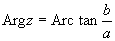
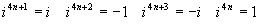

二、复数

1. 复数的概念

[实部与虚部·模与辐角·共轭复数]&nbsp; 复数<i>z</i>一般表示为<i>z</i>=<i>a</i>+<i>ib</i>，其中称为虚数单位，<i>a</i>和<i>b</i>均为实数，分别称为<i>z</i>的实部和虚部，记为<i>a</i>=Re <i>z</i>，<i>b</i>=Im <i>z</i>.

两个复数只有当实部和虚部分别相等时才相等.

称为复数<i>z</i>的模.

称为复数<i>z</i>的辐角，所以，一个复数有无穷多个辐角，但其中一个叫做主辐角，记为arg <i>z</i>，它满足

&nbsp;&nbsp;&nbsp;&nbsp;&nbsp;&nbsp;&nbsp;&nbsp;&nbsp;&nbsp;&nbsp;&nbsp;&nbsp;&nbsp;&nbsp;&nbsp;&nbsp;&nbsp;&nbsp;&nbsp;&nbsp;&nbsp;&nbsp;&nbsp;&nbsp;&nbsp;&nbsp;&nbsp;&nbsp;
0≤arg <i>z</i>&lt;2<i>p</i>

并有&nbsp;&nbsp;&nbsp;&nbsp;&nbsp;&nbsp;&nbsp;&nbsp;&nbsp;
&nbsp;&nbsp; Arg <i>z</i>=arg <i>z</i>+2<i>k</i><i>p</i>&nbsp; (<i>k</i>=0,±1,±2,L)

与互为共轭复数.

[虚数单位的乘方]

