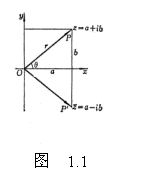
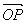
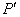
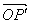
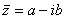
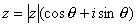
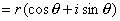
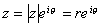

&nbsp;&nbsp;&nbsp; 2．复数的表示法

[坐标表示法]&nbsp; 复数<i>z</i>=<i>a</i>+<i>ib</i>可与直角坐标(<i>a</i>,<i>b</i>)建立一一对应(图1.1).

[矢量表示法]&nbsp; 把<i>a</i>，<i>b</i>视为矢量在<i>x</i>轴和<i>y</i>轴上的投影，则矢量(图1.1)可表示复数<i>z</i>=<i>a</i>+<i>ib</i>，与<i>P</i>点关于<i>x</i>轴对称的点记为，矢量表示共轭复数.

[三角表示法]&nbsp; 

&nbsp;&nbsp;&nbsp;&nbsp;&nbsp;&nbsp; 

[指数表示法]&nbsp; 

