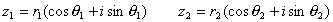

3．复数的运算

[代数式运算]

[三角式运算] 设

&nbsp;&nbsp;&nbsp;&nbsp;&nbsp;&nbsp; 

则&nbsp;&nbsp;&nbsp;&nbsp; 

&nbsp;&nbsp;&nbsp;&nbsp;&nbsp;&nbsp; 

&nbsp;&nbsp;&nbsp;&nbsp;&nbsp;&nbsp; 

当<i>r</i>1=1时，得，这个公式叫做德·莫弗公式.

[指数式运算] 设

&nbsp;&nbsp;&nbsp;&nbsp;&nbsp;&nbsp; 

则&nbsp;&nbsp;&nbsp;&nbsp; 

