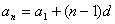
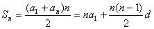
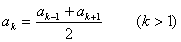

2．等差数列与等差（算术）级数

<i>a</i>1, <i>a</i>1+<i>d</i>, <i>a</i>1+2<i>d</i>,
<i>a</i>1+3<i>d</i>, L (<i>d</i>为常数)

称为公差为<i>d</i>的等差数列.与等差数列相应的级数称为等差级数，又称算术级数.

通项公式&nbsp;&nbsp;&nbsp;&nbsp;&nbsp; 

前<i>n</i>项和&nbsp;&nbsp;&nbsp;&nbsp;&nbsp; 

等差中项&nbsp;&nbsp;&nbsp;&nbsp;&nbsp; 

