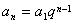
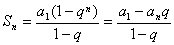
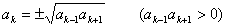
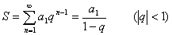

3．等比数列与等比（几何）级数

<i>a</i>1, <i>a</i>1<i>q</i>, <i>a</i>1<i>q</i>2,
<i>a</i>1<i>q</i>3, L (<i>q</i>为常数)

称为公比为<i>q</i>的等比数列.与等比数列相应的级数称为等比级数，又称几何级数.

通项公式&nbsp;&nbsp;&nbsp;&nbsp;&nbsp; 

前<i>n</i>项和&nbsp;&nbsp;&nbsp;&nbsp;&nbsp; 

等比中项&nbsp;&nbsp;&nbsp;&nbsp;&nbsp; 

无穷递减等比级数的和 

