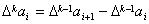
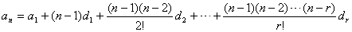
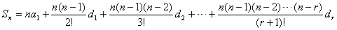

6．高阶等差级数

设有一数列

<i>a</i>1, <i>a</i>2, L , <i>a</i><i>n</i>, L (1)

如果接连地从它的后一项减去前一项，那末就得到原数列(1)的第一次差构成的数列

<i>a</i>2-<i>a</i>1, <i>a</i>3-<i>a</i>2,
L , <i>a</i><i>n</i>-<i>a</i><i>n-1</i>, L (2)

再接连地将(2)的后一项减去前一项，又得到数列(1)的第二次差构成的数列.依次类推：

<pre ALIGN=JUSTIFY>&nbsp;&nbsp;&nbsp;&nbsp;&nbsp;&nbsp;&nbsp;&nbsp;&nbsp;&nbsp;&nbsp;&nbsp;&nbsp;&nbsp; <i>a</i>1&nbsp;&nbsp;&nbsp;&nbsp;&nbsp;&nbsp;&nbsp;&nbsp;&nbsp;&nbsp;&nbsp;&nbsp;&nbsp;&nbsp;&nbsp;&nbsp;&nbsp;&nbsp;&nbsp;&nbsp;&nbsp;&nbsp;&nbsp;&nbsp;&nbsp;&nbsp;&nbsp; <i>a</i>2&nbsp;&nbsp;&nbsp;&nbsp;&nbsp;&nbsp;&nbsp;&nbsp;&nbsp;&nbsp;&nbsp;&nbsp;&nbsp;&nbsp;&nbsp;&nbsp;&nbsp;&nbsp;&nbsp;&nbsp;&nbsp;&nbsp;&nbsp;&nbsp;&nbsp;&nbsp;&nbsp; <i>a</i>3&nbsp;&nbsp;&nbsp;&nbsp;&nbsp;&nbsp;&nbsp;&nbsp;&nbsp;&nbsp;&nbsp;&nbsp;&nbsp; <i>a</i>4&nbsp;&nbsp;&nbsp;&nbsp;&nbsp;&nbsp;&nbsp;&nbsp;&nbsp;&nbsp;&nbsp;&nbsp;&nbsp; L&nbsp;&nbsp;&nbsp; </pre><pre
ALIGN=JUSTIFY>&nbsp;&nbsp;&nbsp;&nbsp;&nbsp;&nbsp;&nbsp; 第一次差&nbsp;&nbsp;&nbsp;&nbsp;&nbsp;&nbsp;&nbsp;&nbsp;&nbsp;&nbsp;&nbsp;&nbsp;&nbsp;&nbsp; <i>d</i>1=D<i>a</i>1&nbsp;&nbsp;&nbsp;&nbsp;&nbsp;&nbsp;&nbsp;&nbsp;&nbsp; D<i>a</i>2&nbsp;&nbsp;&nbsp;&nbsp;&nbsp;&nbsp;&nbsp;&nbsp;&nbsp;&nbsp;&nbsp;&nbsp; D<i>a</i>3&nbsp;&nbsp;&nbsp;&nbsp;&nbsp;&nbsp;&nbsp;&nbsp;&nbsp;&nbsp;&nbsp;&nbsp; L&nbsp;&nbsp;&nbsp; </pre><pre
ALIGN=JUSTIFY>&nbsp;&nbsp;&nbsp;&nbsp;&nbsp;&nbsp;&nbsp; 第二次差&nbsp;&nbsp;&nbsp;&nbsp;&nbsp;&nbsp;&nbsp;&nbsp;&nbsp;&nbsp;&nbsp;&nbsp;&nbsp;&nbsp;&nbsp;&nbsp;&nbsp;&nbsp;&nbsp;&nbsp;&nbsp;&nbsp; <i>d</i>2=D2<i>a</i>1&nbsp;&nbsp;&nbsp;&nbsp;&nbsp;&nbsp;&nbsp;&nbsp;&nbsp; D2<i>a</i>2&nbsp;&nbsp;&nbsp;&nbsp;&nbsp;&nbsp;&nbsp;&nbsp;&nbsp;&nbsp;&nbsp; L&nbsp;&nbsp;&nbsp; </pre><pre
ALIGN=JUSTIFY>&nbsp;&nbsp;&nbsp;&nbsp;&nbsp;&nbsp;&nbsp; 第三次差&nbsp;&nbsp;&nbsp;&nbsp;&nbsp;&nbsp;&nbsp;&nbsp;&nbsp;&nbsp;&nbsp;&nbsp;&nbsp;&nbsp;&nbsp;&nbsp;&nbsp;&nbsp;&nbsp;&nbsp;&nbsp;&nbsp;&nbsp;&nbsp;&nbsp;&nbsp;&nbsp;&nbsp;&nbsp; <i>d</i>3=D3<i>a</i>1&nbsp;&nbsp;&nbsp;&nbsp;&nbsp;&nbsp;&nbsp;&nbsp;&nbsp; L&nbsp;&nbsp;&nbsp; </pre><pre
ALIGN=JUSTIFY>&nbsp;&nbsp;&nbsp;&nbsp;&nbsp;&nbsp;&nbsp;&nbsp;&nbsp;&nbsp;&nbsp;&nbsp;&nbsp;&nbsp;&nbsp;&nbsp;&nbsp;&nbsp;&nbsp;&nbsp;&nbsp;&nbsp;&nbsp;&nbsp;&nbsp;&nbsp;&nbsp;&nbsp;&nbsp;&nbsp;&nbsp;&nbsp;&nbsp;&nbsp;&nbsp;&nbsp;&nbsp;&nbsp;&nbsp;&nbsp;&nbsp;&nbsp;&nbsp;&nbsp;&nbsp; L&nbsp;&nbsp;&nbsp; L </pre>

式中&nbsp;&nbsp;&nbsp;&nbsp;&nbsp;&nbsp;&nbsp;&nbsp;&nbsp;&nbsp;&nbsp;&nbsp;&nbsp;&nbsp;&nbsp;&nbsp;&nbsp;&nbsp;&nbsp;&nbsp;&nbsp;&nbsp;&nbsp; 

如果做了<i>r</i>次，数列(1)的每个第<i>r</i>次差都相等，那末以后各次差都等于零，则称数列(1)为<i>r</i>阶等差数列.与这样的数列相应的级数称为<i>r</i>阶等差级数.一阶等差级数也就是通常的算术级数.

设(1)是<i>r</i>阶等差数列，并设<i>d</i>1为(1)的第一次差构成的数列的首项，<i>d</i>2为(1)的第二次差构成的数列的首项，...，<i>dr</i>为(1)的第<i>r</i>次差构成的数列的首项，则有

通项公式 (<i>n</i>&gt;<i>r</i>)

前<i>n</i>项和

