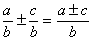
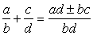
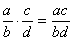
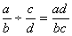
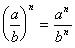
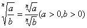

<h3>五、分式 </h3>

1. 分式运算

<pre ALIGN=JUSTIFY>&nbsp;&nbsp;&nbsp;&nbsp;&nbsp;&nbsp;&nbsp; &nbsp;&nbsp;&nbsp; </pre><pre
ALIGN=JUSTIFY>&nbsp;&nbsp;&nbsp;&nbsp;&nbsp;&nbsp;&nbsp; &nbsp;&nbsp;&nbsp;&nbsp;&nbsp; &nbsp;&nbsp; </pre><pre
ALIGN=JUSTIFY>&nbsp;&nbsp;&nbsp;&nbsp;&nbsp;&nbsp;&nbsp; &nbsp;&nbsp;&nbsp;&nbsp;&nbsp; </pre>
