

2. 部分分式

任一既约真分式(分子与分母没有公因子，分子次数低于分母次数)都可唯一地分解成形如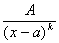或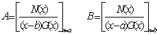的基本真分式之和，其运算称为部分分式展开.若为假分式(分子次数不低于分母次数)，应先化为整式与真分式之和，然后再对真分式进行部分分式展开.部分分式的各个系数可以通过待定系数法来确定.下面分几种不同情况介绍.

设&nbsp;&nbsp;&nbsp;&nbsp; 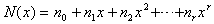

&nbsp;&nbsp;&nbsp;&nbsp;&nbsp;&nbsp; 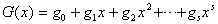

[线性因子重复]

1o 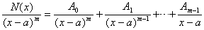

式中<i>N</i>(<i>x</i>)的最高次数<i>r</i>≤<i>m</i>-1；<i>A</i>0，<i>A</i>1，L ，<i>Am</i>-1为待定常数，可由下式确定：

&nbsp;&nbsp;&nbsp;&nbsp;&nbsp;&nbsp; 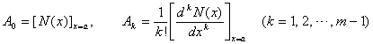

2o 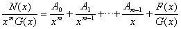

式中<i>A</i>0，<i>A</i>1，L ，<i>Am</i>为待定常数，可由下式确定：

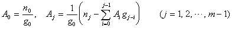

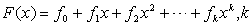≤<i>s</i>-1

其系数<i>fj</i>与<i>m</i>有关，由下表确定：

<table class=MsoNormalTable border=1 cellspacing=1 cellpadding=0 width=320
 style='width:240.0pt'>
 <tr>
  <td width="15%" valign=top style='width:15.0%;padding:.75pt .75pt .75pt .75pt'>
  
<i>m</i> 

  </td>
  <td width="85%" valign=top style='width:85.0%;padding:.75pt .75pt .75pt .75pt'>
  
<i>fj </i>(<i>j</i>=0, 1, 2, L , <i>k</i>; <i>k</i>≤<i>s</i>-1) 

  </td>
 </tr>
 <tr>
  <td width="15%" valign=top style='width:15.0%;padding:.75pt .75pt .75pt .75pt'>
  
1 

  </td>
  <td width="85%" valign=top style='width:85.0%;padding:.75pt .75pt .75pt .75pt'>
  
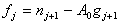

  </td>
 </tr>
 <tr>
  <td width="15%" valign=top style='width:15.0%;padding:.75pt .75pt .75pt .75pt'>
  
2 

  </td>
  <td width="85%" valign=top style='width:85.0%;padding:.75pt .75pt .75pt .75pt'>
  
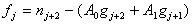

  </td>
 </tr>
 <tr>
  <td width="15%" valign=top style='width:15.0%;padding:.75pt .75pt .75pt .75pt'>
  
3 

  </td>
  <td width="85%" valign=top style='width:85.0%;padding:.75pt .75pt .75pt .75pt'>
  
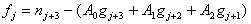

  </td>
 </tr>
 <tr>
  <td width="15%" valign=top style='width:15.0%;padding:.75pt .75pt .75pt .75pt'>
  
M 

  </td>
  <td width="85%" valign=top style='width:85.0%;padding:.75pt .75pt .75pt .75pt'>
  
L L L L L L L L 

  </td>
 </tr>
 <tr>
  <td width="15%" valign=top style='width:15.0%;padding:.75pt .75pt .75pt .75pt'>
  
<i>m</i> 

  </td>
  <td width="85%" valign=top style='width:85.0%;padding:.75pt .75pt .75pt .75pt'>
  
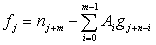

  </td>
 </tr>
</table>

例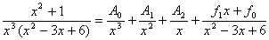

解 依上述公式算出

&nbsp;&nbsp;&nbsp;&nbsp;&nbsp;&nbsp; 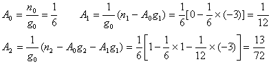

此时<i>m</i>=3，

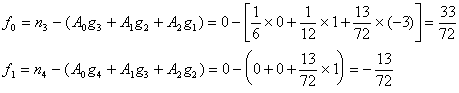

所以得到

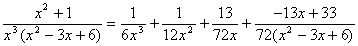

3o 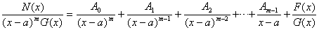

作变换<i>y</i>=<i>x</i>-<i>a</i>，则<i>N</i>(<i>x</i>)=<i>N</i>1(<i>y</i>),
<i>G</i>(<i>x</i>)=<i>G</i>1(<i>y</i>), 上式变为

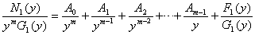

用上述1o，2o的方法确定出<i>A</i>0, <i>A</i>1,
L , <i>Am</i>-1和<i>F</i>1(<i>y</i>)，再将<i>y</i>=<i>x</i>-<i>a</i>代回.也可按下式来确定系数<i>A</i>0, <i>A</i>1,
L , <i>Am</i>-1：

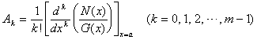

[线性因子不重复]

1o 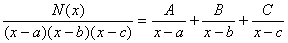

式中<i>N</i>(<i>x</i>)的最高次数<i>r</i>≤2，<i>a</i><i>&sup1; b</i><i>&sup1; c</i>；<i>A</i>, <i>B</i>, <i>C</i>为待定常数，可由下式确定：

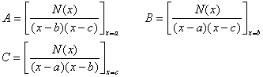

2o 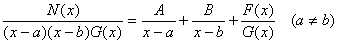

式中多项式<i>F</i>(<i>x</i>)的最高次数<i>k</i>≤s-1；<i>A</i>, <i>B</i>为待定常数，用下式确定：

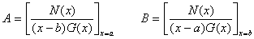

<i>A</i>, <i>B</i>确定后，再用等式两边多项式同次项系数必须相等的法则来确定<i>F</i>(<i>x</i>)的各项系数.

例 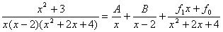

解 依上述公式算得

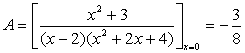

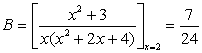

把<i>A</i>,<i>B</i>代入原式，通分并整理后得

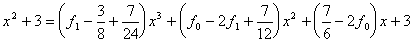

比较等式两边同次项系数得

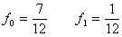

所以有

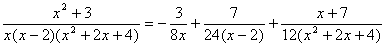

[高次因子]

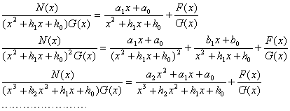

[计算系数的一般方法]

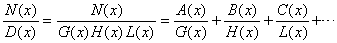

1o 等式两边乘以<i>D</i>(<i>x</i>)化为整式，各项按<i>x</i>的同次幂合并，然后列出未知系数的方程组，解出而得.

2o 等式两边乘以<i>D</i>(<i>x</i>)化为整式，再把<i>x</i>用简单的数值(如<i>x</i>=0, 1, -1等)代入，然后列出未知系数的方程组，解出而得.

