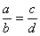
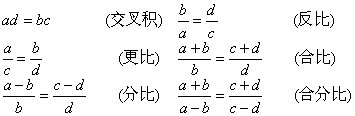
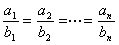
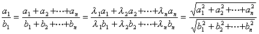
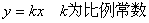
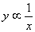
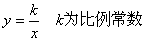
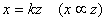
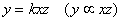

六、比例

1o&nbsp;
若(或写为<i>a</i>:<i>b</i>=<i>c</i>:<i>d</i>)，<i>a</i>, <i>b</i>, <i>c</i>, <i>d</i>都不等于零，则

2o&nbsp;
若，则

式中<i>l i</i>(<i>i</i>=1, 2, L, <i>n</i>)为一组任意的常数，<i>bi</i>(<i>i</i>=1, 2, L, <i>n</i>)都不等于零.

3o&nbsp; 若<i>y</i>与<i>x</i>成正比，(记作<i>y</i>&micro;<i>x</i>)，则

若<i>y</i>与<i>x</i>成反比，(记作)，则

若<i>y</i>与<i>x</i>成正比，<i>y</i>与<i>z</i>也成正比(即<i>y</i>&micro;<i>x</i>, <i>y</i>&micro;<i>z</i>)，则<i>x</i>与<i>z</i>成正比，即

且<i>y</i>与<i>xz</i>成正比，即

