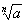
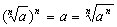

<h3>七、根式 </h3>

1. 根式的概念

[方根与根式] 数<i>a</i>的<i>n</i>次方根是指求一个数，它的<i>n</i>次方恰好等于<i>a</i>.<i>a</i>的<i>n</i>次方根记为(<i>n</i>为大于1的自然数).作为代数式，称为根式.<i>n</i>称为根指数，<i>a</i>称为根底数.在实数范围内，负数不能开偶次方，一个正数开偶次方有两个方根，其绝对值相同，符号相反.

[算术根] 正数的正方根称为算术根.零的算术根规定为零.

[基本性质] 由方根的定义，有

