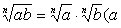
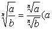
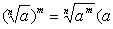
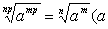
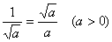
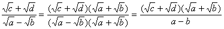
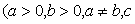
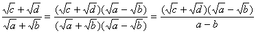

2. 根式运算

[乘积的方根] 乘积的方根等于各因子同次方根的乘积；反过来，同次方根的乘积等于乘积的同次方根，即

≥0,<i>b</i>≥0)

[分式的方根] 分式的方根等于分子、分母同次方根相除，即

≥0,<i>b</i>&gt;0)

[根式的乘方]  ≥0)

[根式化简]

≥0)

&nbsp;&nbsp;&nbsp;&nbsp;&nbsp;&nbsp; ≥0,<i>d</i>≥0)

&nbsp;&nbsp;&nbsp;&nbsp;&nbsp;&nbsp; ≥0,<i>d</i>≥0)

[同类根式及其加减运算]
根指数和根底数都相同的根式称为同类根式，只有同类根式才可用加减运算加以合并.

　

