

4. 某些重要不等式

[算术平均值与几何平均值不等式]

1o 几个数的算术平均值的绝对值不超过这些数的均方根，即

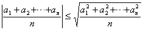

等号只当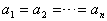时成立.

2o 设<i>a</i>1, <i>a</i>2, L , <i>a</i><i>n</i>均为正数，则它们的几何平均值不超过算术平均值，即

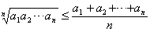

等号只当时成立.

3o 对<i>n</i>个正数<i>a</i>1, <i>a</i>2, L , <i>a</i><i>n</i>的加权平均值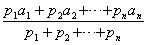，有

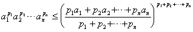

等号只当<i>a</i>1=<i>a</i>2=L =<i>a</i><i>n</i>时成立.

4o 设<i>a</i>1, <i>a</i>2, L , <i>a</i><i>n</i>为正数，又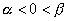，则有

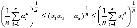

[柯西不等式] 设<i>ai</i>, <i>b<b>i</b></i>(<i>i</i>=1, 2, L , <i>n</i>)为任意实数，则

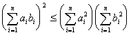

等号只当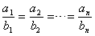时成立.这个不等式表明一个角(取实数值)的余弦值总是小于1的，或者说二矢量内积小于二矢量长度之积.

[赫尔德不等式]

1o 设<i>ai</i>, <i>bi</i>, L , <i>li</i>(<i>i</i>=1, 2, L , <i>n</i>)为正数，又a
, b , L , l 为正数，且a
+b +L +l =1，则

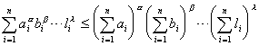

等号只当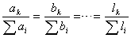时成立.

2o 设<i>ai</i>, <i>bi</i> (<i>i</i>=1, 2, L , <i>n</i>)为正数，又<i>k</i>&gt;0, <i>k</i><i>&sup1; </i>1, 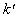与<i>k</i>共轭，即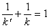，或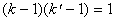，则

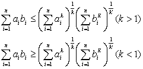

等号只当时成立.

[闵可夫斯基不等式] 设<i>ai</i>, <i>bi</i>&gt;0 (<i>i</i>=1, 2, L , <i>n</i>)，又<i>r</i>&gt;0, <i>r</i><i>&sup1; </i>1, 则

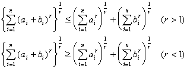

等号只当时成立.当<i>r</i>=2时，此不等式也称为三角形不等式，它表明三角形两边之和大于第三边.

[契贝谢夫不等式] 设<i>ai</i>&gt;0, <i>bi</i>&gt;0 (<i>i</i>=1, 2, L , <i>n</i>).若<i>a</i>1&pound; <i>a</i>2&pound; L &pound; <i>an</i>, 且<i>b</i>1&pound; <i>b</i>2&pound; L &pound; <i>bn</i>, 或<i>a</i>1&sup3; <i>a</i>2&sup3; L &sup3; <i>an</i>, 且<i>b</i>1&sup3; <i>b</i>2&sup3; L &sup3; <i>bn</i>, 则

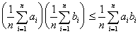

若<i>a</i>1&pound; <i>a</i>2&pound; L &pound; <i>an</i>而<i>b</i>1&sup3; <i>b</i>2&sup3; L &sup3; <i>bn</i>，则

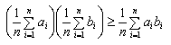

[詹生不等式] 设<i>ai</i>&gt;0 (<i>i</i>=1, 2, L , <i>n</i>)，且0&lt;<i>r</i><i>&pound; </i><i>s</i>，则

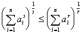

[伯努利不等式] 设<i>a</i>&gt;1，自然数<i>n</i>&gt;1，则

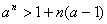

特别令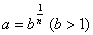，则

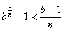

