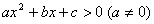
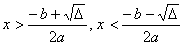
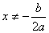
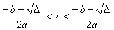

5. 二次不等式解法

的解 (设)

<table class=MsoNormalTable border=1 cellspacing=1 cellpadding=0 width=623
 style='width:467.25pt'>
 <tr>
  <td width="12%" valign=top style='width:12.0%;padding:5.25pt 5.25pt 5.25pt 5.25pt'>
  
　

  </td>
  <td width="35%" valign=top style='width:35.0%;padding:5.25pt 5.25pt 5.25pt 5.25pt'>
  
D &gt;0 

  </td>
  <td width="27%" valign=top style='width:27.0%;padding:5.25pt 5.25pt 5.25pt 5.25pt'>
  
D =0 

  </td>
  <td width="26%" valign=top style='width:26.0%;padding:5.25pt 5.25pt 5.25pt 5.25pt'>
  
D &lt;0 

  </td>
 </tr>
 <tr>
  <td width="12%" valign=top style='width:12.0%;padding:5.25pt 5.25pt 5.25pt 5.25pt'>
  
<i>a</i>&gt;0 

  </td>
  <td width="35%" valign=top style='width:35.0%;padding:5.25pt 5.25pt 5.25pt 5.25pt'>
  

  </td>
  <td width="27%" valign=top style='width:27.0%;padding:5.25pt 5.25pt 5.25pt 5.25pt'>
  

  </td>
  <td width="26%" valign=top style='width:26.0%;padding:5.25pt 5.25pt 5.25pt 5.25pt'>
  

  </td>
 </tr>
 <tr>
  <td width="12%" valign=top style='width:12.0%;padding:5.25pt 5.25pt 5.25pt 5.25pt'>
  
<i>a</i>&lt;0 

  </td>
  <td width="35%" valign=top style='width:35.0%;padding:5.25pt 5.25pt 5.25pt 5.25pt'>
  

  </td>
  <td width="27%" valign=top style='width:27.0%;padding:5.25pt 5.25pt 5.25pt 5.25pt'>
  
无解 

  </td>
  <td width="26%" valign=top style='width:26.0%;padding:5.25pt 5.25pt 5.25pt 5.25pt'>
  
无解 

  </td>
 </tr>
</table>

　

