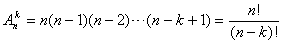
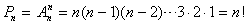
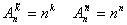
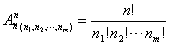
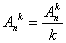

2. 排列

[选排列] 从<i>n</i>个不同的元素中，每次取出<i>k</i>个(<i>k≤</i><i>n</i>)不同的元素，按一定的顺序排成一列，称为选排列.其排列种数为

[全排列] 从<i>n</i>个不同的元素中，每次取出<i>n</i>个不同的元素，按一定的顺序排成一列，称为全排列.其排列种数为

[有重复的排列] 从<i>n</i>个不同的元素中，每次取出<i>k</i>个元素(<i>k≤</i><i>n</i>)，允许重复，这种排列称为有重复的排列.其排列种数为

[不尽相异元素的全排列]
如果在<i>n</i>个元素中，有<i>n</i>1个元素彼此相同，又有<i>n</i>2个元素彼此相同，L ，又有<i>nm</i>个元素彼此相同(<i>n</i>1+<i>n</i>2+L +<i>nm</i>=<i>n</i>)，那末这<i>n</i>个元素的全排列称为不尽相异元素的全排列.其排列种数为

[环状排列] 从<i>n</i>个不同元素中，每次取出<i>k</i>个元素，仅按元素之间的相对位置而不分首尾地围成一圈，这种排列法称为环状排列.其排列种数为

