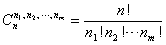
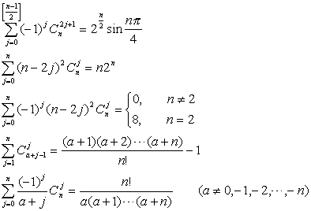

3. 组合

[通常意义下的组合] 从<i>n</i>个不同的元素中，每次取出<i>k</i>个不同的元素，不管其顺序合并成一组，称为组合.其组合种数为

并且规定.

[多组组合]把<i>n</i>个不同的元素分成<i>m</i>组，第<i>i</i>组有<i>ni</i>个不同的元素，即，这样分组的种数为

通常意义下的组合是其特例.

[有重复的组合] 从<i>n</i>个不同元素中，每次取出<i>k</i>个元素，允许重复，不管其顺序合并成一组，这种组合称为有重复的组合，其组合种数为

[组合公式]

