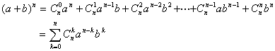
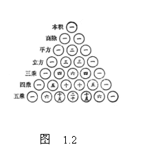
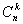
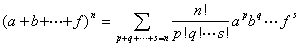

十、杨辉三角形与多项式定理

[二项式定理]

式中<i>n</i>为正整数，称为二项系数.

&nbsp;[杨辉三角形]&nbsp; 我国南宋时期数学家杨辉在他所著的《详解九章算法》(1261年)中记载着有关二项系数的研究.在二项式定理中，当<i>n</i>分别取0, 1, 2, 3, 4, 5, 6时，其二项系数表示成图1.2，即所谓“杨辉三角形”.法国人帕斯卡也有类似结果(1650年)，故外国书刊中称之为“帕斯卡三角形”，但比杨辉晚了近四百年.

[多项式定理]

和式中每一数组(<i>p</i>, <i>q</i>,L,<i>s</i>)对应一项，这个数组满足0&pound;<i>p</i>&pound;<i>n</i>, 0&pound;<i>q</i>&pound;<i>n</i>, L, 0&pound;<i>s</i>&pound;<i>n</i>, <i>p</i>+<i>q</i>+L+<i>s</i>=<i>n</i>,
S是对于所有这样的数组求和.

