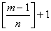

<h3>十一、数学归纳法与抽屉原理 </h3>

[数学归纳法] 对于包含整数<i>n</i>的公式，即从某一整数起对后面所有整数<i>n</i>都成立的公式，有时可用数学归纳法来证明.其步骤如下：

1o 验证<i>n</i>取第一个值<i>n</i>0时(如<i>n</i>0=0, 1或2等)公式成立.

2o 假定当<i>n</i>=<i>k</i>时公式成立，验证当<i>n</i>=<i>k</i>+1时公式也成立.

因为公式当<i>n</i>=<i>n</i>0时成立，所以由2o可知，当<i>n</i>=<i>n</i>0+1时公式也成立；再由2o可知，当<i>n</i>=<i>n</i>0+1+1=<i>n</i>0+2时公式也成立，如此继续推下去可知，对一切大于<i>n</i>0的整数<i>n</i>公式都成立.

[抽屉原理] <i>n</i>+1个物体放入<i>n</i>个抽屉里，至少有一个抽屉有两个以上的物体，这个原理称为抽屉原理，它在证明某些存在性定理时很有用.抽屉原理分以下三种形式：

1o <i>n</i>+1个元素分成<i>n</i>组，必有一组至少包含两个元素.

2o <i>m</i>个元素分成<i>n</i>组(<i>m</i>&gt;<i>n</i>为正整数)，必有一组至少包含个元素([<i>x</i>]表示<i>x</i>的整数部分).

3o 无限多个元素分成有限组，必有一组包含无限多个元素.

