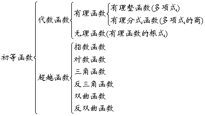

<h2>§2 初等函数及其数值计算 </h2>
<h3>一、函数的概念与分类 </h3>

[函数与反函数] 设<i>D</i>是给定的一个数集.若有两个变量<i>x</i>和<i>y</i>，当变量<i>x</i>在<i>D</i>中取某个特定值时，变量<i>y</i>依确定的关系<i>f</i>也有一个确定的值，则称<i>y</i>是<i>x</i>的函数，<i>f</i>称为<i>D</i>上的一个函数关系，记为<i>y</i>=<i>f</i>(<i>x</i>)，<i>x</i>称为自变量，<i>y</i>称为因变量.当<i>x</i>取遍<i>D</i>中各数，对应的<i>y</i>构成一数集<i>R</i>，<i>D</i>称为定义域或自变数域，<i>R</i>称为值域或因变数域.反过来，若把<i>y</i>视为自变量，<i>x</i>视为因变量，用<i>y</i>写出<i>x</i>的表达式：<i>x</i>=j(<i>y</i>)，则称<i>y</i>=<i>f</i>(<i>x</i>)与<i>x</i>=j(<i>y</i>)互为反函数.

[实变函数与复变函数]
当自变数域为实数域时，函数称为实变函数.当自变数域为复数域时，函数称为复变函数.

[一元函数与多元函数]
只有一个自变量的函数称为一元函数.有两个或两个以上自变量的函数称为多元函数.

[显函数与隐函数] 因变量可以由自变量用数学式子直接表示出来的函数称为显函数.若函数关系包含在一个方程式或一组方程式中，自变量与因变量无明显区分，则称为隐函数.

[简单函数与复合函数]
若<i>y</i>是<i>u</i>的函数<i>y</i>=<i>f</i>(<i>u</i>)，而<i>u</i>又是<i>x</i>的函数，<i>u</i>=j(<i>x</i>)，则<i>y</i>称为<i>x</i>的复合函数，<i>u</i>称为中间变量，记作<i>y</i>=<i>f</i>[j(<i>x</i>)]，无中间变量的函数称为简单函数.

[有界函数与无界函数]
若存在两个数<i>m</i>, <i>M</i>(<i>m</i><i>&pound; </i><i>M</i>)，使<i>m</i><i>&pound; </i><i>f(</i><i>x)</i>&pound; <i>M</i>，对定义域上的任意<i>x</i>都成立，则称<i>f</i>(<i>x</i>)为定义域上的有界函数，<i>m</i>为其下界，<i>M</i>为其上界.若这样的数<i>m</i>和<i>M</i>至少有一个不存在，则称<i>f</i>(<i>x</i>)为定义域上的无界函数.

[单调函数与非单调函数]
若对于区间[<i>a</i>, <i>b</i>]中的任意<i>x</i>1&gt;<i>x</i>2有<i>f</i>(<i>x</i>1)&sup3; <i>f</i>(<i>x</i>2)[或<i>f</i>(<i>x</i>1)&pound; <i>f</i>(<i>x</i>2)]，则称<i>f</i>(<i>x</i>)为[<i>a</i>, <i>b</i>]中的递增函数(或递减函数).递增函数和递减函数通称为单调函数.不是递增(或递减)的函数称为非单调函数.

[奇函数与偶函数] 若对于定义域中的任意<i>x</i>恒有<i>f</i>(<i>-x</i>)=-<i>f</i>(<i>x</i>)，则称<i>f</i>(<i>x</i>)为奇函数；若对于定义域中的任意<i>x</i>恒有<i>f</i>(-<i>x</i>)=<i>f</i>(<i>x</i>)，则称<i>f</i>(<i>x</i>)为偶函数.

[周期函数与非周期函数]
若有一实数<i>T</i><i>&sup1; </i>0，使对定义域中的任意<i>x</i>恒有<i>f</i>(<i>x</i>+<i>T</i>)=<i>f</i>(<i>x</i>)，则<i>f</i>(<i>x</i>)称为以<i>T</i>为周期的周期函数；否则称<i>f</i>(<i>x</i>)为非周期函数.

[单值函数与多值函数]
若对于自变量<i>x</i>的一个值，因变量<i>y</i>有一个而且只有一个值与其对应，则称<i>y</i>为<i>x</i>的单值函数.若对于自变量<i>x</i>的一个值，与其对应的<i>y</i>值不止一个，则称<i>y</i>为<i>x</i>的多值函数.

[初等函数] 幂函数、指数函数、对数函数、三角函数、反三角函数通称为“基本初等函数”，凡是由基本初等函数经过有限次四则运算以及有限次的复合步骤而构成，并能用一个数学式子表示的函数都属于初等函数.

　

