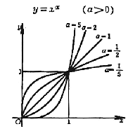
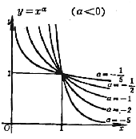

<h3>二、幂函数与有理函数 </h3>

[定义] 形如的函数称为幂函数，式中a 为任意实常数.

<i>x</i>的多项式

(<i>a</i>0, <i>a</i>1, L , <i>an</i>为常数，<i>n</i>为自然数)

称为有理整函数.

两个多项式的商

称为有理分式函数.

有理整函数和有理分式函数通称为有理函数，有时用符号<i>R</i>(<i>x</i>)表示.

[幂函数的图形与特征]

　

<table class=MsoNormalTable border=1 cellspacing=1 cellpadding=0 width=642
 style='width:481.5pt'>
 <tr>
  <td width="40%" valign=top style='width:40.0%;padding:5.25pt 5.25pt 5.25pt 5.25pt'>
  
方程与图形 

  </td>
  <td width="60%" valign=top style='width:60.0%;padding:5.25pt 5.25pt 5.25pt 5.25pt'>
  
特 征 

  </td>
 </tr>
 <tr style='height:171.0pt'>
  <td width="40%" valign=top style='width:40.0%;padding:5.25pt 5.25pt 5.25pt 5.25pt;
  height:171.0pt'>
  

  </td>
  <td width="60%" valign=top style='width:60.0%;padding:5.25pt 5.25pt 5.25pt 5.25pt;
  height:171.0pt'>
  
曲线通过点(0,0)和(1,1)；当<i>x</i>&gt;1时，a
  越大曲线上升越快.

  
当a 为偶数，函数为偶函数，在区间(0,&yen;
  )中为递增函数，在区间(-&yen; ,0)中为递减函数.

  
当a 为奇数，函数为奇函数和递增函数. 

  </td>
 </tr>
 <tr style='height:162.0pt'>
  <td width="40%" valign=top style='width:40.0%;padding:5.25pt 5.25pt 5.25pt 5.25pt;
  height:162.0pt'>
  
&nbsp; 

  </td>
  <td width="60%" valign=top style='width:60.0%;padding:5.25pt 5.25pt 5.25pt 5.25pt;
  height:162.0pt'>
  
曲线通过点(1,1).

  
当a 为负偶数，函数为偶函数，在区间(-&yen;
  ,0)中为递增函数，在区间(0, &yen; )中为递减函数.

  
当a 为负奇数，函数为奇函数和递减函数. 

  </td>
 </tr>
</table>

&nbsp;

