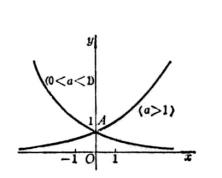
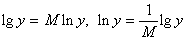

三、指数函数与对数函数

[定义]&nbsp; 形如的函数称为指数函数.

当<i>a</i>=<i>e</i>时，为书写方便，有时把记作exp<i>x</i>，把记作exp{<i>f</i>(<i>x</i>)}，等等.

在函数关系式中，若把<i>x</i>视为自变量，<i>y</i>视为因变量，则称<i>y</i>是以<i>a</i>为底的<i>x</i>的对数函数，<i>x</i>称为真数，记作.指数函数和对数函数互为反函数.

[函数图形与特征]

<table class=MsoNormalTable border=1 cellspacing=0 cellpadding=0
 style='border-collapse:collapse;border:none'>
 <tr>
  <td width=227 valign=top style='width:60.0mm;border:solid windowtext 1.0pt;
  border-left:none;padding:0mm 5.4pt 0mm 5.4pt'>
  
方程与图形

  </td>
  <td width=416 valign=top style='width:110.0mm;border-top:solid windowtext 1.0pt;
  border-left:none;border-bottom:solid windowtext 1.0pt;border-right:none;
  padding:0mm 5.4pt 0mm 5.4pt'>
  
特&nbsp;&nbsp; 征

  </td>
 </tr>
 <tr>
  <td width=227 valign=top style='width:60.0mm;border-top:none;border-left:
  none;border-bottom:solid windowtext 1.0pt;border-right:solid windowtext 1.0pt;
  padding:0mm 5.4pt 0mm 5.4pt'>
  
指数函数

  
&nbsp;&nbsp;&nbsp;&nbsp;&nbsp; 

  

  </td>
  <td width=416 style='width:110.0mm;border:none;border-bottom:solid windowtext 1.0pt;
  padding:0mm 5.4pt 0mm 5.4pt'>
  
曲线与<i>y</i>轴相交于点<i>A</i>(0,1).

  
渐近线为<i>y</i>=0.

  </td>
 </tr>
 <tr>
  <td width=227 valign=top style='width:60.0mm;border-top:none;border-left:
  none;border-bottom:solid windowtext 1.0pt;border-right:solid windowtext 1.0pt;
  padding:0mm 5.4pt 0mm 5.4pt'>
  
对数函数

  
&nbsp; 

  

  </td>
  <td width=416 style='width:110.0mm;border:none;border-bottom:solid windowtext 1.0pt;
  padding:0mm 5.4pt 0mm 5.4pt'>
  
曲线与<i>x</i>轴相交于点<i>A</i>(1,0).

  
渐近线为<i>x</i>=0.

  </td>
 </tr>
</table>

[指数运算法则]

[对数的性质与运算法则]&nbsp; 在下面的公式中，假设<i>a</i>&gt;0，同时所遇到的函数都假设是在定义域里讨论的.

&nbsp;&nbsp;&nbsp;&nbsp;&nbsp;&nbsp; 零与负数没有对数&nbsp;&nbsp; 

&nbsp;&nbsp;&nbsp;&nbsp;&nbsp;&nbsp; &nbsp;&nbsp;&nbsp;&nbsp; 

&nbsp;&nbsp;&nbsp;&nbsp;&nbsp;&nbsp; &nbsp; 

&nbsp;&nbsp;&nbsp;&nbsp;&nbsp;&nbsp; 对数恒等式 &nbsp;&nbsp;&nbsp; 换底公式 

&nbsp;&nbsp;&nbsp;&nbsp;&nbsp;&nbsp; 

[常用对数与自然对数]

1o&nbsp; 常用对数：以10为底的对数称为常用对数，记作

&nbsp;&nbsp;&nbsp;&nbsp;&nbsp;&nbsp;&nbsp;&nbsp;&nbsp;&nbsp;&nbsp;&nbsp;&nbsp;&nbsp;&nbsp;&nbsp;&nbsp;&nbsp;&nbsp;&nbsp;&nbsp;&nbsp;&nbsp;&nbsp;
&nbsp;&nbsp;&nbsp;&nbsp;&nbsp;&nbsp;&nbsp;&nbsp;

2o&nbsp; 自然对数：以<i>e</i>=2.718281828459L为底的对数称为自然对数，记作

3o&nbsp; 常用对数与自然对数的关系：

式中<i>M</i>称为模数，

&nbsp;&nbsp;&nbsp;

4o&nbsp; 常用对数首数求法：

若真数大于1，则对数的首数为正数或零，其值比整数位数少1.

若真数小于1，则对数的首数为负数，其绝对值等于真数首位有效数字前面“0”的个数(包括小数点前的那个“0”).

对数的尾数由对数表查出.

