

四、平面三角函数与反三角函数

1. 角的度量与换算

[角度制与弧度制]

1o&nbsp; 整个圆周的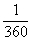的弧称为含有1度的弧，而1度的弧所对的圆心角称为1度的角.1度等于60分(记作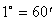)，1分等于60秒(记作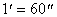).这种用度来度量角的方法称为角度制.

2o &nbsp;把等于半径长的弧称为含有1弧度的弧，而1弧度的弧所对的圆心角称为1弧度的角，这种用弧度来度量角的方法称为弧度制.

[度与弧度的换算]&nbsp; 弧度与度的关系是

&nbsp;&nbsp;&nbsp;&nbsp;&nbsp;&nbsp;&nbsp;&nbsp;&nbsp;&nbsp;&nbsp;&nbsp;&nbsp;&nbsp;&nbsp;&nbsp;&nbsp;&nbsp;&nbsp;&nbsp;&nbsp;&nbsp;&nbsp;&nbsp;&nbsp;&nbsp;&nbsp;&nbsp;&nbsp;&nbsp;
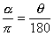

式中<i>q</i>与<i>a</i>分别表示同一角的度数与弧度数.

度与弧度换算表Ⅰ

<table class=MsoNormalTable border=1 cellspacing=0 cellpadding=0
 style='border-collapse:collapse;border:none'>
 <tr>
  <td width=142 valign=top style='width:106.35pt;border:solid windowtext 1.0pt;
  border-left:none;padding:0mm 5.4pt 0mm 5.4pt'>
  
弧度 ( r )

  </td>
  <td width=161 valign=top style='width:120.45pt;border:solid windowtext 1.0pt;
  border-left:none;padding:0mm 5.4pt 0mm 5.4pt'>
  
度 (°)

  </td>
  <td width=170 valign=top style='width:127.6pt;border:solid windowtext 1.0pt;
  border-left:none;padding:0mm 5.4pt 0mm 5.4pt'>
  
分 ( ′)

  </td>
  <td width=170 valign=top style='width:127.55pt;border-top:solid windowtext 1.0pt;
  border-left:none;border-bottom:solid windowtext 1.0pt;border-right:none;
  padding:0mm 5.4pt 0mm 5.4pt'>
  
秒 (&quot; )

  </td>
 </tr>
 <tr>
  <td width=142 valign=top style='width:106.35pt;border:none;border-right:solid windowtext 1.0pt;
  padding:0mm 5.4pt 0mm 5.4pt'>
  
<b>1</b>

  </td>
  <td width=161 valign=top style='width:120.45pt;border:none;border-right:solid windowtext 1.0pt;
  padding:0mm 5.4pt 0mm 5.4pt'>
  
57.29577951

  </td>
  <td width=170 valign=top style='width:127.6pt;border:none;border-right:solid windowtext 1.0pt;
  padding:0mm 5.4pt 0mm 5.4pt'>
  
3437.746771

  </td>
  <td width=170 valign=top style='width:127.55pt;border:none;padding:0mm 5.4pt 0mm 5.4pt'>
  
206264.8063

  </td>
 </tr>
 <tr>
  <td width=142 valign=top style='width:106.35pt;border:none;border-right:solid windowtext 1.0pt;
  padding:0mm 5.4pt 0mm 5.4pt'>
  
0.017453293

  </td>
  <td width=161 valign=top style='width:120.45pt;border:none;border-right:solid windowtext 1.0pt;
  padding:0mm 5.4pt 0mm 5.4pt'>
  
<b>1</b>

  </td>
  <td width=170 valign=top style='width:127.6pt;border:none;border-right:solid windowtext 1.0pt;
  padding:0mm 5.4pt 0mm 5.4pt'>
  
<b>60</b>

  </td>
  <td width=170 valign=top style='width:127.55pt;border:none;padding:0mm 5.4pt 0mm 5.4pt'>
  
<b>3600</b>

  </td>
 </tr>
 <tr>
  <td width=142 valign=top style='width:106.35pt;border:none;border-right:solid windowtext 1.0pt;
  padding:0mm 5.4pt 0mm 5.4pt'>
  
0.0002908882

  </td>
  <td width=161 valign=top style='width:120.45pt;border:none;border-right:solid windowtext 1.0pt;
  padding:0mm 5.4pt 0mm 5.4pt'>
  
0.016666667

  </td>
  <td width=170 valign=top style='width:127.6pt;border:none;border-right:solid windowtext 1.0pt;
  padding:0mm 5.4pt 0mm 5.4pt'>
  
<b>1</b>

  </td>
  <td width=170 valign=top style='width:127.55pt;border:none;padding:0mm 5.4pt 0mm 5.4pt'>
  
<b>60</b>

  </td>
 </tr>
 <tr>
  <td width=142 valign=top style='width:106.35pt;border-top:none;border-left:
  none;border-bottom:solid windowtext 1.0pt;border-right:solid windowtext 1.0pt;
  padding:0mm 5.4pt 0mm 5.4pt'>
  
0.0000048481

  </td>
  <td width=161 valign=top style='width:120.45pt;border-top:none;border-left:
  none;border-bottom:solid windowtext 1.0pt;border-right:solid windowtext 1.0pt;
  padding:0mm 5.4pt 0mm 5.4pt'>
  
0.000277778

  </td>
  <td width=170 valign=top style='width:127.6pt;border-top:none;border-left:
  none;border-bottom:solid windowtext 1.0pt;border-right:solid windowtext 1.0pt;
  padding:0mm 5.4pt 0mm 5.4pt'>
  
0.016666667

  </td>
  <td width=170 valign=top style='width:127.55pt;border:none;border-bottom:
  solid windowtext 1.0pt;padding:0mm 5.4pt 0mm 5.4pt'>
  
<b>1</b>

  </td>
 </tr>
</table>

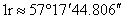.表中黑体数字为精确值.

度与弧度换算表Ⅱ

<table class=MsoNormalTable border=1 cellspacing=0 cellpadding=0
 style='border-collapse:collapse;border:none'>
 <tr>
  <td width=85 valign=top style='width:63.8pt;border:solid windowtext 1.0pt;
  border-left:none;padding:0mm 5.4pt 0mm 5.4pt'>
  
度

  </td>
  <td width=85 valign=top style='width:63.8pt;border:solid windowtext 1.0pt;
  border-left:none;padding:0mm 5.4pt 0mm 5.4pt'>
  
360°

  </td>
  <td width=85 valign=top style='width:63.8pt;border:solid windowtext 1.0pt;
  border-left:none;padding:0mm 5.4pt 0mm 5.4pt'>
  
180°

  </td>
  <td width=94 valign=top style='width:70.85pt;border:solid windowtext 1.0pt;
  border-left:none;padding:0mm 5.4pt 0mm 5.4pt'>
  
90°

  </td>
  <td width=95 valign=top style='width:70.9pt;border:solid windowtext 1.0pt;
  border-left:none;padding:0mm 5.4pt 0mm 5.4pt'>
  
60°

  </td>
  <td width=104 valign=top style='width:77.95pt;border:solid windowtext 1.0pt;
  border-left:none;padding:0mm 5.4pt 0mm 5.4pt'>
  
45°

  </td>
  <td width=94 valign=top style='width:70.85pt;border-top:solid windowtext 1.0pt;
  border-left:none;border-bottom:solid windowtext 1.0pt;border-right:none;
  padding:0mm 5.4pt 0mm 5.4pt'>
  
30°

  </td>
 </tr>
 <tr>
  <td width=85 valign=top style='width:63.8pt;border-top:none;border-left:none;
  border-bottom:solid windowtext 1.0pt;border-right:solid windowtext 1.0pt;
  padding:0mm 5.4pt 0mm 5.4pt'>
  
弧度

  </td>
  <td width=85 valign=top style='width:63.8pt;border-top:none;border-left:none;
  border-bottom:solid windowtext 1.0pt;border-right:solid windowtext 1.0pt;
  padding:0mm 5.4pt 0mm 5.4pt'>
  
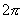

  </td>
  <td width=85 valign=top style='width:63.8pt;border-top:none;border-left:none;
  border-bottom:solid windowtext 1.0pt;border-right:solid windowtext 1.0pt;
  padding:0mm 5.4pt 0mm 5.4pt'>
  

  </td>
  <td width=94 valign=top style='width:70.85pt;border-top:none;border-left:
  none;border-bottom:solid windowtext 1.0pt;border-right:solid windowtext 1.0pt;
  padding:0mm 5.4pt 0mm 5.4pt'>
  

  </td>
  <td width=95 valign=top style='width:70.9pt;border-top:none;border-left:none;
  border-bottom:solid windowtext 1.0pt;border-right:solid windowtext 1.0pt;
  padding:0mm 5.4pt 0mm 5.4pt'>
  
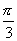

  </td>
  <td width=104 valign=top style='width:77.95pt;border-top:none;border-left:
  none;border-bottom:solid windowtext 1.0pt;border-right:solid windowtext 1.0pt;
  padding:0mm 5.4pt 0mm 5.4pt'>
  
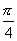

  </td>
  <td width=94 valign=top style='width:70.85pt;border:none;border-bottom:solid windowtext 1.0pt;
  padding:0mm 5.4pt 0mm 5.4pt'>
  
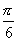

  </td>
 </tr>
</table>

[祖率(圆周率)<i>p</i>]&nbsp; 圆的周长与直径的比值称为圆周率，用<i>p</i> 表示.由于我国古代南朝的数学家祖冲之在计算圆周率方面取得辉煌成就，因而圆周率也常称为祖率.

祖冲之算出<i>p</i>的值为3.1415926&lt;<i>p</i>&lt;3.1415927.

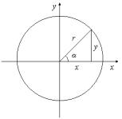&nbsp;&nbsp;&nbsp;&nbsp;&nbsp;&nbsp;&nbsp;&nbsp;&nbsp;&nbsp;
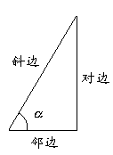&nbsp;&nbsp;&nbsp;&nbsp;&nbsp;&nbsp;&nbsp;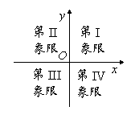

