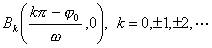
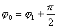

2. 三角函数的定义

[三角函数的定义和符号变化]

<table class=MsoNormalTable border=1 cellspacing=0 cellpadding=0
 style='border-collapse:collapse;border:none'>
 <tr>
  <td width=104 colspan=3 valign=top style='width:78.35pt;border:solid windowtext 1.0pt;
  border-left:none;padding:0mm 5.4pt 0mm 5.4pt'>
  
名称

  </td>
  <td width=79 valign=top style='width:59.05pt;border:solid windowtext 1.0pt;
  border-left:none;padding:0mm 5.4pt 0mm 5.4pt'>
  
正弦

  </td>
  <td width=86 valign=top style='width:64.65pt;border:solid windowtext 1.0pt;
  border-left:none;padding:0mm 5.4pt 0mm 5.4pt'>
  
余弦

  </td>
  <td width=85 valign=top style='width:63.8pt;border:solid windowtext 1.0pt;
  border-left:none;padding:0mm 5.4pt 0mm 5.4pt'>
  
正切

  </td>
  <td width=94 valign=top style='width:70.85pt;border:solid windowtext 1.0pt;
  border-left:none;padding:0mm 5.4pt 0mm 5.4pt'>
  
余切

  </td>
  <td width=95 valign=top style='width:70.9pt;border:solid windowtext 1.0pt;
  border-left:none;padding:0mm 5.4pt 0mm 5.4pt'>
  
正割

  </td>
  <td width=90 valign=top style='width:67.3pt;border-top:solid windowtext 1.0pt;
  border-left:none;border-bottom:solid windowtext 1.0pt;border-right:none;
  padding:0mm 5.4pt 0mm 5.4pt'>
  
余割

  </td>
 </tr>
 <tr style='height:43.65pt'>
  <td width=104 colspan=3 valign=top style='width:78.35pt;border-top:none;
  border-left:none;border-bottom:solid windowtext 1.0pt;border-right:solid windowtext 1.0pt;
  padding:0mm 5.4pt 0mm 5.4pt;height:43.65pt'>
  
定

  
义

  </td>
  <td width=79 valign=top style='width:59.05pt;border-top:none;border-left:
  none;border-bottom:solid windowtext 1.0pt;border-right:solid windowtext 1.0pt;
  padding:0mm 5.4pt 0mm 5.4pt;height:43.65pt'>
  

  </td>
  <td width=86 valign=top style='width:64.65pt;border-top:none;border-left:
  none;border-bottom:solid windowtext 1.0pt;border-right:solid windowtext 1.0pt;
  padding:0mm 5.4pt 0mm 5.4pt;height:43.65pt'>
  

  </td>
  <td width=85 valign=top style='width:63.8pt;border-top:none;border-left:none;
  border-bottom:solid windowtext 1.0pt;border-right:solid windowtext 1.0pt;
  padding:0mm 5.4pt 0mm 5.4pt;height:43.65pt'>
  

  </td>
  <td width=94 valign=top style='width:70.85pt;border-top:none;border-left:
  none;border-bottom:solid windowtext 1.0pt;border-right:solid windowtext 1.0pt;
  padding:0mm 5.4pt 0mm 5.4pt;height:43.65pt'>
  

  </td>
  <td width=95 valign=top style='width:70.9pt;border-top:none;border-left:none;
  border-bottom:solid windowtext 1.0pt;border-right:solid windowtext 1.0pt;
  padding:0mm 5.4pt 0mm 5.4pt;height:43.65pt'>
  

  </td>
  <td width=90 valign=top style='width:67.3pt;border:none;border-bottom:solid windowtext 1.0pt;
  padding:0mm 5.4pt 0mm 5.4pt;height:43.65pt'>
  

  </td>
 </tr>
 <tr>
  <td width=40 rowspan=4 valign=top style='width:30.35pt;border:none;
  border-bottom:solid windowtext 1.0pt;padding:0mm 5.4pt 0mm 5.4pt'>
  
符

  
号

  
与

  </td>
  <td width=30 rowspan=4 valign=top style='width:22.85pt;border-top:none;
  border-left:none;border-bottom:solid windowtext 1.0pt;border-right:solid windowtext 1.0pt;
  padding:0mm 5.4pt 0mm 5.4pt'>
  
增

  
减

  
变

  
化

  </td>
  <td width=34 valign=top style='width:25.15pt;border:none;border-right:solid windowtext 1.0pt;
  padding:0mm 5.4pt 0mm 5.4pt'>
  
Ⅰ

  </td>
  <td width=79 valign=top style='width:59.05pt;border:none;border-right:solid windowtext 1.0pt;
  padding:0mm 5.4pt 0mm 5.4pt'>
  
+↑

  </td>
  <td width=86 valign=top style='width:64.65pt;border:none;border-right:solid windowtext 1.0pt;
  padding:0mm 5.4pt 0mm 5.4pt'>
  
+↓

  </td>
  <td width=85 valign=top style='width:63.8pt;border:none;border-right:solid windowtext 1.0pt;
  padding:0mm 5.4pt 0mm 5.4pt'>
  
+↑

  </td>
  <td width=94 valign=top style='width:70.85pt;border:none;border-right:solid windowtext 1.0pt;
  padding:0mm 5.4pt 0mm 5.4pt'>
  
+↓

  </td>
  <td width=95 valign=top style='width:70.9pt;border:none;border-right:solid windowtext 1.0pt;
  padding:0mm 5.4pt 0mm 5.4pt'>
  
+↑

  </td>
  <td width=90 valign=top style='width:67.3pt;border:none;padding:0mm 5.4pt 0mm 5.4pt'>
  
+↓

  </td>
 </tr>
 <tr>
  <td width=34 valign=top style='width:25.15pt;border:none;border-right:solid windowtext 1.0pt;
  padding:0mm 5.4pt 0mm 5.4pt'>
  
Ⅱ

  </td>
  <td width=79 valign=top style='width:59.05pt;border:none;border-right:solid windowtext 1.0pt;
  padding:0mm 5.4pt 0mm 5.4pt'>
  
+↓

  </td>
  <td width=86 valign=top style='width:64.65pt;border:none;border-right:solid windowtext 1.0pt;
  padding:0mm 5.4pt 0mm 5.4pt'>
  
-↓

  </td>
  <td width=85 valign=top style='width:63.8pt;border:none;border-right:solid windowtext 1.0pt;
  padding:0mm 5.4pt 0mm 5.4pt'>
  
-↑

  </td>
  <td width=94 valign=top style='width:70.85pt;border:none;border-right:solid windowtext 1.0pt;
  padding:0mm 5.4pt 0mm 5.4pt'>
  
-↓

  </td>
  <td width=95 valign=top style='width:70.9pt;border:none;border-right:solid windowtext 1.0pt;
  padding:0mm 5.4pt 0mm 5.4pt'>
  
-↑

  </td>
  <td width=90 valign=top style='width:67.3pt;border:none;padding:0mm 5.4pt 0mm 5.4pt'>
  
+↑

  </td>
 </tr>
 <tr>
  <td width=34 valign=top style='width:25.15pt;border:none;border-right:solid windowtext 1.0pt;
  padding:0mm 5.4pt 0mm 5.4pt'>
  
Ⅲ

  </td>
  <td width=79 valign=top style='width:59.05pt;border:none;border-right:solid windowtext 1.0pt;
  padding:0mm 5.4pt 0mm 5.4pt'>
  
-↓

  </td>
  <td width=86 valign=top style='width:64.65pt;border:none;border-right:solid windowtext 1.0pt;
  padding:0mm 5.4pt 0mm 5.4pt'>
  
-↑

  </td>
  <td width=85 valign=top style='width:63.8pt;border:none;border-right:solid windowtext 1.0pt;
  padding:0mm 5.4pt 0mm 5.4pt'>
  
+↑

  </td>
  <td width=94 valign=top style='width:70.85pt;border:none;border-right:solid windowtext 1.0pt;
  padding:0mm 5.4pt 0mm 5.4pt'>
  
+↓

  </td>
  <td width=95 valign=top style='width:70.9pt;border:none;border-right:solid windowtext 1.0pt;
  padding:0mm 5.4pt 0mm 5.4pt'>
  
-↓

  </td>
  <td width=90 valign=top style='width:67.3pt;border:none;padding:0mm 5.4pt 0mm 5.4pt'>
  
-↑

  </td>
 </tr>
 <tr>
  <td width=34 valign=top style='width:25.15pt;border-top:none;border-left:
  none;border-bottom:solid windowtext 1.0pt;border-right:solid windowtext 1.0pt;
  padding:0mm 5.4pt 0mm 5.4pt'>
  
Ⅳ

  </td>
  <td width=79 valign=top style='width:59.05pt;border-top:none;border-left:
  none;border-bottom:solid windowtext 1.0pt;border-right:solid windowtext 1.0pt;
  padding:0mm 5.4pt 0mm 5.4pt'>
  
-↑

  </td>
  <td width=86 valign=top style='width:64.65pt;border-top:none;border-left:
  none;border-bottom:solid windowtext 1.0pt;border-right:solid windowtext 1.0pt;
  padding:0mm 5.4pt 0mm 5.4pt'>
  
+↑

  </td>
  <td width=85 valign=top style='width:63.8pt;border-top:none;border-left:none;
  border-bottom:solid windowtext 1.0pt;border-right:solid windowtext 1.0pt;
  padding:0mm 5.4pt 0mm 5.4pt'>
  
-↑

  </td>
  <td width=94 valign=top style='width:70.85pt;border-top:none;border-left:
  none;border-bottom:solid windowtext 1.0pt;border-right:solid windowtext 1.0pt;
  padding:0mm 5.4pt 0mm 5.4pt'>
  
-↓

  </td>
  <td width=95 valign=top style='width:70.9pt;border-top:none;border-left:none;
  border-bottom:solid windowtext 1.0pt;border-right:solid windowtext 1.0pt;
  padding:0mm 5.4pt 0mm 5.4pt'>
  
+↓

  </td>
  <td width=90 valign=top style='width:67.3pt;border:none;border-bottom:solid windowtext 1.0pt;
  padding:0mm 5.4pt 0mm 5.4pt'>
  
-↓

  </td>
 </tr>
</table>

[三角函数的图形与特征]

标准正弦曲线

周期：

与<i>x</i>轴交点（同拐点）：

极值点（极大点或极小点）：

余弦曲线

周期：

与<i>x</i>轴交点（同拐点）：

极值点：

&nbsp;&nbsp; 一般正弦曲线

&nbsp;&nbsp;&nbsp;&nbsp;&nbsp;&nbsp;&nbsp;&nbsp;&nbsp;&nbsp;&nbsp;&nbsp;&nbsp;&nbsp;&nbsp;&nbsp;&nbsp;&nbsp;&nbsp;&nbsp;&nbsp;&nbsp;&nbsp;
周期：

式中<i>A</i>&gt;0为振幅，为角频率，为初相&nbsp;&nbsp;&nbsp;&nbsp;&nbsp;&nbsp;&nbsp;&nbsp;&nbsp;
与<i>x</i>轴交点（同拐点）：

&nbsp;&nbsp;&nbsp;&nbsp; &nbsp;&nbsp;&nbsp;&nbsp;&nbsp;

&nbsp;&nbsp;&nbsp;&nbsp;&nbsp;&nbsp;&nbsp;&nbsp;&nbsp;&nbsp;&nbsp;&nbsp;
极值点：

&nbsp;&nbsp;&nbsp;&nbsp;&nbsp;&nbsp;&nbsp; &nbsp;

&nbsp;&nbsp;&nbsp;&nbsp;&nbsp;&nbsp;&nbsp;&nbsp;&nbsp;&nbsp;&nbsp;&nbsp;&nbsp;&nbsp;&nbsp;&nbsp;&nbsp;&nbsp;&nbsp;&nbsp;&nbsp;&nbsp;&nbsp;&nbsp;&nbsp;&nbsp;&nbsp;&nbsp;&nbsp;&nbsp;&nbsp;&nbsp;&nbsp;&nbsp;&nbsp;&nbsp;&nbsp;&nbsp;&nbsp;&nbsp;&nbsp;&nbsp;&nbsp;&nbsp;&nbsp;&nbsp;&nbsp;&nbsp;

&nbsp;&nbsp; 同时，也属于一般正弦曲线(设，可化为 )

它是将标准正弦曲线在<i>y</i>轴方向上伸&nbsp;&nbsp;&nbsp;&nbsp;&nbsp;&nbsp;&nbsp; 长<i>A</i>倍，在<i>x</i>轴方向上压缩倍，并向左平移一段距离而得到.

正切曲线

&nbsp;&nbsp;&nbsp;&nbsp;&nbsp;&nbsp;&nbsp;&nbsp;&nbsp;&nbsp;&nbsp;&nbsp;&nbsp;&nbsp;
周期：

&nbsp;&nbsp;&nbsp;&nbsp;&nbsp;&nbsp;&nbsp;&nbsp;&nbsp;
&nbsp;&nbsp;&nbsp;&nbsp;&nbsp;与<i>x</i>轴交点（同拐点）：

&nbsp;&nbsp;&nbsp;&nbsp;&nbsp;&nbsp;
，

&nbsp;&nbsp;&nbsp;&nbsp;&nbsp;&nbsp;&nbsp;&nbsp;&nbsp;&nbsp;&nbsp;
该点切线斜率为1.

&nbsp;&nbsp;&nbsp;&nbsp;&nbsp;&nbsp;&nbsp;&nbsp;&nbsp;&nbsp;&nbsp;&nbsp;&nbsp;&nbsp;
渐近线：

余切曲线

&nbsp;&nbsp; 

&nbsp;&nbsp;&nbsp;&nbsp;&nbsp;&nbsp;&nbsp;&nbsp;&nbsp;&nbsp;&nbsp;&nbsp;&nbsp;&nbsp;&nbsp;&nbsp;&nbsp;
周期：

&nbsp;&nbsp;&nbsp;&nbsp;&nbsp;&nbsp;&nbsp;&nbsp;&nbsp;&nbsp;&nbsp;&nbsp;&nbsp;&nbsp;&nbsp;&nbsp;&nbsp;
与<i>x</i>轴交点（同拐点）：

&nbsp;&nbsp;&nbsp;&nbsp;&nbsp;&nbsp;&nbsp;&nbsp;&nbsp;&nbsp;&nbsp;&nbsp;&nbsp;
，

&nbsp;&nbsp;&nbsp;&nbsp;&nbsp;&nbsp;&nbsp;&nbsp;&nbsp;&nbsp;&nbsp;&nbsp;&nbsp;&nbsp;&nbsp;&nbsp;&nbsp;
该点切线斜率为－1.

&nbsp;&nbsp;&nbsp;&nbsp;&nbsp;&nbsp;&nbsp;&nbsp;&nbsp;&nbsp;&nbsp;&nbsp;&nbsp;&nbsp;&nbsp;&nbsp;&nbsp;
渐近线：

正割曲线

&nbsp;&nbsp;&nbsp;&nbsp;&nbsp;&nbsp;&nbsp;&nbsp;&nbsp;&nbsp;&nbsp;&nbsp;&nbsp;
&nbsp;周&nbsp; 期：

&nbsp;&nbsp;&nbsp;&nbsp;&nbsp;&nbsp;&nbsp;&nbsp;&nbsp;&nbsp;&nbsp;&nbsp;&nbsp;&nbsp;
极大点：

&nbsp;&nbsp;&nbsp;&nbsp;&nbsp;&nbsp;&nbsp;&nbsp;&nbsp;&nbsp;&nbsp;&nbsp;&nbsp;&nbsp;
极小点：

&nbsp;&nbsp;&nbsp;&nbsp;&nbsp;&nbsp;&nbsp;&nbsp;&nbsp;&nbsp;&nbsp;&nbsp;&nbsp;&nbsp;
渐近线：

余割曲线

&nbsp;&nbsp;&nbsp;&nbsp;&nbsp;&nbsp;&nbsp;&nbsp;&nbsp;&nbsp;&nbsp;&nbsp;&nbsp;&nbsp;&nbsp;
周&nbsp;
期：

&nbsp;&nbsp;&nbsp;&nbsp;&nbsp;&nbsp;&nbsp;&nbsp;&nbsp;&nbsp;&nbsp;&nbsp;&nbsp;&nbsp;&nbsp;
极大点：

&nbsp;&nbsp;&nbsp;&nbsp;&nbsp;&nbsp;&nbsp;&nbsp;&nbsp;&nbsp;&nbsp;&nbsp;&nbsp;&nbsp;&nbsp;
极小点：

&nbsp;&nbsp;&nbsp;&nbsp;&nbsp;&nbsp;&nbsp;&nbsp;&nbsp;&nbsp;&nbsp;&nbsp;&nbsp;&nbsp;&nbsp;&nbsp;&nbsp;&nbsp;&nbsp;&nbsp;&nbsp;&nbsp;&nbsp;

&nbsp;&nbsp;&nbsp;&nbsp;&nbsp;&nbsp;&nbsp;&nbsp;&nbsp;&nbsp;&nbsp;&nbsp;&nbsp;&nbsp;&nbsp;
渐近线：

