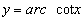

5. 反三角函数定义

[反三角函数的定义域与主值范围]

<table class=MsoNormalTable border=1 cellspacing=0 cellpadding=0
 style='border-collapse:collapse;border:none'>
 <tr>
  <td width=95 valign=top style='width:70.9pt;border:solid windowtext 1.0pt;
  border-left:none;padding:0mm 5.4pt 0mm 5.4pt'>
  
函数

  </td>
  <td width=236 valign=top style='width:177.2pt;border:solid windowtext 1.0pt;
  border-left:none;padding:0mm 5.4pt 0mm 5.4pt'>
  
主值记号

  </td>
  <td width=142 valign=top style='width:106.3pt;border:solid windowtext 1.0pt;
  border-left:none;padding:0mm 5.4pt 0mm 5.4pt'>
  
定义域

  </td>
  <td width=170 valign=top style='width:127.55pt;border-top:solid windowtext 1.0pt;
  border-left:none;border-bottom:solid windowtext 1.0pt;border-right:none;
  padding:0mm 5.4pt 0mm 5.4pt'>
  
主值范围

  </td>
 </tr>
 <tr>
  <td width=95 style='width:70.9pt;border:none;border-right:solid windowtext 1.0pt;
  padding:0mm 5.4pt 0mm 5.4pt'>
  
反正弦

  </td>
  <td width=236 style='width:177.2pt;border:none;border-right:solid windowtext 1.0pt;
  padding:0mm 5.4pt 0mm 5.4pt'>
  
若，则

  </td>
  <td width=142 style='width:106.3pt;border:none;border-right:solid windowtext 1.0pt;
  padding:0mm 5.4pt 0mm 5.4pt'>
  

  </td>
  <td width=170 style='width:127.55pt;border:none;padding:0mm 5.4pt 0mm 5.4pt'>
  

  </td>
 </tr>
 <tr>
  <td width=95 style='width:70.9pt;border:none;border-right:solid windowtext 1.0pt;
  padding:0mm 5.4pt 0mm 5.4pt'>
  
反余弦

  </td>
  <td width=236 style='width:177.2pt;border:none;border-right:solid windowtext 1.0pt;
  padding:0mm 5.4pt 0mm 5.4pt'>
  
若，则

  </td>
  <td width=142 style='width:106.3pt;border:none;border-right:solid windowtext 1.0pt;
  padding:0mm 5.4pt 0mm 5.4pt'>
  

  </td>
  <td width=170 style='width:127.55pt;border:none;padding:0mm 5.4pt 0mm 5.4pt'>
  

  </td>
 </tr>
 <tr>
  <td width=95 style='width:70.9pt;border:none;border-right:solid windowtext 1.0pt;
  padding:0mm 5.4pt 0mm 5.4pt'>
  
反正切

  </td>
  <td width=236 style='width:177.2pt;border:none;border-right:solid windowtext 1.0pt;
  padding:0mm 5.4pt 0mm 5.4pt'>
  
若，则

  </td>
  <td width=142 style='width:106.3pt;border:none;border-right:solid windowtext 1.0pt;
  padding:0mm 5.4pt 0mm 5.4pt'>
  

  </td>
  <td width=170 style='width:127.55pt;border:none;padding:0mm 5.4pt 0mm 5.4pt'>
  

  </td>
 </tr>
 <tr>
  <td width=95 style='width:70.9pt;border:none;border-right:solid windowtext 1.0pt;
  padding:0mm 5.4pt 0mm 5.4pt'>
  
反余切

  </td>
  <td width=236 style='width:177.2pt;border:none;border-right:solid windowtext 1.0pt;
  padding:0mm 5.4pt 0mm 5.4pt'>
  
若，则

  </td>
  <td width=142 style='width:106.3pt;border:none;border-right:solid windowtext 1.0pt;
  padding:0mm 5.4pt 0mm 5.4pt'>
  

  </td>
  <td width=170 style='width:127.55pt;border:none;padding:0mm 5.4pt 0mm 5.4pt'>
  

  </td>
 </tr>
 <tr>
  <td width=95 style='width:70.9pt;border:none;border-right:solid windowtext 1.0pt;
  padding:0mm 5.4pt 0mm 5.4pt'>
  
反正割

  </td>
  <td width=236 style='width:177.2pt;border:none;border-right:solid windowtext 1.0pt;
  padding:0mm 5.4pt 0mm 5.4pt'>
  
若，则

  </td>
  <td width=142 style='width:106.3pt;border:none;border-right:solid windowtext 1.0pt;
  padding:0mm 5.4pt 0mm 5.4pt'>
  

  </td>
  <td width=170 style='width:127.55pt;border:none;padding:0mm 5.4pt 0mm 5.4pt'>
  

  </td>
 </tr>
 <tr>
  <td width=95 style='width:70.9pt;border-top:none;border-left:none;border-bottom:
  solid windowtext 1.0pt;border-right:solid windowtext 1.0pt;padding:0mm 5.4pt 0mm 5.4pt'>
  
反余割

  </td>
  <td width=236 style='width:177.2pt;border-top:none;border-left:none;
  border-bottom:solid windowtext 1.0pt;border-right:solid windowtext 1.0pt;
  padding:0mm 5.4pt 0mm 5.4pt'>
  
若，则

  </td>
  <td width=142 style='width:106.3pt;border-top:none;border-left:none;
  border-bottom:solid windowtext 1.0pt;border-right:solid windowtext 1.0pt;
  padding:0mm 5.4pt 0mm 5.4pt'>
  

  </td>
  <td width=170 style='width:127.55pt;border:none;border-bottom:solid windowtext 1.0pt;
  padding:0mm 5.4pt 0mm 5.4pt'>
  

  </td>
 </tr>
</table>

一般反三角函数与主值的关系为

式中<i>n</i>为任意整数.

[反三角函数的图形与特征]

&nbsp;&nbsp; 反正弦曲线&nbsp;&nbsp;&nbsp;&nbsp;&nbsp;&nbsp;&nbsp;&nbsp;&nbsp;&nbsp;&nbsp;&nbsp;&nbsp;&nbsp;&nbsp;&nbsp;&nbsp;&nbsp;&nbsp;&nbsp;&nbsp;&nbsp;&nbsp;&nbsp;&nbsp;&nbsp;&nbsp;&nbsp;&nbsp;&nbsp;&nbsp;&nbsp;&nbsp;&nbsp;&nbsp;&nbsp;&nbsp;&nbsp;
反余弦曲线

&nbsp;&nbsp;&nbsp;&nbsp;&nbsp;&nbsp;&nbsp;&nbsp;&nbsp;&nbsp;&nbsp;&nbsp;&nbsp;&nbsp;&nbsp;&nbsp;&nbsp;&nbsp;&nbsp;&nbsp;&nbsp;&nbsp;&nbsp;&nbsp;&nbsp;&nbsp;&nbsp;&nbsp;&nbsp;&nbsp;&nbsp;&nbsp;&nbsp;&nbsp;&nbsp;&nbsp;

&nbsp;&nbsp;&nbsp;&nbsp;&nbsp;&nbsp;&nbsp;&nbsp;&nbsp;&nbsp;&nbsp;&nbsp;&nbsp;&nbsp;&nbsp;&nbsp;&nbsp;&nbsp;&nbsp;&nbsp;&nbsp;&nbsp;&nbsp;&nbsp;&nbsp;

拐点（同曲线对称中心）：&nbsp;&nbsp;&nbsp;&nbsp;&nbsp;&nbsp;&nbsp;&nbsp;&nbsp;&nbsp;&nbsp;&nbsp;&nbsp;&nbsp;&nbsp;&nbsp;&nbsp;&nbsp;
拐点（同曲线对称中心）：

，该点切线斜率为1&nbsp;&nbsp;&nbsp;&nbsp;&nbsp;&nbsp;&nbsp;&nbsp;&nbsp;&nbsp;&nbsp;&nbsp;
&nbsp;&nbsp; ，该点切线斜率为－1

&nbsp;&nbsp; 反正切曲线&nbsp;&nbsp;&nbsp;&nbsp;&nbsp;&nbsp;&nbsp;&nbsp;&nbsp;&nbsp;&nbsp;&nbsp;&nbsp;&nbsp;&nbsp;&nbsp;&nbsp;&nbsp;&nbsp;&nbsp;&nbsp;&nbsp;&nbsp;&nbsp;&nbsp;
反余切曲线

&nbsp;&nbsp; &nbsp;&nbsp;&nbsp;&nbsp;&nbsp;&nbsp;&nbsp;&nbsp;&nbsp;&nbsp;&nbsp;&nbsp;&nbsp;&nbsp;&nbsp;&nbsp;&nbsp;&nbsp;&nbsp;&nbsp;&nbsp;&nbsp;&nbsp;&nbsp;&nbsp;&nbsp;&nbsp;

&nbsp;&nbsp;&nbsp;&nbsp;&nbsp;&nbsp; &nbsp;&nbsp;&nbsp;&nbsp;&nbsp; &nbsp;&nbsp;&nbsp;&nbsp;&nbsp;&nbsp;&nbsp;&nbsp;&nbsp;&nbsp;

&nbsp;&nbsp; 拐点（同曲线对称中心）：&nbsp;&nbsp;&nbsp;&nbsp; &nbsp;&nbsp;&nbsp;&nbsp;&nbsp;&nbsp;
拐点：

，该点切线斜率为1&nbsp; &nbsp;&nbsp;&nbsp;&nbsp; ，该点切线斜率为－1

&nbsp;&nbsp; 渐进线：&nbsp; &nbsp;&nbsp;&nbsp;&nbsp;&nbsp;&nbsp;
曲线对称中心：

&nbsp;&nbsp;&nbsp;&nbsp;&nbsp;&nbsp; &nbsp;&nbsp;&nbsp;&nbsp;&nbsp;&nbsp;
渐近线：

&nbsp;&nbsp; 反正割曲线&nbsp;&nbsp;&nbsp;&nbsp; &nbsp;&nbsp;&nbsp;&nbsp;&nbsp;&nbsp;&nbsp;
反余割曲线

&nbsp; &nbsp;&nbsp;&nbsp;&nbsp;&nbsp;&nbsp;&nbsp;&nbsp;&nbsp;&nbsp;&nbsp;&nbsp;&nbsp;&nbsp;&nbsp;&nbsp;&nbsp;&nbsp;&nbsp;&nbsp;&nbsp;&nbsp;&nbsp;&nbsp;&nbsp;&nbsp;&nbsp;&nbsp;&nbsp;&nbsp;&nbsp;&nbsp;&nbsp;

&nbsp;&nbsp;&nbsp;&nbsp;&nbsp; &nbsp; &nbsp;&nbsp;&nbsp;&nbsp;&nbsp;&nbsp;&nbsp;&nbsp;&nbsp;

&nbsp;&nbsp; 顶点：&nbsp;&nbsp;&nbsp;&nbsp;&nbsp; &nbsp;&nbsp;&nbsp;&nbsp;&nbsp;&nbsp;
顶点：

&nbsp;&nbsp; 渐近线：&nbsp;&nbsp;&nbsp;&nbsp; &nbsp;&nbsp;&nbsp;&nbsp;
渐近线：

