

6. 反三角函数的相互关系与基本公式

[反三角函数的相互关系]

<table class=MsoNormalTable border=1 cellspacing=0 cellpadding=0
 style='border-collapse:collapse;border:none'>
 <tr>
  <td width=142 valign=top style='width:106.3pt;border-top:solid windowtext 1.0pt;
  border-left:none;border-bottom:none;border-right:solid windowtext 1.0pt;
  padding:0mm 5.4pt 0mm 5.4pt'>
  
arc
  sin <i>x</i> =

  </td>
  <td width=161 valign=top style='width:120.5pt;border-top:solid windowtext 1.0pt;
  border-left:none;border-bottom:none;border-right:solid windowtext 1.0pt;
  padding:0mm 5.4pt 0mm 5.4pt'>
  
arc
  cos <i>x</i> =

  </td>
  <td width=161 valign=top style='width:120.5pt;border-top:solid windowtext 1.0pt;
  border-left:none;border-bottom:none;border-right:solid windowtext 1.0pt;
  padding:0mm 5.4pt 0mm 5.4pt'>
  
arc
  tan <i>x</i> =

  </td>
  <td width=161 valign=top style='width:120.5pt;border:none;border-top:solid windowtext 1.0pt;
  padding:0mm 5.4pt 0mm 5.4pt'>
  
arc
  cot <i>x</i> =

  </td>
 </tr>
 <tr>
  <td width=142 valign=top style='width:106.3pt;border-top:solid windowtext 1.0pt;
  border-left:none;border-bottom:none;border-right:solid windowtext 1.0pt;
  padding:0mm 5.4pt 0mm 5.4pt'>
  

  </td>
  <td width=161 valign=top style='width:120.5pt;border:none;border-top:solid windowtext 1.0pt;
  padding:0mm 5.4pt 0mm 5.4pt'>
  
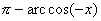

  </td>
  <td width=161 valign=top style='width:120.5pt;border:solid windowtext 1.0pt;
  border-bottom:none;padding:0mm 5.4pt 0mm 5.4pt'>
  

  </td>
  <td width=161 valign=top style='width:120.5pt;border:none;border-top:solid windowtext 1.0pt;
  padding:0mm 5.4pt 0mm 5.4pt'>
  
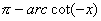

  </td>
 </tr>
 <tr>
  <td width=142 valign=top style='width:106.3pt;border:none;border-right:solid windowtext 1.0pt;
  padding:0mm 5.4pt 0mm 5.4pt'>
  
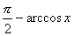

  </td>
  <td width=161 valign=top style='width:120.5pt;border:none;padding:0mm 5.4pt 0mm 5.4pt'>
  
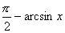

  </td>
  <td width=161 valign=top style='width:120.5pt;border-top:none;border-left:
  solid windowtext 1.0pt;border-bottom:none;border-right:solid windowtext 1.0pt;
  padding:0mm 5.4pt 0mm 5.4pt'>
  
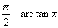

  </td>
  <td width=161 valign=top style='width:120.5pt;border:none;padding:0mm 5.4pt 0mm 5.4pt'>
  
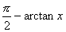

  </td>
 </tr>
 <tr>
  <td width=142 valign=top style='width:106.3pt;border:none;border-right:solid windowtext 1.0pt;
  padding:0mm 5.4pt 0mm 5.4pt'>
  

  </td>
  <td width=161 valign=top style='width:120.5pt;border:none;padding:0mm 5.4pt 0mm 5.4pt'>
  
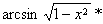

  </td>
  <td width=161 valign=top style='width:120.5pt;border-top:none;border-left:
  solid windowtext 1.0pt;border-bottom:none;border-right:solid windowtext 1.0pt;
  padding:0mm 5.4pt 0mm 5.4pt'>
  
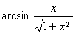

  </td>
  <td width=161 valign=top style='width:120.5pt;border:none;padding:0mm 5.4pt 0mm 5.4pt'>
  
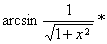

  </td>
 </tr>
 <tr>
  <td width=142 valign=top style='width:106.3pt;border:none;border-right:solid windowtext 1.0pt;
  padding:0mm 5.4pt 0mm 5.4pt'>
  
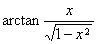

  </td>
  <td width=161 valign=top style='width:120.5pt;border:none;padding:0mm 5.4pt 0mm 5.4pt'>
  
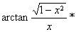

  </td>
  <td width=161 valign=top style='width:120.5pt;border-top:none;border-left:
  solid windowtext 1.0pt;border-bottom:none;border-right:solid windowtext 1.0pt;
  padding:0mm 5.4pt 0mm 5.4pt'>
  
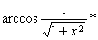

  </td>
  <td width=161 valign=top style='width:120.5pt;border:none;padding:0mm 5.4pt 0mm 5.4pt'>
  
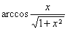

  </td>
 </tr>
 <tr>
  <td width=142 valign=top style='width:106.3pt;border-top:none;border-left:
  none;border-bottom:solid windowtext 1.0pt;border-right:solid windowtext 1.0pt;
  padding:0mm 5.4pt 0mm 5.4pt'>
  
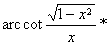

  </td>
  <td width=161 valign=top style='width:120.5pt;border:none;border-bottom:solid windowtext 1.0pt;
  padding:0mm 5.4pt 0mm 5.4pt'>
  
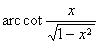

  </td>
  <td width=161 valign=top style='width:120.5pt;border:solid windowtext 1.0pt;
  border-top:none;padding:0mm 5.4pt 0mm 5.4pt'>
  
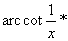

  </td>
  <td width=161 valign=top style='width:120.5pt;border:none;border-bottom:solid windowtext 1.0pt;
  padding:0mm 5.4pt 0mm 5.4pt'>
  
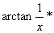

  </td>
 </tr>
</table>

带有*号者只当<i>x</i>为正值时适用.

[反三角函数基本公式]

<table class=MsoNormalTable border=1 cellspacing=0 cellpadding=0
 style='border-collapse:collapse;border:none'>
 <tr>
  <td width=304 valign=top style='width:228.0pt;border:solid windowtext 1.0pt;
  border-left:none;padding:0mm 5.4pt 0mm 5.4pt'>
  
arc
  sin <i>x</i> + arc sin <i>y</i> =

  </td>
  <td width=339 valign=top style='width:253.95pt;border-top:solid windowtext 1.0pt;
  border-left:none;border-bottom:solid windowtext 1.0pt;border-right:none;
  padding:0mm 5.4pt 0mm 5.4pt'>
  
arc
  sin <i>x</i> – arc sin <i>y</i> =

  </td>
 </tr>
 <tr>
  <td width=304 valign=top style='width:228.0pt;border-top:none;border-left:
  none;border-bottom:solid windowtext 1.0pt;border-right:solid windowtext 1.0pt;
  padding:0mm 5.4pt 0mm 5.4pt'>
  
&nbsp;&nbsp; 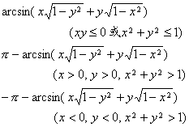

  </td>
  <td width=339 valign=top style='width:253.95pt;border:none;border-bottom:
  solid windowtext 1.0pt;padding:0mm 5.4pt 0mm 5.4pt'>
  
&nbsp;&nbsp;&nbsp;&nbsp;&nbsp; 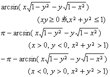

  </td>
 </tr>
 <tr>
  <td width=304 valign=top style='width:228.0pt;border-top:none;border-left:
  none;border-bottom:solid windowtext 1.0pt;border-right:solid windowtext 1.0pt;
  padding:0mm 5.4pt 0mm 5.4pt'>
  
&nbsp;&nbsp;&nbsp;&nbsp;&nbsp;&nbsp; arc
  cos <i>x</i> + arc cos <i>y</i> =

  </td>
  <td width=339 valign=top style='width:253.95pt;border:none;border-bottom:
  solid windowtext 1.0pt;padding:0mm 5.4pt 0mm 5.4pt'>
  
arc
  cos <i>x</i> – arc cos <i>y</i> =

  </td>
 </tr>
 <tr>
  <td width=304 valign=top style='width:228.0pt;border-top:none;border-left:
  none;border-bottom:solid windowtext 1.0pt;border-right:solid windowtext 1.0pt;
  padding:0mm 5.4pt 0mm 5.4pt'>
  
&nbsp;&nbsp;&nbsp; 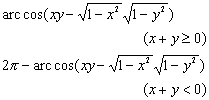

  </td>
  <td width=339 valign=top style='width:253.95pt;border:none;border-bottom:
  solid windowtext 1.0pt;padding:0mm 5.4pt 0mm 5.4pt'>
  
&nbsp;&nbsp;&nbsp;&nbsp;&nbsp; 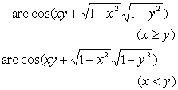

  </td>
 </tr>
 <tr>
  <td width=304 valign=top style='width:228.0pt;border-top:none;border-left:
  none;border-bottom:solid windowtext 1.0pt;border-right:solid windowtext 1.0pt;
  padding:0mm 5.4pt 0mm 5.4pt'>
  
&nbsp;&nbsp;&nbsp;&nbsp;&nbsp;&nbsp;&nbsp;&nbsp;
  arc tan <i>x</i> + arc tan <i>y</i> =

  </td>
  <td width=339 valign=top style='width:253.95pt;border:none;border-bottom:
  solid windowtext 1.0pt;padding:0mm 5.4pt 0mm 5.4pt'>
  
arc
  tan <i>x</i> – arc tan <i>y</i> =

  </td>
 </tr>
 <tr>
  <td width=304 style='width:228.0pt;border-top:none;border-left:none;
  border-bottom:solid windowtext 1.0pt;border-right:solid windowtext 1.0pt;
  padding:0mm 5.4pt 0mm 5.4pt'>
  
&nbsp;&nbsp; 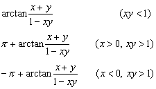

  </td>
  <td width=339 valign=top style='width:253.95pt;border:none;border-bottom:
  solid windowtext 1.0pt;padding:0mm 5.4pt 0mm 5.4pt'>
  
&nbsp;&nbsp;&nbsp;&nbsp;&nbsp; 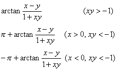

  </td>
 </tr>
 <tr>
  <td width=304 valign=top style='width:228.0pt;border-top:none;border-left:
  none;border-bottom:solid windowtext 1.0pt;border-right:solid windowtext 1.0pt;
  padding:0mm 5.4pt 0mm 5.4pt'>
  
2
  arc sin <i>x</i> =

  </td>
  <td width=339 valign=top style='width:253.95pt;border:none;border-bottom:
  solid windowtext 1.0pt;padding:0mm 5.4pt 0mm 5.4pt'>
  
2
  arc cos <i>x</i> =

  </td>
 </tr>
 <tr>
  <td width=304 valign=top style='width:228.0pt;border-top:none;border-left:
  none;border-bottom:solid windowtext 1.0pt;border-right:solid windowtext 1.0pt;
  padding:0mm 5.4pt 0mm 5.4pt'>
  
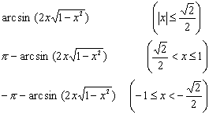

  </td>
  <td width=339 valign=top style='width:253.95pt;border:none;border-bottom:
  solid windowtext 1.0pt;padding:0mm 5.4pt 0mm 5.4pt'>
  
&nbsp;&nbsp;&nbsp;&nbsp;&nbsp;&nbsp; 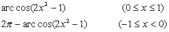

  </td>
 </tr>
 <tr>
  <td width=304 valign=top style='width:228.0pt;border-top:none;border-left:
  none;border-bottom:solid windowtext 1.0pt;border-right:solid windowtext 1.0pt;
  padding:0mm 5.4pt 0mm 5.4pt'>
  
2
  arc tan<i>x</i> =

  </td>
  <td width=339 valign=top style='width:253.95pt;border:none;border-bottom:
  solid windowtext 1.0pt;padding:0mm 5.4pt 0mm 5.4pt'>
  
cos
  (<i>n</i> arc cos <i>x</i>) =

  </td>
 </tr>
 <tr>
  <td width=304 valign=top style='width:228.0pt;border-top:none;border-left:
  none;border-bottom:solid windowtext 1.0pt;border-right:solid windowtext 1.0pt;
  padding:0mm 5.4pt 0mm 5.4pt'>
  
&nbsp; 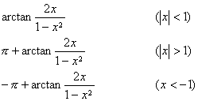

  </td>
  <td width=339 valign=top style='width:253.95pt;border:none;border-bottom:
  solid windowtext 1.0pt;padding:0mm 5.4pt 0mm 5.4pt'>
  
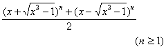

  </td>
 </tr>
</table>

&nbsp;

