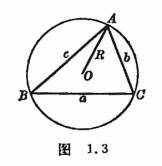
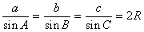
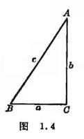
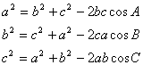
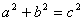
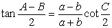
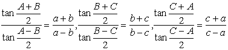
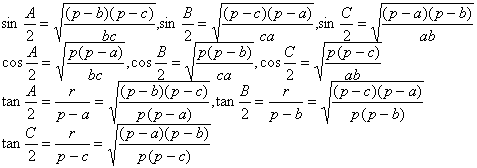
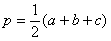
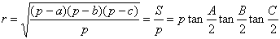

7. 三角形基本定理

<table class=MsoNormalTable border=0 cellspacing=0 cellpadding=0 align=left
 hspace=0 vspace=0>
 <tr>
  <td valign=top style='padding:0mm 0mm 0mm 0mm'>
  

  </td>
 </tr>
</table>

[正弦定理] 

式中<i>R</i>为<i>ABC</i>的外接圆半径(图1.3).

[余弦定理]

&nbsp;

<table class=MsoNormalTable border=0 cellspacing=0 cellpadding=0 align=left
 hspace=0 vspace=0>
 <tr>
  <td valign=top style='padding:0mm 0mm 0mm 0mm'>
  

  </td>
 </tr>
</table>

&nbsp;[勾股定理] 在直角三角形(<i>C</i>为直角)中，勾方加股方等于弦方(图1.4)，即

勾股定理也称商高定理，外国书刊中称毕达哥拉斯定理.

[正切定理]

或

[半角与边长的关系公式]

式中，<i>r</i>为<i>ABC</i>的内切圆半径，且

&nbsp;&nbsp;&nbsp;&nbsp;&nbsp;&nbsp;&nbsp;&nbsp;&nbsp;&nbsp;&nbsp;&nbsp;&nbsp;&nbsp;&nbsp;&nbsp;&nbsp;&nbsp;

式中<i>S</i>为<i>ABC</i>的面积.

