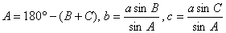
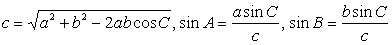
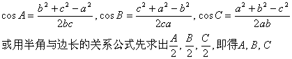
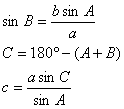

8. 斜三角形解法

<table class=MsoNormalTable border=1 cellspacing=0 cellpadding=0
 style='border-collapse:collapse;border:none'>
 <tr>
  <td width=123 valign=top style='width:92.15pt;border:solid windowtext 1.0pt;
  border-left:none;padding:0mm 5.4pt 0mm 5.4pt'>
  
已知元素

  </td>
  <td width=482 colspan=2 valign=top style='width:361.45pt;border-top:solid windowtext 1.0pt;
  border-left:none;border-bottom:solid windowtext 1.0pt;border-right:none;
  padding:0mm 5.4pt 0mm 5.4pt'>
  
其他元素的求法

  </td>
 </tr>
 <tr>
  <td width=123 valign=top style='width:92.15pt;border-top:none;border-left:
  none;border-bottom:solid windowtext 1.0pt;border-right:solid windowtext 1.0pt;
  padding:0mm 5.4pt 0mm 5.4pt'>
  
一边<i>a</i>及两角<i>B</i>, <i>C</i>

  </td>
  <td width=482 colspan=2 valign=top style='width:361.45pt;border:none;
  border-bottom:solid windowtext 1.0pt;padding:0mm 5.4pt 0mm 5.4pt'>
  

  </td>
 </tr>
 <tr>
  <td width=123 valign=top style='width:92.15pt;border-top:none;border-left:
  none;border-bottom:solid windowtext 1.0pt;border-right:solid windowtext 1.0pt;
  padding:0mm 5.4pt 0mm 5.4pt'>
  
两边<i>a</i>, <i>b</i>及夹角<i>C</i>

  </td>
  <td width=482 colspan=2 valign=top style='width:361.45pt;border:none;
  border-bottom:solid windowtext 1.0pt;padding:0mm 5.4pt 0mm 5.4pt'>
  

  </td>
 </tr>
 <tr>
  <td width=123 valign=top style='width:92.15pt;border-top:none;border-left:
  none;border-bottom:solid windowtext 1.0pt;border-right:solid windowtext 1.0pt;
  padding:0mm 5.4pt 0mm 5.4pt'>
  
三边<i>a</i>, <i>b</i>, <i>c</i>

  </td>
  <td width=482 colspan=2 valign=top style='width:361.45pt;border:none;
  border-bottom:solid windowtext 1.0pt;padding:0mm 5.4pt 0mm 5.4pt'>
  

  </td>
 </tr>
 <tr>
  <td width=123 valign=top style='width:92.15pt;border-top:none;border-left:
  none;border-bottom:solid windowtext 1.0pt;border-right:solid windowtext 1.0pt;
  padding:0mm 5.4pt 0mm 5.4pt'>
  
两边<i>a</i>, <i>b</i>及其中一边的对角<i>A</i>

  </td>
  <td width=206 valign=top style='width:154.65pt;border-top:none;border-left:
  none;border-bottom:solid windowtext 1.0pt;border-right:solid windowtext 1.0pt;
  padding:0mm 5.4pt 0mm 5.4pt'>
  

  </td>
  <td width=276 style='width:206.8pt;border:none;border-bottom:solid windowtext 1.0pt;
  padding:0mm 5.4pt 0mm 5.4pt'>
  
<i>b</i> sin <i>A</i>&lt;<i>a</i>时，有两解

  
<i>b</i> sin <i>A</i>&gt;<i>a</i>时，无解

  
<i>b </i>sin<i> A</i>=<i>a</i>时，有一解

  </td>
 </tr>
</table>

&nbsp;

