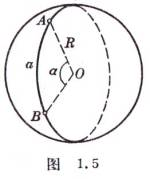
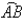
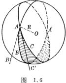
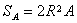
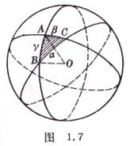
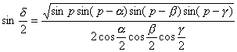
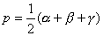

五、球面三角

<table class=MsoNormalTable border=0 cellspacing=0 cellpadding=0 align=left
 hspace=0 vspace=0>
 <tr>
  <td valign=top style='padding:0mm 0mm 0mm 0mm'>
  

  </td>
 </tr>
</table>

1.&nbsp;&nbsp;&nbsp; 球面三角有关名称及性质

&nbsp;[大圆]&nbsp; 用一通过球心<i>O</i>的平面截球，在球表面所得的截线称为大圆，其半径等于球的半径<i>R</i>(图1.5).

&nbsp;[大圆弧长]&nbsp; 连接球面上两点<i>A</i>, <i>B</i>的最短线是通过<i>A</i>, <i>B</i>的大圆上较短的弧，其圆心角为<i>a</i> (以弧度计)，则弧长<i>a </i>= <i>Ra</i>.

&nbsp;[两大圆弧夹角] &nbsp;两大圆弧的交点<i>A</i>上的相应大圆的切线(<i>AB'</i>,
<i>AC'</i>)间的夹角称为这两大圆弧的夹角，它也可用两平面<i>OAB</i>和<i>OAC</i>所构成的二面角来度量(图1.6).

<table class=MsoNormalTable border=0 cellspacing=0 cellpadding=0 align=left
 hspace=0 vspace=0>
 <tr>
  <td valign=top style='padding:0mm 0mm 0mm 0mm'>
  

  </td>
 </tr>
</table>

[球面二角形面积] &nbsp;球面二角形<i>ABA'C</i>的面积(图1.6阴影部分)(<i>A</i>为两大圆弧夹角，单位是弧度).

&nbsp;[球面三角形的球面角超(或球面角过剩)] &nbsp;三个大圆在球面上可构成几个球面三角形，我们只考虑三边和小于<i>p</i>的那些三角形.

&nbsp;

&nbsp;

<table class=MsoNormalTable border=0 cellspacing=0 cellpadding=0 align=left
 hspace=0 vspace=0>
 <tr>
  <td valign=top style='padding:0mm 0mm 0mm 0mm'>
  

  </td>
 </tr>
</table>

设<i>a</i>，<i>b</i>，<i>g</i>为三条边(即三段大圆弧长，以球半径<i>R</i>为度量单位)，<i>A</i>，<i>B</i>，<i>C</i>为三个角(即三段大圆弧的两两夹角，图1.7).球面三角形的三个角之和一定大于180°，其差<i>d</i> = <i>A</i> + <i>B</i> + <i>C</i>－p叫球面角超(单位弧度)，<i>d </i>&gt;0.

<pre style='text-align:justify;text-justify:inter-ideograph'>&nbsp;&nbsp;&nbsp;&nbsp;&nbsp;&nbsp;&nbsp;&nbsp;&nbsp;&nbsp;&nbsp;&nbsp;&nbsp;&nbsp;&nbsp;&nbsp;&nbsp;&nbsp;&nbsp;&nbsp;&nbsp;&nbsp;&nbsp;&nbsp;&nbsp;&nbsp;&nbsp; 式中.</pre>

&nbsp;[球面三角形面积] &nbsp;球面三角形<i>ABC</i>(图1.7阴影部分)的面积<i>S </i>= <i>R</i>2<i>d</i>.

