

3. 球面三角形解法

[一般球面三角形计算公式]

<table class=MsoNormalTable border=1 cellspacing=1 cellpadding=0 width=642
 style='width:481.5pt'>
 <tr>
  <td width="21%" colspan=2 valign=top style='width:21.0%;padding:.75pt .75pt .75pt .75pt'>
  
已知元素 

  </td>
  <td width="79%" valign=top style='width:79.0%;padding:.75pt .75pt .75pt .75pt'>
  
求解公式 

  </td>
 </tr>
 <tr>
  <td width="21%" colspan=2 valign=top style='width:21.0%;padding:.75pt .75pt .75pt .75pt'>
  
三边：

  
<i>a</i><i> </i>, b , g 

  
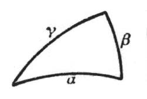

  </td>
  <td width="79%" valign=top style='width:79.0%;padding:.75pt .75pt .75pt .75pt'>
  
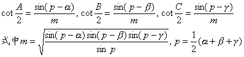

  </td>
 </tr>
 <tr>
  <td width="21%" colspan=2 valign=top style='width:21.0%;padding:.75pt .75pt .75pt .75pt'>
  
三角：

  
<i>A </i>,<i> B </i>,<i> C</i>

  
<i>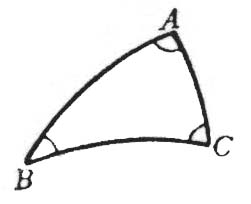</i>

  </td>
  <td width="79%" valign=top style='width:79.0%;padding:.75pt .75pt .75pt .75pt'>
  
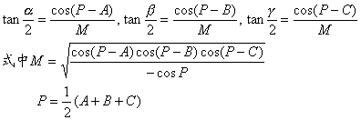

  
　

  
　

  
　

  
　

  
　 

  </td>
 </tr>
 <tr>
  <td width="21%" colspan=2 valign=top style='width:21.0%;padding:.75pt .75pt .75pt .75pt'>
  
两边及夹角：

  
<i>a</i><i> </i>, b , <i>C</i>

  
<i>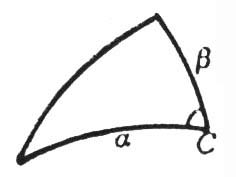</i>

  </td>
  <td width="79%" valign=top style='width:79.0%;padding:.75pt .75pt .75pt .75pt'>
  
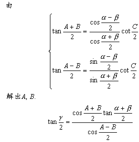

  </td>
 </tr>
 <tr>
  <td width="21%" colspan=2 valign=top style='width:21.0%;padding:.75pt .75pt .75pt .75pt'>
  
两角及夹边：

  
<i>A</i> , <i>B</i> , g 

  
<i>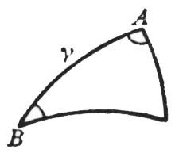</i>

  </td>
  <td width="79%" valign=top style='width:79.0%;padding:.75pt .75pt .75pt .75pt'>
  
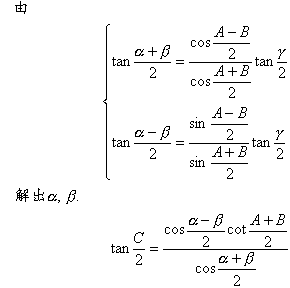

  </td>
 </tr>
 <tr>
  <td width="0%" valign=top style='width:0%;padding:.75pt .75pt .75pt .75pt'>
  
两边及一对角：

  
<i>a</i><i> </i>, b , <i>A</i>

  
<i>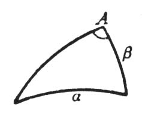</i>

  </td>
  <td colspan=2 valign=top style='padding:.75pt .75pt .75pt .75pt'>
  
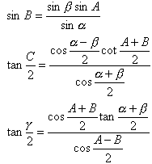

  </td>
 </tr>
 <tr>
  <td width="21%" colspan=2 valign=top style='width:21.0%;padding:.75pt .75pt .75pt .75pt'>
  
两角及一对边：

  
<i>A </i>, <i>B</i> , a 

  
<i>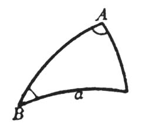</i>

  </td>
  <td width="79%" valign=top style='width:79.0%;padding:.75pt .75pt .75pt .75pt'>
  
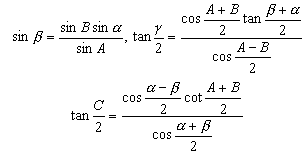

  </td>
 </tr>
 <tr height=0>
  <td width=131 style='border:none'></td>
  <td width=70 style='border:none'></td>
  <td width=441 style='border:none'></td>
 </tr>
</table>

[球面直角三角形计算公式]

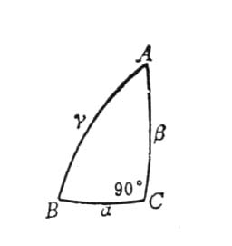

<table class=MsoNormalTable border=1 cellspacing=1 cellpadding=0 width=642
 style='width:481.5pt'>
 <tr>
  <td width="19%" valign=top style='width:19.0%;padding:.75pt .75pt .75pt .75pt'>
  
已知元素 

  </td>
  <td width="26%" valign=top style='width:26.0%;padding:.75pt .75pt .75pt .75pt'>
  
求解公式 

  </td>
  <td width="21%" valign=top style='width:21.0%;padding:.75pt .75pt .75pt .75pt'>
  
已知元素 

  </td>
  <td width="34%" valign=top style='width:34.0%;padding:.75pt .75pt .75pt .75pt'>
  
求解公式 

  </td>
 </tr>
 <tr>
  <td width="19%" valign=top style='width:19.0%;padding:.75pt .75pt .75pt .75pt'>
  
斜边及一角：

  
<i>g</i><i> </i>, <i>A</i> 

  </td>
  <td width="26%" valign=top style='width:26.0%;padding:.75pt .75pt .75pt .75pt'>
  
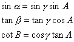

  </td>
  <td width="21%" valign=top style='width:21.0%;padding:.75pt .75pt .75pt .75pt'>
  
两直角边：

  
<i>a</i><i> </i>, b 

  </td>
  <td width="34%" valign=top style='width:34.0%;padding:.75pt .75pt .75pt .75pt'>
  
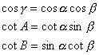

  </td>
 </tr>
 <tr>
  <td width="19%" valign=top style='width:19.0%;padding:.75pt .75pt .75pt .75pt'>
  
一直角边及其对角：

  
<i>a</i><i> </i>, <i>A</i> 

  </td>
  <td width="26%" valign=top style='width:26.0%;padding:.75pt .75pt .75pt .75pt'>
  
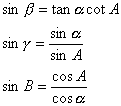

  </td>
  <td width="21%" valign=top style='width:21.0%;padding:.75pt .75pt .75pt .75pt'>
  
斜边及一直角边：

  
<i>g</i><i> </i>, a 

  </td>
  <td width="34%" valign=top style='width:34.0%;padding:.75pt .75pt .75pt .75pt'>
  
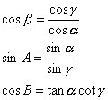

  </td>
 </tr>
 <tr>
  <td width="19%" valign=top style='width:19.0%;padding:.75pt .75pt .75pt .75pt'>
  
一直角边及其邻角：

  
<i>a</i><i> </i>, <i>B</i> 

  </td>
  <td width="26%" valign=top style='width:26.0%;padding:.75pt .75pt .75pt .75pt'>
  
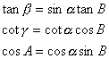

  </td>
  <td width="21%" valign=top style='width:21.0%;padding:.75pt .75pt .75pt .75pt'>
  
两角：

  
<i>A</i> , <i>B</i> 

  </td>
  <td width="34%" valign=top style='width:34.0%;padding:.75pt .75pt .75pt .75pt'>
  
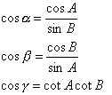

  </td>
 </tr>
</table>

计算时，应尽量利用含未知元素的正切(或余切)的公式，应避免采用正弦的公式，计算结果可代入正弦定理公式进行验算.

