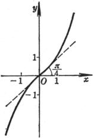

六、双曲函数

&nbsp;&nbsp;&nbsp; 1. 双曲函数的定义、图形与特征

[双曲函数定义]

<table class=MsoNormalTable border=0 cellspacing=0 cellpadding=0>
 <tr>
  <td width=57 valign=top style='width:42.75pt;padding:0mm 0mm 0mm 0mm'>
  
函数

  </td>
  <td width=94 valign=top style='width:70.5pt;padding:0mm 0mm 0mm 0mm'>
  
双曲正弦

  
sh <i>x</i>

  </td>
  <td width=95 valign=top style='width:71.25pt;padding:0mm 0mm 0mm 0mm'>
  
双曲余弦

  
ch <i>x</i>

  </td>
  <td width=104 valign=top style='width:78.0pt;padding:0mm 0mm 0mm 0mm'>
  
双曲正切

  
th<i> x</i>

  </td>
  <td width=95 valign=top style='width:71.25pt;padding:0mm 0mm 0mm 0mm'>
  
双曲余切

  
cth <i>x</i>

  </td>
  <td width=104 valign=top style='width:78.0pt;padding:0mm 0mm 0mm 0mm'>
  
双曲正割

  
sech <i>x</i>

  </td>
  <td width=94 valign=top style='width:70.5pt;padding:0mm 0mm 0mm 0mm'>
  
双曲余割

  
csch <i>x</i>

  </td>
 </tr>
 <tr>
  <td width=57 style='width:42.75pt;padding:0mm 0mm 0mm 0mm'>
  
定义

  </td>
  <td width=94 style='width:70.5pt;padding:0mm 0mm 0mm 0mm'>
  

  </td>
  <td width=95 style='width:71.25pt;padding:0mm 0mm 0mm 0mm'>
  

  </td>
  <td width=104 style='width:78.0pt;padding:0mm 0mm 0mm 0mm'>
  

  </td>
  <td width=95 style='width:71.25pt;padding:0mm 0mm 0mm 0mm'>
  

  </td>
  <td width=104 style='width:78.0pt;padding:0mm 0mm 0mm 0mm'>
  

  </td>
  <td width=94 style='width:70.5pt;padding:0mm 0mm 0mm 0mm'>
  

  </td>
 </tr>
</table>

[双曲函数的图形与特征]

<pre style='text-align:justify;text-justify:inter-ideograph'>&nbsp;&nbsp;&nbsp;&nbsp;&nbsp;&nbsp;&nbsp;&nbsp;&nbsp;&nbsp;&nbsp; 双曲正弦曲线 &nbsp; &nbsp;&nbsp;&nbsp;&nbsp;&nbsp;&nbsp;&nbsp;&nbsp;&nbsp;&nbsp;&nbsp;&nbsp;&nbsp;&nbsp;&nbsp;&nbsp;&nbsp;&nbsp;&nbsp;&nbsp;&nbsp;&nbsp;&nbsp;&nbsp;&nbsp;&nbsp; 双曲余弦曲线</pre><pre style='text-align:justify;text-justify:inter-ideograph'>&nbsp;&nbsp;&nbsp;&nbsp;&nbsp;&nbsp;&nbsp;&nbsp;&nbsp;&nbsp;&nbsp;&nbsp;&nbsp; &nbsp;&nbsp;&nbsp;&nbsp;&nbsp;&nbsp;&nbsp;&nbsp;&nbsp;&nbsp;&nbsp;&nbsp;&nbsp;&nbsp;&nbsp;&nbsp;&nbsp;&nbsp;&nbsp;&nbsp; &nbsp;&nbsp;&nbsp;&nbsp;&nbsp;&nbsp;&nbsp;&nbsp;&nbsp;&nbsp;&nbsp;&nbsp;</pre>

&nbsp;&nbsp;&nbsp;&nbsp;&nbsp;&nbsp;&nbsp;&nbsp;&nbsp;&nbsp;&nbsp;&nbsp;&nbsp;&nbsp;&nbsp;&nbsp;&nbsp; 

<pre style='text-align:justify;text-justify:inter-ideograph'>&nbsp;&nbsp;&nbsp;&nbsp;&nbsp; 曲线关于原点对称.&nbsp;&nbsp;&nbsp;&nbsp;&nbsp;&nbsp;&nbsp;&nbsp;&nbsp;&nbsp;&nbsp;&nbsp;&nbsp;&nbsp;&nbsp;&nbsp;&nbsp;&nbsp;&nbsp;&nbsp;&nbsp;&nbsp;&nbsp;&nbsp;&nbsp; &nbsp;&nbsp;&nbsp;&nbsp;&nbsp;&nbsp;曲线关于<i>y</i>轴对称.</pre><pre style='text-align:justify;text-justify:inter-ideograph'>&nbsp;&nbsp;&nbsp;&nbsp;&nbsp; 拐点（同曲线对称中心）：&nbsp;&nbsp;&nbsp;&nbsp;&nbsp;&nbsp;&nbsp;&nbsp;&nbsp;&nbsp;&nbsp;&nbsp; &nbsp;&nbsp;&nbsp;&nbsp;&nbsp;&nbsp;&nbsp;&nbsp;&nbsp;&nbsp;&nbsp; 顶点（同极小值点）：</pre><pre style='text-align:justify;text-justify:
inter-ideograph'>&nbsp;&nbsp;&nbsp;&nbsp;&nbsp; ，该点切线斜率为1&nbsp;&nbsp;&nbsp;&nbsp;&nbsp;&nbsp;&nbsp;&nbsp;&nbsp; </pre><pre
style='text-align:justify;text-justify:inter-ideograph'>&nbsp;&nbsp;&nbsp;&nbsp;&nbsp; &nbsp;双曲正切曲线&nbsp;&nbsp;&nbsp;&nbsp;&nbsp;&nbsp;&nbsp;&nbsp;&nbsp;&nbsp;&nbsp;&nbsp;&nbsp;&nbsp;&nbsp;&nbsp;&nbsp;&nbsp;&nbsp;&nbsp;&nbsp;&nbsp;&nbsp;&nbsp;&nbsp;&nbsp;&nbsp;&nbsp;&nbsp;&nbsp;&nbsp;&nbsp;&nbsp;双曲余切曲线</pre><pre
style='text-align:justify;text-justify:inter-ideograph'>&nbsp;&nbsp;&nbsp;&nbsp;&nbsp;&nbsp;&nbsp;&nbsp; &nbsp;&nbsp;&nbsp;&nbsp;&nbsp;&nbsp;&nbsp;&nbsp;&nbsp;&nbsp;&nbsp;&nbsp;&nbsp;&nbsp;&nbsp;&nbsp;&nbsp;&nbsp;&nbsp;&nbsp;&nbsp;&nbsp;&nbsp;&nbsp;&nbsp;&nbsp;&nbsp;&nbsp;&nbsp;&nbsp;&nbsp;&nbsp;&nbsp;&nbsp;&nbsp;&nbsp;&nbsp;&nbsp; </pre>

&nbsp;&nbsp;&nbsp;&nbsp;&nbsp;&nbsp;&nbsp;

<pre style='text-align:justify;text-justify:inter-ideograph'>&nbsp;&nbsp;&nbsp;&nbsp;&nbsp;&nbsp;&nbsp; 曲线关于原点对称.&nbsp;&nbsp;&nbsp;&nbsp;&nbsp;&nbsp;&nbsp;&nbsp;&nbsp;&nbsp;&nbsp;&nbsp;&nbsp;&nbsp;&nbsp;&nbsp;&nbsp;&nbsp;&nbsp;&nbsp;&nbsp; &nbsp;&nbsp;&nbsp;&nbsp;曲线关于原点对称.</pre><pre style='text-align:justify;
text-justify:inter-ideograph'>&nbsp;&nbsp;&nbsp;&nbsp;&nbsp;&nbsp;&nbsp; 拐点（同曲线对称中心）：&nbsp;&nbsp;&nbsp;&nbsp;&nbsp;&nbsp;&nbsp;&nbsp; &nbsp;&nbsp;&nbsp;&nbsp;&nbsp;&nbsp;&nbsp;&nbsp;&nbsp;&nbsp;不连续点：</pre><pre style='text-align:justify;text-justify:
inter-ideograph'>&nbsp;&nbsp;&nbsp;&nbsp;&nbsp;&nbsp;&nbsp; ，该点切线斜率为1&nbsp;&nbsp;&nbsp;&nbsp;&nbsp;&nbsp;&nbsp;&nbsp;&nbsp;&nbsp;&nbsp;&nbsp;&nbsp;&nbsp;&nbsp;&nbsp;&nbsp;&nbsp;&nbsp; 渐近线：</pre><pre style='text-align:justify;text-justify:
inter-ideograph'>&nbsp;&nbsp;&nbsp;&nbsp;&nbsp;&nbsp;&nbsp; 渐近线：</pre><pre
style='text-align:justify;text-justify:inter-ideograph'>&nbsp;&nbsp;&nbsp;&nbsp;&nbsp;&nbsp;&nbsp; 双曲正割曲线&nbsp;&nbsp;&nbsp;&nbsp;&nbsp;&nbsp;&nbsp;&nbsp;&nbsp;&nbsp;&nbsp;&nbsp;&nbsp;&nbsp;&nbsp;&nbsp;&nbsp;&nbsp;&nbsp;&nbsp;&nbsp;&nbsp;&nbsp;&nbsp;&nbsp;&nbsp;&nbsp;&nbsp;&nbsp;&nbsp;&nbsp;&nbsp;&nbsp;&nbsp;&nbsp;&nbsp; &nbsp;&nbsp;双曲余割曲线</pre><pre style='text-align:justify;
text-justify:inter-ideograph'>&nbsp;&nbsp;&nbsp;&nbsp;&nbsp;&nbsp;&nbsp; &nbsp;&nbsp;&nbsp;&nbsp;&nbsp;&nbsp;&nbsp;&nbsp;&nbsp;&nbsp;&nbsp;&nbsp;&nbsp;&nbsp;&nbsp;&nbsp;&nbsp;&nbsp;&nbsp;&nbsp;&nbsp;&nbsp;&nbsp;&nbsp;&nbsp;&nbsp;&nbsp;&nbsp;&nbsp;&nbsp;&nbsp;&nbsp;&nbsp;&nbsp;&nbsp;&nbsp;&nbsp; &nbsp;&nbsp;&nbsp;&nbsp;&nbsp;</pre>

&nbsp;&nbsp;&nbsp;&nbsp;&nbsp;&nbsp; &nbsp;&nbsp;&nbsp;&nbsp;&nbsp;

&nbsp;&nbsp;&nbsp;&nbsp;&nbsp;&nbsp;&nbsp;&nbsp;&nbsp; 曲线关于<i>y</i>轴对称.&nbsp;&nbsp;&nbsp;&nbsp;&nbsp;&nbsp;&nbsp;&nbsp;&nbsp;&nbsp;&nbsp;&nbsp;&nbsp;&nbsp;&nbsp;&nbsp;&nbsp;&nbsp;&nbsp;&nbsp;&nbsp;&nbsp;&nbsp;
&nbsp;&nbsp;&nbsp;&nbsp; 曲线关于原点对称.

<pre style='text-align:justify;text-justify:inter-ideograph'>&nbsp;&nbsp;&nbsp;&nbsp;&nbsp;&nbsp;&nbsp;&nbsp;&nbsp; 顶点（同极大点）：&nbsp;&nbsp;&nbsp;&nbsp;&nbsp;&nbsp;&nbsp;&nbsp;&nbsp;&nbsp;&nbsp;&nbsp;&nbsp;&nbsp;&nbsp;&nbsp; &nbsp;&nbsp;&nbsp;&nbsp; 不连续点：</pre><pre style='text-align:justify;text-justify:
inter-ideograph'>&nbsp;&nbsp;&nbsp;&nbsp;&nbsp;&nbsp;&nbsp;&nbsp;&nbsp; 拐点：&nbsp;&nbsp;&nbsp;&nbsp;&nbsp;&nbsp;&nbsp;&nbsp; &nbsp;&nbsp;&nbsp;&nbsp;&nbsp;&nbsp;&nbsp;&nbsp;&nbsp;&nbsp;&nbsp;&nbsp;&nbsp;&nbsp;&nbsp;渐近线：</pre><pre style='text-align:justify;text-justify:
inter-ideograph'>&nbsp;&nbsp;&nbsp;&nbsp;&nbsp;&nbsp;&nbsp;&nbsp;&nbsp;&nbsp;&nbsp;&nbsp;&nbsp; &nbsp;</pre><pre style='text-align:justify;
text-justify:inter-ideograph'>&nbsp;&nbsp;&nbsp;&nbsp;&nbsp;&nbsp;&nbsp;&nbsp;&nbsp; 渐近线：</pre>
