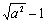

2. 双曲函数的相互关系和基本公式

[双曲函数的相互关系]

<table class=MsoNormalTable border=1 cellspacing=0 cellpadding=0>
 <tr>
  <td width=76 valign=top style='width:57.0pt;padding:0mm 0mm 0mm 0mm'>
  
&nbsp; 

  </td>
  <td width=95 valign=top style='width:71.25pt;padding:0mm 0mm 0mm 0mm'>
  
sh <i>x</i> = <i>a</i>

  </td>
  <td width=94 valign=top style='width:70.5pt;padding:0mm 0mm 0mm 0mm'>
  
ch <i>x</i> = <i>a</i>

  </td>
  <td width=95 valign=top style='width:71.25pt;padding:0mm 0mm 0mm 0mm'>
  
th <i>x</i> = <i>a</i>

  </td>
  <td width=94 valign=top style='width:70.5pt;padding:0mm 0mm 0mm 0mm'>
  
cth <i>x</i> = <i>a</i>

  </td>
  <td width=85 valign=top style='width:63.75pt;padding:0mm 0mm 0mm 0mm'>
  
sech <i>x</i> = <i>a</i>

  </td>
  <td width=104 valign=top style='width:78.0pt;padding:0mm 0mm 0mm 0mm'>
  
csch <i>x</i> = <i>a</i>

  </td>
 </tr>
 <tr>
  <td width=76 valign=top style='width:57.0pt;padding:0mm 0mm 0mm 0mm'>
  
sh <i>x</i> =

  </td>
  <td width=95 valign=top style='width:71.25pt;padding:0mm 0mm 0mm 0mm'>
  
<i>a</i>

  </td>
  <td width=94 valign=top style='width:70.5pt;padding:0mm 0mm 0mm 0mm'>
  

  </td>
  <td width=95 valign=top style='width:71.25pt;padding:0mm 0mm 0mm 0mm'>
  

  </td>
  <td width=94 valign=top style='width:70.5pt;padding:0mm 0mm 0mm 0mm'>
  

  </td>
  <td width=85 valign=top style='width:63.75pt;padding:0mm 0mm 0mm 0mm'>
  

  </td>
  <td width=104 valign=top style='width:78.0pt;padding:0mm 0mm 0mm 0mm'>
  

  </td>
 </tr>
 <tr>
  <td width=76 valign=top style='width:57.0pt;padding:0mm 0mm 0mm 0mm'>
  
ch <i>x</i> =

  </td>
  <td width=95 valign=top style='width:71.25pt;padding:0mm 0mm 0mm 0mm'>
  

  </td>
  <td width=94 valign=top style='width:70.5pt;padding:0mm 0mm 0mm 0mm'>
  
<i>a</i>

  </td>
  <td width=95 valign=top style='width:71.25pt;padding:0mm 0mm 0mm 0mm'>
  

  </td>
  <td width=94 valign=top style='width:70.5pt;padding:0mm 0mm 0mm 0mm'>
  

  </td>
  <td width=85 valign=top style='width:63.75pt;padding:0mm 0mm 0mm 0mm'>
  

  </td>
  <td width=104 valign=top style='width:78.0pt;padding:0mm 0mm 0mm 0mm'>
  

  </td>
 </tr>
 <tr>
  <td width=76 valign=top style='width:57.0pt;padding:0mm 0mm 0mm 0mm'>
  
th <i>x</i> =

  </td>
  <td width=95 valign=top style='width:71.25pt;padding:0mm 0mm 0mm 0mm'>
  

  </td>
  <td width=94 valign=top style='width:70.5pt;padding:0mm 0mm 0mm 0mm'>
  

  </td>
  <td width=95 valign=top style='width:71.25pt;padding:0mm 0mm 0mm 0mm'>
  
<i>a</i>

  </td>
  <td width=94 valign=top style='width:70.5pt;padding:0mm 0mm 0mm 0mm'>
  

  </td>
  <td width=85 valign=top style='width:63.75pt;padding:0mm 0mm 0mm 0mm'>
  

  </td>
  <td width=104 valign=top style='width:78.0pt;padding:0mm 0mm 0mm 0mm'>
  

  </td>
 </tr>
 <tr>
  <td width=76 valign=top style='width:57.0pt;padding:0mm 0mm 0mm 0mm'>
  
cth <i>x</i> =

  </td>
  <td width=95 valign=top style='width:71.25pt;padding:0mm 0mm 0mm 0mm'>
  

  </td>
  <td width=94 valign=top style='width:70.5pt;padding:0mm 0mm 0mm 0mm'>
  

  </td>
  <td width=95 valign=top style='width:71.25pt;padding:0mm 0mm 0mm 0mm'>
  

  </td>
  <td width=94 valign=top style='width:70.5pt;padding:0mm 0mm 0mm 0mm'>
  
<i>a</i>

  </td>
  <td width=85 valign=top style='width:63.75pt;padding:0mm 0mm 0mm 0mm'>
  

  </td>
  <td width=104 valign=top style='width:78.0pt;padding:0mm 0mm 0mm 0mm'>
  

  </td>
 </tr>
 <tr>
  <td width=76 valign=top style='width:57.0pt;padding:0mm 0mm 0mm 0mm'>
  
sech <i>x</i> =

  </td>
  <td width=95 valign=top style='width:71.25pt;padding:0mm 0mm 0mm 0mm'>
  

  </td>
  <td width=94 valign=top style='width:70.5pt;padding:0mm 0mm 0mm 0mm'>
  

  </td>
  <td width=95 valign=top style='width:71.25pt;padding:0mm 0mm 0mm 0mm'>
  

  </td>
  <td width=94 valign=top style='width:70.5pt;padding:0mm 0mm 0mm 0mm'>
  

  </td>
  <td width=85 valign=top style='width:63.75pt;padding:0mm 0mm 0mm 0mm'>
  
<i>a</i>

  </td>
  <td width=104 valign=top style='width:78.0pt;padding:0mm 0mm 0mm 0mm'>
  

  </td>
 </tr>
 <tr>
  <td width=76 valign=top style='width:57.0pt;padding:0mm 0mm 0mm 0mm'>
  
csch <i>x</i> =

  </td>
  <td width=95 valign=top style='width:71.25pt;padding:0mm 0mm 0mm 0mm'>
  

  </td>
  <td width=94 valign=top style='width:70.5pt;padding:0mm 0mm 0mm 0mm'>
  

  </td>
  <td width=95 valign=top style='width:71.25pt;padding:0mm 0mm 0mm 0mm'>
  

  </td>
  <td width=94 valign=top style='width:70.5pt;padding:0mm 0mm 0mm 0mm'>
  

  </td>
  <td width=85 valign=top style='width:63.75pt;padding:0mm 0mm 0mm 0mm'>
  

  </td>
  <td width=104 valign=top style='width:78.0pt;padding:0mm 0mm 0mm 0mm'>
  
<i>a</i>

  </td>
 </tr>
</table>

&nbsp;&nbsp;&nbsp;&nbsp;&nbsp;&nbsp;&nbsp;&nbsp;&nbsp;

[双曲函数基本公式]

和差的双曲函数

双曲函数的和差

倍&nbsp; 元&nbsp; 公&nbsp; 式

<pre style='text-align:center' align=center></pre>

半 &nbsp;元&nbsp; 公&nbsp; 式

德·莫弗公式

