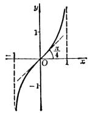
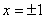
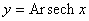

3. 反双曲函数的定义、图形与特征

[反双曲函数的定义及其对数表达式]

<table class=MsoNormalTable border=0 cellspacing=0 cellpadding=0>
 <tr>
  <td width=138 valign=top style='width:103.5pt;padding:0mm 0mm 0mm 0mm'><pre
  style='text-align:center' align=center>函&nbsp; 数</pre></td>
  <td width=138 valign=top style='width:103.5pt;padding:0mm 0mm 0mm 0mm'><pre
  style='text-align:center' align=center>记&nbsp; 号</pre></td>
  <td width=138 valign=top style='width:103.5pt;padding:0mm 0mm 0mm 0mm'>
  
对数表达式

  </td>
 </tr>
 <tr>
  <td width=138 valign=top style='width:103.5pt;padding:0mm 0mm 0mm 0mm'>
  
反双曲正弦

  </td>
  <td width=195 valign=top style='width:146.25pt;padding:0mm 0mm 0mm 0mm'>
  
若 <i>x </i>= sh <i>y</i>,

  
则 <i>y </i>= Ar sh <i>x</i>

  </td>
  <td width=312 valign=top style='width:234.0pt;padding:0mm 0mm 0mm 0mm'>
  

  </td>
 </tr>
 <tr>
  <td width=138 valign=top style='width:103.5pt;padding:0mm 0mm 0mm 0mm'>
  
反双曲余弦

  </td>
  <td width=195 valign=top style='width:146.25pt;padding:0mm 0mm 0mm 0mm'>
  
若 <i>x </i>=<i> </i>ch <i>y</i>,

  
则 <i>y</i> = Ar ch <i>x</i>

  </td>
  <td width=312 valign=top style='width:234.0pt;padding:0mm 0mm 0mm 0mm'>
  

  </td>
 </tr>
 <tr>
  <td width=138 valign=top style='width:103.5pt;padding:0mm 0mm 0mm 0mm'>
  
反双曲正切

  </td>
  <td width=195 valign=top style='width:146.25pt;padding:0mm 0mm 0mm 0mm'>
  
若 <i>x</i> = th <i>y</i>,

  
则 <i>y</i> = Ar th <i>x</i>

  </td>
  <td width=312 valign=top style='width:234.0pt;padding:0mm 0mm 0mm 0mm'>
  

  </td>
 </tr>
 <tr>
  <td width=138 valign=top style='width:103.5pt;padding:0mm 0mm 0mm 0mm'>
  
反双曲余切

  </td>
  <td width=195 valign=top style='width:146.25pt;padding:0mm 0mm 0mm 0mm'>
  
若 <i>x</i> = cth <i>y</i>,

  
则 <i>y</i> = Ar cth <i>x</i>

  </td>
  <td width=312 valign=top style='width:234.0pt;padding:0mm 0mm 0mm 0mm'>
  

  </td>
 </tr>
 <tr>
  <td width=138 valign=top style='width:103.5pt;padding:0mm 0mm 0mm 0mm'>
  
反双曲正割

  </td>
  <td width=195 valign=top style='width:146.25pt;padding:0mm 0mm 0mm 0mm'>
  
若 <i>x</i> = sech <i>y</i>,

  
则 <i>y</i> = Ar sech <i>x</i>

  </td>
  <td width=312 valign=top style='width:234.0pt;padding:0mm 0mm 0mm 0mm'>
  

  </td>
 </tr>
 <tr>
  <td width=138 valign=top style='width:103.5pt;padding:0mm 0mm 0mm 0mm'>
  
反双曲余割

  </td>
  <td width=195 valign=top style='width:146.25pt;padding:0mm 0mm 0mm 0mm'>
  
若 <i>x</i> = csch <i>x</i>,

  
则 <i>y</i> = Ar csch <i>x</i>

  </td>
  <td width=312 valign=top style='width:234.0pt;padding:0mm 0mm 0mm 0mm'>
  

  </td>
 </tr>
</table>
<pre style='text-align:justify;text-justify:inter-ideograph'>[反双曲函数的图形与特征]</pre><pre style='text-align:
justify;text-justify:inter-ideograph'>&nbsp;&nbsp; 反双曲正弦曲线&nbsp;&nbsp;&nbsp;&nbsp;&nbsp;&nbsp;&nbsp;&nbsp;&nbsp;&nbsp;&nbsp;&nbsp;&nbsp;&nbsp;&nbsp;&nbsp;&nbsp;&nbsp;&nbsp;&nbsp; 反双曲余弦曲线</pre><pre style='text-align:justify;text-justify:
inter-ideograph'>&nbsp;&nbsp; &nbsp;&nbsp;&nbsp;&nbsp;&nbsp;&nbsp;&nbsp;&nbsp;&nbsp;&nbsp;&nbsp;&nbsp;&nbsp;&nbsp;&nbsp;&nbsp;&nbsp;&nbsp;&nbsp;&nbsp;&nbsp;&nbsp;&nbsp;&nbsp;&nbsp; </pre>

&nbsp;&nbsp; &nbsp;&nbsp;&nbsp;&nbsp;&nbsp;&nbsp;&nbsp;&nbsp;&nbsp;&nbsp;&nbsp;&nbsp; 

<pre style='text-align:justify;text-justify:inter-ideograph'>&nbsp;&nbsp; 曲线关于原点对称.&nbsp;&nbsp;&nbsp;&nbsp;&nbsp;&nbsp;&nbsp;&nbsp;&nbsp;&nbsp;&nbsp;&nbsp;&nbsp;&nbsp;&nbsp;&nbsp;&nbsp;&nbsp;&nbsp;&nbsp;&nbsp;&nbsp; &nbsp;&nbsp;曲线关于<i>x</i>轴对称.</pre><pre
style='text-align:justify;text-justify:inter-ideograph'>&nbsp;&nbsp; 拐点（同曲线对称中心）：&nbsp;&nbsp;&nbsp;&nbsp;&nbsp;&nbsp;&nbsp;&nbsp;&nbsp;&nbsp;&nbsp;&nbsp;&nbsp;&nbsp;&nbsp;&nbsp;&nbsp; 顶点：</pre><pre style='text-align:justify;text-justify:
inter-ideograph'>&nbsp;&nbsp; ，该点切线斜率为1</pre><pre
style='text-align:justify;text-justify:inter-ideograph'>&nbsp;&nbsp; 反双曲正切曲线&nbsp;&nbsp;&nbsp;&nbsp;&nbsp;&nbsp;&nbsp;&nbsp;&nbsp;&nbsp;&nbsp;&nbsp;&nbsp;&nbsp;&nbsp;&nbsp;&nbsp;&nbsp;&nbsp;&nbsp;&nbsp;&nbsp;&nbsp;&nbsp;&nbsp;&nbsp;&nbsp;&nbsp;&nbsp;&nbsp;&nbsp;&nbsp;&nbsp;&nbsp;&nbsp;反双曲余切曲线</pre><pre style='text-align:justify;text-justify:
inter-ideograph'>&nbsp;&nbsp; &nbsp;&nbsp;&nbsp;&nbsp;&nbsp;&nbsp;&nbsp;&nbsp;&nbsp;&nbsp;&nbsp;&nbsp;&nbsp;&nbsp;&nbsp;&nbsp;&nbsp;&nbsp;&nbsp;&nbsp;&nbsp;&nbsp;&nbsp;&nbsp;&nbsp;&nbsp;&nbsp;&nbsp;&nbsp;&nbsp;&nbsp;&nbsp;&nbsp;&nbsp;&nbsp;&nbsp;&nbsp;&nbsp;&nbsp;&nbsp;</pre>

&nbsp;&nbsp;&nbsp; &nbsp;&nbsp;&nbsp;&nbsp;&nbsp;&nbsp;&nbsp;&nbsp;&nbsp;&nbsp;&nbsp;&nbsp; 

<pre style='text-align:justify;text-justify:inter-ideograph'>&nbsp;&nbsp; 曲线关于原点对称.&nbsp;&nbsp;&nbsp;&nbsp;&nbsp;&nbsp;&nbsp;&nbsp;&nbsp;&nbsp;&nbsp;&nbsp;&nbsp;&nbsp;&nbsp;&nbsp;&nbsp; 曲线关于原点对称.</pre><pre
style='text-align:justify;text-justify:inter-ideograph'>&nbsp;&nbsp; 拐点（同曲线对称中心）：&nbsp;&nbsp;&nbsp;&nbsp;&nbsp;&nbsp;&nbsp;&nbsp;&nbsp;&nbsp;&nbsp; 不连续点：</pre><pre style='text-align:justify;text-justify:
inter-ideograph'>&nbsp;&nbsp; ，该点切线斜率为1&nbsp;&nbsp;&nbsp;&nbsp;&nbsp;&nbsp;&nbsp;&nbsp; &nbsp;&nbsp;&nbsp;渐近线：</pre><pre style='text-align:justify;text-justify:
inter-ideograph'>&nbsp;&nbsp; 反双曲正割曲线&nbsp;&nbsp;&nbsp;&nbsp;&nbsp;&nbsp;&nbsp;&nbsp;&nbsp;&nbsp;&nbsp;&nbsp;&nbsp;&nbsp;&nbsp;&nbsp;&nbsp;&nbsp;&nbsp;&nbsp; 反双曲余割曲线</pre><pre style='text-align:justify;text-justify:
inter-ideograph'>&nbsp;&nbsp; &nbsp;&nbsp;&nbsp;&nbsp;&nbsp;&nbsp;&nbsp;&nbsp;&nbsp;&nbsp;&nbsp;&nbsp;&nbsp;&nbsp;&nbsp;&nbsp;&nbsp;&nbsp;&nbsp;&nbsp;&nbsp;&nbsp;&nbsp; </pre>

&nbsp;&nbsp;&nbsp; &nbsp;&nbsp;&nbsp;&nbsp;&nbsp;&nbsp;&nbsp;&nbsp;&nbsp;&nbsp;&nbsp; 

&nbsp;&nbsp;&nbsp; 曲线关于<i>x</i>轴对称.&nbsp;&nbsp;&nbsp;&nbsp;&nbsp;&nbsp;&nbsp;&nbsp;&nbsp;&nbsp;&nbsp;&nbsp;&nbsp;&nbsp;&nbsp;&nbsp;&nbsp;&nbsp;&nbsp;&nbsp;&nbsp;&nbsp;&nbsp;&nbsp;&nbsp;&nbsp;&nbsp;&nbsp; 曲线关于原点对称.

&nbsp;&nbsp;&nbsp; 顶点：&nbsp;&nbsp;&nbsp;&nbsp;&nbsp;&nbsp;&nbsp;&nbsp;&nbsp;&nbsp;&nbsp;&nbsp;&nbsp;&nbsp;&nbsp;&nbsp;&nbsp;&nbsp;&nbsp;&nbsp;&nbsp;&nbsp;&nbsp;&nbsp;&nbsp;&nbsp;&nbsp;&nbsp;&nbsp;&nbsp;&nbsp;&nbsp; 不连续点：

&nbsp;&nbsp;&nbsp; 拐点：&nbsp;&nbsp;&nbsp;&nbsp;&nbsp;&nbsp;&nbsp;&nbsp;&nbsp;&nbsp;&nbsp;&nbsp;&nbsp;&nbsp;&nbsp;&nbsp;&nbsp; &nbsp;&nbsp;&nbsp;&nbsp; 渐近线：

&nbsp;&nbsp;&nbsp;&nbsp;&nbsp;&nbsp;&nbsp; &nbsp;和

