

4. 反双曲函数的相互关系与基本公式

[反双曲函数的相互关系]

<table class=MsoNormalTable border=0 cellspacing=0 cellpadding=0
 style='border-collapse:collapse'>
 <tr>
  <td width=123 valign=top style='width:92.15pt;border-top:solid windowtext 1.0pt;
  border-left:none;border-bottom:solid windowtext 1.0pt;border-right:none;
  padding:0mm 1.4pt 0mm 1.4pt'>
  
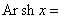

  </td>
  <td width=156 valign=top style='width:116.75pt;border:solid windowtext 1.0pt;
  padding:0mm 1.4pt 0mm 1.4pt'>
  
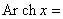

  </td>
  <td width=166 valign=top style='width:124.2pt;border:solid windowtext 1.0pt;
  border-left:none;padding:0mm 1.4pt 0mm 1.4pt'>
  
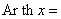

  </td>
  <td width=170 valign=top style='width:127.6pt;border-top:solid windowtext 1.0pt;
  border-left:none;border-bottom:solid windowtext 1.0pt;border-right:none;
  padding:0mm 1.4pt 0mm 1.4pt'>
  
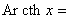

  </td>
 </tr>
 <tr>
  <td width=123 valign=top style='width:92.15pt;padding:0mm 1.4pt 0mm 1.4pt'>
  
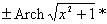

  </td>
  <td width=156 valign=top style='width:116.75pt;border-top:none;border-left:
  solid windowtext 1.0pt;border-bottom:none;border-right:solid windowtext 1.0pt;
  padding:0mm 1.4pt 0mm 1.4pt'>
  
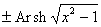

  </td>
  <td width=166 valign=top style='width:124.2pt;border:none;border-right:solid windowtext 1.0pt;
  padding:0mm 1.4pt 0mm 1.4pt'>
  
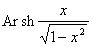

  </td>
  <td width=170 valign=top style='width:127.6pt;padding:0mm 1.4pt 0mm 1.4pt'>
  
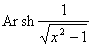

  </td>
 </tr>
 <tr>
  <td width=123 valign=top style='width:92.15pt;padding:0mm 1.4pt 0mm 1.4pt'>
  
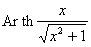

  </td>
  <td width=156 valign=top style='width:116.75pt;border-top:none;border-left:
  solid windowtext 1.0pt;border-bottom:none;border-right:solid windowtext 1.0pt;
  padding:0mm 1.4pt 0mm 1.4pt'>
  
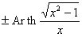

  </td>
  <td width=166 valign=top style='width:124.2pt;border:none;border-right:solid windowtext 1.0pt;
  padding:0mm 1.4pt 0mm 1.4pt'>
  
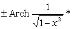

  </td>
  <td width=170 valign=top style='width:127.6pt;padding:0mm 1.4pt 0mm 1.4pt'>
  
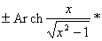

  </td>
 </tr>
 <tr>
  <td width=123 valign=top style='width:92.15pt;border:none;border-bottom:solid windowtext 1.0pt;
  padding:0mm 1.4pt 0mm 1.4pt'>
  
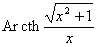

  </td>
  <td width=156 valign=top style='width:116.75pt;border:solid windowtext 1.0pt;
  border-top:none;padding:0mm 1.4pt 0mm 1.4pt'>
  
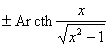

  </td>
  <td width=166 valign=top style='width:124.2pt;border-top:none;border-left:
  none;border-bottom:solid windowtext 1.0pt;border-right:solid windowtext 1.0pt;
  padding:0mm 1.4pt 0mm 1.4pt'>
  
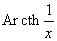

  </td>
  <td width=170 valign=top style='width:127.6pt;border:none;border-bottom:solid windowtext 1.0pt;
  padding:0mm 1.4pt 0mm 1.4pt'>
  
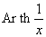

  </td>
 </tr>
</table>

有*号者，当<i>x</i>&gt;0时取正号，当<i>x</i>&lt;0时取负号.

[基本公式]

&nbsp;&nbsp;&nbsp;&nbsp;&nbsp;&nbsp; &nbsp;&nbsp;&nbsp;&nbsp;&nbsp;&nbsp;&nbsp;&nbsp;
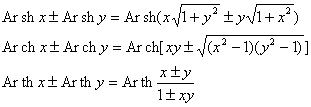

