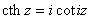

5. 双曲函数与三角函数的对比

[双曲函数与三角函数的关系]

<table class=MsoNormalTable border=0 cellspacing=0 cellpadding=0
 style='border-collapse:collapse'>
 <tr>
  <td width=293 valign=top style='width:219.75pt;border:solid windowtext 1.0pt;
  border-left:none;padding:0mm 1.4pt 0mm 1.4pt'>
  
用三角函数表示双曲函数

  </td>
  <td width=350 valign=top style='width:262.2pt;border-top:solid windowtext 1.0pt;
  border-left:none;border-bottom:solid windowtext 1.0pt;border-right:none;
  padding:0mm 1.4pt 0mm 1.4pt'>
  
用双曲函数表示三角函数

  </td>
 </tr>
 <tr>
  <td width=293 valign=top style='width:219.75pt;border:none;border-right:solid windowtext 1.0pt;
  padding:0mm 1.4pt 0mm 1.4pt'>
  

  </td>
  <td width=350 valign=top style='width:262.2pt;padding:0mm 1.4pt 0mm 1.4pt'>
  

  </td>
 </tr>
 <tr>
  <td width=293 valign=top style='width:219.75pt;border:none;border-right:solid windowtext 1.0pt;
  padding:0mm 1.4pt 0mm 1.4pt'>
  

  </td>
  <td width=350 valign=top style='width:262.2pt;padding:0mm 1.4pt 0mm 1.4pt'>
  

  </td>
 </tr>
 <tr>
  <td width=293 valign=top style='width:219.75pt;border:none;border-right:solid windowtext 1.0pt;
  padding:0mm 1.4pt 0mm 1.4pt'>
  

  </td>
  <td width=350 valign=top style='width:262.2pt;padding:0mm 1.4pt 0mm 1.4pt'>
  

  </td>
 </tr>
 <tr>
  <td width=293 valign=top style='width:219.75pt;border-top:none;border-left:
  none;border-bottom:solid windowtext 1.0pt;border-right:solid windowtext 1.0pt;
  padding:0mm 1.4pt 0mm 1.4pt'>
  

  </td>
  <td width=350 valign=top style='width:262.2pt;border:none;border-bottom:solid windowtext 1.0pt;
  padding:0mm 1.4pt 0mm 1.4pt'>
  

  </td>
 </tr>
</table>

表中.

[三角函数、反三角函数、双曲函数与反双曲函数的几何意义]

<table class=MsoNormalTable border=0 cellspacing=0 cellpadding=0
 style='border-collapse:collapse'>
 <tr>
  <td width=288 valign=top style='width:216.0pt;border:solid windowtext 1.0pt;
  border-left:none;padding:0mm 1.4pt 0mm 1.4pt'>
  
图&nbsp;&nbsp; 形

  </td>
  <td width=355 valign=top style='width:265.95pt;border-top:solid windowtext 1.0pt;
  border-left:none;border-bottom:solid windowtext 1.0pt;border-right:none;
  padding:0mm 1.4pt 0mm 1.4pt'>
  
几&nbsp; 何&nbsp; 意&nbsp; 义

  </td>
 </tr>
 <tr>
  <td width=288 valign=top style='width:216.0pt;border-top:none;border-left:
  none;border-bottom:solid windowtext 1.0pt;border-right:solid windowtext 1.0pt;
  padding:0mm 1.4pt 0mm 1.4pt'>
  

  
2<i>a</i>为圆扇形<i>COEA</i>的圆心角(弧度)，圆扇形<i>COEA</i>的面积<i>S</i>=<i>a</i>

  </td>
  <td width=355 valign=top style='width:265.95pt;border:none;border-bottom:
  solid windowtext 1.0pt;padding:0mm 1.4pt 0mm 1.4pt'>
  
三角函数

  

  
反三角函数

  

  
都是圆扇形<i>COEA</i>的面积，因此反三角函数又称圆函数

  </td>
 </tr>
 <tr>
  <td width=288 valign=top style='width:216.0pt;border-top:none;border-left:
  none;border-bottom:solid windowtext 1.0pt;border-right:solid windowtext 1.0pt;
  padding:0mm 1.4pt 0mm 1.4pt'>
  

  
双曲扇形<i>COEA</i>的面积

  

  </td>
  <td width=355 valign=top style='width:265.95pt;border:none;border-bottom:
  solid windowtext 1.0pt;padding:0mm 1.4pt 0mm 1.4pt'>
  
双曲函数

  

  
反双曲函数

  

  
都是双曲扇形<i>COEA</i>的面积，因此反双曲函数又称面积函数

  </td>
 </tr>
</table>

&nbsp;

