

<b>第二章 初等几何图形的计算与作图</b>

几何图形是从现实世界中抽象出来的，所以，几何图形的理论、计算与作图广泛应用与人们的社会实践中.

本章重点介绍两类常用的几何图形：一是平面图形，如三角形、四边形、正多边形以及与圆有关的各种图形；另一是空间立体图形，如正方体、长方体、球体、锥体、圆柱体以及各种正多面体.这里较详细地收集了它们的面积、体积、侧面积、表面积、重心和转动惯量等计算公式.

另外，还介绍了一些图形（如正多边形）的作图方法，对于生产实践中常用的椭圆作图法和圆弧放样法也作了简要的说明.同时，明确指出了在百余年前已经严格证明了的所谓“几何三大问题”不能用尺规作图.

<b>§</b><b>1&nbsp;&nbsp; </b><b>三角形与四边形</b>

一、&nbsp; 一、 三角形各元素的计算

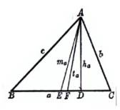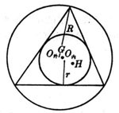

&nbsp;&nbsp; 1. 三角形各元素

&nbsp;&nbsp;&nbsp;&nbsp;&nbsp;&nbsp;&nbsp;&nbsp;&nbsp;&nbsp;&nbsp;&nbsp;
图 2.1<i>&nbsp;&nbsp;&nbsp;&nbsp;&nbsp;&nbsp; </i>&nbsp;&nbsp;&nbsp;&nbsp;&nbsp;&nbsp;&nbsp;&nbsp;&nbsp;&nbsp;&nbsp;&nbsp;&nbsp;&nbsp;&nbsp;&nbsp;&nbsp;&nbsp;&nbsp;&nbsp;&nbsp;图 2.2 

<i>a,b,c</i>为三角形三边&nbsp;&nbsp;&nbsp;&nbsp;&nbsp;&nbsp;&nbsp;&nbsp;&nbsp;&nbsp;&nbsp;&nbsp;&nbsp;&nbsp;&nbsp;&nbsp;
<i>R</i>为外接圆半径

<i>A,B,C</i>为三个角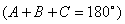&nbsp;&nbsp;&nbsp;
<i>r</i>为内切圆半径

<i>AD</i>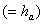为<i>a</i>边上的高&nbsp;&nbsp;&nbsp;&nbsp;&nbsp;&nbsp;&nbsp;&nbsp;&nbsp;&nbsp;&nbsp;&nbsp;
<i>H</i>为垂心（三条高的交点）

<i>AF</i>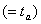为<i>A</i>角的平分线&nbsp;&nbsp;&nbsp;&nbsp;&nbsp;&nbsp;&nbsp;&nbsp;&nbsp;&nbsp;
<i>G</i>为重心（三条中线的交点）

<i>AE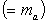</i>为<i>a</i>边上的中线&nbsp;&nbsp;&nbsp;&nbsp;&nbsp;&nbsp;&nbsp;&nbsp;&nbsp;&nbsp;&nbsp;
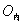为内心（三条角平分线的交点）

<i>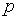</i>为半周长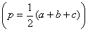&nbsp;&nbsp;&nbsp;&nbsp;&nbsp;&nbsp;&nbsp;
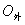为外心（三条垂直平分线的交点）

<pre><i>S</i>为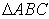的面积</pre>
