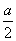
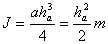
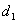

二．&nbsp; 三角形和四边形的面积、几何重心、转动惯量计算公式

<table class=MsoNormalTable border=1 cellspacing=0 cellpadding=0
 style='border-collapse:collapse;border:none'>
 <tr>
  <td width=304 valign=top style='width:228.0pt;border:solid windowtext 1.0pt;
  padding:0mm 5.4pt 0mm 5.4pt'>
  
图形

  </td>
  <td width=296 valign=top style='width:222.0pt;border:solid windowtext 1.0pt;
  border-left:none;padding:0mm 5.4pt 0mm 5.4pt'>
  
面积<i>S</i>、几何重心<i>G</i>与转动惯量*<i>J</i>

  </td>
 </tr>
 <tr style='height:84.45pt'>
  <td width=304 valign=top style='width:228.0pt;border:solid windowtext 1.0pt;
  border-top:none;padding:0mm 5.4pt 0mm 5.4pt;height:84.45pt'>
  
[直线段]

  

  </td>
  <td width=296 valign=top style='width:222.0pt;border-top:none;border-left:
  none;border-bottom:solid windowtext 1.0pt;border-right:solid windowtext 1.0pt;
  padding:0mm 5.4pt 0mm 5.4pt;height:84.45pt'>
  
长度&nbsp;&nbsp; <i>L=a</i>

  
重心&nbsp;&nbsp; <i>GA=GB</i>=

  
转动惯量

  
<i>(a)&nbsp;&nbsp;&nbsp; </i><i>(a)</i>转轴平行于细杆，到细杆距离

  
&nbsp; 为h(图(<i>a</i>))

  
&nbsp;&nbsp;&nbsp;&nbsp;&nbsp;&nbsp;&nbsp;&nbsp;&nbsp;
  

  
<i>(b)&nbsp;&nbsp;&nbsp; </i><i>(b)</i>转轴通过细杆重心<i>G</i>,且与细杆

  
&nbsp; 垂直(图(<i>b</i>))

  
&nbsp;&nbsp;&nbsp;&nbsp;&nbsp;&nbsp;&nbsp;&nbsp;&nbsp;
  

  
<i>(c) </i><i>(c)</i><i> </i>转轴通过细杆的一个端点,且与细

  
&nbsp; 杆垂直(图(<i>c</i>
  ))

  
&nbsp;&nbsp;&nbsp;&nbsp;&nbsp;&nbsp;&nbsp;&nbsp;&nbsp;
  

  </td>
 </tr>
</table>

&nbsp;
表中<i>m</i>为物体的质量，物体都为匀质.一般物体的转动惯量计算公式见第六章，

§<i>3</i>，五.

<table class=MsoNormalTable border=1 cellspacing=0 cellpadding=0
 style='border-collapse:collapse;border:none'>
 <tr>
  <td width=304 valign=top style='width:228.0pt;border:solid windowtext 1.0pt;
  padding:0mm 5.4pt 0mm 5.4pt'>
  
图形

  </td>
  <td width=296 valign=top style='width:222.0pt;border:solid windowtext 1.0pt;
  border-left:none;padding:0mm 5.4pt 0mm 5.4pt'>
  
面积<i>S</i>、几何重心<i>G</i>与转动惯量<i>J</i>

  </td>
 </tr>
 <tr style='height:660.9pt'>
  <td width=304 valign=top style='width:228.0pt;border:solid windowtext 1.0pt;
  border-top:none;padding:0mm 5.4pt 0mm 5.4pt;height:660.9pt'>
  
[任意三角形]

  

  
&nbsp;&nbsp;
  <i>a,b,c</i>为三边,为<i>a</i>边上的高

  
&nbsp;

  
[等腰三角形]

  

  
<i>b</i>为两腰,<i>a</i>为底边,为<i>a</i>边上高

  </td>
  <td width=296 valign=top style='width:222.0pt;border-top:none;border-left:
  none;border-bottom:solid windowtext 1.0pt;border-right:solid windowtext 1.0pt;
  padding:0mm 5.4pt 0mm 5.4pt;height:660.9pt'>
  
重心&nbsp; &nbsp;&nbsp;&nbsp;

  
转动惯量

  
(<i>a</i>)转轴通过重心<i>G</i>,且与<i>a</i>边平行

  
&nbsp;&nbsp;&nbsp; (图(<i>a</i>))

  
&nbsp;&nbsp;&nbsp;&nbsp;&nbsp;&nbsp;&nbsp;
  

  
(<i>b</i>)转轴与三角形一边<i>a</i>重合(图(<i>b</i>))

  
&nbsp;&nbsp;&nbsp;&nbsp;&nbsp;&nbsp;&nbsp;
  

  
(<i>c</i>)转轴通过三角形一顶点<i>A</i>,且平行于<i>a</i>边(图(<i>c</i> ))

  
&nbsp;&nbsp;&nbsp;&nbsp;&nbsp;&nbsp;&nbsp;&nbsp;
  

  
&nbsp;

  
重心&nbsp;&nbsp; &nbsp;&nbsp;&nbsp;

  
转动惯量

  
&nbsp; 转轴与底边上的高重合

  
&nbsp;&nbsp;&nbsp;&nbsp;&nbsp;&nbsp;&nbsp;
  

  
&nbsp;&nbsp;
  当<i>a=b</i>时

  
&nbsp;&nbsp;&nbsp;&nbsp;&nbsp;&nbsp;
  &nbsp;&nbsp;

  </td>
 </tr>
</table>

&nbsp;

<table class=MsoNormalTable border=1 cellspacing=0 cellpadding=0
 style='border-collapse:collapse;border:none'>
 <tr>
  <td width=304 valign=top style='width:228.0pt;border:solid windowtext 1.0pt;
  padding:0mm 5.4pt 0mm 5.4pt'>
  
图形

  </td>
  <td width=296 valign=top style='width:222.0pt;border:solid windowtext 1.0pt;
  border-left:none;padding:0mm 5.4pt 0mm 5.4pt'>
  
面积<i>S</i>、几何重心<i>G</i>与转动惯量<i>J</i>

  </td>
 </tr>
 <tr style='height:660.9pt'>
  <td width=304 valign=top style='width:228.0pt;border:solid windowtext 1.0pt;
  border-top:none;padding:0mm 5.4pt 0mm 5.4pt;height:660.9pt'>
  
[矩形]

  

  
&nbsp;&nbsp;
  <i>a,b</i>为邻边,<i>d</i>为对角线, 为对角线的夹角

  
&nbsp;

  
&nbsp;

  
&nbsp;

  
&nbsp;

  
&nbsp;

  
[菱形]

  

  
<i>a</i>为边长,为顶角,为两对角线

  </td>
  <td width=296 valign=top style='width:222.0pt;border-top:none;border-left:
  none;border-bottom:solid windowtext 1.0pt;border-right:solid windowtext 1.0pt;
  padding:0mm 5.4pt 0mm 5.4pt;height:660.9pt'>
  
面积&nbsp;&nbsp;&nbsp;&nbsp; 

  
重心 <i>G</i>在对角线的交点上,即

  
转动惯量

  
(<i>a</i>)转轴通过矩形中心,且垂直于矩形所在平面(图(<i>a</i>))

  
&nbsp;&nbsp;&nbsp;&nbsp;&nbsp;
  

  
&nbsp;&nbsp;&nbsp;&nbsp;&nbsp;&nbsp;&nbsp;
  

  
(<i>b</i>)转轴通过矩形中心,且与矩形的<i>b</i>边平行(图(<i>b</i>))

  
&nbsp;&nbsp;&nbsp;&nbsp;&nbsp;&nbsp;
  

  
(<i>c</i>)转轴与矩形的<i>b</i>边重合(图(<i>c</i>))

  
&nbsp;&nbsp;&nbsp;&nbsp;&nbsp;&nbsp;
  

  
&nbsp;

  
面积&nbsp;&nbsp; 

  
重心<i>G</i>在对角线交点上,即

  
转动惯量

  
(<i>a</i>)转轴与对角线重合(图(<i>a</i>))

  
&nbsp;&nbsp;&nbsp;&nbsp;&nbsp;&nbsp;&nbsp;
  

  
(<i>b</i>)转轴通过重心<i>G</i>且垂直于图形所在平面(图(<i>b</i>))

  
&nbsp;&nbsp;
  

  </td>
 </tr>
</table>

&nbsp;

<table class=MsoNormalTable border=1 cellspacing=0 cellpadding=0
 style='border-collapse:collapse;border:none'>
 <tr>
  <td width=304 valign=top style='width:228.0pt;border:solid windowtext 1.0pt;
  padding:0mm 5.4pt 0mm 5.4pt'>
  
图形

  </td>
  <td width=336 valign=top style='width:252.0pt;border:solid windowtext 1.0pt;
  border-left:none;padding:0mm 5.4pt 0mm 5.4pt'>
  
面积<i>S</i>、几何重心<i>G</i>与转动惯量<i>J</i>

  </td>
 </tr>
 <tr style='height:660.9pt'>
  <td width=304 valign=top style='width:228.0pt;border:solid windowtext 1.0pt;
  border-top:none;padding:0mm 5.4pt 0mm 5.4pt;height:660.9pt'>
  
[平行四边形]

  
&nbsp; 

  
<i>a,b</i>为邻边,<i>h</i>为对边距,为顶角,为两对角线,为两对角线夹角

  
[梯形]

  
&nbsp;

  
<i>a,b</i>为上下底,<i>h</i>为高,<i>l</i>为两腰中点连线

  
&nbsp;

  
&nbsp;

  
&nbsp;

  
&nbsp;

  
&nbsp;

  
&nbsp;

  
&nbsp;

  
&nbsp;

  
[任意四边形]

  
&nbsp;

  
<i>a,b,c,d</i>为四边长,为两对角线,为两对角线夹角

  </td>
  <td width=336 valign=top style='width:252.0pt;border-top:none;border-left:
  none;border-bottom:solid windowtext 1.0pt;border-right:solid windowtext 1.0pt;
  padding:0mm 5.4pt 0mm 5.4pt;height:660.9pt'>
  
面积&nbsp;&nbsp; 

  
&nbsp;&nbsp;&nbsp;&nbsp;&nbsp;&nbsp;&nbsp;&nbsp;
  

  
重心&nbsp;&nbsp; <i>G</i>在对角线交点上

  
&nbsp;

  
&nbsp;

  
面积&nbsp;&nbsp; 

  
重心&nbsp;&nbsp; 

  
&nbsp;&nbsp;&nbsp;&nbsp;&nbsp;&nbsp;
  

  
&nbsp;&nbsp;&nbsp;&nbsp;&nbsp;&nbsp;
  

  
转动惯量

  
转轴通过重心,且平行于上下底

  
(图(<i>a</i>))

  
&nbsp;&nbsp;&nbsp;&nbsp;
  

  
当<i>a=b</i>时(平行四边形)

  
&nbsp;&nbsp;&nbsp;&nbsp;
  

  
&nbsp;

  
面积&nbsp; 

  
&nbsp;&nbsp;&nbsp;&nbsp;&nbsp;&nbsp;&nbsp;&nbsp;&nbsp;&nbsp;&nbsp;&nbsp;&nbsp;
  

  
&nbsp;&nbsp;
  &nbsp;&nbsp;&nbsp;

  
&nbsp;&nbsp;&nbsp;&nbsp;&nbsp;
  

  
&nbsp;&nbsp;&nbsp;
  或&nbsp; 

  </td>
 </tr>
</table>

&nbsp;

