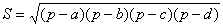

<b>§</b><b>2&nbsp;&nbsp; </b><b>圆与正多边形</b>

一、&nbsp;&nbsp;&nbsp; 一、&nbsp;&nbsp;&nbsp;&nbsp;&nbsp;&nbsp;&nbsp; 与圆有关的各量计算公式

<table class=MsoNormalTable border=1 cellspacing=0 cellpadding=0
 style='border-collapse:collapse;border:none'>
 <tr>
  <td width=277 valign=top style='width:207.65pt;border:solid windowtext 1.0pt;
  padding:0mm 5.4pt 0mm 5.4pt'>
  
[圆的切线与弦的夹角]

  

  

  
式中表示<i>AMB</i>弧所对应的圆心角∠<i>AOB</i>的角度（下同），<i>C</i>为<i>ANB</i>弧上的任意点.

  
&nbsp; [两割线及其夹角]

  

  

  
<i>AE</i><i>·BE= CE</i><i>·DE=ET2</i>

  </td>
  <td width=331 valign=top style='width:248.35pt;border:solid windowtext 1.0pt;
  border-left:none;padding:0mm 5.4pt 0mm 5.4pt'>
  
[两弦及其夹角]

  

  
&nbsp;

  
&nbsp;<i>AE</i><i>·BE= CE</i><i>·DE=r</i>2<i>-OE</i>2

  
&nbsp;式中<i>r</i>为圆的半径.

  
[两切线的夹角]

  

  
&nbsp;&nbsp;&nbsp;
  

  </td>
 </tr>
 <tr style='height:211.05pt'>
  <td width=608 colspan=2 valign=top style='width:456.0pt;border:solid windowtext 1.0pt;
  border-top:none;padding:0mm 5.4pt 0mm 5.4pt;height:211.05pt'>
  
&nbsp; [圆内接四边形面积<i>S</i>]

  
&nbsp;&nbsp;&nbsp; 

  
&nbsp;&nbsp;&nbsp;&nbsp;&nbsp;&nbsp;&nbsp;&nbsp;&nbsp;&nbsp;&nbsp;&nbsp;&nbsp;&nbsp;&nbsp;&nbsp;&nbsp;&nbsp;&nbsp;&nbsp;&nbsp;&nbsp;&nbsp;&nbsp;&nbsp;&nbsp;
  &nbsp;&nbsp;&nbsp;&nbsp;&nbsp;&nbsp;&nbsp;式中

  
&nbsp;&nbsp;
  <i>a,b,c,d</i>为四边

  </td>
 </tr>
</table>

&nbsp;

