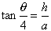
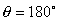
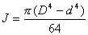
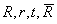
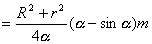

二、&nbsp;&nbsp;&nbsp;&nbsp;&nbsp;&nbsp;&nbsp;
二、&nbsp;&nbsp;&nbsp; 圆有关的各种图形的面积、几何重心与转动惯量计算公式

<table class=MsoNormalTable border=1 cellspacing=0 cellpadding=0
 style='border-collapse:collapse;border:none'>
 <tr>
  <td width=328 valign=top style='width:246.0pt;border:solid windowtext 1.0pt;
  padding:0mm 5.4pt 0mm 5.4pt'>
  
图形

  </td>
  <td width=280 valign=top style='width:210.0pt;border:solid windowtext 1.0pt;
  border-left:none;padding:0mm 5.4pt 0mm 5.4pt'>
  
面积、几何重心与转动惯量

  </td>
 </tr>
 <tr style='height:638.0pt'>
  <td width=328 valign=top style='width:246.0pt;border:solid windowtext 1.0pt;
  border-top:none;padding:0mm 5.4pt 0mm 5.4pt;height:638.0pt'>
  
[圆圈]

  

  
<i>O</i>为圆心,<i>r</i>为半径,<i>d</i>为直径

  
[圆形]

  
&nbsp;

  
<i>O</i>为圆心,<i>r</i>为半径,<i>d</i>为直径

  </td>
  <td width=280 valign=top style='width:210.0pt;border-top:none;border-left:
  none;border-bottom:solid windowtext 1.0pt;border-right:solid windowtext 1.0pt;
  padding:0mm 5.4pt 0mm 5.4pt;height:638.0pt'>
  
周长&nbsp;&nbsp; 

  
重心&nbsp;&nbsp; <i>G</i>与圆心<i>O</i>重合

  
转动惯量

  
(<i>a</i>)转轴通过圆心,且垂直于圆所在平面(图(<i>a</i>))

  
&nbsp;&nbsp;&nbsp;&nbsp;&nbsp;&nbsp;
  

  
(<i>b</i>)转轴与圆圈的直径重合(图(<i>b</i>))

  
&nbsp;&nbsp;&nbsp;&nbsp;&nbsp;&nbsp;
  

  
(<i>c</i>)转轴为圆圈的一条切线(图(<i>c</i> ))

  
&nbsp;&nbsp;&nbsp;&nbsp;&nbsp;&nbsp; 

  
面积&nbsp;&nbsp; 

  
重心&nbsp;&nbsp; <i>G</i>与圆心<i>O</i>重合

  
转动惯量

  
(<i>a</i>)转轴通过圆心,且垂直于圆所在平面(图(<i>a</i>))

  
&nbsp;&nbsp;&nbsp;&nbsp;&nbsp;&nbsp;
  

  
(<i>b</i>)转轴与圆的直径重合(图(<i>b</i>))

  
&nbsp;&nbsp;&nbsp;&nbsp;&nbsp;&nbsp;
  

  
(<i>c</i>)转轴为圆的某直径平行,其距离为<i>h</i>(图(<i>c</i> ))

  
&nbsp;&nbsp;&nbsp;&nbsp;&nbsp;&nbsp; 

  
&nbsp;&nbsp;&nbsp;&nbsp;&nbsp;&nbsp;&nbsp;&nbsp;
  

  </td>
 </tr>
</table>

&nbsp;

<table class=MsoNormalTable border=1 cellspacing=0 cellpadding=0
 style='border-collapse:collapse;border:none'>
 <tr>
  <td width=328 valign=top style='width:246.0pt;border:solid windowtext 1.0pt;
  padding:0mm 5.4pt 0mm 5.4pt'>
  
图形

  </td>
  <td width=280 valign=top style='width:210.0pt;border:solid windowtext 1.0pt;
  border-left:none;padding:0mm 5.4pt 0mm 5.4pt'>
  
面积、几何重心与转动惯量

  </td>
 </tr>
 <tr style='height:653.1pt'>
  <td width=328 valign=top style='width:246.0pt;border:solid windowtext 1.0pt;
  border-top:none;padding:0mm 5.4pt 0mm 5.4pt;height:653.1pt'>
  
[半圆形]

  

  
[扇形]

  

  
<i>r</i>为半径,<i>b</i>为弦长,为弧<i>s</i>所对应的圆心角的度数,为其弧度数,<i>O</i>为圆心

  </td>
  <td width=280 valign=top style='width:210.0pt;border-top:none;border-left:
  none;border-bottom:solid windowtext 1.0pt;border-right:solid windowtext 1.0pt;
  padding:0mm 5.4pt 0mm 5.4pt;height:653.1pt'>
  
面积&nbsp;&nbsp; 

  
重心&nbsp;&nbsp; 

  
转动惯量

  
<i>(a)&nbsp;&nbsp;&nbsp; </i><i>(a)</i>转轴与<i>GO</i>重合(图(<i>a</i>))

  
&nbsp;&nbsp;&nbsp;&nbsp;&nbsp;&nbsp;
  

  
<i>(b)&nbsp;&nbsp;&nbsp; </i><i>(b)</i>转轴通过<i>G</i>点,且平行于直径<i>AB</i>(图(<i>b</i>))

  
&nbsp;&nbsp;&nbsp;&nbsp;&nbsp;&nbsp;
  

  
&nbsp;&nbsp;&nbsp;&nbsp;&nbsp;&nbsp;&nbsp;
  

  
弧长&nbsp;&nbsp; 

  
面积&nbsp;&nbsp; 

  
重心&nbsp;&nbsp; 

  
&nbsp;&nbsp;&nbsp;&nbsp;&nbsp;&nbsp;&nbsp;&nbsp;&nbsp;
  

  
转动惯量

  
<i>(a)&nbsp;&nbsp;&nbsp; </i><i>(a)</i>转轴在图形平面上通过<i>G</i>点,且垂直于<i>GO</i>(图(<i>a</i>))

  
&nbsp; 

  

  
<i>(b)&nbsp;&nbsp;&nbsp; </i><i>(b)</i>转轴与<i>GO</i>重合(图(<i>b</i>))

  

  
&nbsp; 

  
&nbsp;(当时,即为四分之一圆形)

  </td>
 </tr>
</table>

&nbsp;

<table class=MsoNormalTable border=1 cellspacing=0 cellpadding=0
 style='border-collapse:collapse;border:none'>
 <tr>
  <td width=328 valign=top style='width:246.0pt;border:solid windowtext 1.0pt;
  padding:0mm 5.4pt 0mm 5.4pt'>
  
图形

  </td>
  <td width=280 valign=top style='width:210.0pt;border:solid windowtext 1.0pt;
  border-left:none;padding:0mm 5.4pt 0mm 5.4pt'>
  
面积、几何重心与转动惯量

  </td>
 </tr>
 <tr style='height:637.5pt'>
  <td width=328 valign=top style='width:246.0pt;border:solid windowtext 1.0pt;
  border-top:none;padding:0mm 5.4pt 0mm 5.4pt;height:637.5pt'>
  
[弓形]

  

  
<i>r</i>为半径,<i>b</i>为弦长(<i>b=2a</i>),<i>h</i>为拱高,为圆心角度数,为圆心角弧度数,<i>s</i>为弧长,<i>O</i>为圆心

  
[圆环]

  

  
<i>R</i>为外半径,<i>r</i>为内半径,<i>D</i>为外直径,<i>d</i>为内直径,<i>O</i>为圆心

  </td>
  <td width=280 valign=top style='width:210.0pt;border-top:none;border-left:
  none;border-bottom:solid windowtext 1.0pt;border-right:solid windowtext 1.0pt;
  padding:0mm 5.4pt 0mm 5.4pt;height:637.5pt'>
  
弦长&nbsp;&nbsp; 

  
&nbsp;&nbsp;&nbsp;
  &nbsp;&nbsp;&nbsp;

  
拱高&nbsp;&nbsp; 

  
面积&nbsp;&nbsp; 

  
&nbsp;&nbsp;&nbsp;&nbsp;&nbsp;&nbsp;&nbsp;&nbsp;
  

  
&nbsp;&nbsp;
  

  
重心&nbsp; 

  
(当时,弓形即为半圆形)

  
转动惯量

  
<i>(a)&nbsp;&nbsp; </i><i>(a)</i><i>&nbsp;&nbsp;
  </i>转轴与<i>GO</i>重合(图(<i>a</i>))

  
&nbsp; 

  
<i>(b)&nbsp;&nbsp; </i><i>(b)</i><i>&nbsp;&nbsp;
  </i>转轴通过重心<i>G</i>,且与弦平行(图(<i>b</i>))

  

  
面积&nbsp; 

  
&nbsp;&nbsp;&nbsp;&nbsp;&nbsp;&nbsp;&nbsp;
  

  
&nbsp;&nbsp;&nbsp;&nbsp;
  式中&nbsp; <i>t=R-r</i>为环宽,

  
&nbsp;&nbsp;&nbsp;&nbsp;&nbsp;&nbsp;&nbsp;&nbsp;&nbsp;&nbsp;
  为平均直径

  
重心&nbsp;&nbsp; <i>G</i>与圆心<i>O</i>重合

  
转动惯量

  
转轴在图形平面上,且通过<i>G</i>点

  
(图(<i>a</i>))

  
&nbsp;&nbsp;&nbsp;&nbsp; 

  
&nbsp;&nbsp;&nbsp;&nbsp;&nbsp;&nbsp; 

  </td>
 </tr>
</table>

&nbsp;

<table class=MsoNormalTable border=1 cellspacing=0 cellpadding=0
 style='border-collapse:collapse;border:none'>
 <tr style='height:27.0pt'>
  <td width=328 valign=top style='width:246.0pt;border:solid windowtext 1.0pt;
  padding:0mm 5.4pt 0mm 5.4pt;height:27.0pt'>
  
图形

  </td>
  <td width=288 colspan=9 valign=top style='width:216.0pt;border:solid windowtext 1.0pt;
  border-left:none;padding:0mm 5.4pt 0mm 5.4pt;height:27.0pt'>
  
面积、几何重心与转动惯量

  </td>
 </tr>
 <tr style='height:466.2pt'>
  <td width=328 rowspan=7 valign=top style='width:246.0pt;border:solid windowtext 1.0pt;
  border-top:none;padding:0mm 5.4pt 0mm 5.4pt;height:466.2pt'>
  
[部分圆环]

  

  
同前,为所对应的圆心角的度数,为其弧度数

  
[新月形]

  

  
<i>r</i>为半径,<i>d</i>为直径,<i>l</i>为圆心距,<i></i>,为新月形张开角度,为其弧度数

  </td>
  <td width=288 colspan=9 valign=top style='width:216.0pt;border:none;
  border-right:solid windowtext 1.0pt;padding:0mm 5.4pt 0mm 5.4pt;height:466.2pt'>
  
面积&nbsp;&nbsp; 

  
&nbsp;&nbsp;&nbsp;&nbsp;&nbsp;&nbsp;&nbsp;&nbsp;
  

  
重心&nbsp;&nbsp; 

  
&nbsp;&nbsp;&nbsp;&nbsp;&nbsp;&nbsp;&nbsp;&nbsp;&nbsp;
  

  
转动惯量&nbsp; 转轴与<i>GO</i>重合(图(<i>a</i>))

  
&nbsp;&nbsp;&nbsp;&nbsp;
  

  
&nbsp;&nbsp;&nbsp;&nbsp;&nbsp;&nbsp;
  

  
面积&nbsp;&nbsp; 

  
&nbsp;&nbsp;&nbsp;&nbsp;&nbsp;&nbsp;&nbsp;&nbsp;
  

  
&nbsp;&nbsp;&nbsp;&nbsp;&nbsp;&nbsp;&nbsp;&nbsp;
  

  
&nbsp;&nbsp;&nbsp;&nbsp;
  式中&nbsp; 

  
重心&nbsp;&nbsp; 

  
&nbsp;&nbsp;&nbsp;&nbsp;&nbsp;&nbsp;
  

  
&nbsp;

  </td>
 </tr>
 <tr style='height:21.8pt'>
  <td width=48 valign=top style='width:36.0pt;border:solid windowtext 1.0pt;
  border-left:none;padding:0mm 5.4pt 0mm 5.4pt;height:21.8pt'>
  

  </td>
  <td width=64 colspan=2 valign=top style='width:48.0pt;border-top:none;
  border-left:none;border-bottom:solid windowtext 1.0pt;border-right:solid windowtext 1.0pt;
  padding:0mm 5.4pt 0mm 5.4pt;height:21.8pt'>
  
0.1

  </td>
  <td width=56 colspan=2 valign=top style='width:42.0pt;border-top:none;
  border-left:none;border-bottom:solid windowtext 1.0pt;border-right:solid windowtext 1.0pt;
  padding:0mm 5.4pt 0mm 5.4pt;height:21.8pt'>
  
0.2

  </td>
  <td width=56 colspan=2 valign=top style='width:42.0pt;border-top:none;
  border-left:none;border-bottom:solid windowtext 1.0pt;border-right:solid windowtext 1.0pt;
  padding:0mm 5.4pt 0mm 5.4pt;height:21.8pt'>
  
0.3

  </td>
  <td width=64 colspan=2 valign=top style='width:48.0pt;border-top:none;
  border-left:none;border-bottom:solid windowtext 1.0pt;border-right:solid windowtext 1.0pt;
  padding:0mm 5.4pt 0mm 5.4pt;height:21.8pt'>
  
0.4

  </td>
 </tr>
 <tr style='height:23.25pt'>
  <td width=48 valign=top style='width:36.0pt;border-top:none;border-left:none;
  border-bottom:solid windowtext 1.0pt;border-right:solid windowtext 1.0pt;
  padding:0mm 5.4pt 0mm 5.4pt;height:23.25pt'>
  

  </td>
  <td width=64 colspan=2 valign=top style='width:48.0pt;border-top:none;
  border-left:none;border-bottom:solid windowtext 1.0pt;border-right:solid windowtext 1.0pt;
  padding:0mm 5.4pt 0mm 5.4pt;height:23.25pt'>
  
0.399

  </td>
  <td width=56 colspan=2 valign=top style='width:42.0pt;border-top:none;
  border-left:none;border-bottom:solid windowtext 1.0pt;border-right:solid windowtext 1.0pt;
  padding:0mm 5.4pt 0mm 5.4pt;height:23.25pt'>
  
0.795

  </td>
  <td width=56 colspan=2 valign=top style='width:42.0pt;border-top:none;
  border-left:none;border-bottom:solid windowtext 1.0pt;border-right:solid windowtext 1.0pt;
  padding:0mm 5.4pt 0mm 5.4pt;height:23.25pt'>
  
1.182

  </td>
  <td width=64 colspan=2 valign=top style='width:48.0pt;border-top:none;
  border-left:none;border-bottom:solid windowtext 1.0pt;border-right:solid windowtext 1.0pt;
  padding:0mm 5.4pt 0mm 5.4pt;height:23.25pt'>
  
1.556

  </td>
 </tr>
 <tr style='height:24.0pt'>
  <td width=288 colspan=9 valign=top style='width:216.0pt;border-top:none;
  border-left:none;border-bottom:solid windowtext 1.0pt;border-right:solid windowtext 1.0pt;
  padding:0mm 5.4pt 0mm 5.4pt;height:24.0pt'>
  
&nbsp;

  
&nbsp;

  </td>
 </tr>
 <tr style='height:20.25pt'>
  <td width=48 valign=top style='width:36.0pt;border-top:none;border-left:none;
  border-bottom:solid windowtext 1.0pt;border-right:solid windowtext 1.0pt;
  padding:0mm 5.4pt 0mm 5.4pt;height:20.25pt'>
  

  </td>
  <td width=48 valign=top style='width:36.0pt;border-top:none;border-left:none;
  border-bottom:solid windowtext 1.0pt;border-right:solid windowtext 1.0pt;
  padding:0mm 5.4pt 0mm 5.4pt;height:20.25pt'>
  
0.5

  </td>
  <td width=48 colspan=2 valign=top style='width:36.0pt;border-top:none;
  border-left:none;border-bottom:solid windowtext 1.0pt;border-right:solid windowtext 1.0pt;
  padding:0mm 5.4pt 0mm 5.4pt;height:20.25pt'>
  
0.6

  </td>
  <td width=48 colspan=2 valign=top style='width:36.0pt;border-top:none;
  border-left:none;border-bottom:solid windowtext 1.0pt;border-right:solid windowtext 1.0pt;
  padding:0mm 5.4pt 0mm 5.4pt;height:20.25pt'>
  
0.7

  </td>
  <td width=48 colspan=2 valign=top style='width:36.0pt;border-top:none;
  border-left:none;border-bottom:solid windowtext 1.0pt;border-right:solid windowtext 1.0pt;
  padding:0mm 5.4pt 0mm 5.4pt;height:20.25pt'>
  
0.8

  </td>
  <td width=48 valign=top style='width:36.0pt;border-top:none;border-left:none;
  border-bottom:solid windowtext 1.0pt;border-right:solid windowtext 1.0pt;
  padding:0mm 5.4pt 0mm 5.4pt;height:20.25pt'>
  
0.9

  </td>
 </tr>
 <tr style='height:22.45pt'>
  <td width=48 valign=top style='width:36.0pt;border-top:none;border-left:none;
  border-bottom:solid windowtext 1.0pt;border-right:solid windowtext 1.0pt;
  padding:0mm 5.4pt 0mm 5.4pt;height:22.45pt'>
  

  </td>
  <td width=48 valign=top style='width:36.0pt;border-top:none;border-left:none;
  border-bottom:solid windowtext 1.0pt;border-right:solid windowtext 1.0pt;
  padding:0mm 5.4pt 0mm 5.4pt;height:22.45pt'>
  
1.913

  </td>
  <td width=48 colspan=2 valign=top style='width:36.0pt;border-top:none;
  border-left:none;border-bottom:solid windowtext 1.0pt;border-right:solid windowtext 1.0pt;
  padding:0mm 5.4pt 0mm 5.4pt;height:22.45pt'>
  
2.247

  </td>
  <td width=48 colspan=2 valign=top style='width:36.0pt;border-top:none;
  border-left:none;border-bottom:solid windowtext 1.0pt;border-right:solid windowtext 1.0pt;
  padding:0mm 5.4pt 0mm 5.4pt;height:22.45pt'>
  
2.551

  </td>
  <td width=48 colspan=2 valign=top style='width:36.0pt;border-top:none;
  border-left:none;border-bottom:solid windowtext 1.0pt;border-right:solid windowtext 1.0pt;
  padding:0mm 5.4pt 0mm 5.4pt;height:22.45pt'>
  
2.815

  </td>
  <td width=48 valign=top style='width:36.0pt;border-top:none;border-left:none;
  border-bottom:solid windowtext 1.0pt;border-right:solid windowtext 1.0pt;
  padding:0mm 5.4pt 0mm 5.4pt;height:22.45pt'>
  
3.024

  </td>
 </tr>
 <tr style='height:32.25pt'>
  <td width=288 colspan=9 valign=top style='width:216.0pt;border-top:none;
  border-left:none;border-bottom:solid windowtext 1.0pt;border-right:solid windowtext 1.0pt;
  padding:0mm 5.4pt 0mm 5.4pt;height:32.25pt'>
  
&nbsp; 

  </td>
 </tr>
 <tr>
  <td width=328 style='width:246.0pt;border:none;padding:0mm 5.4pt 0mm 5.4pt'>
  
&nbsp;

  </td>
  <td width=48 style='width:36.0pt;border:none;padding:0mm 5.4pt 0mm 5.4pt'>
  
&nbsp;

  </td>
  <td width=48 style='width:36.0pt;border:none;padding:0mm 5.4pt 0mm 5.4pt'>
  
&nbsp;

  </td>
  <td width=16 style='width:12.0pt;border:none;padding:0mm 5.4pt 0mm 5.4pt'>
  
&nbsp;

  </td>
  <td width=32 style='width:24.0pt;border:none;padding:0mm 5.4pt 0mm 5.4pt'>
  
&nbsp;

  </td>
  <td width=24 style='width:18.0pt;border:none;padding:0mm 5.4pt 0mm 5.4pt'>
  
&nbsp;

  </td>
  <td width=24 style='width:18.0pt;border:none;padding:0mm 5.4pt 0mm 5.4pt'>
  
&nbsp;

  </td>
  <td width=32 style='width:24.0pt;border:none;padding:0mm 5.4pt 0mm 5.4pt'>
  
&nbsp;

  </td>
  <td width=16 style='width:12.0pt;border:none;padding:0mm 5.4pt 0mm 5.4pt'>
  
&nbsp;

  </td>
  <td width=48 style='width:36.0pt;border:none;padding:0mm 5.4pt 0mm 5.4pt'>
  
&nbsp;

  </td>
 </tr>
</table>

&nbsp;

