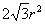
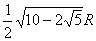

三、正多边形各量换算公式与比例系数表

&nbsp;

<i>n</i>为边数&nbsp;&nbsp;&nbsp;&nbsp;&nbsp;&nbsp;&nbsp;&nbsp;&nbsp;&nbsp;&nbsp;&nbsp;&nbsp;&nbsp;&nbsp;&nbsp;&nbsp;&nbsp;&nbsp;
<i>R</i>为外接圆半径

<i>a</i>为边长&nbsp;&nbsp;&nbsp;&nbsp;&nbsp;&nbsp;&nbsp;&nbsp;&nbsp;&nbsp;&nbsp;&nbsp;&nbsp;&nbsp;&nbsp;&nbsp;&nbsp;&nbsp;
<i>&nbsp;r</i>为内切圆半径

为圆心角&nbsp;&nbsp;&nbsp;&nbsp;&nbsp;&nbsp;
<i>S</i>为多边形面积

重心<i>G</i>与外接圆心<i>O</i>重合

正多边形各量换算公式表

<table class=MsoNormalTable border=1 cellspacing=0 cellpadding=0
 style='border-collapse:collapse;border:none'>
 <tr>
  <td width=64 valign=top style='width:48.0pt;border-top:solid windowtext 1.0pt;
  border-left:solid windowtext 1.0pt;border-bottom:none;border-right:none;
  padding:0mm 5.4pt 0mm 5.4pt'>
  
各量

  </td>
  <td width=109 valign=top style='width:81.6pt;border:none;border-top:solid windowtext 1.0pt;
  padding:0mm 5.4pt 0mm 5.4pt'>
  
正三角形

  </td>
  <td width=109 valign=top style='width:81.6pt;border:none;border-top:solid windowtext 1.0pt;
  padding:0mm 5.4pt 0mm 5.4pt'>
  
正方形

  </td>
  <td width=109 valign=top style='width:81.6pt;border:none;border-top:solid windowtext 1.0pt;
  padding:0mm 5.4pt 0mm 5.4pt'>
  
正五边形

  </td>
  <td width=109 valign=top style='width:81.6pt;border:none;border-top:solid windowtext 1.0pt;
  padding:0mm 5.4pt 0mm 5.4pt'>
  
正六边形

  </td>
  <td width=109 valign=top style='width:81.6pt;border-top:solid windowtext 1.0pt;
  border-left:none;border-bottom:none;border-right:solid windowtext 1.0pt;
  padding:0mm 5.4pt 0mm 5.4pt'>
  
正<i>n</i>边形

  </td>
 </tr>
 <tr style='height:69.75pt'>
  <td width=64 valign=top style='width:48.0pt;border:none;border-left:solid windowtext 1.0pt;
  padding:0mm 5.4pt 0mm 5.4pt;height:69.75pt'>
  
图

  
形

  </td>
  <td width=109 valign=top style='width:81.6pt;border:none;padding:0mm 5.4pt 0mm 5.4pt;
  height:69.75pt'>
  

  </td>
  <td width=109 valign=top style='width:81.6pt;border:none;padding:0mm 5.4pt 0mm 5.4pt;
  height:69.75pt'>
  

  </td>
  <td width=109 valign=top style='width:81.6pt;border:none;padding:0mm 5.4pt 0mm 5.4pt;
  height:69.75pt'>
  

  </td>
  <td width=109 valign=top style='width:81.6pt;border:none;padding:0mm 5.4pt 0mm 5.4pt;
  height:69.75pt'>
  

  </td>
  <td width=109 valign=top style='width:81.6pt;border:none;border-right:solid windowtext 1.0pt;
  padding:0mm 5.4pt 0mm 5.4pt;height:69.75pt'>
  

  </td>
 </tr>
 <tr style='height:129.75pt'>
  <td width=64 valign=top style='width:48.0pt;border:none;border-left:solid windowtext 1.0pt;
  padding:0mm 5.4pt 0mm 5.4pt;height:129.75pt'>
  <h1>S</h1>
  </td>
  <td width=109 valign=top style='width:81.6pt;border:none;padding:0mm 5.4pt 0mm 5.4pt;
  height:129.75pt'>
  

  

  

  </td>
  <td width=109 valign=top style='width:81.6pt;border:none;padding:0mm 5.4pt 0mm 5.4pt;
  height:129.75pt'>
  

  

  

  

  </td>
  <td width=109 valign=top style='width:81.6pt;border:none;padding:0mm 5.4pt 0mm 5.4pt;
  height:129.75pt'>
  

  </td>
  <td width=109 valign=top style='width:81.6pt;border:none;padding:0mm 5.4pt 0mm 5.4pt;
  height:129.75pt'>
  

  

  

  </td>
  <td width=109 valign=top style='width:81.6pt;border-top:none;border-left:
  none;border-bottom:solid windowtext 1.0pt;border-right:solid windowtext 1.0pt;
  padding:0mm 5.4pt 0mm 5.4pt;height:129.75pt'>
  

  

  

  

  </td>
 </tr>
 <tr style='height:45.0pt'>
  <td width=64 valign=top style='width:48.0pt;border:none;border-left:solid windowtext 1.0pt;
  padding:0mm 5.4pt 0mm 5.4pt;height:45.0pt'>
  
<i>a</i>

  </td>
  <td width=109 valign=top style='width:81.6pt;border:none;padding:0mm 5.4pt 0mm 5.4pt;
  height:45.0pt'>
  

  </td>
  <td width=109 valign=top style='width:81.6pt;border:none;padding:0mm 5.4pt 0mm 5.4pt;
  height:45.0pt'>
  

  </td>
  <td width=109 valign=top style='width:81.6pt;border:none;padding:0mm 5.4pt 0mm 5.4pt;
  height:45.0pt'>
  

  </td>
  <td width=109 valign=top style='width:81.6pt;border:none;padding:0mm 5.4pt 0mm 5.4pt;
  height:45.0pt'>
  <h1>R</h1>
  </td>
  <td width=109 valign=top style='width:81.6pt;border:none;border-right:solid windowtext 1.0pt;
  padding:0mm 5.4pt 0mm 5.4pt;height:45.0pt'>
  

  </td>
 </tr>
 <tr style='height:69.0pt'>
  <td width=64 valign=top style='width:48.0pt;border:none;border-left:solid windowtext 1.0pt;
  padding:0mm 5.4pt 0mm 5.4pt;height:69.0pt'>
  <h1>R</h1>
  </td>
  <td width=109 valign=top style='width:81.6pt;border:none;padding:0mm 5.4pt 0mm 5.4pt;
  height:69.0pt'>
  

  </td>
  <td width=109 valign=top style='width:81.6pt;border:none;padding:0mm 5.4pt 0mm 5.4pt;
  height:69.0pt'>
  

  </td>
  <td width=109 valign=top style='width:81.6pt;border:none;padding:0mm 5.4pt 0mm 5.4pt;
  height:69.0pt'>
  

  </td>
  <td width=109 valign=top style='width:81.6pt;border:none;padding:0mm 5.4pt 0mm 5.4pt;
  height:69.0pt'>
  
<i>a</i>

  </td>
  <td width=109 valign=top style='width:81.6pt;border:none;border-right:solid windowtext 1.0pt;
  padding:0mm 5.4pt 0mm 5.4pt;height:69.0pt'>
  

  </td>
 </tr>
 <tr style='height:47.8pt'>
  <td width=64 valign=top style='width:48.0pt;border-top:none;border-left:solid windowtext 1.0pt;
  border-bottom:solid windowtext 1.0pt;border-right:none;padding:0mm 5.4pt 0mm 5.4pt;
  height:47.8pt'>
  
<i>r</i>

  </td>
  <td width=109 valign=top style='width:81.6pt;border:none;border-bottom:solid windowtext 1.0pt;
  padding:0mm 5.4pt 0mm 5.4pt;height:47.8pt'>
  

  </td>
  <td width=109 valign=top style='width:81.6pt;border:none;border-bottom:solid windowtext 1.0pt;
  padding:0mm 5.4pt 0mm 5.4pt;height:47.8pt'>
  

  </td>
  <td width=109 valign=top style='width:81.6pt;border:none;border-bottom:solid windowtext 1.0pt;
  padding:0mm 5.4pt 0mm 5.4pt;height:47.8pt'>
  

  </td>
  <td width=109 valign=top style='width:81.6pt;border:none;border-bottom:solid windowtext 1.0pt;
  padding:0mm 5.4pt 0mm 5.4pt;height:47.8pt'>
  

  </td>
  <td width=109 valign=top style='width:81.6pt;border-top:none;border-left:
  none;border-bottom:solid windowtext 1.0pt;border-right:solid windowtext 1.0pt;
  padding:0mm 5.4pt 0mm 5.4pt;height:47.8pt'>
  

  </td>
 </tr>
</table>

正多边形各量比例系数表

<table class=MsoNormalTable border=1 cellspacing=0 cellpadding=0
 style='border-collapse:collapse;border:none'>
 <tr>
  <td width=74 valign=top style='width:55.45pt;border:solid windowtext 1.0pt;
  padding:0mm 5.4pt 0mm 5.4pt'>
  
<i>n</i>

  </td>
  <td width=89 valign=top style='width:66.75pt;border:solid windowtext 1.0pt;
  border-left:none;padding:0mm 5.4pt 0mm 5.4pt'>
  

  </td>
  <td width=89 valign=top style='width:66.75pt;border:solid windowtext 1.0pt;
  border-left:none;padding:0mm 5.4pt 0mm 5.4pt'>
  

  </td>
  <td width=89 valign=top style='width:66.75pt;border:solid windowtext 1.0pt;
  border-left:none;padding:0mm 5.4pt 0mm 5.4pt'>
  

  </td>
  <td width=89 valign=top style='width:66.75pt;border:solid windowtext 1.0pt;
  border-left:none;padding:0mm 5.4pt 0mm 5.4pt'>
  
<i>a/R</i>

  </td>
  <td width=89 valign=top style='width:66.75pt;border:solid windowtext 1.0pt;
  border-left:none;padding:0mm 5.4pt 0mm 5.4pt'>
  <h1>R/a</h1>
  </td>
  <td width=89 valign=top style='width:66.8pt;border:solid windowtext 1.0pt;
  border-left:none;padding:0mm 5.4pt 0mm 5.4pt'>
  
<i>r/a</i>

  </td>
 </tr>
 <tr style='height:249.5pt'>
  <td width=74 valign=top style='width:55.45pt;border-top:none;border-left:
  solid windowtext 1.0pt;border-bottom:none;border-right:solid windowtext 1.0pt;
  padding:0mm 5.4pt 0mm 5.4pt;height:249.5pt'>
  
3

  
4

  
5

  
6

  
7

  
8

  
9

  
10

  
12

  
15

  
16

  
20

  
24

  
32

  
48

  
64

  </td>
  <td width=89 valign=top style='width:66.75pt;border:none;border-right:solid windowtext 1.0pt;
  padding:0mm 5.4pt 0mm 5.4pt;height:249.5pt'>
  
0.4330

  
1.0000

  
1.7205

  
2.5981

  
3.6339

  
4.8284

  
6.1818

  
7.6942

  
11.196

  
17.642

  
20.109

  
31.569

  
45.575

  
81.225

  
183.08

  
325.69

  </td>
  <td width=89 valign=top style='width:66.75pt;border:none;border-right:solid windowtext 1.0pt;
  padding:0mm 5.4pt 0mm 5.4pt;height:249.5pt'>
  
1.2990

  
2.0000

  
2.3776

  
2.5981

  
2.7364

  
2.8284

  
2.8925

  
2.9389

  
3.0000

  
3.0505

  
3.0615

  
3.0902

  
3.1058

  
3.1214

  
3.1326

  
3.1366

  </td>
  <td width=89 valign=top style='width:66.75pt;border:none;border-right:solid windowtext 1.0pt;
  padding:0mm 5.4pt 0mm 5.4pt;height:249.5pt'>
  
5.1962

  
4.0000

  
3.6327

  
3.4641

  
3.3710

  
3.3137

  
3.2757

  
3.2492

  
3.2154

  
3.1883

  
3.1826

  
3.1677

  
3.1597

  
3.1517

  
3.1461

  
3.1441

  </td>
  <td width=89 valign=top style='width:66.75pt;border:none;border-right:solid windowtext 1.0pt;
  padding:0mm 5.4pt 0mm 5.4pt;height:249.5pt'>
  
1.7321

  
1.4142

  
1.1756

  
1.0000

  
0.8678

  
0.7654

  
0.6840

  
0.6180

  
0.5176

  
0.4158

  
0.3902

  
0.3129

  
0.2611

  
0.1960

  
0.1308

  
0.0981

  </td>
  <td width=89 valign=top style='width:66.75pt;border:none;border-right:solid windowtext 1.0pt;
  padding:0mm 5.4pt 0mm 5.4pt;height:249.5pt'>
  
0.5774

  
0.7071

  
0.8507

  
1.0000

  
1.1524

  
1.3066

  
1.4619

  
1.6180

  
1.9319

  
2.4049

  
2.5629

  
3.1962

  
3.8306

  
5.1012

  
7.6449

  
10.190

  </td>
  <td width=89 valign=top style='width:66.8pt;border-top:none;border-left:none;
  border-bottom:solid windowtext 1.0pt;border-right:solid windowtext 1.0pt;
  padding:0mm 5.4pt 0mm 5.4pt;height:249.5pt'>
  
0.2887

  
0.5000

  
0.6882

  
0.8660

  
1.0383

  
1.2071

  
1.3737

  
1.5388

  
1.8660

  
2.5323

  
2.5137

  
3.1569

  
3.7979

  
5.0766

  
7.6285

  
10.178

  </td>
 </tr>
</table>

&nbsp;

