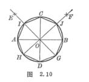

<b>§</b><b>3</b><b>&nbsp;&nbsp; </b><b>实用几何作图</b>

一、&nbsp;&nbsp;&nbsp; 一、&nbsp;&nbsp;&nbsp;&nbsp;&nbsp;&nbsp;&nbsp; 

二、&nbsp;&nbsp;&nbsp; &nbsp;

三、&nbsp;&nbsp;&nbsp; 正多边形作图

[已知边长作正三角形] 已知<i>AB</i>等于边长.分别以<i>A,B</i>为圆心，<i>AB</i>为半径画弧交于<i>C</i>,连接<i>AC</i><i>，BC</i>，即为所求正三角形（图2.3）.

&nbsp;

&nbsp;

[已知边长作正方形]&nbsp; 已知<i>AB</i>等于边长.以<i>AB</i>外任一点<i>O</i>为圆心，<i>OA</i>为半径画圆交<i>AB</i>于<i>E</i>.连接<i>EO</i>并延长交圆于<i>F</i>,连接<i>AF</i>并延长截取<i>AD=AB</i>.分别以<i>B</i><i>，D</i>为圆心，<i>AB</i>为半径画弧交于<i>C</i>，连接<i>BC</i><i>，DC</i>，□<i>ABCD</i>即为所求正方形(图2.4).

[已知外接圆作正五边形] 过圆心<i>O</i>作互相垂直的直径<i>AB</i><i>，CD</i>，平分<i>OB</i>于<i>E</i>，以<i>E</i>为圆心，<i>EC</i>为半径画弧交<i>OA</i>于<i>F</i>，以<i>CF</i>为半径在圆周上顺次截段并连接各点，即为所求正五边形(图2.5).也可参考正十边形作法(见图2.11中的虚线).

[已知边长作正五边形]&nbsp; 已知<i>AB</i>等于边长.以<i>A</i><i>，B</i>为圆心，<i>AB</i>为半径画两圆交于<i>C</i><i>，D</i>，连接<i>CD</i>.以<i>D</i>为圆心，<i>AB</i>为半径画圆，交<i>CD</i>于<i>E</i>，交<i>A</i>圆于<i>F</i>，交<i>B</i>圆于<i>G</i>，连接<i>FE</i><i>，GE</i>，并延长交<i>B</i>，<i>A</i>圆于<i>H</i><i>，I</i>.分别以<i>H</i><i>，I</i>为圆心，<i>AB</i>为半径画弧交于<i>J</i>，连接<i>JI</i><i>，IA</i><i>，BH</i><i>，HJ</i>，连同<i>AB</i>即为所求正五边形(图2.6).

&nbsp;

[已知外接圆作正六边形]&nbsp; 以外接圆半径在其圆周上顺次截段，并连接各点，即为所求正六边形(图2.7).

&nbsp;

[已知边长作正六边形]&nbsp; 已知<i>AB</i>等于边长，分别以<i>A</i><i>，B</i>为圆心，<i>AB</i>为半径画弧交于<i>O</i>，以<i>O</i>为圆心，<i>AB</i>为半径画圆.再按上法可作出所求正六边形(图2.8).

&nbsp;

[已知外接圆作正七边形(近似作法)]&nbsp; 以圆周上任一点<i>A</i>为圆心，以同圆半径为半径画弧交圆周于<i>B</i><i>，C</i>，连接<i>BC</i><i>，AO</i>，交于<i>D</i>.以<i>BD</i>为半径(作图时应略大于<i>BD</i>)在圆周上顺次截段，并连接各点，即为所求正七边形(图2.9).

[已知外接圆作正八边形]&nbsp; 过圆心<i>O</i>作互相垂直的直径<i>AB</i><i>，CD</i>.分别以<i>A</i><i>，B</i><i>，D</i>为圆心，任意长为半径画弧交于<i>E</i><i>，F</i>，连接<i>EO</i><i>，FO</i>，并延长交圆于<i>G</i><i>，H</i><i>，I</i><i>，J</i>，顺次连接八点，即为所求正八边形(图2.10).

[已知外接圆作正十边形]&nbsp; 过圆心<i>O</i>作互相垂直的直径<i>AB</i><i>，CD</i>，以<i>OB</i>为直径画圆<i>E</i>，连接<i>EC</i>交<i>E</i>圆于<i>F</i>.以<i>CF</i>为半径在圆周上顺次截段，并连接各点，即为所求正十边形(图2.11).

[已知外接圆作任意正多边形(近似作法)]&nbsp; 将直径<i>AB n</i>等分(<i>n</i>为边数),以<i>A</i><i>，B</i>为圆心，<i>AB</i>为半径画弧交于<i>C</i>，连接<i>C</i>与第二个分点<i>E</i>，并延长交圆于<i>D</i>，以<i>AD</i>为半径在圆周上顺次截段，并连接各点，即为所求正<i>n</i>边形(图2.12中为正九边形).

