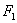

二、椭圆作图

&nbsp;

已知长短轴(2<i>a,</i>2<i>b</i>)作椭圆，其方法如下：

[轨迹法]&nbsp; 作长轴<i>AB</i>=2<i>a</i>，短轴<i>CD</i>=2<i>b</i>,相互垂直平分交于<i>O</i>，以<i>D</i>为圆心，<i>a</i>为半径画弧交<i>AB</i>于.在两点钉上钉子，把一长度为2<i>a</i>的线的两端固定在钉子上，再用铅笔拉紧线，移动铅笔所画出的曲线即为椭圆(图2.13).

[焦点法]&nbsp; 同轨迹法一样，先画出点，将<i>AB</i>8等分，中间各点为.分别以为圆心，为半径画弧，以为圆心，为半径画弧，两两相交于和.再将这些交点连同<i>A</i><i>，B</i>一起用光滑曲线顺次连接，即近似于所求椭圆(图2.14).

[压缩法]&nbsp; 用长短轴为直径画出两个同心圆，并将圆周12等分(小圆分点1～12，大圆分点对应为).连接和1－11,2－10,4－8,5－7,并延长，将与1－11,5－7;与2－10,4－8;与1－11,5－7;与2－10,4－8的交点(共8个)，连同四个顶点一起，用光滑曲线顺次连接，即近似于所求椭圆(图2.15).

[圆弧法]&nbsp; 作长轴<i>AB=</i>2<i>a</i>,短轴<i>CD=</i>2<i>b</i>，相互垂直平分交于<i>O</i>，作<i>OE=OA</i>，以C为圆心，<i>CE</i>为半径画弧交<i>AC</i>于<i>F</i>，作<i>AF</i>的垂直平分线交<i>AB</i>于<i>G</i>，交<i>CD</i>延长线于<i>I</i>.作<i>OH=OG</i><i>，OJ=OI</i>.分别以<i>I</i><i>，J</i>为圆心，<i>IC</i>为半径画弧，又分别以<i>G</i><i>，H</i>为圆心，<i>GA</i>为半径画弧，则四段弧相连即近似于所求椭圆(图2.16).

