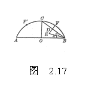
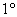
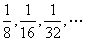
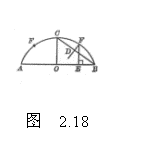
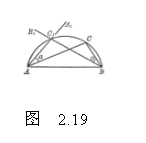
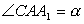
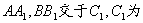

三、&nbsp;&nbsp;&nbsp;&nbsp;&nbsp;&nbsp;&nbsp;
三、&nbsp;&nbsp;&nbsp; 弧放样法

在土木建筑工程中，由于受各种施工条件的限制，不能用圆规一转就画出圆弧，可采用下面方法在施工现场直接放大样.这种方法可在有限平面内放出任意大半径的圆弧实样，又便于工人同志掌握.

[已知弦长和拱高作圆弧]

方法

作<i>AB</i>等于弦长，作<i>CO</i>垂直平分<i>AB</i>，并使<i>CO</i>等于拱高，连接<i>BC</i>，作<i>BC</i>的中垂线<i>DE</i>.作的平分线交<i>DE</i>于<i>E</i>，在<i>ED</i>延长线上取<i>DF=DE</i>，则<i>F</i>为的分点.由对称性，<i>F</i>的对称点也是的分点.重复上述步骤，可得的各分点，将各分点以光滑曲线顺次连接，即为所求圆弧(图2.17).此方法概念明确，步骤较少，占地最少.

方法

作<i>AB</i>等于弦长，作<i>CO</i>垂直平分<i>AB</i>，并使<i>CO</i>等于拱高.作<i>BC</i>的中垂线<i>DF</i>，截<i>OE=CD</i>.过<i>E</i>作<i>AB</i>的垂线交<i>DF</i>于<i>F</i>，则<i>F</i>为的分点.由对称性，<i>F</i>的对称点也是的分点.重复上述步骤，可得的各分点，将各分点以光滑曲线顺次连接，即为所求圆弧(图2.18).此方法步骤最少.

[已知弦长和圆弧上任一点作圆弧]&nbsp; 已知<i>AB</i>为弦长，<i>C</i>为已知圆弧上一点.以<i>BC</i>为边作角.再以<i>AC</i>为边按相同方向作角.上的点.当取<i>a</i>为一系列值时，便得到圆弧上一系列点，将各点以光滑曲线顺次连接，即为所求圆弧(图2.19).此方法最适于采用经纬仪、罗盘仪来测放半径很大的圆弧.

