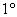
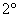
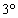

<h3>四、几何作图问题</h3>

&nbsp;

所谓初等几何作图问题，是指使用无刻度的直尺和圆规来作图.若使用尺规有限次能作出几何图形，则称为作图可能，或者说欧几里得作图法是可能的，否则称为作图不可能.

很多平面图形可以用直尺和圆规作出，例如上面列举的正五边形、正六边形、正八边形、正十边形等.而另一些就不能作出，例如正七边形、正九边形、正十一边形等，这些多边形只能用近似作图法.如何判断哪些作图可能，哪些作图不可能呢？直到百余年前，用代数的方法彻底地解决了这个问题，即给出一个关于尺规作图可能性的准则：作图可能的充分必要条件是，这个作图问题中必需求出的未知量能够由若干已知量经过有限次有理运算及开平方运算而算出.几千年来许多数学家耗费了不少的精力，企图解决所谓“几何三大问题”：

　 立方倍积问题，即作一个立方体，使它的体积二倍于一已知立方体的体积.

　 三等分角问题，即三等分一已知角.

　 化圆为方问题，即作一正方形，使它的面积等于一已知圆的面积.

后来已严格证明了这三个问题不能用尺规作图.

　

　

