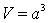
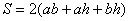
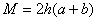
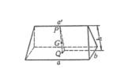
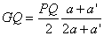
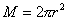
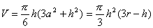
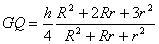

<b>§</b><b>4</b><b>&nbsp;&nbsp; </b><b>立体图形的体积、表面积、侧面积</b>

<b>几何重心与转动惯量计算公式</b>

一、&nbsp;&nbsp;&nbsp; 一、&nbsp;&nbsp;&nbsp;&nbsp;&nbsp;&nbsp;&nbsp; 立体图形的体积、表面积、侧面积、几何重心与转动惯量计算公式

<table class=MsoNormalTable border=1 cellspacing=0 cellpadding=0
 style='border-collapse:collapse;border:none'>
 <tr>
  <td width=328 valign=top style='width:246.0pt;border:solid windowtext 1.0pt;
  padding:0mm 5.4pt 0mm 5.4pt'>
  
图形

  </td>
  <td width=272 valign=top style='width:204.0pt;border:solid windowtext 1.0pt;
  border-left:none;padding:0mm 5.4pt 0mm 5.4pt'>
  
体积<i>V</i>、表面积<i>S</i>、侧面积<i>M</i>、几何重心<i>G</i>与转动惯量<i>*J</i>

  </td>
 </tr>
 <tr>
  <td width=328 valign=top style='width:246.0pt;border:solid windowtext 1.0pt;
  border-top:none;padding:0mm 5.4pt 0mm 5.4pt'>
  
[正方体]

  
&nbsp;

  
<i>a</i>为棱长，<i>d</i>为对角线

  
[长方体]

  

  
<i>a,b,h</i>分别为长,宽,高,<i>d</i>为对角线

  </td>
  <td width=272 valign=top style='width:204.0pt;border-top:none;border-left:
  none;border-bottom:solid windowtext 1.0pt;border-right:solid windowtext 1.0pt;
  padding:0mm 5.4pt 0mm 5.4pt'>
  
体&nbsp; 积 

  
表面积 

  
侧面积 

  
对角线 

  
重&nbsp; 心 <i>G</i>在对角线交点上

  
体&nbsp; 积 

  
表面积 

  
侧面积 

  
对角线 

  
重&nbsp; 心 <i>G</i>在对角线交点上

  
转动惯量

  
取长方体中心为坐标原点,坐标

  
轴分别平行三个棱边

  
&nbsp;

  
&nbsp;

  
&nbsp;

  
&nbsp;&nbsp;

  
(当时,即为正方体的情况)

  </td>
 </tr>
</table>

表中<i>m</i>为物体的质量，物体都为匀质.一般物体的转动惯量计算公式见第六章，§3，五.

<table class=MsoNormalTable border=1 cellspacing=0 cellpadding=0
 style='border-collapse:collapse;border:none'>
 <tr>
  <td width=328 valign=top style='width:246.0pt;border:solid windowtext 1.0pt;
  padding:0mm 5.4pt 0mm 5.4pt'>
  
图形

  </td>
  <td width=280 valign=top style='width:210.0pt;border:solid windowtext 1.0pt;
  border-left:none;padding:0mm 5.4pt 0mm 5.4pt'>
  
体积<i>V</i>、表面积<i>S</i>、侧面积<i>M</i>、几何重心<i>G</i>与转动惯量<i>J</i>

  </td>
 </tr>
 <tr>
  <td width=328 valign=top style='width:246.0pt;border:solid windowtext 1.0pt;
  border-top:none;padding:0mm 5.4pt 0mm 5.4pt'>
  
[三棱柱]

  

  
<i>a,b,c</i>为边长,<i>h</i>为高

  
[正六棱柱]

  

  
<i>a</i>为底边长,<i>h</i>为高,<i>d</i>为对角线

  
[正棱锥]

  

  
<i>n</i>为棱数,<i>a</i>为底边长,<i>h</i>为高,<i>g</i>为斜高

  </td>
  <td width=280 valign=top style='width:210.0pt;border-top:none;border-left:
  none;border-bottom:solid windowtext 1.0pt;border-right:solid windowtext 1.0pt;
  padding:0mm 5.4pt 0mm 5.4pt'>
  
体&nbsp; 积 

  
表面积 

  
侧面积 

  
&nbsp;&nbsp;&nbsp;
  式中<i>F</i>为底面积

  
重&nbsp; 心 

  
&nbsp;&nbsp;&nbsp;
  (<i>P</i><i>、Q</i>分别为上下底重心)

  
转动惯量

  
&nbsp; 对于正三棱柱(<i>a=b=c</i>)取<i>G</i>为坐标原点,<i>z</i>轴与棱平行

  
&nbsp;&nbsp;&nbsp;&nbsp;&nbsp;
  

  
体&nbsp; 积 

  
表面积 

  

  
侧面积 

  
对角线 

  
重&nbsp; 心 

  
&nbsp;&nbsp;&nbsp;
  (<i>P</i><i>、Q</i>分别为上下底重心)

  
转动惯量

  
&nbsp; 取<i>G</i>为坐标原点,<i>z</i>轴与棱平行

  
&nbsp;&nbsp;&nbsp;&nbsp;&nbsp;
  

  
体&nbsp; 积 

  
表面积 

  
侧面积 

  
&nbsp; 式中<i>F</i>为底面积,为一侧三角形面积

  
重&nbsp; 心 &nbsp;&nbsp;&nbsp;(<i>Q</i>为底面的重心)

  </td>
 </tr>
</table>

&nbsp;

<table class=MsoNormalTable border=1 cellspacing=0 cellpadding=0
 style='border-collapse:collapse;border:none'>
 <tr>
  <td width=328 valign=top style='width:246.0pt;border:solid windowtext 1.0pt;
  padding:0mm 5.4pt 0mm 5.4pt'>
  
图形

  </td>
  <td width=280 valign=top style='width:210.0pt;border:solid windowtext 1.0pt;
  border-left:none;padding:0mm 5.4pt 0mm 5.4pt'>
  
体积<i>V</i>、表面积<i>S</i>、侧面积<i>M</i>、几何重心<i>G</i>与转动惯量<i>J</i>

  </td>
 </tr>
 <tr>
  <td width=328 valign=top style='width:246.0pt;border:solid windowtext 1.0pt;
  border-top:none;padding:0mm 5.4pt 0mm 5.4pt'>
  
[四面体]

  

  
<i>a,b,c,p,q,r</i>为棱长

  
[棱台]

  

  
<i>h</i>为高

  
[正棱台]

  

  
<i>a’,a</i>分别为上下底边长,<i>n</i>为棱数,<i>h</i>为高,<i>g</i>为斜高

  </td>
  <td width=280 valign=top style='width:210.0pt;border-top:none;border-left:
  none;border-bottom:solid windowtext 1.0pt;border-right:solid windowtext 1.0pt;
  padding:0mm 5.4pt 0mm 5.4pt'>
  
体积

  

  
重心&nbsp;&nbsp; 

  
&nbsp;&nbsp;&nbsp;
  &nbsp;&nbsp;&nbsp;(<i>P</i>为顶点,<i>Q</i>为底面的重心)

  
体积&nbsp; 

  
式中分别为上下底面积

  
重心&nbsp; 

  
&nbsp;&nbsp;&nbsp;
  (<i>P,Q</i>分别为上下底重心)

  
体&nbsp; 积 

  
表面积 

  
侧面积 

  
&nbsp; 式中分别为上下底面积

  
重&nbsp; 心 

  
&nbsp;&nbsp;&nbsp;&nbsp;&nbsp;&nbsp;
  (<i>P</i><i>、Q</i>分别为上下底重心)

  </td>
 </tr>
</table>

&nbsp;

<table class=MsoNormalTable border=1 cellspacing=0 cellpadding=0
 style='border-collapse:collapse;border:none'>
 <tr>
  <td width=328 valign=top style='width:246.0pt;border:solid windowtext 1.0pt;
  padding:0mm 5.4pt 0mm 5.4pt'>
  
图形

  </td>
  <td width=280 valign=top style='width:210.0pt;border:solid windowtext 1.0pt;
  border-left:none;padding:0mm 5.4pt 0mm 5.4pt'>
  
体积<i>V</i>、表面积<i>S</i>、侧面积<i>M</i>、几何重心<i>G</i>与转动惯量<i>J</i>

  </td>
 </tr>
 <tr>
  <td width=328 valign=top style='width:246.0pt;border:solid windowtext 1.0pt;
  border-top:none;padding:0mm 5.4pt 0mm 5.4pt'>
  
[截头方锥体]

  

  
两底为矩形,<i>a’,b’,a,b</i>分别为上下底边长,<i>h</i>为高,为截头棱长

  
[楔形]

  

  
底为矩形,<i>a,b</i>为其边长,<i>h</i>为高,<i>a’</i>为上棱长

  
[球体]

  

  
<i>r</i>为半径

  </td>
  <td width=280 valign=top style='width:210.0pt;border-top:none;border-left:
  none;border-bottom:solid windowtext 1.0pt;border-right:solid windowtext 1.0pt;
  padding:0mm 5.4pt 0mm 5.4pt'>
  
体积

  

  
&nbsp;&nbsp;&nbsp;
  &nbsp;&nbsp;

  
重心&nbsp; 

  
&nbsp;&nbsp;&nbsp;&nbsp;&nbsp;
  (<i>P,Q</i>分别为上下底重心)

  
体积&nbsp; 

  
重心&nbsp; 

  
&nbsp;&nbsp;
  (<i>P</i>为上棱中点,<i>Q</i>为下底面重心)

  
体 积&nbsp; 

  
表面积&nbsp; 

  
重&nbsp; 心&nbsp; <i>G</i>与球心<i>O</i>重合

  
转动惯量

  
&nbsp; 取球心<i>O</i>为坐标原点

  
&nbsp;&nbsp;&nbsp;&nbsp;&nbsp;
  

  
&nbsp;&nbsp;&nbsp;&nbsp;&nbsp;
  

  </td>
 </tr>
</table>

&nbsp;

<table class=MsoNormalTable border=1 cellspacing=0 cellpadding=0
 style='border-collapse:collapse;border:none'>
 <tr>
  <td width=328 valign=top style='width:246.0pt;border:solid windowtext 1.0pt;
  padding:0mm 5.4pt 0mm 5.4pt'>
  
图形

  </td>
  <td width=280 valign=top style='width:210.0pt;border:solid windowtext 1.0pt;
  border-left:none;padding:0mm 5.4pt 0mm 5.4pt'>
  
体积<i>V</i>、表面积<i>S</i>、侧面积<i>M</i>、几何重心<i>G</i>与转动惯量<i>J</i>

  </td>
 </tr>
 <tr style='height:614.35pt'>
  <td width=328 valign=top style='width:246.0pt;border:solid windowtext 1.0pt;
  border-top:none;padding:0mm 5.4pt 0mm 5.4pt;height:614.35pt'>
  
[半球体]

  

  
<i>r</i>为半径,<i>O</i>为球心

  
[球扇形(球状楔)]<i> </i>

  
<i>&nbsp;&nbsp; </i>

  
<i>r</i>为球半径,<i>a</i>为弓形底圆半径,<i>h</i>为拱高,为锥角(弧度)

  
[球冠(球缺)]

  

  
<i>r</i>为球半径,<i>a</i>为拱底圆半径,<i>h</i>为拱高

  </td>
  <td width=280 valign=top style='width:210.0pt;border-top:none;border-left:
  none;border-bottom:solid windowtext 1.0pt;border-right:solid windowtext 1.0pt;
  padding:0mm 5.4pt 0mm 5.4pt;height:614.35pt'>
  
体&nbsp; 积 

  
表面积 

  
侧面积 

  
重&nbsp; 心 

  
转动惯量

  
&nbsp; 取球心<i>O</i>为坐标原点,<i>z</i>轴与<i>GO</i>重合

  
&nbsp;&nbsp;&nbsp;&nbsp;&nbsp;
  

  
&nbsp;&nbsp;&nbsp;&nbsp;&nbsp;
  

  
体&nbsp; 积 

  
表面积 

  
侧面积 (锥面部分) 

  
重&nbsp; 心 

  
转动惯量

  
&nbsp; <i>z</i>轴与<i>GO</i>重合

  
&nbsp;&nbsp;&nbsp;&nbsp;
  

  
&nbsp;&nbsp;&nbsp;&nbsp;&nbsp;&nbsp;&nbsp;
  

  
体 积 

  

  
表面积 

  
侧面积(球面部分)&nbsp; 

  

  
重&nbsp; 心 

  </td>
 </tr>
</table>

&nbsp;

<table class=MsoNormalTable border=1 cellspacing=0 cellpadding=0
 style='border-collapse:collapse;border:none'>
 <tr>
  <td width=328 valign=top style='width:246.0pt;border:solid windowtext 1.0pt;
  padding:0mm 5.4pt 0mm 5.4pt'>
  
图形

  </td>
  <td width=280 valign=top style='width:210.0pt;border:solid windowtext 1.0pt;
  border-left:none;padding:0mm 5.4pt 0mm 5.4pt'>
  
体积<i>V</i>、表面积<i>S</i>、侧面积<i>M</i>、几何重心<i>G</i>与转动惯量<i>J</i>

  </td>
 </tr>
 <tr style='height:606.05pt'>
  <td width=328 valign=top style='width:246.0pt;border:solid windowtext 1.0pt;
  border-top:none;padding:0mm 5.4pt 0mm 5.4pt;height:606.05pt'>
  
[球台]

  

  
<i>r</i>为球半径,<i>,</i><i>a</i>分别为上下底圆的半径,<i>h</i>为高

  
[圆环胎]

  

  

  
<i>R</i>为中心半径,<i>D</i>为中心直径,<i>r</i>为圆截面半径,<i>d</i>为圆截面直径

  </td>
  <td width=280 valign=top style='width:210.0pt;border-top:none;border-left:
  none;border-bottom:solid windowtext 1.0pt;border-right:solid windowtext 1.0pt;
  padding:0mm 5.4pt 0mm 5.4pt;height:606.05pt'>
  
体&nbsp; 积 

  
表面积 

  
侧面积 

  
&nbsp;&nbsp;&nbsp;&nbsp;&nbsp;&nbsp;
  

  
重&nbsp; 心 

  
&nbsp;&nbsp;&nbsp;&nbsp;&nbsp;&nbsp;
  

  
&nbsp;&nbsp;&nbsp;&nbsp;&nbsp;&nbsp;
  (<i>Q</i>为下底圆心)

  
体&nbsp; 积 

  
表面积 

  
重&nbsp; 心 <i>G</i>在圆环的中心上

  
转动惯量

  
&nbsp; 取圆环的中心为坐标原点,<i>z</i>轴垂直于圆环所在平面

  
&nbsp;&nbsp;
  

  
&nbsp;&nbsp;
  

  </td>
 </tr>
</table>

&nbsp;

<table class=MsoNormalTable border=1 cellspacing=0 cellpadding=0
 style='border-collapse:collapse;border:none'>
 <tr>
  <td width=328 valign=top style='width:246.0pt;border:solid windowtext 1.0pt;
  padding:0mm 5.4pt 0mm 5.4pt'>
  
图形

  </td>
  <td width=280 valign=top style='width:210.0pt;border:solid windowtext 1.0pt;
  border-left:none;padding:0mm 5.4pt 0mm 5.4pt'>
  
体积<i>V</i>、表面积<i>S</i>、侧面积<i>M</i>、几何重心<i>G</i>与转动惯量<i>J</i>

  </td>
 </tr>
 <tr>
  <td width=328 valign=top style='width:246.0pt;border:solid windowtext 1.0pt;
  border-top:none;padding:0mm 5.4pt 0mm 5.4pt'>
  
[圆柱体]

  

  
<i>r</i>为底面半径,<i>h</i>为高

  
[中空圆柱体(管)]

  

  
<i>R</i>为外半径,<i>r</i>为内半径,<i>h</i>为高

  
[斜截圆柱体]

  

  
<i>r</i>为底圆半径,<i>h,H</i>分别为最小,最大高度,为截角,<i>D</i>为截头椭圆轴

  </td>
  <td width=280 valign=top style='width:210.0pt;border-top:none;border-left:
  none;border-bottom:solid windowtext 1.0pt;border-right:solid windowtext 1.0pt;
  padding:0mm 5.4pt 0mm 5.4pt'>
  
体&nbsp; 积&nbsp; 

  
表面积&nbsp; 

  
侧面积&nbsp; 

  
重&nbsp; 心 &nbsp;

  
&nbsp;&nbsp;&nbsp;&nbsp;&nbsp;&nbsp;
  (<i>P,Q</i>分别为上下底圆心)

  
转动惯量

  
&nbsp; 取重心<i>G</i>为坐标原点,<i>z</i>轴垂直底面

  
&nbsp;&nbsp;&nbsp;&nbsp;
  

  
&nbsp;&nbsp;&nbsp;&nbsp;
  

  
体&nbsp; 积&nbsp; 

  
表面积&nbsp; 

  
侧面积&nbsp; 

  
&nbsp;&nbsp;&nbsp;&nbsp;
  式中<i>t</i>为管壁厚,为平均半径

  
重&nbsp; 心&nbsp; 

  
转动惯量

  
&nbsp; 取<i>z</i>轴与<i>GQ</i>重合

  
&nbsp;&nbsp;&nbsp;&nbsp;
  

  
体&nbsp; 积&nbsp; 

  
表面积&nbsp; 

  
&nbsp;&nbsp;&nbsp;&nbsp;&nbsp;&nbsp;&nbsp;&nbsp;&nbsp;
  

  
侧面积&nbsp; 

  
截头椭圆轴&nbsp; 

  
重&nbsp; 心&nbsp; 

  
&nbsp;&nbsp;&nbsp;&nbsp;&nbsp;&nbsp;&nbsp;
  

  
&nbsp;&nbsp;&nbsp;&nbsp;&nbsp;&nbsp;&nbsp;
  (<i>GQ</i>为重心到底面距离,<i>GK</i>

  
<i>&nbsp;&nbsp;&nbsp;&nbsp;&nbsp;&nbsp;&nbsp;&nbsp;
  </i>为重心到轴线<i></i>的距离)

  </td>
 </tr>
</table>

&nbsp;

<table class=MsoNormalTable border=1 cellspacing=0 cellpadding=0
 style='border-collapse:collapse;border:none'>
 <tr>
  <td width=328 valign=top style='width:246.0pt;border:solid windowtext 1.0pt;
  padding:0mm 5.4pt 0mm 5.4pt'>
  
图形

  </td>
  <td width=280 valign=top style='width:210.0pt;border:solid windowtext 1.0pt;
  border-left:none;padding:0mm 5.4pt 0mm 5.4pt'>
  
体积<i>V</i>、表面积<i>S</i>、侧面积<i>M</i>、几何重心<i>G</i>与转动惯量<i>J</i>

  </td>
 </tr>
 <tr>
  <td width=328 valign=top style='width:246.0pt;border:solid windowtext 1.0pt;
  border-top:none;padding:0mm 5.4pt 0mm 5.4pt'>
  
[圆柱截段]

  

  
<i>h</i>为截段最大高度,<i>b</i>为底面拱高,2<i>a</i>为底面弦长,<i>r</i>为底面半径,为弧所对圆心角(弧度)

  
[椭球体]

  

  

  
<i>a,b,c</i>为半轴

  </td>
  <td width=280 valign=top style='width:210.0pt;border-top:none;border-left:
  none;border-bottom:solid windowtext 1.0pt;border-right:solid windowtext 1.0pt;
  padding:0mm 5.4pt 0mm 5.4pt'>
  
体&nbsp; 积&nbsp; 

  
&nbsp; 

  
&nbsp;&nbsp;&nbsp;
  

  
侧面积(柱面部分)

  
&nbsp; 

  
体&nbsp; 积&nbsp; 

  
重&nbsp; 心&nbsp; <i>G</i>在椭球中心<i>O</i>上

  
转动惯量

  
&nbsp; 取椭球中心为坐标原点,<i>z</i>轴与<i>c</i>轴重合

  
&nbsp;&nbsp;&nbsp;
  

  

  

  </td>
 </tr>
</table>

&nbsp;

<table class=MsoNormalTable border=1 cellspacing=0 cellpadding=0
 style='border-collapse:collapse;border:none'>
 <tr>
  <td width=328 valign=top style='width:246.0pt;border:solid windowtext 1.0pt;
  padding:0mm 5.4pt 0mm 5.4pt'>
  
图形

  </td>
  <td width=272 valign=top style='width:204.0pt;border:solid windowtext 1.0pt;
  border-left:none;padding:0mm 5.4pt 0mm 5.4pt'>
  
体积<i>V</i>、表面积<i>S</i>、侧面积<i>M</i>、几何重心<i>G</i>与转动惯量<i>J</i>

  </td>
 </tr>
 <tr>
  <td width=328 valign=top style='width:246.0pt;border:solid windowtext 1.0pt;
  border-top:none;padding:0mm 5.4pt 0mm 5.4pt'>
  
[圆锥体]

  

  
<i>r</i>为底圆半径,<i>h</i>为高,<i>l</i>为母线

  
[圆台]

  

  
<i>r,R</i>分别为上,下底圆半径,<i>h</i>为高,<i>l</i>为母线

  
[拟棱台]

  

  
上下底平行,<i>,</i>分别为上,下底面积,为中截面面积,<i>h</i>为高

  </td>
  <td width=272 valign=top style='width:204.0pt;border-top:none;border-left:
  none;border-bottom:solid windowtext 1.0pt;border-right:solid windowtext 1.0pt;
  padding:0mm 5.4pt 0mm 5.4pt'>
  
体&nbsp; 积&nbsp; 

  
表面积&nbsp; 

  
侧面积&nbsp; 

  
母&nbsp; 线&nbsp; 

  
重&nbsp; 心&nbsp; 

  
&nbsp;&nbsp;&nbsp;&nbsp;&nbsp;&nbsp;&nbsp;
  (<i>Q</i>为底圆中心,<i>O</i>为圆锥顶点)

  
转动惯量

  
&nbsp; 取圆锥顶点为坐标原点,<i>z</i>轴与<i>GQ</i>重合

  
&nbsp;&nbsp;&nbsp;&nbsp;&nbsp;&nbsp;
  

  
&nbsp;&nbsp;&nbsp;&nbsp;&nbsp;&nbsp;
  

  
体&nbsp; 积&nbsp; 

  
表面积&nbsp; 

  
侧面积&nbsp; 

  
母&nbsp; 线&nbsp; 

  
圆锥高(母线交点到底圆的距离)

  
&nbsp;&nbsp;&nbsp;&nbsp;&nbsp;&nbsp;&nbsp;
  

  
重&nbsp; 心&nbsp; 

  
&nbsp;&nbsp;&nbsp;&nbsp;&nbsp;&nbsp;&nbsp;
  (<i>P,Q</i>分别为上下底圆心)

  
体&nbsp; 积&nbsp; 

  
[注]&nbsp; 棱台、圆台、球台、圆锥、棱柱、圆柱等都是拟棱台的特例

  </td>
 </tr>
</table>

&nbsp;

<table class=MsoNormalTable border=1 cellspacing=0 cellpadding=0
 style='border-collapse:collapse;border:none'>
 <tr>
  <td width=288 valign=top style='width:216.0pt;border:solid windowtext 1.0pt;
  padding:0mm 5.4pt 0mm 5.4pt'>
  
图形

  </td>
  <td width=304 valign=top style='width:228.0pt;border:solid windowtext 1.0pt;
  border-left:none;padding:0mm 5.4pt 0mm 5.4pt'>
  
体积<i>V</i>、表面积<i>S</i>、侧面积<i>M</i>、几何重心<i>G</i>与转动惯量<i>J</i>

  </td>
 </tr>
 <tr>
  <td width=288 valign=top style='width:216.0pt;border:solid windowtext 1.0pt;
  border-top:none;padding:0mm 5.4pt 0mm 5.4pt'>
  
[桶形体]

  

  
<i>d</i>为上,下底圆直径,<i>D</i>为中截面直径,<i>h</i>为高

  </td>
  <td width=304 valign=top style='width:228.0pt;border-top:none;border-left:
  none;border-bottom:solid windowtext 1.0pt;border-right:solid windowtext 1.0pt;
  padding:0mm 5.4pt 0mm 5.4pt'>
  
母线为圆弧时:

  
体积

  
&nbsp; 

  
&nbsp;&nbsp;&nbsp;
  

  
母线为抛物线时:

  
体积&nbsp; 

  
&nbsp; 

  
&nbsp;&nbsp;&nbsp;
  

  
重心&nbsp; 

  
&nbsp;&nbsp;&nbsp;&nbsp;&nbsp;
  (<i>P,Q</i>分别为上下底圆心)

  </td>
 </tr>
</table>

&nbsp;

