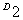
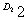
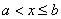
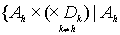
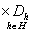
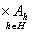
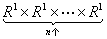
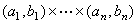
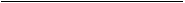

<b>§</b><b> </b><b>3</b><b> </b><b>拓扑空间</b>

一、&nbsp; 一、&nbsp;&nbsp;&nbsp;&nbsp;&nbsp;&nbsp;&nbsp; 基本概念

&nbsp;&nbsp;&nbsp; [拓扑与拓扑空间]&nbsp; 假定<i>D</i>是一个集，<i>τ</i><i></i>（就是<i>τ</i>的每个元素都是<i>D</i>的子集），且满足条件：

&nbsp;&nbsp;&nbsp;&nbsp;&nbsp;&nbsp;&nbsp;&nbsp;&nbsp;
&nbsp;(i) <i>φ</i><i>τ</i>，<i>D</i><i></i><i>τ</i>；

&nbsp;&nbsp;&nbsp;&nbsp;&nbsp; (ii) 任何一族属于<i>τ</i>的集的和集属于<i>τ</i>；

&nbsp;&nbsp;&nbsp;&nbsp;&nbsp; (iii) 任何有限个属于<i>τ</i>的集的通集属于<i>τ</i>，

那末称<i>τ</i>为<i>D</i>的一个拓扑，称&lt;<i>D</i>,<i>τ</i>&gt;这个有序对（见§1，二）为一个拓扑空间.

假定<i>X</i>=&lt;<i>D</i>,<i>τ</i>&gt;是一个拓扑空间，那末<i>D</i>的每个元素都称为<i>X</i>里的点，<i>D</i>的每个子集都称为<i>X</i>里的点集，特别，<i>D</i>称为<i>X</i>的承载点集.<i>τ</i>的每个元素（是<i>D</i>的特殊子集）都称为<i>X</i>里的开集，<i>τ</i>称为<i>X</i>的拓扑.

在不至于引起误解的情况下，也往往把一个拓扑空间跟它的承载点集混为一谈.

&nbsp;&nbsp;&nbsp; [凝固拓扑与分散拓扑] &nbsp;注意，任何一个集<i>D</i>的拓扑总是存在的.比如{<i>φ</i>，<i>D</i>}就是<i>D</i>的一个拓扑，称为<i>D</i>的凝固拓扑，&lt;<i>D</i>，{<i>φ</i>，<i>D</i>}&gt;称为一个凝固空间，在这个凝固空间里，开集只有<i>φ</i>和<i>D</i>.还有也是<i>D</i>的一个拓扑，称为<i>D</i>的分散拓扑，&lt;<i>D</i>, &gt;称为分散空间，在这个分散空间里，任何点集都是开集.

&nbsp;&nbsp;&nbsp; [诱导拓扑与拓扑子空间] &nbsp;假定<i>X</i>是一个拓扑空间，<i>A</i>是<i>X</i>里的一个点集.把<i>X</i>里的任何一个开集跟<i>A</i>的通集称为<i>A</i>的一个相对开集，那末<i>A</i>的所有相对开集全体<i>τ</i>'是<i>A</i>的一个拓扑，称为<i>A</i>的诱导拓扑，&lt;<i>A</i>,<i>τ</i>'&gt;称为<i>X</i>的一个拓扑子空间.

&nbsp;&nbsp;&nbsp;
注意，凡是说拓扑子空间，它的拓扑一定是指诱导拓扑.

&nbsp;&nbsp;&nbsp; [拓扑的粗细] &nbsp;假定<i>τ</i>1和<i>τ</i>2都是集<i>D</i>的拓扑，<i>τ</i>1&Igrave;<i>τ</i>2，那末说<i>τ</i>1比<i>τ</i>2粗，或者说<i>τ</i>2比<i>τ</i>1细.

&nbsp;&nbsp;&nbsp;
一个集<i>D</i>的每个拓扑都是的一个子集，因此是的一个元素，应用划分公理，一个集<i>D</i>的所有拓扑的全体是一个集，称为<i>D</i>的拓扑族，而粗细关系是这个拓扑族里的一个小大关系，不过还不是次序，因为<i>D</i>的不同的拓扑不一定可以比粗细.因此，<i>D</i>的拓扑族按照这个粗细关系是一个分行集.不过，当<i>D</i>的元素不止一个时，<i>D</i>一定有最粗的拓扑，那就是凝固拓扑，也一定有最细的拓扑，那就是分散拓扑.

[拓扑亚基与拓扑的确定] &nbsp;虽然一个集<i>D</i>的任何一族子集的全体只要满足上面定义的条

件（i），（ii），（iii）就可以取做拓扑，但是要验证这些条件是否满足往往不很方便.通常要利用拓扑亚基的概念来确定一个拓扑.

&nbsp;&nbsp;&nbsp;
假定<i>s</i><i> </i>是集<i>D</i>的一族子集（就是<i>s</i><i> </i>），把<i>D</i>的所有掩盖<i>s</i><i> </i>的拓扑<i>τ</i>（就是<i>τ</i>&Ecirc;<i>s</i>）的通集记作<i>τ</i>0，那末不难看到，<i>τ</i>0是一个拓扑，并且是掩盖<i>s</i> 的最粗的拓扑.<i>τ</i>0称为<i>s</i> 所繁殖的拓扑，而<i>s</i>称为<i>τ</i>0的一个亚基.

&nbsp;&nbsp;&nbsp;
任何一个拓扑<i>τ</i>都是它自己所繁殖的拓扑，因此都是自己的一个亚基.

&nbsp;&nbsp;&nbsp;
由这定义知道，集<i>D</i>的任何一族子集可以繁殖出一个唯一的拓扑来.

&nbsp;&nbsp;&nbsp;
例1 （一维实数空间<i>R</i>1）把实数全体记作<i>R</i>1.由所有区间（<i>a</i>，<i>b</i>）（当<i>a</i>&sup3;<i>b</i>，（<i>a</i>，<i>b</i>）表示空集）的全体所繁殖的拓扑<i>τ</i>1称为<i>R</i>1的普通拓扑.以后如果没有另外说明，就把<i>R</i>1当作具备这个普通拓扑的拓扑空间，称为一维实数空间.

<i>&nbsp;&nbsp;&nbsp; R</i>1当作集看还有别的拓扑，除凝固拓扑、分散拓扑外，比如由所有的半闭区间（<i>a</i>，<i>b</i>]（就是{<i>x</i>|<i> </i>}，当<i>a</i>&sup3;<i>b</i>时，（<i>a</i>，<i>b</i>]表示空集）全体也繁殖出一个拓扑来.但是这些都不是普通拓扑，如果要采用这些拓扑，要另外声明.

&nbsp;&nbsp;&nbsp; [拓扑基]&nbsp; 假定<i>s</i> 是一个拓扑空间<i>X</i>里的一族开集的全体.如果<i>X</i>里任何一个开集都是一族属于<i>s</i> 的开集的和集，那末称<i>s</i>为<i>X</i>的拓扑的一个基.显然<i>X</i>的拓扑自己就是自己的一个基.

&nbsp;&nbsp;&nbsp;
由这定义知道，如果<i>s</i> 是拓扑空间<i>X</i>的拓扑的一个基，那末一定是<i>X</i>的拓扑的一个亚基.

&nbsp;&nbsp;&nbsp;
定理&nbsp; 一个集<i>D</i>的一族子集的全体<i>s</i> 是它所繁殖的拓扑的一个基的充分必要条件是：对任何<i>A</i><i></i><i>s</i>，任何<i>B</i><i></i><i>s </i>和任何<i>x</i><i>A</i>∩<i>B</i>，存在<i>C</i><i></i><i>s</i><i>,</i>使<i>x</i><i>C</i><i>A</i>∩<i>B</i>.

&nbsp;&nbsp;&nbsp;
因此可以看到，所有实数区间（<i>a</i>，<i>b</i>）的全体是<i>R</i>1的普通拓扑的一个基，因为属于任何两个区间的通集的任何一个实数<i>x</i>，一定属于这个通集的一个子区间，因此还知道<i>R</i>1里的任何一个开集都是区间的和集.

&nbsp;&nbsp;&nbsp; [开邻域、邻域与基本邻域]&nbsp; 假定一个拓扑空间里的一点<i>x</i>属于一个开集，那末称这开集为<i>x</i>的一个开邻域.假定一个点集掩盖<i>x</i>的一个点邻域，那末称这点集为<i>x</i>的一个邻域.假设<i>x</i>的一个开邻域属于这空间的拓扑的基，那末称这开邻域为<i>x</i>的一个基本邻域.

&nbsp;&nbsp;&nbsp;
一个拓扑空间里的一个点集<i>S</i>是开集的充分必要条件：属于<i>S</i>的每一点都至少有一个基本邻域被<i>S</i>所掩盖.

&nbsp;&nbsp;&nbsp;
开集也可用基本邻域的概念来定义.这是通常利用拓扑基来确定拓扑的另一个办法.例如这样规定：假定<i>S</i>是一个实数集.如果对任何<i>x</i><i>S</i>，存在一个区间（<i>a</i>，<i>b</i>）使<i>x</i><i></i>（<i>a</i>，<i>b</i>）<i>S</i>，那末称<i>S</i>为一个开集.所有这种开集全体正好就是<i>R</i>1的普通拓扑.

&nbsp;&nbsp;&nbsp; [拓扑乘积空间]&nbsp; 假定{<i>Xh</i>|<i>h</i><i>H</i>}是一个拓扑空间族，<i>Xh</i>=&lt;<i> Dh </i><i>τh</i>&gt;,那末是<i>τ</i><i>h</i> 的任何一个元素，<i>h</i>是<i>H</i>的任何一个元素}是的一个子集族，由这个子集族繁殖出的一个拓扑<i>τ</i>，称为这族<i>τ</i><i>h</i>的乘积拓扑.把&lt;,<i>τ</i>&gt;称为这族拓扑空间<i>Xh </i>的拓扑乘积空间.

&nbsp;&nbsp;&nbsp;
注意，{|<i>Ah</i>是<i>τ</i><i>h</i>的任何一个元素}这个集族所繁殖的拓扑一般比乘积拓扑细.只有对有限个拓扑空间的乘积，才跟乘积拓扑一致.

&nbsp;&nbsp;&nbsp;
在不至于引起误解的情况，这个拓扑乘积空间往往就记作它的承载点集，因为说到拓扑乘积空间，意思就是它的拓扑是乘积拓扑.

&nbsp;&nbsp;&nbsp; [<i>n</i>维实数空间与<i>n</i>维区间] &nbsp;把所有实数全体记作<i>R</i>1.由例1可知<i>R</i>1是一维实数空间.当<i>n</i>是一个正整数时，<i>n</i>个<i>R</i>1的拓扑乘积空间,记作<i>Rn</i>，称为<i>n</i>维实数空间.

&nbsp;&nbsp;&nbsp;
如果把<i>n</i>个区间的直接积称为<i>n</i>维区间（如果其中某个（<i>ai</i>，<i>bi</i>）=<i>φ</i>的话，这个直接积也当作<i>φ</i>理解），那末由拓扑乘积空间的定义知道，<i>Rn</i>的拓扑就是所有<i>n</i>维区间的全体繁殖出来的拓扑，而且所有<i>n</i>维区间的全体是这个拓扑的一个基.换句话说，<i>Rn</i>里的任何一个开集都是<i>n</i>维区间的和集.

<table class=MsoNormalTable border=0 cellspacing=0 cellpadding=0 align=left>
 <tr>
  <td width=13 style='width:9.75pt;padding:0mm 0mm 0mm 0mm'>
  
&nbsp;

  </td>
 </tr>
 <tr>
  <td style='padding:0mm 0mm 0mm 0mm'>
  
&nbsp;

  </td>
  <td style='padding:0mm 0mm 0mm 0mm'>
  

  </td>
 </tr>
</table>

&nbsp; 

*
实数的进位制见第一章，§1，一.

&nbsp;

