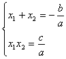

2. 二次方程

二次方程根的表达式及根与系数的相互关系

<table class=MsoNormalTable border=1 cellspacing=1 cellpadding=0 width=623
 style='width:467.25pt'>
 <tr>
  <td width="23%" valign=top style='width:23.0%;padding:5.25pt 5.25pt 5.25pt 5.25pt'>
  
方程 

  </td>
  <td width="36%" valign=top style='width:36.0%;padding:5.25pt 5.25pt 5.25pt 5.25pt'>
  
<i>ax</i>2+<i>bx</i>+<i>c</i>=0 

  </td>
  <td width="41%" valign=top style='width:41.0%;padding:5.25pt 5.25pt 5.25pt 5.25pt'>
  
<i>x</i>2+<i>px</i>+<i>q</i>=0 

  </td>
 </tr>
 <tr>
  <td width="23%" valign=top style='width:23.0%;padding:5.25pt 5.25pt 5.25pt 5.25pt'>
  
根的表达式 

  </td>
  <td width="36%" valign=top style='width:36.0%;padding:5.25pt 5.25pt 5.25pt 5.25pt'>
  
<i>x</i>1,2= 

  </td>
  <td width="41%" valign=top style='width:41.0%;padding:5.25pt 5.25pt 5.25pt 5.25pt'>
  
<i>x</i>1,2= 

  </td>
 </tr>
 <tr>
  <td width="23%" valign=top style='width:23.0%;padding:5.25pt 5.25pt 5.25pt 5.25pt'>
  
根与系数的关系 

  </td>
  <td width="36%" valign=top style='width:36.0%;padding:5.25pt 5.25pt 5.25pt 5.25pt'>
  <h2></h2>
  </td>
  <td width="41%" valign=top style='width:41.0%;padding:5.25pt 5.25pt 5.25pt 5.25pt'>
  <h2></h2>
  </td>
 </tr>
 <tr>
  <td width="23%" valign=top style='width:23.0%;padding:5.25pt 5.25pt 5.25pt 5.25pt'>
  
　

  
判别式 

  </td>
  <td width="36%" valign=top style='width:36.0%;padding:5.25pt 5.25pt 5.25pt 5.25pt'>
  
=<i>b</i>2－4<i>ac</i>

  
&gt;0 有两个不等的实根

  
=0 有两个相等的实根

  
&lt;0 有两个复根 

  </td>
  <td width="41%" valign=top style='width:41.0%;padding:5.25pt 5.25pt 5.25pt 5.25pt'>
  
=<i>p</i>2－4<i>q</i>

  
&gt;0 有两个不等的实根

  
=0 有两个相等的实根

  
&lt;0 有两个复根 

  </td>
 </tr>
</table>

&nbsp;&nbsp;&nbsp;&nbsp;&nbsp;&nbsp; 

