

3.三次方程

&nbsp;&nbsp;&nbsp;&nbsp;&nbsp;&nbsp; [<i>x</i>3－1=0] 方程 <i>x</i>3－1=0

的三个根为
<i>x</i>1=1, <i>x</i>2=<i>ω</i>=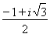, <i>x</i>3=<i>ω</i>2=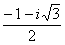 (<i>i</i>2=－1) (1)

&nbsp;&nbsp;&nbsp;&nbsp;&nbsp;&nbsp; [<i>x</i>3+<i>px</i>+<i>q</i>=0(卡尔丹公式)] 方程

<i>x</i>3+<i>px</i>+<i>q</i>=0

的三个根为

<i>x</i>1= 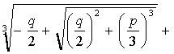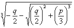

<i>x</i>2=<i>ω </i><i>ω</i>2 (2) 

<i>x</i>3=<i>ω</i>2 <i>ω </i>

式中<i>ω</i>,<i>ω</i>2同(1).这叫做卡尔丹公式.

&nbsp;&nbsp;&nbsp;&nbsp;&nbsp;&nbsp; 根与系数的关系为

<i>x</i>1+<i>x</i>2+<i>x</i>3=0,
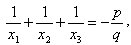<i>x</i>1<i>x</i>2<i>x</i>3=－<i>q</i>

&nbsp;&nbsp;&nbsp;&nbsp;&nbsp;&nbsp; 判别式为

=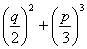

&gt;0时，有一个实根和两个复根；=0时，有三个实根，当<i>p</i>=<i>q</i>=0时，有一个三重零根；当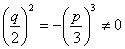时，三个实根中有两个相等；&lt;0时，有三个不等的实根.

&nbsp;&nbsp;&nbsp;&nbsp;&nbsp;&nbsp; 三个根的三角函数表达式（仅当<i>p</i>&lt;0时）为

<i>x</i>1=2 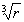cos<i>θ</i>

<i>x</i>2=2 cos(<i>θ</i>+120°)

<i>x</i>3=2 cos(<i>θ</i>+240°)

式中

<i>r</i>=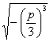, <i>θ</i>=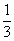arc cos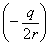

&nbsp;&nbsp;&nbsp;&nbsp;&nbsp;&nbsp; [<i>ax</i>3+<i>bx</i>2+<i>cx</i>+<i>d</i>=0] 一般三次方程

<i>ax</i>3+<i>bx</i>2+<i>cx</i>+<i>d</i>=0&nbsp;&nbsp;&nbsp;&nbsp;&nbsp;&nbsp;&nbsp; 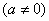

上式除以<i>a</i>，并设

<i>x</i>=<i>y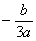</i>

则化为如下的形式

<i>y</i>3+<i>py</i>+<i>q</i>=0

可按（2）的情形处理，解出<i>y</i>1<i>，y</i>2<i>，y</i>3<i>，</i>则一般三次方程的三个根为

<i>x</i>1=<i>y</i>1 ， <i>x</i>2=<i>y</i>2
，
<i>x</i>3=<i>y</i>3

三个根与系数的关系为

<i>x</i>1+<i>x</i>2+<i>x</i>3=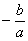, 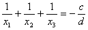, <i>x</i>1<i>x</i>2<i>x</i>3=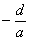

