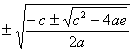
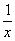
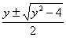
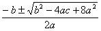
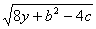
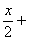
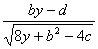

4.四次方程

&nbsp;&nbsp;&nbsp;&nbsp;&nbsp;&nbsp; [<i>ax</i>4+<i>cx</i>2+<i>e</i>=0] 方程

<i>ax</i>4+<i>cx</i>2+<i>e</i>=0

中，设<i>y</i>=<i>x</i>2，则化为二次方程

<i>ay</i>2+<i>cy</i>+<i>e</i>=0

可解出四个根为

&nbsp;&nbsp;&nbsp;&nbsp;&nbsp;&nbsp;&nbsp;&nbsp;&nbsp;&nbsp;&nbsp;&nbsp;&nbsp;&nbsp;&nbsp;&nbsp;&nbsp;&nbsp;&nbsp;&nbsp;&nbsp;&nbsp;&nbsp;&nbsp;&nbsp;&nbsp;&nbsp;&nbsp;&nbsp;&nbsp;&nbsp;&nbsp;&nbsp;&nbsp; <i>x</i>1,2,3,4=

[<i>ax</i>4+<i>bx</i>3+<i>cx</i>2+<i>bx</i>+<i>a</i>=0]
方程

<i>ax</i>4+<i>bx</i>3+<i>cx</i>2+<i>bx</i>+<i>a</i>=0

中，设<i>y</i>=<i>x</i>+，则化为二次方程，可解出四个根为

<i>x</i>1,2,3,4=, <i>y</i>=

[<i>x</i>4+<i>bx</i>3+<i>cx</i>2+<i>dx</i>+<i>e</i>=0]&nbsp;&nbsp;&nbsp; 一般四次方程

<i>ax</i>4+<i>bx</i>3+<i>cx</i>2+<i>dx</i>+<i>e</i>=0

都可化为首项系数为1的四次方程，而方程

<i>x</i>4+<i>bx</i>3+<i>cx</i>2+<i>dx</i>+<i>e</i>=0

的四个根与下面两个方程的四个根完全相同：

<i>x</i>2+(<i>b</i>+)(<i>y</i>+)=0

<i>x</i>2+(<i>b</i>－)(<i>y</i>－)=0

式中<i>y</i>是三次方程

8<i>y</i>3-4<i>cy</i>2+(2<i>bd</i>-8<i>e</i>)<i>y</i>+<i>e</i>(4<i>c</i>-<i>b</i>2)-<i>d</i>2=0

的任一实根.

